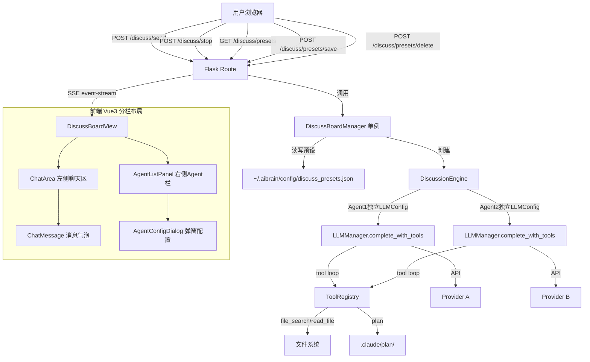
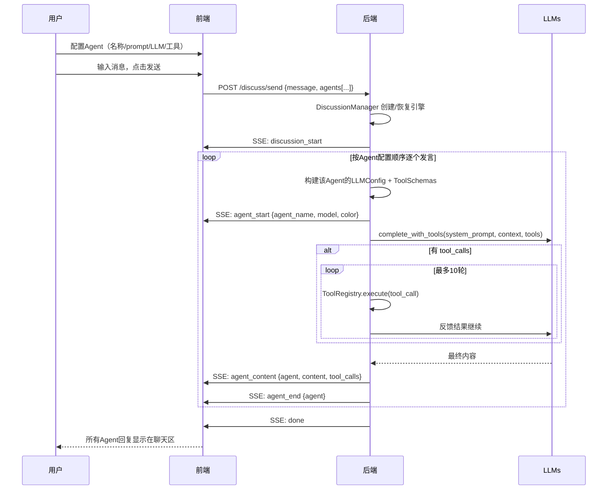

# 一、项目目标

## 项目名称

AI 讨论会议（AI Discuss Board）

## 一句话描述

用户输入想法后，多个 AI agent 通过搜索当前代码库理解项目现状，围绕实现方案进行多轮结构化讨论，每个 agent 可独立配置模型和 API key，用户可在轮间介入反馈，最终产出可执行的计划方案文档到 `.claude/plan/`。

## 核心目标

1. **基于代码库的方案生成**：用户输入想法后，agent 自动搜索当前代码库结构、文件内容，基于真实项目现状生成方案
2. **多角色协作评审**：多个角色按固定流程协作讨论，每轮产出阶段性结论
3. **完全自定义角色**：用户可增删角色、编辑每个角色的 system prompt、独立配置每个角色的 LLM 模型和 API key，支持保存为预设模板
4. **每角色独立模型**：每个 agent 可使用不同的 LLM provider/model/api_key，实现异构模型协作（如主持人用 GPT-4o、质疑者用 Claude）
5. **轮间用户介入**：每轮讨论结束后暂停，用户可输入反馈意见，agent 在下一轮中参考调整
6. **结构化方案输出**：讨论结束后自动生成 Markdown 计划文档，保存到 `.claude/plan/`
7. **实时进度可见**：前端实时展示当前轮次/阶段、各角色发言内容、工具调用细节，支持手动停止

## 不做的事

- 不支持 agent 内部流式输出（token 级别），仅 agent 级别整体推送
- 不支持多个讨论并行运行
- 不支持历史讨论回放（仅保留最终输出文档）

---

# 二、业务背景

## 问题现状

开发者在做技术方案设计时，通常依赖个人经验和同事评审。但人工评审存在以下痛点：
- 评审者时间难协调，反馈周期长
- 单一评审者视角有限，容易遗漏边界情况
- 缺乏结构化的讨论记录，决策理由容易丢失

## 目标用户画像

- **主要用户**：独立开发者、小团队技术负责人，需要在没有多人评审条件时获得多角度方案审视
- **次要用户**：有团队但希望先让 AI 预评审一轮，过滤明显问题后再人工评审的开发者

## 预期价值

- 将方案评审从"等别人有空"变为"随时启动"，缩短反馈周期
- 多角色从不同角度（可行性、风险、补充）审视方案，提高方案完整度
- Agent 通过工具搜索实际代码库，确保方案基于真实项目结构而非凭空想象
- 自动产出结构化方案文档，直接保存到 `.claude/plan/`，与项目计划系统无缝衔接

## 参考方案

- AutoGPT / MetaGPT 等多 agent 框架的角色分工模式
- 传统技术评审会议的流程（提案 → 质疑 → 补充 → 决议）

---

# 三、功能需求

## F1. 角色管理

| 编号 | 功能 | 用户故事 | 优先级 | 备注 |
|------|------|---------|--------|------|
| F1.1 | 查看预设角色模板 | 作为用户，我想看到系统内置的角色模板，以便快速了解可用的讨论模式 | P0 | 内置"技术评审"模板（5 角色） |
| F1.2 | 编辑角色属性 | 作为用户，我想编辑每个角色的名称、system prompt、显示颜色，以便定制讨论风格 | P0 | 支持重置为预设默认值 |
| F1.3 | 为角色配置 LLM | 作为用户，我想为每个角色独立选择 provider、model、填写 API key，以便不同角色使用不同模型进行异构协作 | P0 | 每个角色有独立的 LLM 配置，默认继承全局 Chat 配置 |
| F1.4 | 为角色分配工具 | 作为用户，我想为每个角色选择可用的工具（记忆搜索、文件读取、计划操作等），以便角色在讨论中能调用工具辅助思考 | P0 | 复用项目已有 `ToolRegistry`，每个角色可单独勾选允许的工具 |
| F1.5 | 增加/删除角色 | 作为用户，我想按需添加或删除角色，以便适配不同讨论场景 | P0 | 最少保留 2 个角色 |
| F1.6 | 保存/加载角色预设 | 作为用户，我想将当前角色配置（含 LLM 配置 + 工具列表）保存为预设，下次直接加载使用 | P1 | 存储到 `~/.aibrain/config/discuss_presets.json` |

## F2. Agent 管理

| 编号 | 功能 | 用户故事 | 优先级 | 备注 |
|------|------|---------|--------|------|
| F2.1 | 添加/删除 Agent | 作为用户，我想在右侧面板添加或删除讨论的 Agent，以便自由组合讨论阵容 | P0 | 最少 2 个 Agent |
| F2.2 | 配置 Agent | 作为用户，我想点击 Agent 卡片配置其名称、prompt、LLM 模型、工具、颜色 | P0 | 弹出配置对话框 |
| F2.3 | 从预设加载 | 作为用户，我想从预设模板一键加载整套 Agent 配置 | P0 | 预设包含角色 + LLM 配置 + 工具 |
| F2.4 | 保存为预设 | 作为用户，我想将当前 Agent 配置保存为预设 | P1 | |

## F3. 讨论执行

| 编号 | 功能 | 用户故事 | 优先级 | 备注 |
|------|------|---------|--------|------|
| F3.1 | 输入消息/启动讨论 | 作为用户，我在底部输入框发送消息后，所有 Agent 按顺序依次回复 | P0 | 用户消息+Agent回复连续显示在聊天区 |
| F3.2 | 实时消息流 | 作为用户，我想看到每个 Agent 的消息依次出现在聊天区，含角色色标和模型标签 | P0 | 类似群聊的消息流 |
| F3.3 | 工具调用可视化 | 作为用户，我想看到 Agent 调用了什么工具和结果摘要 | P0 | 消息气泡内可展开工具调用记录 |
| F3.4 | 手动停止 | 作为用户，我想在任意时刻停止 Agent 继续发言 | P0 | |
| F3.5 | 清空对话 | 作为用户，我想清空聊天记录重新开始 | P0 | |

## F4. 方案产出

| 编号 | 功能 | 用户故事 | 优先级 | 备注 |
|------|------|---------|--------|------|
| F4.1 | 自动生成方案文档 | 作为用户，我想系统自动将讨论结论整理为结构化方案 | P0 | 含背景、目标、方案、步骤、风险等章节 |
| F4.2 | 保存方案文件 | 作为用户，我想将方案保存到 `.claude/plan/` 目录 | P0 | 文件名 `discuss_<timestamp>.md` |
| F4.3 | 复制方案内容 | 作为用户，我想一键复制完整方案到剪贴板 | P1 | |

---

# 四、非功能需求

## 性能要求

- 单个 agent 调用响应时间：依赖 LLM provider，无特殊要求
- 单轮讨论（5 角色）耗时：预计 1-3 分钟（取决于 LLM 速度）
- SSE 连接保持时间上限：单轮最长 5 分钟（LLM timeout 120s × 最多 3 次重试）
- 无特殊并发要求（单讨论限制）

## 安全要求

- 每个角色的 API key 独立配置，存储在预设 JSON 文件中
- **安全提醒**：API key 以明文存储在 `discuss_presets.json` 中，与项目现有 Chat 配置一致的安全级别
- 议题内容仅在当前会话中使用，不持久化到数据库（最终方案文件除外）

## 可用性要求

- 浏览器兼容：与现有前端一致（支持现代浏览器 + PyWebView）
- 移动端适配：不做额外适配，桌面端优先
- 响应式：讨论卡片区支持滚动，内容不过长时自动滚动到底部

## 可维护性要求

- 日志：agent 调用记录到后端日志（与 chat 一致）
- 角色配置持久化到 JSON 文件，方便手动编辑
- 前端使用 MVVM 模式，组件职责单一

---

# 五、系统架构

## 架构图



## 技术栈选型

| 层级 | 技术 | 理由 |
|------|------|------|
| 后端框架 | Flask (已有) | 项目统一技术栈 |
| 实时通信 | SSE (text/event-stream) | 单向推送，比 WebSocket 更轻量，Flask 原生支持 |
| LLM 调用 | `LLMManager.complete_with_tools()` (已有) | 工具增强的 LLM 调用，支持 tool loop |
| 工具系统 | `ToolRegistry` (已有) | 复用项目已有工具：memory_search、file_search、read_file、plan 等 |
| 方案存储 | `PLAN_TOOL.fn()` (已有) | 复用现有 plan 工具，约束在 `.claude/plan/` 内 |
| Agent 框架 | `BaseAgent` 模式 (已有) | 每个讨论角色类比 BaseAgent：有 system_prompt、可配置允许的工具列表 |
| 预设存储 | JSON 文件 | 轻量，无需数据库，方便手动编辑 |
| 前端框架 | Vue 3 + TypeScript + Pinia (已有) | 项目统一前端栈 |
| SSE 消费 | Fetch API + ReadableStream (已有) | 与 ChatView 一致 |

## 目录结构

### 后端新增

```
backend/modules/discuss_board/           # 讨论模块
├── __init__.py                          # 导出 DiscussBoardManager 等
├── discuss_board_mod.py                 # DiscussBoardManager + DiscussionEngine + DiscussionState
└── prompts.py                           # 角色 system prompt 预设模板

backend/routes/discuss_board_routes.py   # 路由：/discuss/*
```

### 前端新增

```
web/src/views/DiscussBoardView/
├── DiscussBoardView.vue                 # 主页面（左聊天+右agent栏分栏布局）
├── index.ts                             # DiscussBoardViewModel
├── types.ts                             # TypeScript 类型定义
├── ChatArea.vue                         # 聊天对话区（类似ChatView的消息流）
├── ChatMessage.vue                      # 单条消息气泡（角色头像+名称+模型标签+内容）
├── AgentListPanel.vue                   # 右侧Agent面板（列表+添加/删除按钮）
└── AgentConfigDialog.vue                # Agent配置弹窗（名称/prompt/LLM/工具/颜色）
```

### 配置文件新增

```
~/.aibrain/config/discuss_presets.json   # 角色预设存储
```

## 关键设计决策

1. **群聊式交互**：用户发送一条消息后，所有 Agent 按配置顺序依次调用 LLM 生成回复，回复流实时推送到聊天区。用户可随时介入发送新消息，打断 Agent 的自动发言序列。

2. **单次 SSE 长连接**：`POST /discuss/send` 建立一个 SSE 连接，后端持续推送每个 Agent 的发言（event-stream），直到所有 Agent 回复完毕或被用户停止。这与现有 ChatView 的 `/chat/send` SSE 模式一致。

3. **每角色独立 LLMConfig**：DiscussionEngine 为每个角色构建独立的 `LLMConfig` 对象，调用 `LLMManager.complete()` 时传入。不同角色可以连接完全不同的 LLM 服务。

4. **角色可调用工具**：每个角色可配置允许使用的工具列表（复用项目 `ToolRegistry`）。角色发言时自动执行 tool loop：LLM 返回 tool call → `ToolRegistry.execute()` → 结果回传 → LLM 继续，最多 10 轮。**核心场景**：Agent 通过 `file_search`/`read_file` 探查代码库现状，通过 `plan` 工具写入最终方案。

5. **Agent 面板驱动配置**：右侧面板列出所有参与 Agent，每个 Agent 卡片显示名称、模型名、颜色。点击卡片弹出配置对话框，可编辑 prompt/LLM/工具/颜色。添加/删除 Agent 即时生效。

6. **前端复用 ChatView 模式**：消息气泡 + SSE 消费 + Input 输入框均复用 ChatView 的现有实现模式，降低实现复杂度。

---

# 六、数据结构

## 核心数据实体

### RoleLlmConfig（角色 LLM 配置）

| 字段 | 类型 | 说明 | 约束 |
|------|------|------|------|
| `provider` | `str` | LLM provider | 必填，如 "openai", "anthropic" |
| `model` | `str` | 模型名称 | 必填，如 "gpt-4o", "claude-sonnet-4-6" |
| `api_key` | `str` | API 密钥 | 必填 |
| `base_url` | `str` | API 地址 | 可选，为空则用 provider 默认地址 |
| `temperature` | `float` | 温度参数 | 可选，默认 0.7 |
| `max_tokens` | `int` | 最大 token 数 | 可选，默认 2048 |
| `use_global` | `bool` | 是否使用全局 Chat 配置 | 可选，默认 true |

当 `use_global=true` 时，忽略其他字段，直接使用 `ConfigManager.read_chat()` 的 LLM 配置。

### DiscussionRole（角色定义）

| 字段 | 类型 | 说明 | 约束 |
|------|------|------|------|
| `id` | `str` | 唯一标识 | 必填，如 "host", "proposer" |
| `name` | `str` | 角色名称 | 必填，如 "主持人" |
| `role_key` | `str` | 阶段标识 | 必填，如 "host", "propose" |
| `system_prompt` | `str` | 系统提示词 | 必填，200-5000 字符 |
| `color` | `str` | 显示颜色 | 必填，CSS 颜色值如 "#a78bfa" |
| `order` | `int` | 发言顺序 | 必填，从 0 开始 |
| `icon` | `str` | 角色图标 | 可选，emoji 或图标名 |
| `allowed_tools` | `list[str]` | 允许使用的工具名列表 | 可选，空 = 不使用工具。如 `["memory_search", "file_search", "plan"]` |
| `llm_config` | `RoleLlmConfig` | LLM 配置 | 必填 |

### DiscussionConfig（讨论配置）

| 字段 | 类型 | 说明 | 约束 |
|------|------|------|------|
| `topic` | `str` | 议题描述 | 必填，1-5000 字符 |
| `round_count` | `int` | 总轮数 | 必填，1-10 |
| `roles` | `list[DiscussionRole]` | 角色列表（含各角色 llm_config） | 必填，2-10 个角色 |

### AgentSpeech（角色发言）

| 字段 | 类型 | 说明 |
|------|------|------|
| `round` | `int` | 所属轮次 |
| `agent` | `str` | 角色 key（如 "proposer"） |
| `role_name` | `str` | 角色名称（如 "提案者"） |
| `color` | `str` | 显示颜色 |
| `model` | `str` | 使用的模型名称 |
| `content` | `str` | 发言内容 |

### DiscussionState（讨论状态，后端内存）

| 字段 | 类型 | 说明 |
|------|------|------|
| `config` | `DiscussionConfig` | 讨论配置 |
| `current_round` | `int` | 当前轮次（0=未开始） |
| `round_history` | `list[list[AgentSpeech]]` | 每轮的发言列表 |
| `user_feedback` | `list[str]` | 每轮结束后的用户反馈 |
| `final_plan` | `str` | 最终方案文档 |
| `plan_path` | `str` | 保存的文件路径 |
| `is_running` | `bool` | 是否有活跃讨论 |

### RolePreset（角色预设，JSON 持久化）

| 字段 | 类型 | 说明 |
|------|------|------|
| `name` | `str` | 预设名称，如 "技术方案评审" |
| `description` | `str` | 预设描述 |
| `roles` | `list[DiscussionRole]` | 角色列表（含各角色 llm_config） |
| `is_builtin` | `bool` | 是否内置预设 |
| `created_at` | `str` | 创建时间 ISO 格式 |
| `updated_at` | `str` | 更新时间 ISO 格式 |

## 预设存储结构（`discuss_presets.json`）

```json
{
  "version": 1,
  "presets": [
    {
      "name": "技术方案评审",
      "description": "适合代码架构、技术选型等开发类议题的评审决策",
      "is_builtin": true,
      "roles": [
        {
          "id": "host",
          "name": "主持人",
          "role_key": "host",
          "system_prompt": "你是技术讨论的主持人...",
          "color": "#a78bfa",
          "order": 0,
          "icon": "🎤",
          "llm_config": {
            "use_global": true,
            "provider": "",
            "model": "",
            "api_key": "",
            "base_url": "",
            "temperature": 0.7,
            "max_tokens": 2048
          }
        },
        {
          "id": "challenger",
          "name": "质疑者",
          "role_key": "challenge",
          "system_prompt": "你是技术方案的质疑者...",
          "color": "#f87171",
          "order": 2,
          "icon": "🔍",
          "allowed_tools": ["memory_search", "file_search"],
          "llm_config": {
            "use_global": false,
            "provider": "anthropic",
            "model": "claude-sonnet-4-6",
            "api_key": "sk-ant-xxx",
            "base_url": "",
            "temperature": 0.8,
            "max_tokens": 2048
          }
        }
      ]
    }
  ]
}
```

---

# 七、流程设计

## 核心流程：完整讨论



## 发言顺序

Agent 按 `AgentListPanel` 中从上到下的排列顺序依次发言。每个 Agent 使用自己配置的 LLM provider/model/api_key 发起独立的 LLM 请求。

## 异常流程

### Agent 调用失败

```
LLM 调用异常（API key 无效、模型不存在、网络超时）
  → yield agent_skipped {agent, reason}
  → 继续下一个 Agent
  → 若所有 Agent 都失败 → yield error，讨论终止
```

### 用户手动停止

```
用户点击停止 → POST /discuss/stop
  → 后端设置 stop_event
  → 当前 Agent 调用完成后终止，已完成的发言保留在聊天区
```

### LLM 配置缺失

```
POST /discuss/send
  → 验证每个 Agent 的 llm_config
  → 若 use_global=false 且 api_key 为空 → 返回 400
  → 若全局 Chat 配置也缺失 → 返回 503
```

---

# 八、API 设计

## 8.1 角色预设

### `GET /discuss/presets`

获取所有角色预设列表（含每角色的 LLM 配置）。

**响应：**
```json
{
  "presets": [
    {
      "name": "技术方案评审",
      "description": "...",
      "is_builtin": true,
      "roles": [
        {
          "id": "host",
          "name": "主持人",
          "role_key": "host",
          "system_prompt": "你是技术讨论的主持人...",
          "color": "#a78bfa",
          "order": 0,
          "icon": "🎤",
          "allowed_tools": ["memory_search", "file_search", "plan"],
          "llm_config": {
            "use_global": true,
            "provider": "",
            "model": "",
            "api_key": "",
            "base_url": "",
            "temperature": 0.7,
            "max_tokens": 2048
          }
        }
      ]
    }
  ],
  "default_preset": "技术方案评审"
}
```

### `POST /discuss/presets/save`

保存自定义预设（含每角色的 LLM 配置）。

**请求：**
```json
{
  "name": "我的预设",
  "description": "...",
  "roles": ["... (含 llm_config)"]
}
```

**响应：** `{"ok": true}` 或 `{"error": "..."}`

### `POST /discuss/presets/delete`

删除自定义预设。

**请求：** `{"name": "我的预设"}`

**响应：** `{"ok": true}`

### `GET /discuss/providers`

获取支持的 LLM provider 列表（用于前端下拉选择）。

**响应：**
```json
{
  "providers": [
    {"id": "openai", "name": "OpenAI", "default_base_url": "https://api.openai.com/v1"},
    {"id": "anthropic", "name": "Anthropic", "default_base_url": "https://api.anthropic.com"},
    {"id": "deepseek", "name": "DeepSeek", "default_base_url": "https://api.deepseek.com/v1"},
    {"id": "gemini", "name": "Gemini", "default_base_url": ""},
    {"id": "groq", "name": "Groq", "default_base_url": "https://api.groq.com/openai/v1"},
    {"id": "ollama", "name": "Ollama", "default_base_url": "http://localhost:11434/v1"},
    {"id": "lmstudio", "name": "LM Studio", "default_base_url": "http://localhost:1234/v1"},
    {"id": "together", "name": "Together", "default_base_url": "https://api.together.xyz/v1"},
    {"id": "minimax", "name": "MiniMax", "default_base_url": "https://api.minimax.chat/v1"}
  ]
}
```

### `GET /discuss/tools`

获取系统可用的工具列表（复用 `ToolRegistry.get_all_tools()`），用于前端角色配置工具勾选。

**响应：**
```json
{
  "tools": [
    {"name": "memory_search", "description": "从记忆库搜索相关内容"},
    {"name": "memory_store", "description": "存储内容到记忆库"},
    {"name": "file_search", "description": "搜索项目文件"},
    {"name": "read_file", "description": "读取项目文件内容"},
    {"name": "plan", "description": "管理计划文件（list/read/write/delete）"}
  ]
}

## 8.2 讨论执行

### `POST /discuss/send`

用户发送一条消息，所有 Agent 按顺序依次回复。整个回复过程通过单次 SSE 连接持续推送。

**请求：**
```json
{
  "message": "帮我设计一个用户认证系统",
  "agents": [
    {
      "id": "proposer", "name": "提案者",
      "system_prompt": "你是技术方案的提案者...",
      "color": "#60a5fa", "icon": "💡",
      "allowed_tools": ["file_search", "read_file"],
      "llm_config": {
        "use_global": true,
        "provider": "", "model": "",
        "api_key": "", "base_url": "",
        "temperature": 0.7, "max_tokens": 4096
      }
    },
    {
      "id": "challenger", "name": "质疑者",
      "system_prompt": "你是技术方案的质疑者...",
      "color": "#f87171", "icon": "🔍",
      "allowed_tools": ["memory_search", "file_search"],
      "llm_config": {
        "use_global": false,
        "provider": "anthropic",
        "model": "claude-sonnet-4-6",
        "api_key": "sk-ant-xxx",
        "base_url": "",
        "temperature": 0.8, "max_tokens": 2048
      }
    }
  ]
}
```

**响应：** SSE 流 (`text/event-stream`)

SSE 事件类型：

| type | payload | 说明 |
|------|---------|------|
| `discussion_start` | `{message}` | 讨论开始，包含用户消息 |
| `agent_start` | `{agent, name, model, color}` | Agent 开始发言 |
| `agent_content` | `{agent, content}` | 发言文本块（增量推送，类似 chat token） |
| `agent_tool_call` | `{agent, name, args, result}` | 工具调用记录 |
| `agent_end` | `{agent}` | Agent 发言结束 |
| `agent_skipped` | `{agent, reason}` | Agent 被跳过 |
| `plan_saved` | `{path, filename}` | 最终方案已保存 |
| `stopped` | `{}` | 已停止 |
| `error` | `{message}` | 致命错误 |
| `done` | `{}` | 所有 Agent 回复完毕 |

### `POST /discuss/stop`

停止当前讨论。

**响应：** `{"ok": true}`

---

# 九、验收标准

## 功能验收

### F1. Agent 管理（右侧面板）
- [ ] 右侧 Agent 面板默认显示"技术方案评审"预设的 5 个 Agent
- [ ] 每个 Agent 卡片显示名称、模型名、颜色圆点
- [ ] 点击卡片弹出配置弹窗，可编辑名称/prompt/LLM配置/工具/颜色
- [ ] 每个 Agent 可独立配置 provider/model/api_key，支持"使用全局配置"开关
- [ ] 可添加新 Agent（设置名称/prompt/LLM/工具/颜色）
- [ ] 可删除 Agent（最少保留 2 个）
- [ ] 可从预设加载整套 Agent 配置
- [ ] 可将当前配置保存为预设

### F2. 聊天交互
- [ ] 左侧聊天区类似 ChatView，消息气泡从上到下排列
- [ ] 用户消息和 Agent 消息交替显示在聊天区
- [ ] 每条 Agent 消息显示角色名称、模型标签、颜色圆点
- [ ] 发送消息后，Agent 按顺序依次回复，实时看到每个 Agent 开始/结束
- [ ] Agent 工具调用显示在消息气泡内（可展开查看）
- [ ] 点击停止按钮可中断 Agent 回复
- [ ] 清空对话按钮重置聊天区

### F3. 方案产出
- [ ] Agent 使用 `plan` 工具写入 `.claude/plan/discuss_<timestamp>.md`
- [ ] 方案为结构化 Markdown，含背景、目标、方案、步骤、风险等章节
- [ ] 前端收到 `plan_saved` 事件后显示保存路径
- [ ] 可一键复制聊天区所有内容

## 性能验收
- [ ] 单轮 5 角色讨论在 5 分钟内完成（取决于 LLM 速度，不做硬性保证）
- [ ] 前端 SSE 事件延迟 < 200ms（本地网络）

## 安全验收
- [ ] 各角色的 API key 正确传递到后端 LLM 调用，不暴露到前端控制台
- [ ] 方案文件仅保存在 `.claude/plan/` 目录内，不可越权写入
- [ ] 预设 JSON 文件中的 api_key 存储在用户目录下，不提交到 git

## 交付物清单
- [ ] 后端模块：`backend/modules/discuss_board/`（3 个文件）
- [ ] 后端路由：`backend/routes/discuss_board_routes.py`
- [ ] 前端视图：`web/src/views/DiscussBoardView/`（7 个文件：ChatArea + ChatMessage + AgentListPanel + AgentConfigDialog + DiscussBoardView + index + types）
- [ ] 修改文件：`backend/app.py`、`web/src/router/index.ts`、`web/src/components/NavSidebar.vue`
- [ ] 前端构建产物：`web/dist/`（`npm run build` 后）

---

# 十、开发任务拆分

| ID | 任务 | 依赖 | 复杂度 | 模块 | 对应需求 |
|----|------|------|--------|------|---------|
| T001 | 创建 `prompts.py`：内置"技术方案评审"预设 prompt + provider 配置列表 | 无 | S | 后端模块 | F1.1 |
| T002 | 创建 `discuss_board_mod.py`：RoleLlmConfig + DiscussionRole + DiscussionState + DiscussionEngine（ToolRegistry 集成 + tool loop + 每角色独立 LLMConfig）+ DiscussBoardManager | T001 | L | 后端模块 | F1.3-F1.4, F3.1-F3.5 |
| T003 | 创建 `__init__.py`：模块导出 + `get_discuss_board_manager()` | T002 | S | 后端模块 | — |
| T004 | 创建 `discuss_board_routes.py`：所有 API 端点（含 /discuss/providers、/discuss/tools、llm_config 验证、tool 配置校验）+ SSE | T003 | L | 后端路由 | F1.3-F1.4, F2.1-F3.6, F4.1-F4.2 |
| T005 | 修改 `backend/app.py`：注册路由 + SPA 快捷方式 | T004 | S | 集成 | — |
| T006 | 创建 `types.ts`：前端类型定义（AgentConfig、Message、LLmConfig 等） | 无 | S | 前端 | — |
| T007 | 创建 `index.ts`：DiscussBoardViewModel（Agent列表管理 + SSE消费 + 消息状态管理） | T006 | L | 前端 | F2-F3 |
| T008 | 创建 `ChatMessage.vue`：消息气泡（头像/色标 + 名称 + 模型标签 + 内容 + tool call展开） | T006 | M | 前端 | F2.2 |
| T009 | 创建 `ChatArea.vue`：聊天对话区（消息流 + 输入框 + 发送/停止按钮） | T007, T008 | M | 前端 | F2.1-F2.2 |
| T010 | 创建 `AgentConfigDialog.vue`：Agent 配置弹窗（名称/prompt/LLM/工具/颜色） | T006, T004 | L | 前端 | F1.2-F1.4 |
| T011 | 创建 `AgentListPanel.vue`：右侧 Agent 面板（卡片列表 + 添加/删除 + 点击配置 + 预设） | T010 | M | 前端 | F1.1-F1.6 |
| T012 | 创建 `DiscussBoardView.vue`：主页面（左聊天+右Agent分栏布局） | T009, T011 | M | 前端 | — |
| T013 | 修改 `web/src/router/index.ts`：添加 `/discuss` 路由 | T012 | S | 集成 | — |
| T014 | 修改 `web/src/components/NavSidebar.vue`：添加"会议"导航 | 无 | S | 集成 | — |
| T015 | `npm run build` + 重启后端 + 全流程验证 | T005, T013, T014 | M | 测试 | 全部 |

**并行建议：**
- T001-T005（后端）和 T006-T012（前端）可并行开发
- T008, T010 可并行
- T013, T014 可并行
