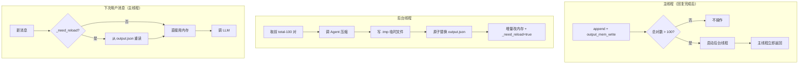

# 后台自压缩对话上下文

## 一、项目目标

- **项目名称**：后台自压缩对话上下文
- **一句话描述**：主线程判断 _conversation_history 超 100 轮后启动后台线程，将旧对话按主题分条压缩写回 output.json，下次回答前重读，用户无感知
- **核心目标**：
  1. 对话超过 Token 阈值时自动触发压缩，保持上下文在合理范围内
  2. 压缩直接修改 output.json，作为持久化的事实来源
  3. 后台压缩后设标记，下次回答前从 output.json 重读到内存
  4. 保留最近 100 轮完整，只压缩 100 轮之前的部分
- **不做的事**：
  - 不做实时 Token 计费显示（那是 Token 用量面板的功能）
  - 不做跨对话 session 的压缩（仅处理当前对话上下文）
  - 不修改 input.json（那是记忆搜索的独立数据源）

## 二、业务背景

- **问题现状**：
  - 当前 `_conversation_history` 在内存中维护，超过 10 轮直接丢弃最旧的轮次，丢失关键信息
  - Flask 重启后 `_conversation_history` 清空，LLM 失忆
  - output.json 保留完整历史但 LLM 不直接从它读取
  - 内存和磁盘有两份对话数据，不一致
- **目标用户**：需要长时间深度对话的 AiBrain 使用者
- **预期价值**：
  - 对话可以持续更长时间，早期信息通过摘要保留而非丢弃
  - 重启后上下文仍然存在，LLM 能延续之前的对话
  - 内存和磁盘统一为单一数据源（output.json），消除不一致
  - 前端展示时压缩条目可折叠显示

## 三、功能需求

| 功能 | 用户故事 | 优先级 | 备注 |
|------|---------|--------|------|
| 后台线程压缩 | 每轮回复完成后启动后台线程，不阻塞主交互流程 | P0 | daemon 线程 |
| Token 估算 | 后台线程估算 _conversation_history 总 Token，超阈值则压缩 | P0 | 阈值可配置，默认 4000 |
| 智能分条 | Agent 根据对话内容判断分段点，将旧轮次精炼为多条，每条一个主题 | P0 | 如3个话题→3条压缩 |
| 临时文件写盘 | 压缩结果先写 .tmp 文件，完成后原子替换 output.json | P0 | 崩溃不损坏文件 |
| 增量替换内存 | 压缩完成后直接修改 _conversation_history，删旧插新 | P0 | 线程安全加锁 |

## 四、非功能需求

- **性能要求**：压缩调用 LLM 在后台完成，不阻塞用户当前回复流
- **文件安全**：output.json 写操作使用临时文件 + 原子重命名，防止写坏
- **可维护性**：压缩器作为独立模块，通过 ChatManager 调用
- **透明性**：压缩不应增加用户等待时间

## 五、系统架构

### 核心变革

```
当前架构（两套数据）:
  loop.py 内存: _conversation_history ← 只用于 LLM，重启丢失
  output.json 磁盘: 完整对话记录 ← 只用于前端展示，LLM 不读

新架构（内存为主 + 持久化 + 后台压缩）:
  _conversation_history 内存 ← LLM 上下文来源（正常时）
  output.json 磁盘 ← 持久化 + 前端展示
                     ↓ 超 100 轮时后台压缩写回 + 设标记
                     ↓ 下次回答前读盘重入内存
```

### 架构图



### output.json 变更示例

**容量变更为 100 条**（原来 20 条），前 100 轮保持原始完整，超出后压缩最早的 batch。

压缩前（原始 6 轮对话）：
```json
[
  {"seq": 1, "user": "帮我写个计划", "assistant": "好的，首先要明确目标...", "time": "09:00"},
  {"seq": 2, "user": "再加个图表", "assistant": "加了柱状图，你看...", "time": "09:05"},
  {"seq": 3, "user": "改一下颜色", "assistant": "改成蓝色了", "time": "09:06"},
  {"seq": 4, "user": "说说最近的新闻", "assistant": "最近...", "time": "09:10"},
  {"seq": 5, "user": "你怎么看", "assistant": "我认为...", "time": "09:11"},
  {"seq": 6, "user": "还有其他观点吗", "assistant": "从另一个角度看...", "time": "09:12"}
]
```

压缩后（根据内容智能分条，3 个话题→2 条压缩+3 条原始）：
```json
[
  {"seq": 1, "user": "帮我写个计划\n再加个图表\n改一下颜色", "assistant": "好的，先明确目标...加了柱状图...改成蓝色了。", "time": "09:00"},
  {"seq": 2, "user": "说说最近的新闻\n你怎么看\n还有其他观点吗", "assistant": "最近...我认为...从另一个角度看...", "time": "09:10"},
  {"seq": 5, "user": "刚才说到哪了", "assistant": "我们讨论了...", "time": "10:00"},
  {"seq": 6, "user": "继续", "assistant": "好的...", "time": "10:05"}
]
```

> **注意**：压缩条目的 JSON 结构和普通条目完全一致（user + assistant + time），没有任何额外字段。前端和 LLM 都无需感知压缩，压缩后直接读盘即可。

### 目录结构变化

```
backend/modules/LLM/Agents/
  ├── context_compress_agent.py  # 上下文压缩 Agent（继承 BaseAgent）
  └── __init__.py                # + 注册 context_compress_agent
backend/modules/chat/
  ├── __init__.py             # 已有（确保 loop.py 可从包内 import）
  ├── context_compress.py    # try_spawn_compress + reload_if_needed（供 loop.py 调用）
  ├── loop.py                # 导入并调用，移除 _trim_history，添加加锁读
  └── chat_mod.py            # 无变化
```

### 新增文件 compression/context_compress.py

```python
"""后台上下文压缩 — 三个函数供 loop.py 调用"""
import threading, tempfile, os, json
from pathlib import Path
from typing import Optional

_history_lock = threading.Lock()
_need_reload = False
MAX_KEEP_PAIRS = 100


def try_spawn_compress(conversation_history: list) -> bool:
    """主线程调用：判断是否超 100 轮，是则启动后台线程"""
    if len(conversation_history) // 2 <= MAX_KEEP_PAIRS:
        return False
    t = threading.Thread(target=_compress_background, args=(conversation_history,), daemon=True)
    t.start()
    return True


def _compress_background(conversation_history: list):
    """后台线程：压缩 + .tmp 临时文件 + 原子替换 + 改内存 + 设标记"""
    global _need_reload
    total_pairs = len(conversation_history) // 2
    compress_pairs = total_pairs - MAX_KEEP_PAIRS

    with _history_lock:
        old_entries = conversation_history[:compress_pairs * 2]
        remaining = conversation_history[compress_pairs * 2:]

    from modules.LLM import get_agent_manager
    agent = get_agent_manager().get("context_compress")
    result = agent.run({"entries": old_entries})
    # Agent 内部需有 JSON 解析降级：解析失败 → 保留原始条目不压缩

    from modules.brain.memory.workmemory import get_work_memory, _BASE_DIR
    wm = get_work_memory()
    raw = wm.output_mem_read()
    compressed_entries = []
    for i, item in enumerate(result):
        compressed_entries.append({
            "seq": raw[0]["seq"] + i,         # 从压缩第一批的 seq 开始递增
            "user": item["user"],
            "assistant": item["assistant"],
            "time": raw[0]["time"],           # 取最早原始条目的时间
        })
    new_output = compressed_entries + raw[compress_pairs:]

    fd, tmp = tempfile.mkstemp(dir=str(_BASE_DIR), suffix='.json')
    try:
        with os.fdopen(fd, 'w', encoding='utf-8') as f:
            json.dump(new_output, f, ensure_ascii=False, indent=2)
        os.replace(tmp, _BASE_DIR / "output.json")
    except:
        os.unlink(tmp)
        raise

    with _history_lock:
        mem_compressed = []
        for item in result:
            mem_compressed.append({"role": "user", "content": item["user"]})
            mem_compressed.append({"role": "assistant", "content": item["assistant"]})
        conversation_history[:] = mem_compressed + remaining
    _need_reload = True


def reload_if_needed(conversation_history: list) -> bool:
    """主线程调用：检查标记，需要则从 output.json 重读"""
    global _need_reload
    if not _need_reload:
        return False
    from modules.brain.memory.workmemory import get_work_memory
    entries = get_work_memory().output_mem_read()
    with _history_lock:
        conversation_history.clear()
        for e in entries:
            conversation_history.append({"role": "user", "content": e["user"]})
            conversation_history.append({"role": "assistant", "content": e["assistant"]})
    _need_reload = False
    return True
```

### loop.py 调用方式

**注意：loop.py 需要先做两项修改方能启用压缩：**
1. 删除流式路径（第 178 行）和 Tool Loop 路径（第 309 行）中的 `_trim_history()` 调用
2. `MAX_HISTORY_TURNS = 10` 常量保留但不被调用，压缩逻辑（100 轮保留 + 后台压缩）替换了旧的截断

```python
# 在 send_message 开头
from .compression.context_compress import reload_if_needed
reload_if_needed(_conversation_history)

# 在 send_message 回复完成后
from .compression.context_compress import try_spawn_compress
try_spawn_compress(_conversation_history)
```

### 技术栈

| 层 | 技术 | 理由 |
|---|------|------|
| 压缩器 | Python 类（单例） | 遵循项目约定 |
| 压缩 Agent | context_compress_agent（继承 BaseAgent） | 遵循现有 Agent 模式 |
| Token 估算 | tiktoken（优先）或 字符数/4*1.1（兜底） | 中文对话估算准确 |
| 压缩模型 | gpt-4o-mini 或当前 chat_model | 压缩不需要高级推理，可配置 |
| 文件安全 | tempfile + os.replace | 防止写坏 output.json |

### 关键设计决策

1. **内存为 LLM 上下文来源**：`_conversation_history` 保持内存读取
2. **后台线程触发**：每轮回复完成后启动后台线程执行压缩，不阻塞主交互流程
3. **临时文件 + 原子替换**：压缩结果先写 `.tmp` 文件，完成后 `os.replace` 替换原文件，崩溃不损坏
4. **增量修改内存**：压缩完成后直接修改 `_conversation_history`，删旧插新
5. **压缩 Agent**：通过 `context_compress_agent`（继承 BaseAgent）完成
6. **线程安全**：后台线程操作 `_conversation_history` 和 output.json 需加锁
7. **LLM 上下文**：正常从内存 `_conversation_history` 读取，压缩后下次回答前从 output.json 重读
8. **错误处理**：Agent 调用失败 → 跳过本轮压缩，不影响对话

## 六、数据结构

### output.json 条目格式

| 字段 | 类型 | 说明 |
|------|------|------|
| seq | int | 序号 |
| user | string | 用户输入（压缩条目为合并浓缩后的文本） |
| assistant | string | 助手回复（压缩条目为合并浓缩后的文本） |
| time | string | 时间戳（压缩条目取最早原始条目的时间） |

### LLM 上下文构建规则

`_conversation_history` 中的每条消息直接用于构建 LLM 上下文，压缩条目和原始条目格式完全一致（`user` + `assistant`），LLM 无需感知压缩：

| 来源 | 转换 |
|------|------|
| 原始条目 | → user msg + assistant msg |
| 压缩条目 | → user msg + assistant msg（内容为浓缩文本） |
| 正常时 | → 从内存 `_conversation_history` 直接读取 |
| 压缩后下次回答 | → 从 output.json 重读后写入 `_conversation_history` |

### 配置参数

| 参数 | 默认值 | 说明 |
|------|--------|------|
| MAX_RAW_ENTRIES | 100 | 保留的原始条目数，超过则触发压缩 |
| COMPRESS_BATCH_SIZE | 30 | 每次压缩处理的旧条目数 |

### workmemory 修改

`output_mem_write()` 需要增强文件安全写入，但核心逻辑不变。

## 七、流程设计

### 核心流程

```mermaid
sequenceDiagram
    participant User as 用户
    participant Loop as loop.py（主线程）
    participant Worker as 后台线程
    participant Agent as context_compress_agent

    Note over Loop: ─── 第 N 轮回复完成（主线程） ───
    Loop->>Loop: append + output_mem_write
    Loop->>Loop: 检查总对数 > 100?
    alt > 100
        Loop->>Worker: start(压缩后台)
        Loop->>Loop: 立即返回
    else ≤ 100
        Loop->>Loop: 不操作
    end

    Note over Worker: ─── 后台异步 ───
    Worker->>Worker: 取前 total-100 对
    Worker->>Agent: run({"entries": 旧条目})
    Agent-->>Worker: 返回 {user, assistant}
    Worker->>Worker: 写 .tmp 临时文件
    Worker->>Worker: 原子替换 output.json
    Worker->>Worker: 增量改内存 + _need_reload = true

    Note over User: ═══ 无感 ═══
    User->>Loop: 第 N+1 轮消息
    Loop->>Loop: _need_reload? → 是 → 从 output.json 读盘
    Loop->>Loop: 构建上下文调 LLM
    Loop-->>User: 流式输出
```

### 压缩 Prompt（Agent 内部使用）

将系统提示 + 对话内容传入，Agent 返回压缩后的 user 和 assistant 文本：

**System Prompt：**
```
你是一个对话压缩助手。分析多轮对话的内容变化，按主题分段，
每段压缩为一条 user+assistant，保留核心信息，删除冗余。

规则：
- 输出格式：[{"user": "...", "assistant": "..."}, ...]
- 按话题变化分段，每个独立话题输出一条
- 同一话题的多轮合并为一条
- 保留技术细节、决策、具体数值
- 删除客套话、重复表述、语气词
- 每条 user ≤ 200 字，assistant ≤ 300 字
- 只输出 JSON 数组，不要添加额外说明
```

**每轮 User Prompt：**
```
请分段压缩以下 {N} 轮对话：

1. 用户：...
   助手：...
2. 用户：...
   助手：...
...
```

### output_mem_write 文件安全写入（C002）

当前实现直接 `fpath.write_text()`。改为临时文件 + 原子替换：
```python
import tempfile, os
# 写临时文件
fd, tmp = tempfile.mkstemp(dir=str(_BASE_DIR), suffix='.json')
try:
    with os.fdopen(fd, 'w', encoding='utf-8') as f:
        json.dump(entries, f, ensure_ascii=False, indent=2)
    # 原子替换
    os.replace(tmp, fpath)
except:
    os.unlink(tmp)
    raise
```

### 异常流程

- **压缩 LLM 调用失败**：打印警告，跳过本轮压缩
- **output.json 读失败**：视为空文件继续（降级处理）
- **压缩后 Token 反而增加**：放弃压缩（理论上不会发生）

## 八、API 设计

无需新增 API 端点。压缩是纯后台行为。

### 内部接口

```
compression/context_compress.py 导出:
  try_spawn_compress(history)      # 主线程调用 → bool
  reload_if_needed(history)        # 主线程调用 → bool

WorkMemoryManager 修改:
  output_mem_write()               # 增强：临时文件+原子重命名
```

## 九、验收标准

### 功能验收

1. **后台执行**：压缩在后台线程执行，不阻塞用户交互
2. **Token 估算**：50 轮对话后估算值 > 0，与实际 Token 相差不超过 50%
3. **压缩触发**：超 100 轮后，前 (total-100) 轮被压缩为多条（按话题分段），最近 100 轮保持完整
4. **压缩后上下文连续**：LLM 能理解压缩后的浓缩内容并正确回答
5. **临时文件安全**：模拟崩溃后 output.json 完整不损坏
6. **持久化**：压缩结果同步写入 output.json，重启后恢复
7. **多轮压缩**：持续对话可多次触发压缩

### 性能验收

- 压缩 LLM 调用 < 3 秒
- 不增加用户等待时间（压缩在主回复之后触发）
- 文件安全：模拟崩溃不损坏 output.json

## 十、开发任务拆分

| ID | 任务名称 | 依赖 | 复杂度 | 模块 | 对应需求 |
|----|---------|------|--------|------|---------|
| C001 | context_compress_agent（继承 BaseAgent + 注册） | — | S | 后端/LLM/Agents | 压缩 Agent |
| C002 | output_mem_write 原子写入 + 上限 20→100 + _BASE_DIR 暴露 | — | S | 后端/brain/workmemory | 文件安全 + 容量 |
| C003 | context_compress.py + loop.py 集成（移除 _trim_history 调用） | C001+C002 | M | 后端/chat | 全流程集成 |
| C004 | 压缩阈值可配置 + 线程安全 + 异常处理 | C003 | S | 后端/chat | 可配置+稳定性 |
