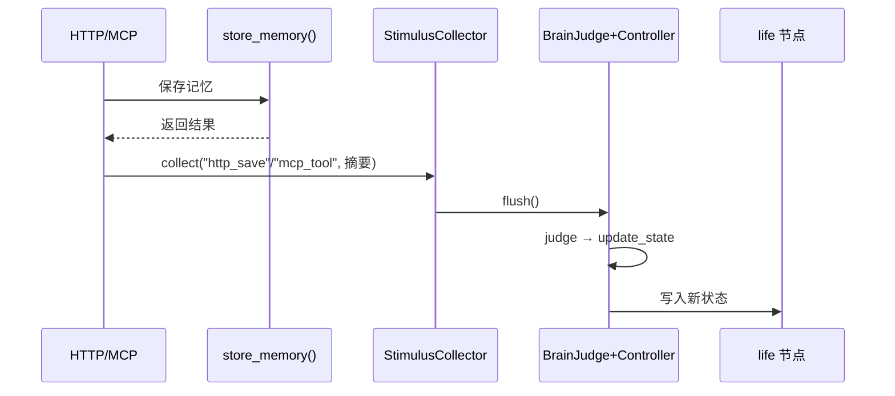

# 一、项目目标

**项目名称**：外部刺激捕获与自我状态更新模块

**一句话描述**：在 main_brain 中新增一个模块，收集所有外部事件（聊天消息、HTTP 调用、MCP tool、系统事件），合并后触发一次 LLM 循环来更新 AI 的自我状态。

**核心目标**：
1. 所有外部事件都能被捕获并记录到统一的刺激队列
2. 密集的刺激自动合并去重，不每条单独触发 LLM
3. 在合适时机（如回复生成后）复用 BrainJudge + controller 跑一次状态更新循环
4. 新状态（mood / energy / focus / drives / recent_thoughts）落盘到现有 life 节点

**不做的事**：
- 不改变现有 chat loop 的回复生成流程
- 不替换 ActivitySelector 的规则
- 不新增 judge prompt/decision 类型，只扩展现有 update_state action
- 不存"刺激"到长时记忆，仅用于状态更新
- 未来新增刺激源不需要修改 stimulus.py 核心模块

# 二、业务背景

**问题现状**：
- 当前自我状态（mood/energy/focus/current_activity）只在 brain loop tick 或每日反思时更新
- 聊天、HTTP 存记忆、MCP tool 调用这些"外部事件"完全不参与状态更新
- 结果：AI 的 mood 和 energy 反映的是"上次 tick 的状态"，不是真实当前状态
- encoder 存记忆时读到的 life_state 可能已经过时，导致 affect 与实际不符

**目标用户画像**：
- 系统本身（数字生命体），需要更真实地感知自己在做什么、心情如何
- 用户侧：看到 AI 的状态（mood/focus）与当前互动内容一致，体验更连贯

**预期价值**：
- 自我状态与外部活动实时同步，不再滞后
- encoder 存记忆时的 affect 基于真实状态而非过时的 tick 数据
- 为未来主动表达提供更准确的情绪/关注基础

# 三、功能需求

## 3.1 刺激捕获

| 功能 | 用户故事 | 优先级 | 备注 |
|---|---|---|---|
| 聊天消息捕获 | 作为系统，当用户发送聊天消息时，我希望把该事件记录到刺激队列，以便后续触发状态更新 | P0 | chat loop 结束时注入 |
| HTTP 存记忆捕获 | 作为系统，当用户通过 HTTP API 保存记忆时，我希望把该事件记入刺激队列 | P0 | memory_routes 中注入 |
| MCP tool 捕获 | 作为系统，当 LLM 通过 tool 调用 save_memory 时，我希望把该事件记入刺激队列 | P1 | memory_tools 中注入 |
| brain loop 自定义捕获 | 作为系统，当 brain loop 自己做了重要事情（如整理记忆、反思完成）时，也可以触发 | P2 | 用于 internel 事件 |

## 3.2 刺激队列与合并

| 功能 | 用户故事 | 优先级 | 备注 |
|---|---|---|---|
| 队列存储 | 作为刺激模块，我希望有一个内存队列暂存未处理的刺激，以便判断是否需要合并 | P0 | 最多保留 50 条 |
| 合并触发 | 作为系统，当短时间内收到多条刺激时，我希望合并为一条再触发状态更新 | P0 | 距离上次触发 < 30s 则合并 |
| 强制触发 | 作为系统，当刺激累积超过 10 条仍未触发时，我希望强制触发一次 | P1 | 避免队列无限积压 |
| 空闲触发 | 作为系统，如果队列非空且用户停止输入 10s，我希望触发一次 | P2 | 聊到一半停顿时更新 |

## 3.3 LLM 状态更新

| 功能 | 用户故事 | 优先级 | 备注 |
|---|---|---|---|
| 复用 controller | 作为状态更新模块，我希望走现有的 BrainJudge + controller 循环，不另起炉灶 | P0 | 复用 action_handlers |
| 状态落盘 | 作为 judge，当更新状态时，我通过 update_state action 把新状态写入 life 节点 | P0 | 现有适配器已实现 |
| 刺激上下文 | 作为 judge，我希望在决策上下文中看到最近的外部刺激摘要，以便判断如何调整状态 | P0 | 输入到 judge_view |

## 3.4 配置开关

| 功能 | 优先级 | 备注 |
|---|---|---|
| external_stimulus_enabled（总开关） | P0 | 默认关 |
| stimulus_cooldown_seconds（合并窗口） | P1 | 默认 30s |
| stimulus_max_queue（队列上限） | P1 | 默认 50 |

# 四、非功能需求

| 类别 | 要求 |
|---|---|
| 性能 | 刺激捕获是同步 O(1) 入队，不影响主流程延迟。LLM 更新在回复生成后的后台触发。 |
| 容错 | 任何异常不得阻断主流程（聊天/HTTP/MCP）。stimulus 模块初始化失败时静默降级。 |
| 成本控制 | stimulus_enabled=False 时，入队和队列操作消耗 0 额外 LLM token。LLM 更新复用的 judge 走现有 judge_timeout 配置。 |
| 数据安全 | 刺激队列纯内存，不落盘，不包含敏感 payload。 |

# 五、系统架构

## 架构图

```mermaid
graph TB
    subgraph 外部刺激源
        CHAT[ChatSource]
        HTTP[HttpSaveSource]
        MCP[McpToolSource]
        FUTURE[任意未来Source]
    end

    subgraph stimulus_core[StimulusCollector 核心]
        REGISTRY[Source Registry]
        QUEUE[刺激队列]
        MERGE[合并触发器]
        DISPATCH[分发器]
    end

    subgraph source_plugin[刺激源协议]
        SRC_IFACE[SourceProtocol<br/>source_name<br/>preprocess(summary)]
    end

    subgraph main_brain
        CONTROLLER[BrainCycleRunner]
        JUDGE[BrainJudge]
        ADAPTERS[action_handlers]
    end

    subgraph 状态落地
        LIFE[life 节点]
        INTERNAL[InternalState]
    end

    CHAT -.->|注册 source_name| REGISTRY
    HTTP -.->|注册 source_name| REGISTRY
    MCP -.->|注册 source_name| REGISTRY
    FUTURE -.->|注册 source_name| REGISTRY

    CHAT -->|collect| QUEUE
    HTTP -->|collect| QUEUE
    MCP -->|collect| QUEUE
    FUTURE -->|collect| QUEUE

    QUEUE --> MERGE
    MERGE -->|触发时机| CONTROLLER
    CONTROLLER --> JUDGE
    JUDGE --> ADAPTERS
    ADAPTERS --> LIFE
    ADAPTERS --> INTERNAL
```

## 刺激源注册表设计

核心是 SourceRegistry——所有外部代码不直接调 collect()，而是先注册为刺激源：

```python
# 模块启动时注册
get_stimulus_collector().register("chat")
get_stimulus_collector().register("http_save")

# 后续任何地方只需要 source_name
get_stimulus_collector().collect("chat", "用户发送了消息")
```

新增一个刺激源时，只需要在对应模块的初始化处调一行 `register()`，然后各处调 `collect(source_name, summary)`——**不修改 stimulus.py 核心**。

## 技术栈

| 组件 | 选型 | 理由 |
|---|---|---|
| 刺激源注册表 | dict[str, SourceInfo] | 轻量，O(1) 查找，不需要外部存储 |
| 刺激队列 | Python list + threading.Lock | 纯内存，简单可靠，不需要序列化 |
| 合并判定 | 时间戳差值 + 队列长度 | 轻量，O(1) 检查 |
| 状态更新 | 复用现有的 BrainJudge + controller | 不重复造轮子，judge prompt/schema 和后台判断一致 |
| 触发钩子 | collect() 作为统一入口 | 任何代码都可以触发，不需要改核心 |

## 目录结构

```
backend/main_brain/
├── stimulus/                     ← 新增：整个刺激模块收起
│   ├── __init__.py               ← 导出 get_stimulus_collector()
│   ├── collector.py              ← StimulusCollector 核心
│   │   ├── register(name)        ← 注册一个刺激源
│   │   ├── collect(name, summary) ← 统一入口
│   │   ├── flush()               ← 强制触发
│   │   ├── _should_trigger()     ← 合并条件判断
│   │   └── _merge_queue()        ← 合并队列成上下文
│   └── sources/                  ← 官方刺激源实现
│       ├── __init__.py
│       ├── chat.py               ← 注册 "chat" + loop.py 末尾调用
│       ├── http_save.py          ← 注册 "http_save" + memory_routes 调用
│       └── mcp_tool.py           ← 注册 "mcp_tool" + memory_tools 调用
├── daemon.py
├── session.py
└── adapters/
    └── state.py                  ← 已有，不动
```

外部代码只需要：
```python
from main_brain.stimulus import get_stimulus_collector
get_stimulus_collector().collect("chat", "摘要")
```

这样外部代码只需要 `from main_brain.stimulus import get_stimulus_collector` + `collect(source_name, summary)`，不需要了解队列、合并、触发机制。**未来加任意数量的刺激源都不改核心**。

# 六、数据结构

## 刺激源注册表

```python
@dataclass
class SourceInfo:
    name: str               # 唯一标识："chat" / "http_save" / "mcp_tool"
    registered_at: float    # 注册时间戳
    count: int = 0          # 累计触发次数（统计用）
```

## 刺激条目

```python
@dataclass
class StimulusItem:
    source: str              # 来源，如 "chat" / "http_save" / "mcp_tool"
    summary: str             # 描述（如"用户发送了关于记忆系统的消息"）
    timestamp: float         # time.monotonic()
```

## StimulusCollector 核心

```python
class StimulusCollector:
    _registry: dict[str, SourceInfo]  # 已注册的刺激源
    _queue: list[StimulusItem]        # 内存队列，FIFO
    _last_trigger_at: float           # 上次触发状态更新的时间
    _lock: threading.Lock             # 线程安全

    # 公开方法（所有外部代码只需要这 2 个）
    def register(self, name: str) -> bool    # 注册刺激源
    def collect(self, source: str, summary: str) -> bool  # 统一入队入口

    # 内部方法（不对外暴露）
    def _should_trigger(self) -> bool
    def _merge_queue(self) -> str
    def flush(self, force=False) -> dict
```

## 状态更新

不新增数据结构。落盘路径完全复用现有的 life 节点字段：

## 状态更新

不新增数据结构。落盘路径完全复用现有的 life 节点字段：

| 字段 | 现有存储 | 更新者 |
|---|---|---|
| mood | life 节点 | state_adapter.update_life_node |
| energy | life 节点 | state_adapter.update_life_node |
| current_focus | life 节点 | state_adapter.update_life_node |
| recent_thoughts | life 节点 | state_adapter.append_recent_thought |
| drives | InternalState | get_state().transaction()→drives |
| concerns | InternalState | state_adapter.apply_state_updates |

# 七、流程设计

## 7.1 聊天消息 → 状态更新

```mermaid
sequenceDiagram
    participant User as 用户
    participant Chat as chat_routes
    participant Loop as send_message()
    participant Stimulus as StimulusCollector
    participant Brain as BrainJudge+Controller
    participant State as life 节点

    User->>Chat: 发送消息
    Chat->>Brain: run_reactive（如有）
    Chat->>Loop: send_message（LLM 回复生成）
    Loop-->>User: 流式回复
    Loop->>Stimulus: collect("chat", 摘要)
    Note over Stimulus: 检查合并条件
    Stimulus->>Brain: flush() → controller.run()
    Brain->>Brain: judge 查看刺激上下文
    Brain->>State: update_state(mood/energy/focus)
    Brain->>State: append_recent_thought
```

## 7.2 HTTP/MCP 存记忆 → 状态更新



## 7.3 合并触发逻辑

```
collect() 被调用时:
  1. 入队：append(StimulusItem)
  2. 检查：_should_trigger()
     条件 A：队列长度 >= 强制触发阈值（10）→ 触发
     条件 B：距离上次触发 > cooldown（30s）且队列非空 → 触发
     否则：不触发，等下一次 collect 或定时

flush() 被调用时:
  1. 合并队列：所有刺激条目拼接成一段文本
  2. 构造 judge_view + 刺激上下文
  3. controller.run(ctx, max_cycles=1)
  4. 清空队列
  5. 更新 _last_trigger_at
```

## 7.4 异常处理

| 场景 | 行为 |
|---|---|
| main_brain 未初始化/不可用 | collect() 静默降级，不抛异常 |
| judge LLM 调用失败 | controller 返回 error，状态不变，队列不清空（下次重试） |
| 队列超过上限 | FIFO 丢弃最旧的 10 条 |

# 八、API设计

不新增 HTTP API。模块通过代码接口调用：

## 内部接口

| 方法 | 参数 | 返回 | 调用方 |
|---|---|---|---|
| `StimulusCollector.register(name)` | name: str | bool（是否新注册） | 各模块初始化时调一次 |
| `StimulusCollector.collect(source, summary)` | source: str, summary: str | bool（是否触发了 flush） | 任何检测到刺激的代码 |
| `StimulusCollector.flush(force=False)` | force: bool | dict（controller.run 结果摘要） | 内部 / 调试 |
| `StimulusCollector.get_status()` | 无 | dict（注册源列表/队列长度/上次触发时间） | 调试/监控 |

## 集成模式

不再硬编码集成点。改为**由刺激源自己注册自己**：

```
阶段 1（初始化时）:
  chat_source.py → register("chat")
  http_source.py → register("http_save")
  任何未来的 source → register("xxx")

阶段 2（运行时）:
  聊天结束时 → collect("chat", "用户说了啥")
  HTTP 保存后 → collect("http_save", "保存了记忆")
  任何未来场景 → collect("xxx", "发生了什么")
```

**核心模块 stimulus.py 永远不需要改。新增刺激源只需：**
1. 新文件 `stimulus/<new>_source.py`
2. 在文件里调 `register(name)`
3. 在对应逻辑处调 `collect(name, summary)`

# 九、验收标准

## 功能验收

| # | 验证项 | 操作 | 预期 |
|---|---|---|---|
| 1 | 聊天触发 | 发送一条聊天消息，等待回复完成 | 日志出现 `[stimulus] collected chat` + `[stimulus] flush` |
| 2 | 状态变化 | 上述触发后，检查 life 节点 | mood / focus / recent_thoughts 有更新 |
| 3 | 合并节流 | 5 秒内连续发 3 条消息 | 3 条合并成 1 次 LLM 调用，不是 3 次 |
| 4 | 强制触发 | 连续发 11 条短消息（间隔 1s） | 第 10 条时强制触发一次 |
| 5 | 开关控制 | 设 external_stimulus_enabled=false | collect() 入队但 return False，不触发 |
| 6 | HTTP 触发 | 通过 HTTP API 保存记忆 | `[stimulus] collected http_save` |
| 7 | 异常容错 | controller.run() 抛异常 | 主流程不中断，队列不清空 |

## 性能验收

| # | 验证项 | 预期 |
|---|---|---|
| 1 | collect() 耗时 | < 1ms（纯内存追加 + 锁） |
| 2 | 空转时消耗 | stimulus_enabled=False 时 0 额外消耗 |

## 交付物清单

- `backend/main_brain/stimulus/__init__.py` — 包入口，导出 get_stimulus_collector()
- `backend/main_brain/stimulus/collector.py` — StimulusCollector 核心（注册表 + 队列 + 合并 + 触发）
- `backend/main_brain/stimulus/sources/__init__.py` — 刺激源子包
- `backend/main_brain/stimulus/sources/chat.py` — 聊天刺激源（注册 "chat" + 在 loop.py 末尾注入 collect）
- `backend/main_brain/stimulus/sources/http_save.py` — HTTP 存记忆刺激源（注册 "http_save" + 在 memory_routes 注入）
- `backend/main_brain/stimulus/sources/mcp_tool.py` — MCP tool 刺激源（注册 "mcp_tool" + 在 memory_tools 注入）
- `backend/main_brain/__init__.py`（修改：启动时初始化 / 引入刺激包）
- `backend/main_brain/config.py`（修改：新增刺激配置项）
- `backend/modules/chat/loop.py`（修改：末尾注入 collect）

# 十、开发任务拆分

```
T001: 包结构与 collector 核心
  创建 stimulus/__init__.py + stimulus/collector.py
  包含：SourceRegistry / StimulusQueue / 合并判定 / flush → controller 集成
  配置项：external_stimulus_enabled / stimulus_cooldown_seconds / stimulus_max_queue
  依赖：无
  预估：M

T002: 刺激源子包与初始化
  创建 stimulus/sources/__init__.py
  在 main_brain/__init__.py 导入刺激源子包（触发各 source 的 register）
  依赖：T001
  预估：S

T003: 官方聊天刺激源
  创建 stimulus/sources/chat.py（注册 "chat"）
  在 loop.py stream 末尾 + tool_loop 末尾注入 collect("chat", 摘要)
  依赖：T002
  预估：S

T004: 官方 HTTP/MCP 刺激源
  创建 stimulus/sources/http_save.py + sources/mcp_tool.py
  在 memory_routes + memory_tools 末尾注入
  依赖：T002
  预估：S

T005: E2E 验证
  发消息→查 life 节点状态更新
  连续发→合并触发不频繁
  HTTP 存记忆→触发
  依赖：T003+T004
  预估：M
```

任务依赖图：

```
T001 → T002 → T003
          ↘ T004
               ↘ T005
```

优先级排序：T001 + T002 为核心（注册表 + 队列 + 合并 + 触发），做完即可支持任何刺激源。T003（聊天）是主入口，先做。T004（HTTP/MCP）可并行。T005 最终验证。

**扩展性验证**：未来要加第 4、第 5 个刺激源时，只需要新增 `stimulus/xxx_source.py` 文件 + 调 register/collect，**不改 T001 一行代码**。
