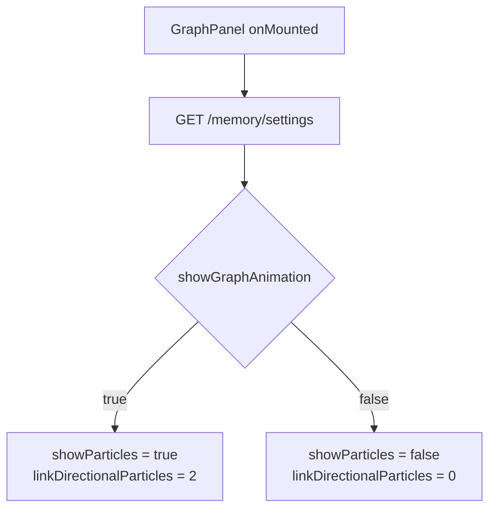
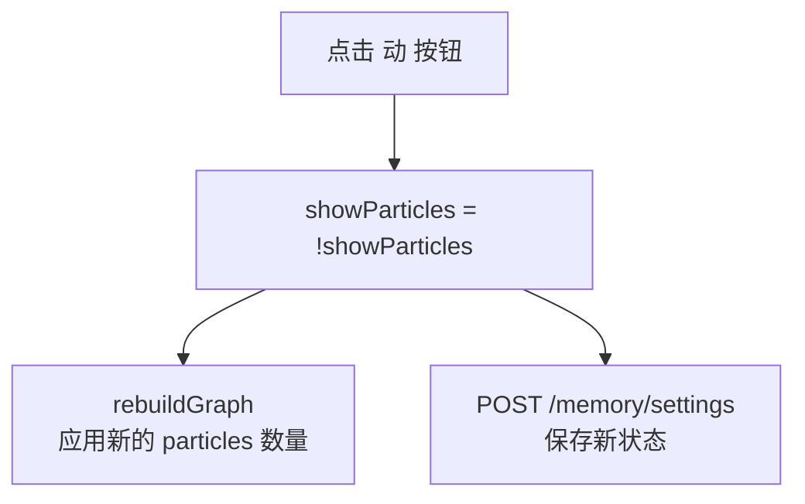

# 图谱动画开关持久化

## 一、项目目标

- **项目名称**：图谱连线粒子动画开关持久化
- **一句话描述**：将图谱 Tab 已有的"动"按钮的状态持久化到 `memory_settings.json`，刷新后保持用户的关闭选择
- **核心目标**：
  1. 后端 `memory_settings.json` 新增 `showGraphAnimation` 字段（默认 `true`）
  2. 前端图谱面板加载时从后端读取动画开关状态
  3. 前端切换"动"按钮时自动持久化到后端
  4. 不做动画开关以外的任何改动
- **不做的事**：
  - 不修改节点光晕、星空背景等其他视觉效果
  - 不修改力导向物理参数
  - 不新增 Settings Tab 的 UI 条目（使用现有 GraphTab 内按钮）

---

## 二、业务背景

- **问题现状**：图谱节点多时（50+ 实体 + 130+ 关系边），每条边 2 个梭形粒子的自定义渲染导致帧率下降。现有"动"按钮可关闭动画缓解卡顿，但状态不持久——每次切 Tab 或刷新页面后自动恢复开启
- **目标用户**：拥有大量实体关系的用户
- **预期价值**：用户关闭动画后，状态持久保持，不需要每次手动关闭

---

## 三、功能需求

| 功能 | 优先级 | 说明 |
|---|---|---|
| 动画开关持久化 | P0 | "动"按钮状态存入 `memory_settings.json` 的 `showGraphAnimation` 字段 |
| 加载时恢复状态 | P0 | 图谱面板 onMounted 时从后端读取 `showGraphAnimation`，初始化按钮状态 |
| 切换时自动保存 | P0 | 点击"动"按钮时立即 POST 持久化 |

---

## 四、非功能需求

- **性能要求**：无额外开销，仅在 toggle 时发一次 POST
- **向后兼容**：老版本 `memory_settings.json` 缺少 `showGraphAnimation` 字段时默认为 `true`
- **无特殊要求**：安全、可用性、部署方式无变更

---

## 五、系统架构

### 架构图

```
┌──────────────────────────────────────┐
│         GraphPanel.vue               │
│  [动] 按钮 ←→ showParticles         │
│     │ toggle 时 POST /memory/settings│
│     │ onMounted 时 GET /memory/settings│
└─────────────────┬────────────────────┘
                  │
┌─────────────────▼────────────────────┐
│  memory_routes.py                    │
│  GET  /memory/settings               │
│  POST /memory/settings               │
└─────────────────┬────────────────────┘
                  │
┌─────────────────▼────────────────────┐
│  ~/.aibrain/config/                  │
│  memory_settings.json                │
│  { "infer": true,                    │
│    "showGraphAnimation": true }      │
└──────────────────────────────────────┘
```

### 改动文件清单

| 文件 | 改动 | 行数 |
|---|---|---|
| `backend/modules/brain/memory.py` | `_DEFAULT_MEMORY_SETTINGS` 加字段，`_load_settings_from_disk` 兼容老配置，`update_memory_settings` 处理新字段 | ~10 行 |
| `web/src/views/MemoryView/GraphTab/GraphPanel.vue` | 加入 API 调用，`showParticles` 初始值从后端加载，toggle 时自动保存 | ~15 行 |

---

## 六、数据结构

### `memory_settings.json`

```json
{
    "infer": true,
    "showGraphAnimation": true
}
```

| 字段 | 类型 | 默认值 | 说明 |
|---|---|---|---|
| `infer` | bool | true | LLM 模式（已有） |
| `showGraphAnimation` | bool | true | 图谱连线粒子动画 |

---

## 七、流程设计

### 1. 图谱面板加载流程



### 2. 点击"动"按钮流程



---

## 八、API 设计

### 8.1 获取设置（不变，返回值扩展）

**GET /memory/settings**

```json
// Response（新增 showGraphAnimation 字段）
{
    "infer": true,
    "showGraphAnimation": true
}
```

### 8.2 更新设置（不变，允许传 showGraphAnimation）

**POST /memory/settings**

```json
// Request
{ "showGraphAnimation": false }
// Response
{ "infer": false, "showGraphAnimation": false }
```

---

## 九、验收标准

| 编号 | 验收项 | 操作 | 预期结果 |
|---|---|---|---|
| A1 | 关闭动画后持久化 | 图谱页面 → 点击"动"关闭动画 → 刷新页面 | 动画保持关闭，按钮为非激活状态 |
| A2 | 关闭后重建不恢复 | 关闭动画 → 切换到其他 Tab → 切回图谱 | 粒子动画保持关闭 |
| A3 | 老配置兼容 | `memory_settings.json` 只有 `{"infer":true}` → 启动 | `showGraphAnimation` 默认为 `true` |
| A4 | 不影响 LLM 设置 | 修改动画开关 → 检查 LLM 开关 | `infer` 值不受影响 |

---

## 十、开发任务拆分

| 任务 ID | 任务名称 | 依赖 | 复杂度 | 所属模块 |
|---|---|---|---|---|
| T001 | 后端设置新增 `showGraphAnimation` 字段 | 无 | S | backend/memory.py |
| T002 | 前端 `GraphPanel.vue` 加载时读取动画状态 | T001 | S | web/GraphTab |
| T003 | 前端"动"按钮切换时自动 POST 持久化 | T001 | S | web/GraphTab |

**全部串行，预估总工作量 15 分钟。**

### T001 后端详情

文件：`backend/modules/brain/memory.py`

1. `_DEFAULT_MEMORY_SETTINGS` 加 `"showGraphAnimation": True`
2. `_load_settings_from_disk()` 加兼容读取逻辑
3. `update_memory_settings()` 加 `"showGraphAnimation"` 字段处理

### T002 + T003 前端详情

文件：`web/src/views/MemoryView/GraphTab/GraphPanel.vue`

1. 引入 `useApi` composable
2. `showParticles` 初始值改为 `ref<boolean | null>(null)`，onMounted 中 GET `/memory/settings` 获取实际值
3. "动"按钮 @click 中追加 POST `/memory/settings { showGraphAnimation: !showParticles }` 持久化
