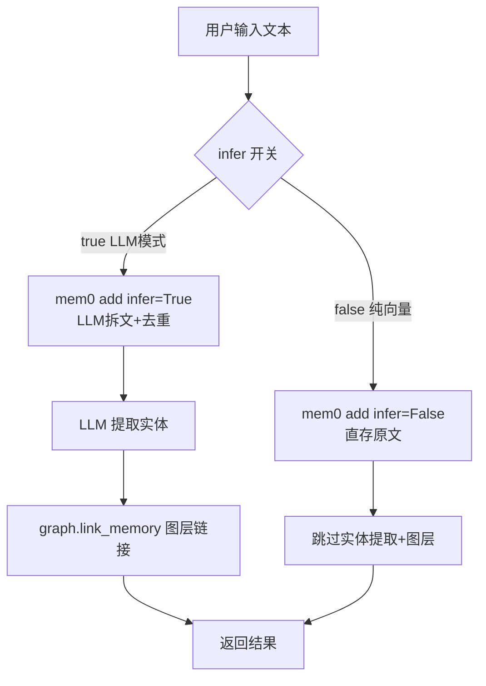
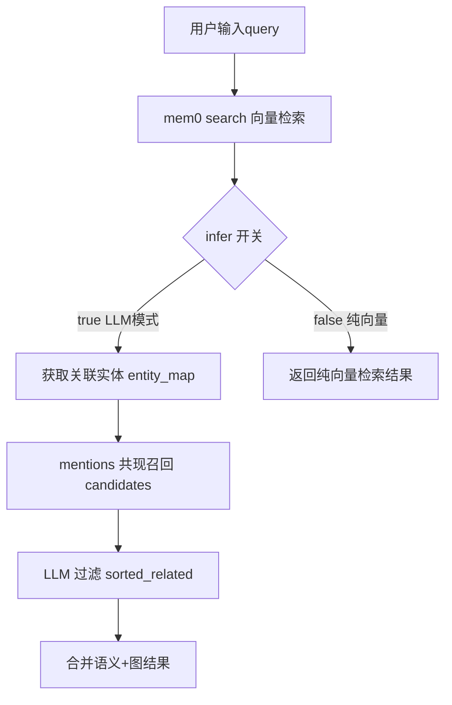
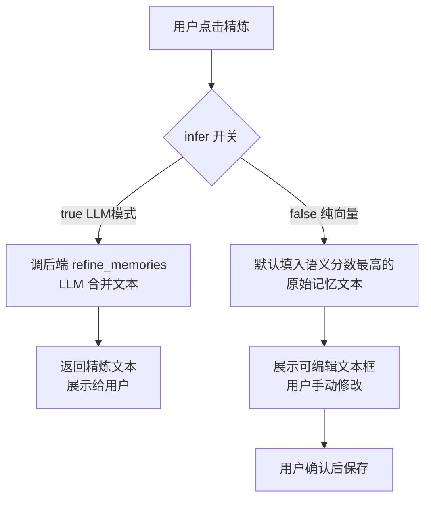

# mem0 纯向量降级模式（LLM 全局开关扩展）

## 一、项目目标

- **项目名称**：mem0 纯向量降级模式
- **一句话描述**：将前端已有的 `infer` 开关扩展为全局 LLM 模式开关，关闭时 mem0 退化为纯向量系统，搜索/保存/整理全部跳过 LLM 调用。
- **核心目标**：
  1. 前端现有 `infer` 开关升级为"LLM 模式"全局开关，关闭时全面禁用 LLM
  2. 保存记忆：`infer=False` 直存原文 + 跳过图层（LLM 实体提取 + 图链接）
  3. 搜索记忆：纯向量搜索，跳过图增强（共现召回 + LLM 过滤）
  4. 合并记忆：禁用 LLM 精炼按钮，用户手动编辑，默认填入语义分数最高的原始记忆
  5. 去重分析保留（仅依赖 BGE-M3 向量相似度，无 LLM）
- **不做的事**：
  - 不删除/移除已有的图层数据（已建成的实体网络保留）
  - 不改变 MCP 工具接口签名
  - 不改变 mem0 本身的混合检索机制（Qdrant 向量 + BM25 + RRF 融合继续工作）

---

## 二、业务背景

- **问题现状**：当前 `infer` 开关仅控制 `store_memory()` 中的 mem0 `infer` 参数。`search_memory()` 仍会调用 LLM（`extract_entities_llm`、`filter_related_memories`），合并记忆的 LLM 精炼也无法禁用。用户关闭开关后仍有 LLM 调用开销。
- **目标用户**：需要节省 LLM token 消耗、或暂时不需要智能拆文/实体关联的用户
- **预期价值**：关闭 LLM 后真正实现零 LLM 调用，所有操作仅依赖 BGE-M3 向量相似度

---

## 三、功能需求

| 功能 | 用户故事 | 优先级 | 备注 |
|---|---|---|---|
| LLM 全局开关 | 关闭"LLM模式"后，整个记忆系统不再调用任何大模型 | P0 | 扩展现有 `infer` 字段语义 |
| 纯向量保存 | 关闭 LLM 后，保存记忆时原文直存，不提取实体、不建图层 | P0 | `infer=False` + 跳过 `extract_entities_llm` + `graph.link_memory` |
| 纯向量搜索 | 关闭 LLM 后，搜索仅返回向量相似度结果，不进行图增强 | P0 | 跳过 `search_related_new` + `filter_related_memories` 整个 block |
| 手动精炼 | 关闭 LLM 后，合并记忆 Tab 的精炼按钮不调 LLM，弹出可编辑文本 | P1 | 默认填入时间最新的原始记忆 |
| 开关状态展示 | 前端清晰展示当前 LLM 模式及影响范围 | P1 | 关：提示"纯向量模式：搜索/保存/精炼均不调用大模型" |

---

## 四、非功能需求

- **性能要求**：关闭 LLM 后搜索响应应明显变快（无 LLM 调用等待）
- **向后兼容**：`memory_settings.json` 的 `infer` 字段不变，旧配置直接兼容
- **图层数据保留**：关闭 LLM 期间已建成的实体网络数据不删除，重新开启后可继续使用
- **无特殊要求**：安全、可用性、部署方式无变更

---

## 五、系统架构

### 架构图

```
                    ┌──────────────────────────────┐
                    │      前端 MemorySettings      │
                    │   [LLM模式]  ◄── toggle      │
                    │   开: ✨ 智能 / 关: ⚡ 纯向量  │
                    └─────────────┬────────────────┘
                                  │ GET/POST /memory/settings
                                  │ { infer: true/false }
                    ┌─────────────▼────────────────┐
                    │  memory.py (_memory_settings) │
                    │  _memory_settings["infer"]    │
                    └──────┬──────────┬────────────┘
                           │          │
              ┌────────────▼──┐  ┌───▼──────────────┐
              │ store_memory  │  │ search_memory     │
              │               │  │                   │
              │ if infer:     │  │ if infer:         │
              │   llm拆文     │  │   图增强搜索      │
              │   实体提取    │  │   (共现+LLM过滤)  │
              │   图链接      │  │ else:             │
              │ else:         │  │   纯向量结果      │
              │   直存原文    │  │                   │
              └───────────────┘  └───────────────────┘
                           │
              ┌────────────▼──────────────────┐
              │  refine_memories (LLM精炼)     │
              │  if infer:                     │
              │    调用 llm.refine_group()     │
              │  else:                         │
              │    返回错误/前端手动处理        │
              └───────────────────────────────┘
```

### 技术栈

| 组件 | 技术 | 说明 |
|---|---|---|
| 向量检索 | mem0 + Qdrant + BGE-M3 | 不变，始终可用 |
| LLM 拆文 | mem0 `infer` 参数 | 受开关控制 |
| 图增强 | SQLite + LLM (`extract_entities_llm`, `filter_related_memories`) | 受开关控制 |
| LLM 精炼 | `llm.refine_group()` | 受开关控制 |
| 去重分析 | BGE-M3 向量相似度 + Union-Find | 不受开关影响（无 LLM） |

### 目录结构（变更文件清单）

```
AiBrain/
├── backend/
│   ├── modules/brain/
│   │   ├── memory.py          # [改] store/search/refine 检查 infer 开关
│   │   ├── llm.py             # [不改] LLM 调用函数保留
│   │   └── graph.py           # [不改] 图层函数保留
│   └── routes/
│       └── memory_routes.py   # [改] refine 路由处理 infer=false
├── web/src/views/MemoryView/
│   ├── SettingsTab/
│   │   ├── MemorySettingsPanel.vue  # [改] 开关标签和描述升级
│   │   └── MemorySettingsTab.ts     # [不改] 接口不变
│   └── OrganizeTab/
│       ├── OrganizeTab.ts           # [改] refine 时检查 infer，填充默认文本
│       └── OrganizeGroupCard.vue    # [改] 精炼按钮行为调整
└── ~/.aibrain/config/
    └── memory_settings.json  # [不改] 字段不变，语义扩展
```

### 关键设计决策

1. **字段名不变**：`infer` 保留原名，与 mem0 API 一致。语义从"实体提取"扩展为"LLM全局模式"
2. **图层函数保留不删**：`extract_entities_llm`、`graph.link_memory` 等函数不动，仅在调用侧加 `if use_infer:` 判断
3. **去重分析保留**：`dedup.py` 不依赖 LLM（仅 BGE-M3 向量相似度），不受开关影响
4. **精炼降级策略**：后端 `refine_memories` 在 `infer=false` 时返回空结果 + hint，前端检测后允许用户手动编辑

---

## 六、数据结构

### `memory_settings.json`（不变）

```json
{
    "infer": true
}
```

字段含义扩展：
- `true`：LLM 模式开启（智能拆分、实体提取、图增强搜索、LLM 精炼）
- `false`：LLM 关闭（纯向量保存、纯向量搜索、手动精炼）

### `memory.py` 内部使用

```python
# 获取当前 LLM 模式（复用现有 _memory_settings）
use_llm = _memory_settings.get("infer", True)  # True=LLM模式, False=纯向量
```

---

## 七、流程设计

### 1. 保存记忆流程



### 2. 搜索记忆流程



### 3. 精炼记忆流程



---

## 八、API 设计

### 8.1 记忆设置（不变）

**GET /memory/settings**
```json
// Response
{ "infer": true }
```

**POST /memory/settings**
```json
// Request
{ "infer": false }
// Response
{ "infer": false }
```

### 8.2 存储记忆（不变）

**POST /memory/store**
```json
// Request
{ "text": "今天学习了mem0的使用方法" }
// Response
{ "result": "已记住: 新增 1 条记忆", "stored_texts": [...], "added_count": 1, "deleted_count": 0, "entities": [] }
```
> infer=false 时 `entities` 始终为空数组

### 8.3 搜索记忆（不变）

**POST /memory/search**
```json
// Request
{ "query": "mem0 使用方法" }
// Response
[
  { "id": "abc123", "text": "今天学习了mem0的使用方法", "score": 0.8542, "source": "semantic" }
]
```
> infer=false 时结果中不包含 `source: "graph"` 的条目，`entities` 字段仍存在但为空数组

### 8.4 精炼记忆（行为变更）

**POST /memory/organize/refine**
```json
// Request（不变）
{ "groups": [{"group_id": 0, "similarity": 0.85, "memories": [...]}] }

// Response（infer=false）
{
  "refined": [
    {
      "group_id": 0,
      "refined_text": "",  // 空，需前端手动处理
      "category": "reference",
      "refined": false,
      "hint": "LLM模式已关闭，请手动编辑合并文本"
    }
  ]
}
```

---

## 九、验收标准

### 功能验收

| 编号 | 验收项 | 操作 | 预期结果 |
|---|---|---|---|
| A1 | 开关关闭后保存纯向量 | 关闭 LLM → 保存记忆 → 查看结果 | entities 为空，mem0 不调用 LLM 拆文 |
| A2 | 开关关闭后搜索纯向量 | 关闭 LLM → 搜索 | 结果无 `source: "graph"` 条目，响应变快 |
| A3 | 开关关闭后精炼手动 | 关闭 LLM → 去重分析 → 点击精炼 | 弹出编辑框，默认填入时间最新的原文，可手动编辑 |
| A4 | 开关开启后恢复完整功能 | 开启 LLM → 保存 → 搜索 | entities 非空，搜索结果有图增强条目 |
| A5 | 前端开关 UI 更新 | 查看设置 Tab | 开关标签为"LLM 模式"，描述覆盖全部影响范围 |
| A6 | 去重分析不受影响 | 关闭 LLM → 开始去重分析 | 正常分组，流程不变 |

### 交付物清单

- [ ] `backend/modules/brain/memory.py` — store/search/refine 加 infer 判断
- [ ] `backend/routes/memory_routes.py` — refine 路由兼容 infer=false 响应
- [ ] `web/src/views/MemoryView/SettingsTab/MemorySettingsPanel.vue` — 开关 UI 更新
- [ ] `web/src/views/MemoryView/OrganizeTab/OrganizeTab.ts` — 精炼默认填充逻辑
- [ ] `web/src/views/MemoryView/OrganizeTab/OrganizeGroupCard.vue` — 精炼按钮行为调整

---

## 十、开发任务拆分

| 任务 ID | 任务名称 | 依赖 | 复杂度 | 所属模块 |
|---|---|---|---|---|
| T001 | 后端 `store_memory` 纯向量：infer=false 时跳过 LLM 实体提取和图链接 | 无 | S | backend/memory.py |
| T002 | 后端 `search_memory` 纯向量：infer=false 时跳过图增强 block | 无 | S | backend/memory.py |
| T003 | 后端 `refine_memories` 降级：infer=false 返回空 refined_text + hint | T001 | S | backend/memory.py + routes |
| T004 | 前端设置面板 UI 升级：开关标签改为"LLM 模式"，描述覆盖全部影响 | 无 | S | web/SettingsTab |
| T005 | 前端合并记忆 Tab：精炼按钮在 infer=false 时改为手动编辑模式 | T003 | M | web/OrganizeTab |
| T006 | 手动精炼默认填充逻辑：选择时间最新的原始记忆填入编辑框 | T005 | S | web/OrganizeTab |
| T007 | E2E 测试：LLM 模式开关的保存/搜索/精炼全流程验证 | T001-T006 | M | tests/ |

**并行分组**：
- 组1（后端）：T001、T002、T003 可并行
- 组2（前端）：T004、T005、T006 依赖 T003 完成后端接口
- 组3（测试）：T007 在所有完成后执行
