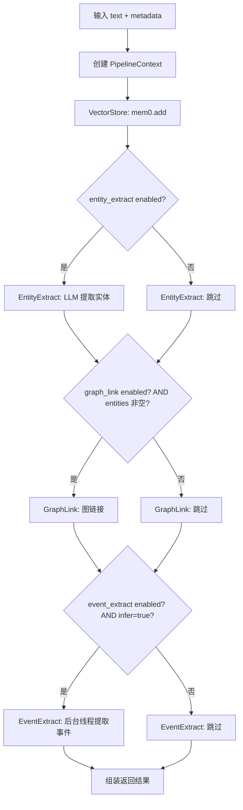
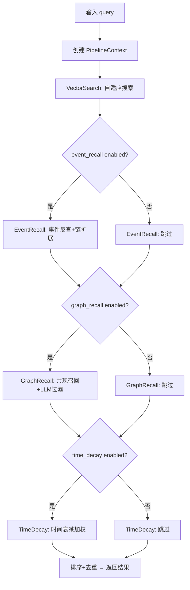

# 记忆流水线架构 —— 可插拔步骤编排

## 一、项目目标

- **项目名称**：记忆流水线架构（Memory Pipeline Architecture）
- **一句话描述**：将 `store_memory()` 和 `search_memory()` 中硬编码的处理阶段拆分为独立的 Step，通过 PipelineEngine 统一编排，支持运行时动态增删改步骤。
- **核心目标**：
  1. **步骤解耦**：每个处理阶段（实体提取、事件提取、图搜索、时间衰减等）拆为独立 Step，互不干扰
  2. **动态编排**：通过配置文件控制步骤顺序和启停，修改即时生效，无需重启后端
  3. **可扩展**：新功能以 Step 形式"插"入流水线，不改核心代码
  4. **可观测**：每个 Step 自动记录耗时和状态，方便调优
  5. **向后兼容**：`store_memory()` / `search_memory()` 签名和返回格式完全不变
- **不做的事**：
  - 不改变 mem0 向量存储机制
  - 不改变现有 API 接口和返回格式
  - 不删除现有数据（实体网络、事件表等）
  - 不引入新的外部依赖
  - `list_memories` / `delete_memory` / `update_memory` 不纳入 pipeline（无多阶段处理需求，保持现有直接调用 mem0 的方式）
  - `organize_memories` / `dedup_memories` / `refine_memories` 不纳入 pipeline（通过兼容层间接使用 engine，见 §11.2）

---

## 二、业务背景

### 2.1 问题现状

| 问题 | 表现 | 影响 |
|------|------|------|
| 步骤硬编码 | store_memory 内嵌 Step0~Step2、search_memory 内嵌 Phase1~Phase4 | 修改步骤必须改 core.py，容易引入回归 |
| 粒度控制粗 | 所有 LLM 相关步骤共享 `infer` 布尔开关，无法单独启停 | 想关事件提取但要保留实体提取？做不到 |
| 扩展成本高 | 加一个新后处理步骤需要读懂整个巨型函数，找到正确的插入点 | 开发效率低，难以并行 |
| 无法运行时调整 | 步骤拓扑在代码中固定，想临时关闭某个步骤必须改代码+重启 | 调试和调优不便 |

### 2.2 目标场景

```
场景1：调试时临时跳过某个步骤
  → 调用 API 禁用 EntityExtract 步骤
  → 存储记忆时不再提取实体
  → 保存后重新启用，立即恢复

场景2：添加 ReRank 重排序步骤
  → 新建 rerank_step.py + register
  → 修改配置文件插入到 VectorSearch 之后
  → 搜索流水线自动应用重排序

场景3：A/B 测试两种不同的搜索策略
  → 同时配置两条流水线拓扑
  → 按请求参数选择使用哪条
```

---

## 三、功能需求

| 功能 | 用户故事 | 优先级 | 备注 |
|------|---------|--------|------|
| PipelineEngine | 统一编排步骤执行，管理上下文传递 | **P0** | 核心基础设施 |
| Step 基类 | 定义步骤接口（execute 方法 + metadata） | **P0** | 所有步骤继承 |
| Store 步骤拆分 | VectorStore、EntityExtract、GraphLink、EventExtract 各为独立 Step | **P0** | 保持现有行为不变 |
| Search 步骤拆分 | VectorSearch、EventRecall、GraphRecall、TimeDecay 各为独立 Step | **P0** | 保持现有行为不变 |
| 配置持久化 | 步骤拓扑写 JSON 文件，重启保留 | **P0** | ~/.aibrain/config/memory_pipeline.json |
| 运行时步骤调整 API | GET/PUT /memory/pipeline 查询和修改流水线拓扑 | **P1** | 安全限制：不允许禁用强制步骤 |
| 步骤耗时统计 | 引擎自动记录每步耗时，日志可见 | **P1** | 用于性能调优 |
| 兼容层 | store_memory/search_memory 函数转为调用引擎 | **P0** | 现有调用方无需修改 |
| 前端流水线配置页 | 可视化查看/调整步骤拓扑 | **P2** | 后续迭代 |

---

## 四、非功能需求

- **性能**：引擎调度开销 < 1ms（相比 LLM 调用可忽略）
- **向后兼容**：`store_memory()` / `search_memory()` 签名和返回格式完全不变
- **线程安全**：配置读取用 threading.Lock 保护，并发请求安全
- **扩展性**：新增一个 Step ≤ 20 行代码（新建文件 + 注册）
- **无特殊要求**：安全、日志、部署方式无变更

---

## 五、系统架构

### 5.1 架构图

```
主流程（同步）：
  请求 → memory_routes.py (POST /memory/store, /memory/search)
          ↓
        core.py (兼容层: store_memory / search_memory)
          ↓
        PipelineEngine.run(ctx) ← 从配置读取步骤拓扑
          ├── [Step 1] VectorStore / VectorSearch  (required: true)
          ├── [Step 2] EntityExtract / EventRecall
          ├── [Step 3] GraphLink / GraphRecall
          ├── [Step 4] EventExtract / TimeDecay
          └── [Step N] ... 未来扩展
          ↓
        ctx.output → 组装返回 → JSON 响应

MCP 异步流程：
  请求 → memory_routes.py (POST /memory/mcp/store)
          ↓
        线程 Thread(target=bg_store)
          └→ core.store_memory() → PipelineEngine.run(ctx)
          └→ 结果写入 stats_db stream（不返回给调用方）
          ↓
        立即返回 {status: "pending", rowid: ...}

  MCP 搜索 (/memory/mcp/search)：
        同步调用 PipelineEngine.run(ctx)，与 /memory/search 走相同流程
```

**PipelineContext 数据流**：

```
PipelineContext {
    input_data:  str | dict        # 原始输入（text / query）
    metadata:    dict              # 附加元数据
    output:      Any               # 最终结果
    intermediate: dict             # {step_name: step_output} 步骤间共享
    step_results: dict             # {step_name: {duration, status, error}}
    aborted:     bool              # 是否中止
}
```

### 5.2 技术栈

| 组件 | 技术 | 说明 |
|------|------|------|
| 流水线引擎 | 纯 Python (无依赖) | PipelineEngine 单例，~100 行 |
| 步骤基类 | Python Protocol / ABC | StepProtocol 接口 |
| 配置持久化 | JSON 文件 | ~/.aibrain/config/memory_pipeline.json |
| 上下文 | PipelineContext dataclass | 显式传递，类型提示 |

### 5.3 目录结构（变更文件清单）

```
backend/modules/brain/
├── memory/
│   ├── __init__.py          # [改] 导出 init_pipelines()
│   ├── core.py              # [改] store_memory/search_memory 转为引擎调用
│   ├── events.py            # [不改] EventStore 逻辑不变
│   ├── prompts.py           # [不改] Prompt 常量不变
│   └── pipeline/            # [新增] 流水线架构
│       ├── __init__.py      # [新增] init_pipelines() 工厂函数
│       ├── context.py       # [新增] PipelineContext 类
│       ├── engine.py        # [新增] PipelineEngine 单例
│       ├── config.py        # [新增] 配置读写
│       └── steps/
│           ├── __init__.py  # [新增] 注册所有步骤
│           ├── store/
│           │   ├── __init__.py     # [新增] store 步骤注册
│           │   ├── vector_store.py # [新增] 封 mem0.add()
│           │   ├── entity_extract.py # [新增] LLM 实体提取
│           │   ├── graph_link.py   # [新增] 图链接
│           │   └── event_extract.py # [新增] 后台事件提取
│           └── search/
│               ├── __init__.py     # [新增] search 步骤注册
│               ├── vector_search.py # [新增] 封 mem0.search()
│               ├── event_recall.py  # [新增] 事件反查+链扩展
│               ├── graph_recall.py  # [新增] 共现召回+LLM过滤
│               └── time_decay.py    # [新增] 时间衰减加权
│
├── graph.py               # [不改] 图操作不变
├── llm.py                 # [不改] LLM 调用不变
├── mem0_adapter.py        # [不改] mem0 客户端不变
└── CLAUDE.md              # 已有："记忆相关新功能放 memory/ 目录"
```

### 5.4 关键设计决策

1. **PipelineContext 作为唯一上下文**：所有步骤通过 `ctx.intermediate` 读写中间结果，步骤间不直接调用，消除隐式耦合
2. **required 步骤保护**：VectorStore / VectorSearch 标记为 `required=True`，配置文件无法禁用，API 层面拒绝修改
3. **配置即拓扑**：步骤顺序由 JSON 数组顺序决定，修改后下次请求立即生效，不重启
4. **非强制步骤容错**：某个步骤抛异常时引擎 catch 并记录错误，继续执行下一步骤（标记为 `required` 的步骤失败则整体失败）
5. **后台步骤隔离**：EventExtract 启动后台线程后立即返回，引擎不等待，保证 store 请求不阻塞
6. **惰性注册**：步骤在首次 `init_pipelines()` 时注册到引擎，app 启动时调用一次
7. **MCP 路由接入**：MCP store 是异步路由，在后台线程中调用 `store_memory()` → 引擎同步执行完整流水线；MCP search 直接同步调用引擎，与主流程完全一致。引擎本身不提供"异步模式"，异步由路由层通过 threading.Thread 实现
8. **步骤间数据契约显式化**：见"六.4 步骤间数据契约"表格，每个步骤必须声明写入/读取的 intermediate key
9. **GraphRecall 内部封装**：泛化实体过滤、LLM 批量过滤、共现排序、激活扩散（备用）等子逻辑全部封装在 GraphRecall 步骤内部，不拆为更细的步骤。如果未来某个子逻辑需要独立启停，再考虑拆分
10. **打分系数硬编码在步骤内部**：事件召回得分 = min_semantic × 0.85、图召回得分 = min_semantic × 0.8 等系数不纳入配置，保持各步骤内部硬编码。理由是这些系数是算法常数不是用户可调参数，且修改频率极低。未来如有调优需求再考虑纳入配置
11. **后台线程错误仅记录日志**：EventExtract 后台线程的错误不传播到引擎，也不写入 step_results（主线程已返回）。错误仅写入 `logger.warning`，通过日志查询接口定位。不提供独立的错误查询 API
12. **配置校验规则**：① 未注册的 step name → 报错拒绝（防止拼写错误导致步骤静默丢失）；② 同一 pipeline 中出现重复 step name → 报错拒绝；③ required 步骤不可设置 enabled=false → API 层面拒绝；④ pipeline 为空（所有非 required 步骤被禁用）→ 允许，引擎只执行 required 步骤，不视为异常；⑤ 配置文件损坏或不存在 → 使用代码内置默认拓扑（硬编码 default_config，非从文件恢复），首次启动自动生成配置文件
13. **init_pipelines() 启动集成点**：在 `app.py` 的 `create_app()` 工厂函数中、路由注册之前调用。语义模型预热（`warmup_memory_count()`, `_preload`）在前，pipeline 初始化在后。顺序为：create_app() → 注册路由前 → warmup_memory → init_pipelines() → 注册路由。理由：init_pipelines() 本身只做步骤注册+配置加载到内存，不依赖任何路由。PUT /memory/pipeline API 才依赖路由，但那是运行时请求，不涉及启动阶段。所以 init 放路由注册前完全安全
14. **`_memory_settings` 与 pipeline 的关系**：`_memory_settings["infer"]` 保留，语义从"全局 LLM 开关"降为"LLM 步骤的默认启用/禁用依据"。具体规则：每个依赖 LLM 的 Step（EntityExtract、EventExtract、EventRecall、GraphRecall）在 execute() 内部检查 `_memory_settings.get("infer", True)`，如果 `infer=false` 则步骤内部返回空结果（不调 LLM），但仍然被引擎执行。即：步骤 enabled 控制"是否被引擎执行"，步骤内部 infer 控制"执行后是否调 LLM"。GET/POST /memory/settings 保留不变，GET/PUT /memory/pipeline 与其独立，不合并
15. **Step 生命周期钩子**：引擎在 execute() 前后自动触发 on_start / on_finish / on_error 钩子，集中处理日志和计时，步骤内部无需重复。钩子在 StepDef/StepProtocol 中定义为可选方法，不强制实现。引擎侧实现方式：在 `run()` 循环中包一层 `_run_step(name)`，内部调用 `_log_start(name) → step.execute(ctx) → _log_end(name, duration)`。步骤内部不再写 `logger.info(f"Step X starting...")`
16. **Step 超时机制**：StepDef 增加 `timeout: float = 30.0`（秒）。引擎在执行 Step 时用 `concurrent.futures` 做超时控制：提交到线程池执行，设定超时时间，超时则标记为 error 并跳过（非 required 步骤）或抛异常（required 步骤）。LLM 调用类步骤（EntityExtract、EventRecall、GraphRecall）超时设为 30s，mem0 操作类步骤（VectorStore、VectorSearch）超时设为 10s。网络 IO 密集型步骤（GraphLink）超时设为 15s
    - **已知限制**：Python 的 `concurrent.futures` 超时后无法杀死已启动的线程。如果 LLM 调用在网络层面卡死，线程会一直存活到响应返回或 TCP 超时。这不影响正确性（流水线继续执行后续步骤），但线程资源不会立即释放。缓解措施：LLM 调用自身设置 HTTP 请求级别的 `timeout` 参数，双重保障
17. **配置热加载策略**：采用方案 C（纯内存 + API 写入持久化）。流程：PUT /memory/pipeline → config.py 校验 → 写入 JSON 文件 → 更新内存拓扑。GET /memory/pipeline 直接读内存，不读磁盘。后续请求直接读内存拓扑，零 IO 开销。首次启动时从 JSON 文件加载到内存，文件不存在则使用代码内置默认值。不需要文件 mtime 检测（非 API 方式的文件修改视为配置损坏 + fallback）
18. **并发模型**：PipelineEngine.run() 是线程安全的。每个请求创建独立的 PipelineContext 实例，ctx.intermediate 互不干扰。配置读取通过 `threading.Lock` 保护（虽然方案 C 读写都是内存操作，但写操作需要加锁防止半写状态被另一个读请求看到）。步骤内部（如 LLM 调用、mem0 调用、SQLite 写入）由这些组件的自身线程安全机制保障。PipelineEngine 不引入额外的并发限制

---

## 六、数据结构

### 6.1 PipelineEngine 配置（JSON 持久化）

配置文件路径：`{home}/.aibrain/config/memory_pipeline.json`
- 路径解析：`pathlib.Path.home() / ".aibrain" / "config" / "memory_pipeline.json"`
- Windows 解析示例：`C:\Users\Kaplc\.aibrain\config\memory_pipeline.json`
- 目录不存在时首次启动自动创建

```json
{
    "store": [
        {"name": "vector_store", "enabled": true, "required": true},
        {"name": "entity_extract", "enabled": true, "required": false},
        {"name": "graph_link", "enabled": true, "required": false},
        {"name": "event_extract", "enabled": true, "required": false}
    ],
    "search": [
        {"name": "vector_search", "enabled": true, "required": true},
        {"name": "event_recall", "enabled": true, "required": false},
        {"name": "graph_recall", "enabled": true, "required": false},
        {"name": "time_decay", "enabled": true, "required": false}
    ]
}
```

> 校验规则：未注册 step name → 报错；重复 step name → 报错；required 步骤设置 enabled=false → 拒绝；pipeline 为空（仅剩 required）→ 允许
>
> timeout 字段不暴露到 JSON 配置中，由各步骤内部硬编码。理由：超时是运维参数而非业务开关，误改可能导致步骤被截断或等待异常。如需调整，改步骤代码而非配置文件。

### 6.2 PipelineEngine 内部状态

```python
@dataclass
class PipelineContext:
    input_data: Any              # 原始输入
    metadata: dict               # 附加元数据
    output: Any = None           # 最终结果
    intermediate: dict = None    # 步骤间共享 {step_name: output}
    step_results: dict = None    # {step_name: {duration, status, error}}
    aborted: bool = False

@dataclass
class StepDef:
    name: str                    # 唯一标识符
    description: str             # 人类可读描述
    execute: Callable            # fn(ctx) -> ctx
    enabled: bool = True         # 是否启用
    required: bool = False       # 强制步骤不可禁用
    pipeline: str = "store"      # "store" | "search"
    timeout: float = 30.0        # 执行超时（秒），LLM 步骤 30s，mem0 步骤 10s

    # 可选生命周期钩子（引擎在 execute 前后自动触发）
    def on_start(self, ctx: PipelineContext) -> None: ...
    def on_error(self, ctx: PipelineContext, e: Exception) -> None: ...
    def on_finish(self, ctx: PipelineContext) -> None: ...
```

### 6.3 PipelineEngine 接口

```python
class PipelineEngine:
    def register_step(self, step: StepDef) -> None
    def set_pipeline(self, name: str, steps: list[dict]) -> None
    def get_pipeline(self, name: str) -> list[dict]
    def run(self, ctx: PipelineContext, pipeline: str) -> Any
```

### 6.4 步骤间数据契约（ctx.intermediate 的 key 定义）

每个步骤通过 `ctx.intermediate` 读写数据。下表定义了每个步骤的 key 契约：

| Step | 写入 key | 读取 key | 说明 |
|------|---------|---------|------|
| **VectorStore** | `mem0_result`, `mem0_ids`, `mem_texts` | — | `mem0_result`: mem0.add() 返回的原始结果（含 events 列表）；`mem0_ids`: 提取的 ID 列表；`mem_texts`: 对应记忆文本列表 |
| **EntityExtract** | `entities`, `root_entity` | `mem_texts` | `entities`: LLM 提取的实体名列表（list[str]）；`root_entity`: 归属分类（如"用户"） |
| **GraphLink** | `graph_result` | `entities`, `mem0_ids`, `mem_texts` | `graph_result`: graph.link_memory() 的调用结果 |
| **EventExtract**（后台） | — | `mem0_ids`, `mem_texts` | 后台线程，不写入 intermediate；通过 `es.extract_events_from_memory()` 直接操作 DB |
| **VectorSearch** | `semantic_results`, `min_semantic_score` | — | `semantic_results`: mem0.search() 结果列表；`min_semantic_score`: 语义结果中的最低分（其他步骤用它做基准） |
| **EventRecall** | `event_results` | `semantic_results` | `event_results`: 事件链扩展召回的额外记忆列表（格式同 semantic_results） |
| **GraphRecall** | `graph_results` | `semantic_results`, `event_results` | `graph_results`: 共现召回的额外记忆列表（含 LLM 过滤） |
| **TimeDecay** | — | `semantic_results`, `event_results`, `graph_results` | 直接原地修改 ctx.intermediate 内的 score 字段，不写入新 key |

> **失败约定**：步骤如果抛异常或跳过，**不写入任何 intermediate key**。下游步骤统一用 `ctx.intermediate.get(key)` 判空（返回 None 或缺失），不应假设 key 存在。如果必填 key 缺失则下游步骤自身也应跳过。不存在"失败的步骤写了 None"的情况——要么成功写入，要么完全不写。

### 6.5 打分策略说明（硬编码在各步骤内部）

| 步骤 | 得分计算 | 说明 |
|------|---------|------|
| VectorSearch | mem0 原始得分 | 直接取 mem0 返回的 score |
| EventRecall | `min_semantic × 0.85 - i × 0.001` | 以语义结果最低分为基准，i 为事件结果索引 |
| GraphRecall | `min_semantic × 0.8 - i × 0.001` | 以语义结果最低分为基准，LLM 过滤后排序 |
| TimeDecay | `score × decay(t) × emotion_boost × importance_boost` | 时间衰减后在原分数上调整 |

> 这些系数是算法常数，硬编码在步骤内部。未来如需调优，可从步骤内部提到配置文件。

---

## 七、流程设计

### 1. StorePipeline 执行流程



### 2. SearchPipeline 执行流程



### 3. VectorSearch 自适应搜索逻辑（封装在步骤内部）

VectorSearch 步骤封装了现有的 `_get_search_options()` 自适应逻辑：

```
Step: VectorSearch
  1. 根据记忆总数自适应参数：
     - total < 100:    top_k=50, threshold=0.55, rerank=False
     - total ≤ 1000:   top_k=50, threshold=0.55, rerank=False
     - total > 1000:   top_k=50, threshold=0.55, rerank=True
  2. 首次搜索：使用 threshold 过滤，top_k=75
  3. 判断结果是否 ≥ 15 条
  4. 不足 15 条时：去掉阈值（threshold=0）再补搜一次，去重
  5. 写入 ctx.intermediate:
     - semantic_results: 最终结果列表 [{id, text, score, source: "semantic"}]
     - min_semantic_score: 最低分（供后续步骤做基准）
```

> 自适应逻辑完全封装在 VectorSearch 步骤内部，对其他步骤透明。

### 4. GraphRecall 步骤的内部子逻辑（封装在步骤内部）

GraphRecall 步骤封装了现有的 Phase 3 所有子逻辑：

```
Step: GraphRecall
  1. 从 ctx.intermediate["semantic_results"] 获取已命中的记忆 ID
  2. 获取关联实体映射：graph.get_entities_for_memories(mem_ids) → entity_map
  3. 写入 entities 字段到每条约结果
  4. 泛化实体过滤：出现频率超过总记忆数 5% 的实体视为泛化词，过滤掉
  5. mentions 共现召回：graph.search_related_new(mem_ids, entities, max_candidates=50)
     - 候选按 co_count 降序排列
     - 激活扩散算法（spreading_activation）作为备用策略
  6. LLM 批量过滤：filter_related_memories(query, candidates) → related_ids
  7. 打分：min_semantic × 0.8 - i × 0.001，标记 source: "graph"
  8. 写入 ctx.intermediate["graph_results"]
```

> 这些子逻辑全部封装在 GraphRecall 步骤内部，不拆为更细的步骤。如需独立启停某个子逻辑（如关闭 LLM 过滤），通过步骤内部的条件开关控制。

### 5. 步骤异常与错误处理策略

| 步骤 | 异常类型 | 处理方式 | 对调用的影响 |
|------|---------|---------|-------------|
| VectorStore / VectorSearch | mem0 连接/超时错误 / 执行超时（10s） | 重试 1 次，仍失败则抛异常 | **required 步骤** → 流水线整体失败，错误返回给调用方 |
| EntityExtract | LLM 调用失败 / 执行超时（30s） | 记录 warn，不写入 entities key；下游用 `.get("entities")` 判空后跳过 | 后续 GraphLink 读取到 None 自动跳过，不影响 store 结果 |
| GraphLink | 数据库锁超时 / 执行超时（15s） | 重试 1 次，失败记录 warn | 跳过图链接，store 结果不含实体 |
| **EventExtract**（后台线程） | LLM 调用失败 / 数据库写入失败 | 仅写入 `logger.warning`，不写 step_results（主线程已返回） | **不影响请求响应**。错误通过日志文件 `logs/` 排查 |
| EventRecall | LLM 搜索失败 / 执行超时（30s） | 回退子串匹配，仍失败记录 warn | 跳过事件召回，不写入 event_results key |
| GraphRecall | LLM 批量过滤失败 / 执行超时（30s） | 跳过 LLM 过滤，直接返回共现候选 | 结果可能包含不相关的共现记忆 |
| TimeDecay | 事件查询异常 | 保持原始分数不变，记录 warn | search 结果正常返回，无衰减效果 |

> EventExtract 后台错误排查方式：通过 GET /memory/graph/rebuild/log 或直接查看 `logs/` 目录下的日志文件。不提供独立的错误查询 API，避免接口膨胀。

---

## 八、API 设计

### 8.1 记忆存储（不变）

**POST /memory/store**

请求和响应格式完全不变，内部改为引擎调用：

```
// Request
{ "text": "今天学习了mem0的使用方法" }

// Response
{ "result": "已记住: 新增 1 条记忆", "stored_texts": [...], "added_count": 1, "deleted_count": 0, "entities": [...] }
```

### 8.2 记忆搜索（不变）

**POST /memory/search**

```
// Request
{ "query": "mem0 使用方法" }

// Response
{ "results": [{ "id": "abc123", "text": "...", "score": 0.85, "source": "semantic" }] }
```

### 8.3 流水线配置查询（新增）

**GET /memory/pipeline**

```
// Response
{
  "store": [
    {"name": "vector_store", "enabled": true, "required": true, "description": "mem0 向量存储"},
    {"name": "entity_extract", "enabled": true, "required": false, "description": "LLM 实体提取"},
    ...
  ],
  "search": [...]
}
```

### 8.4 流水线配置更新（新增）

**PUT /memory/pipeline**

```
// Request
{
  "store": [
    {"name": "vector_store", "enabled": true},
    {"name": "entity_extract", "enabled": false},
    ...
  ]
}

// Response
{ "ok": true, "store": [...更新后的配置...] }
```

> 注意：`required: true` 的步骤不可禁用，API 层面拒绝修改 `enabled: false`

### 8.5 MCP 路由处理

**POST /memory/mcp/store（异步）**

MCP store 在后台线程中调用引擎，不阻塞请求返回：

```
请求 → memory_routes.mcp_store()
   1. 立即返回 {rowid, status: "pending"}
   2. 启动后台线程 _bg_store():
      └→ core.store_memory(text)     ← 通过兼容层走引擎
      └→ PipelineEngine.run(ctx)     ← 引擎同步执行完整 StorePipeline
      └→ 结果写入 stats_db stream     ← rowid 更新内容和状态
```

> 引擎本身不提供异步模式。异步由路由层通过 threading.Thread 实现，在后台线程中同步调用引擎。引擎内部不需要任何异步支持。

**POST /memory/mcp/search（同步）**

MCP search 与 /memory/search 走完全相同的代码路径：

```
请求 → memory_routes.mcp_search()
   └→ core.search_memory(query)    ← 通过兼容层走引擎
   └→ PipelineEngine.run(ctx)      ← 引擎同步执行完整 SearchPipeline
   └→ 结果写入 stats_db stream     ← rowid 更新状态
   └→ 返回 {results, stats}
```

### 8.6 API 变更汇总

| API | 变更类型 | 说明 |
|-----|---------|------|
| `POST /memory/store` | **内部重写，格式不变** | 改为 PipelineEngine.run() |
| `POST /memory/search` | **内部重写，格式不变** | 改为 PipelineEngine.run() |
| `POST /memory/mcp/store` | **内部重写，返回格式不变** | 路由层开线程 → 线程内调用引擎 |
| `POST /memory/mcp/search` | **内部重写，格式不变** | 直接调用引擎，与 /memory/search 一致 |
| `GET /memory/pipeline` | 新增 | 查询流水线拓扑 |
| `PUT /memory/pipeline` | 新增 | 更新流水线拓扑（步骤启停/重排） |
| `GET /memory/settings` | 不变 | 保留原 settings |

---

## 九、验收标准

### 9.1 功能验收

| 编号 | 验收项 | 操作 | 预期结果 |
|------|--------|------|---------|
| A1 | 步骤拆分不改变 store 行为 | 保存一段文本 | 返回结果与拆分前一致 |
| A2 | 步骤拆分不改变 search 行为 | 搜索关键词 | 返回结果与拆分前一致（含 event/graph 增强） |
| A3 | 禁用非强制步骤（store） | PUT 禁用 entity_extract → 保存记忆 | 实体字段为空，其他结果正常 |
| A4 | 禁用非强制步骤（search） | PUT 禁用 graph_recall → 搜索 | 结果无 source:"graph" 条目 |
| A5 | 重排步骤顺序 | PUT 调整 search 步骤顺序 → 搜索 | 按新顺序执行（通过日志验证） |
| A6 | 强制步骤保护 | PUT 设置 vector_store.enabled=false | 接口拒绝，返回错误 |
| A7 | 步骤异常容错 | 让某个非强制步骤抛异常 | 流水线继续，最终结果返回 |
| A8 | 配置持久化 | PUT 修改配置 → 重启后端 → GET 查询 | 配置与修改后一致 |
| A9 | 重新启用步骤 | PUT 重新启用已禁用的步骤 | 步骤恢复工作 |
| A10 | 添加新步骤 | 新建 Step 文件 + 注册 + 修改配置 | 新步骤正确执行 |

### 9.2 交付物清单

- [ ] `backend/modules/brain/memory/pipeline/engine.py` — PipelineEngine
- [ ] `backend/modules/brain/memory/pipeline/context.py` — PipelineContext
- [ ] `backend/modules/brain/memory/pipeline/config.py` — 配置读写
- [ ] `backend/modules/brain/memory/pipeline/__init__.py` — init_pipelines()
- [ ] `backend/modules/brain/memory/pipeline/steps/__init__.py` — 步骤注册中心
- [ ] `backend/modules/brain/memory/pipeline/steps/store/` — 4 个 store Step
- [ ] `backend/modules/brain/memory/pipeline/steps/search/` — 4 个 search Step
- [ ] `backend/modules/brain/memory/core.py` — 兼容层改造
- [ ] `backend/modules/brain/memory/__init__.py` — 导出更新
- [ ] `backend/routes/memory_routes.py` — 新增流水线 API
- [ ] `~/.aibrain/config/memory_pipeline.json` — 默认配置文件（首次启动自动生成）

---

## 十、开发任务拆分

| 任务 ID | 任务名称 | 依赖 | 复杂度 | 预估代码量 | 所属模块 |
|---------|----------|------|--------|-----------|---------|
| T001 | PipelineContext + StepDef 数据结构定义 | 无 | S | ~50 行 | pipeline/context.py |
| T002 | PipelineEngine 核心实现（注册 + 执行 + 异常+超时处理 + 生命周期钩子 + 并发锁） | T001 | M | ~150 行 | pipeline/engine.py |
| T003 | 配置持久化（读写 + 校验规则 + 默认配置 + Windows 路径处理） | T002 | M | ~80 行 | pipeline/config.py |
| T004 | store 步骤拆分（VectorStore / EntityExtract / GraphLink / EventExtract） | T002 | M | ~150 行 | pipeline/steps/store/ |
| T005 | search 步骤拆分（VectorSearch / EventRecall / GraphRecall / TimeDecay） | T002 | M | ~180 行 | pipeline/steps/search/ |
| T006 | 步骤注册中心 + init_pipelines() 工厂函数 | T004, T005 | S | ~40 行 | pipeline/__init__.py |
| T007 | core.py 兼容层改造（store_memory / search_memory 转为引擎调用） | T006 | M | ~60 行 | core.py |
| T008 | 流水线 API（GET/PUT /memory/pipeline + 配置校验） | T003 | S | ~50 行 | memory_routes.py |
| T009 | E2E 回归测试（store/search/MCP/CRUD/排序完整性） | T001-T008 | M | ~80 行 | tests/ |
| T010 | Step 单元测试（mock mem0/LLM/graph，验证每个 Step 的输入输出契约） | T004, T005 | M | ~120 行 | tests/unit/steps/ |

### 预估工作量
- **总计**：约 12-15 小时（10 个任务，~900 行代码）
- **核心变更**：T002（引擎实现）、T004/T005（步骤拆分）、T010（单元测试）
- **注意事项**：每个步骤需确保从 `core.py` 提取时逻辑完全一致，不改变现有行为

---

## 十一、风险与回滚

### 11.1 风险识别

| 风险 | 概率 | 影响 | 缓解措施 |
|------|------|------|---------|
| 步骤拆分导致隐式依赖断裂 | 中 | Phase 2 依赖 Phase 1 的输出 | 用 ctx.intermediate 显式传递，单元测试每个步骤 |
| 配置损坏导致流水线不可用 | 低 | 高 | 配置校验 + 自动 fallback 到默认拓扑 |
| Organizer/Dedup 调用链断裂 | 中 | 中 | 见下方"外部调用方依赖说明" |
| 并发请求下配置读写冲突 | 低 | 低 | 读写均通过 `threading.Lock` 保护（方案 C 运行时 PUT 修改内存配置，读必须加锁防半写） |

### 11.2 外部调用方依赖说明

| 调用方 | 调用方式 | 是否受影响 | 说明 |
|--------|---------|-----------|------|
| **organizer.py** (`organize_memories`) | 调用 `core.store_memory()` + `core.search_memory()` + `graph.*` | **不受影响** | 通过兼容层调用 store/search，自动走引擎；graph 操作直接调用 graph 模块，不受引擎影响 |
| **dedup.py** (`dedup_memories`) | 直接操作 mem0 client + graph | **不受影响** | 不经过 store/search，直接操作底层接口 |
| **organizer.py** (`refine_group`) | 调用 `llm.refine_group()` | **不受影响** | 不经过引擎，直接调用 LLM |
| **memory_routes.py** 的 `/memory/organize/refine` | 调用 `core.refine_memories()` | **不受影响** | 不经过引擎，直接调用现有逻辑（refine 不纳入流水线） |

**结论**：`organize_memories()` 内部调用了 `store_memory()` 和 `search_memory()`，这些调用通过兼容层自动路由到引擎，调用方无需修改。dedup 和 refine 不经过引擎，完全不受影响。

### 11.3 回滚方案
- 流水线架构作为独立的 `pipeline/` 子包，与现有代码共存
- 核心函数（store_memory / search_memory）保留旧实现，通过配置开关 `use_pipeline: true/false` 控制使用哪套
- 出现严重问题时：`use_pipeline: false` → 立即恢复旧逻辑 → 逐步排查

---

## 十二、后续扩展

- **ReRank 步骤**：在 VectorSearch 后插入 rerank 步骤，提升排序质量
- **记忆摘要步骤**：存储时自动生成记忆摘要
- **情感分析步骤**：存储时分析文本情感，作为 metadata 存储
- **复合步骤**：将一组相关步骤组合为一个 StepGroup，简化拓扑管理
- **多流水线共存**：支持配置多条流水线变体，按请求参数选择

---

**文档信息**
- 生成工具: Claude
- 生成日期: 2026-06-05
- 文档版本: v1.0
