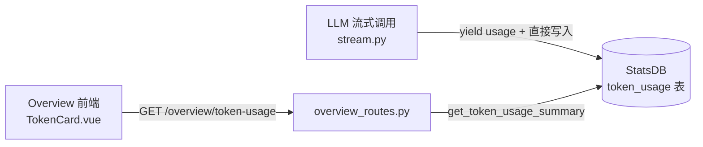

# Token 用量面板

## 一、项目目标

- **项目名称**：Token 用量面板
- **一句话描述**：在 Overview 页面新增一张 Token 用量卡片，展示最近 24 小时、7 日、30 日的 LLM Token 消耗统计
- **核心目标**：
  1. 持久化记录每次 LLM 调用的 Token 用量（prompt_tokens、completion_tokens、cache_hit_tokens、cache_miss_tokens）
  2. 在 Overview 页面以卡片形式展示三个时间维度的聚合数据
  3. 展示缓存命中信息，帮助评估 prompt caching 效果
- **不做的事**：
  - 不做费用换算（只显示 Token 数量）
  - 不按模型或用户细分

## 二、业务背景

- **问题现状**：目前 LLM 每次调用都会返回 Token 用量信息（DeepSeek 返回 prompt_tokens、completion_tokens、cache_hit_tokens、cache_miss_tokens），但这些数据仅用于日志记录，没有持久化存储和可视化展示。`chat_messages` 表虽预留了 `tokens_in`/`tokens_out` 字段，但实际未被使用。
- **目标用户**：AiBrain 系统使用者（开发者 / AI 研究者）
- **预期价值**：
  - 直观了解 Token 消耗情况，评估 API 调用成本
  - 通过缓存命中率判断 prompt caching 是否有效
  - 为后续的成本控制和模型选型提供数据支撑

## 三、功能需求

| 功能 | 用户故事 | 优先级 | 备注 |
|------|---------|--------|------|
| Token 用量持久化 | 作为系统，我希望每次 LLM 调用结束后自动记录 Token 用量，以便后续统计 | P0 | 覆盖交互式聊天和意识流 |
| 24 小时用量展示 | 作为用户，我希望在 Overview 看到最近 24 小时的 Token 消耗，包括输入/输出/缓存命中 | P0 | 显示消耗Token、输入、输出、缓存命中、缓存命中率 |
| 7 日用量展示 | 作为用户，我希望在 Overview 看到最近 7 日的累计 Token 消耗 | P1 | 同上五项指标 |
| 30 日用量展示 | 作为用户，我希望在 Overview 看到最近 30 日的累计 Token 消耗 | P1 | 同上五项指标 |
| 缓存命中率展示 | 作为用户，我希望看到缓存命中 Token 占比，评估 caching 效果 | P1 | cache_hit / (cache_hit + cache_miss) |

## 四、非功能需求

- **性能要求**：Token 写入同步不阻塞 LLM 流式响应；概览查询响应 <200ms
- **可维护性**：沿用现有的 StatsDB 单例模式，复用现有数据库文件
- **自动刷新**：TokenCard 每 30 秒轮询 /overview/token-usage，自动更新图表和统计数字

## 五、系统架构

### 架构图



### 视觉样式

采用与 MemoryCard 图表区域完全一致的样式：
- 深色背景（`background: #1a1d27`）+ 边框（`border: 1px solid #2d3149`）+ 圆角 12px
- 标题与时间范围 Tab 栏（`chart-tab` 按钮样式）
- 上方 ECharts 折线图（展示消耗 / 输入 / 输出 / 缓存命中四条曲线）
- 下方 `stat-box` 展示五项统计数字（`sb-value` + `sb-label`）

### UI 布局草图

```
┌──────────────────────────────────────────────────────────────┐
│ LLM Token 用量   [24h] [7d] [30d]  [📅 开始]~[📅 结束]  │
├──────────────────────────────────────────────────────────────┤
│                                                              │
│  ┌─ ECharts 折线图（消耗 / 输入 / 输出 / 缓存命中）───────┐  │
│  │  800 ┤                                              │  │
│  │  600 ┤        ╱╲     ── 消耗                         │  │
│  │  400 ┤  ╱╲  ╱  ╲  ╱╲  ── 输入                        │  │
│  │  200 ┤ ╱  ╲╱    ╲╱  ╲  ── 输出                       │  │
│  │    0 ┤╱              ── 缓存命中                      │  │
│  │      └──┬──┬──┬──┬──┬──┬──┬──┬──┬──┬──┬──┬──┬──    │  │
│  │        09  10  11  12  13  14  15  16  17  18  ...  │  │
│  └──────────────────────────────────────────────────────┘  │
│                                                              │
│  ┌──────────┐  ┌──────────┐  ┌──────────┐  ┌──────────┐   │
│  │  23,000  │  │  15,000  │  │  8,000   │  │  5,000   │   │
│  │  消耗     │  │  输入     │  │  输出     │  │  缓存命中  │   │
│  └──────────┘  └──────────┘  └──────────┘  └──────────┘   │
│                                                             │
│  缓存命中率  ████████████░░░░░░░░░░  33%                    │
│                                                             │
```

切换逻辑：默认选中 "24h"，点击预设 Tab（24h/7d/30d）或选择自定义日期范围时重新请求 API → 更新 ECharts 折线图 + 更新 4 个 stat-box + 进度条 的数字。

### 目录结构变化

```
backend/core/database.py          # + token_usage 表 + 记录/查询方法
backend/modules/LLM/stream.py     # + 提取 cache_hit/cache_miss + 直接写入 token_usage
backend/routes/overview_routes.py # + GET /overview/token-usage 端点

web/src/views/OverviewView/
  ├── TokenCard/
  │   ├── TokenCard.vue           # 新卡片模板
  │   └── TokenCard.ts            # 卡片逻辑类
  ├── CardRegistry.ts             # + import TokenCard
  └── OverviewView.vue            # + <TokenCard />
```

### 技术栈

| 层 | 技术 | 理由 |
|---|------|------|
| 数据库 | SQLite（现有 StatsDB） | 无需新依赖，与现有统计共存 |
| 后端 | Flask（现有） | 沿用现有路由注册模式 |
| 前端 | Vue 3 + 现有卡片模式 | 复用 BalanceCard 的模板 |

## 六、数据结构

### token_usage 表

| 字段 | 类型 | 说明 | 约束 |
|------|------|------|------|
| id | INTEGER | 主键 | PK, AUTOINCREMENT |
| prompt_tokens | INTEGER | 提示词 Token 数 | NOT NULL DEFAULT 0 |
| completion_tokens | INTEGER | 生成 Token 数 | NOT NULL DEFAULT 0 |
| cache_hit_tokens | INTEGER | 缓存命中 Token 数 | NOT NULL DEFAULT 0 |
| cache_miss_tokens | INTEGER | 缓存未命中 Token 数 | NOT NULL DEFAULT 0 |
| total_tokens | INTEGER | 总 Token 数 | NOT NULL DEFAULT 0 |
| model | TEXT | 使用的模型名称 | DEFAULT '' |
| source | TEXT | 来源（chat / idle_thought） | DEFAULT 'chat' |
| created_at | TEXT | 记录时间 | DEFAULT datetime('now','localtime') |

索引：`idx_token_usage_created`（`created_at DESC`）

### ER 关系

此表独立于现有表，无外键关联。

### 数据量预估

- 每次 LLM 调用产生 1 条记录
- 日均调用量：交互式聊天约 50 次 + 意识流约 500 次 → 约 550 条/日
- 保留 90 天 → 约 50,000 条，SQLite 轻松承载

## 七、流程设计

### 核心流程：Token 记录 → 展示

```
1. 任意 LLM 调用（聊天/意识流/Agent）→ stream.py
2. stream.py 解析流式 chunk
3. usage chunk 到达（含 prompt_tokens/completion_tokens/cache_hit/cache_miss）
4. stream.py 记录日志: logger.info(f"[llm:usage] model=... prompt=... completion=... cache_hit=...")
5. stream.py 调用 StatsDB.record_token_usage() 写入 token_usage 表
6. stream.py 继续 yield usage 事件给上层（不阻塞流）
7. 前端 TokenCard 轮询 GET /overview/token-usage
8. 后端查询最近 24h / 7d / 30d 的 SUM 聚合
9. 返回 JSON → 前端渲染图表 + stat-box + 进度条
```

### 异常流程

- **usage 事件缺失**：某些 provider 可能不返回 usage，直接跳过不记录
- **意识流没有 usage**：DeepSeek 的 idle thought 调用同样会返回 usage，正常记录；如无 usage，跳过记录
- **数据库写入失败**：catch 异常，打印警告日志，不影响主流程

## 八、API 设计

### GET /overview/token-usage
请求参数（可选）：
| 参数 | 类型 | 必填 | 说明 |
|------|------|------|------|
| start | string | 否 | 开始日期，格式 YYYY-MM-DD 或 YYYY-MM-DD HH:MM |
| end | string | 否 | 结束日期，格式同上，不传则默认为当前时间 |

不传参数时返回预设的 24h / 7d / 30d 三个时间维度的数据。
传入 start/end 时返回自定义范围内的时序数据 + 聚合摘要。


响应结构（JSON）：

```json
{
  "ok": true,
  "periods": {
    "24h": {
      "summary": {
        "prompt_tokens": 15000,
        "completion_tokens": 8000,
        "cache_hit_tokens": 5000,
        "cache_miss_tokens": 10000,
        "total_tokens": 23000,
        "cache_hit_rate": 0.33
      },
      "data": [
        {"date": "09:00", "prompt_tokens": 100, "completion_tokens": 50, "cache_hit_tokens": 30, "total_tokens": 150},
        {"date": "10:00", "prompt_tokens": 200, "completion_tokens": 80, "cache_hit_tokens": 60, "total_tokens": 280},
        ...
      ]
    },
    "7d": {
      "summary": { ... },
      "data": [
        {"date": "06-03", "prompt_tokens": 18000, "completion_tokens": 9000, ...},
        ...
      ]
    },
    "30d": {
      "summary": { ... },
      "data": [
        {"date": "05-10", "prompt_tokens": 15000, ...},
        ...
      ]
    }
  }
}
```

错误响应：

```json
{"ok": false, "error": "错误描述"}
```

## 九、验收标准

### 功能验收

1. **Token 记录**：发送一条聊天消息，检查 token_usage 表新增一条记录，字段值正确
2. **意识流记录**：意识流空闲思绪生成后，检查 token_usage 表有 source='idle_thought' 的记录
3. **卡片展示**：Overview 页面显示 LLM Token 用量卡片，包含时间范围 Tab（24h / 7d / 30d）
4. **折线图**：每个 Tab 下显示对应时间周期的消耗/输入/输出/缓存命中四条曲线的折线图
5. **五项指标**：图表下方显示 4 个 stat-box + 进度条：消耗、输入、输出、缓存命中、命中率
6. **Tab 切换**：点击 7d / 30d Tab 时，4 个 stat-box + 进度条 数字更新为对应时间周期的聚合数据
6. **数据正确**：各时间维度的数字与 token_usage 表的 SUM 聚合一致
7. **缓存命中率**：命中率显示为百分比格式（如 "33%"），当无缓存数据时显示 "--"
8. **数字格式化**：大数字用千分位逗号显示（如 "23,000"）
9. **无数据状态**：首次部署无数据时，全部显示 0 而不是报错
10. **页面刷新**：刷新页面后数据仍然正确展示

### 性能验收

- 概览页面加载响应 < 200ms
- 数据库文件增长 < 10MB（90 天数据）

## 十、开发任务拆分

| ID | 任务名称 | 依赖 | 复杂度 | 模块 | 对应需求 |
|----|---------|------|--------|------|---------|
| T001 | token_usage 表创建 + 数据库方法 | — | S | 后端/database | Token 用量持久化 |
| T002 | stream.py 统一记录 token 用量（提取 cache_hit/cache_miss + 写入 DB） | T001 | S | 后端/LLM | Token 用量持久化 |
| T004 | GET /overview/token-usage 路由（含时序数据和聚合摘要） | T001 | S | 后端/routes | 图表 + 统计展示 |
| T005 | TokenCard.ts ViewModel（轮询 API + Tab 切换 + ECharts 渲染） | T004 | M | 前端/Overview | 图表 + 统计展示 |
| T006 | TokenCard.vue 模板（chart-section + ECharts 容器 + stat-box） | T005 | S | 前端/Overview | 图表 + 统计展示 |
| T007 | CardRegistry 注册 + OverviewView 布局 | T006 | S | 前端/Overview | 集成展示 |
