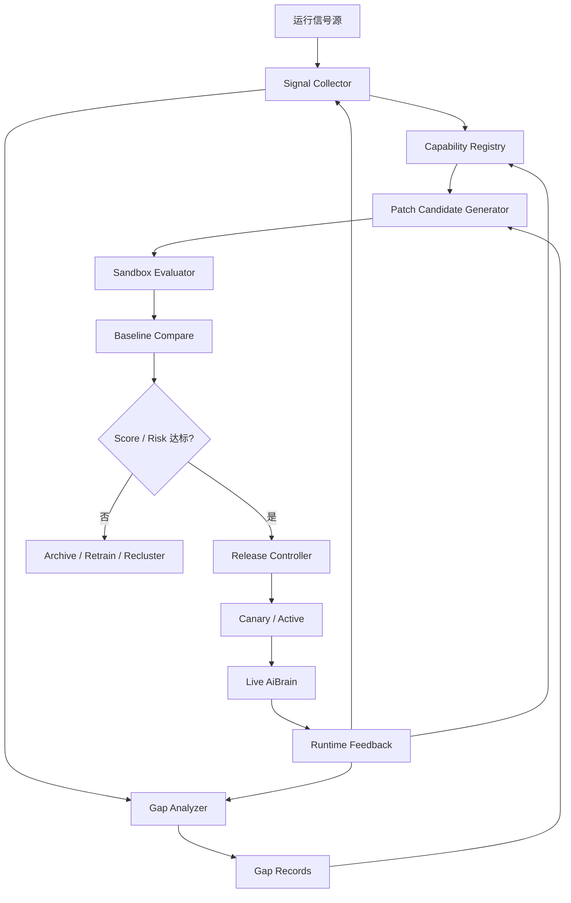
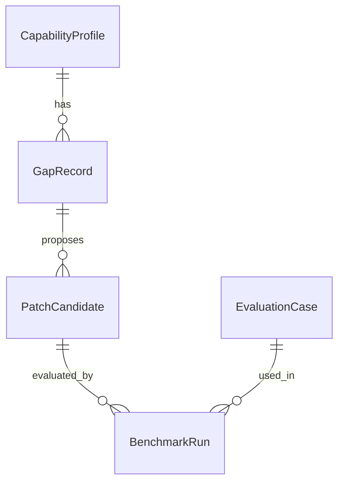
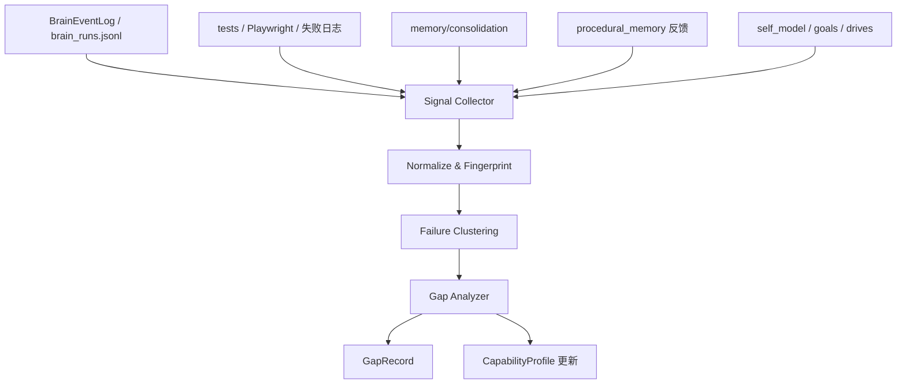
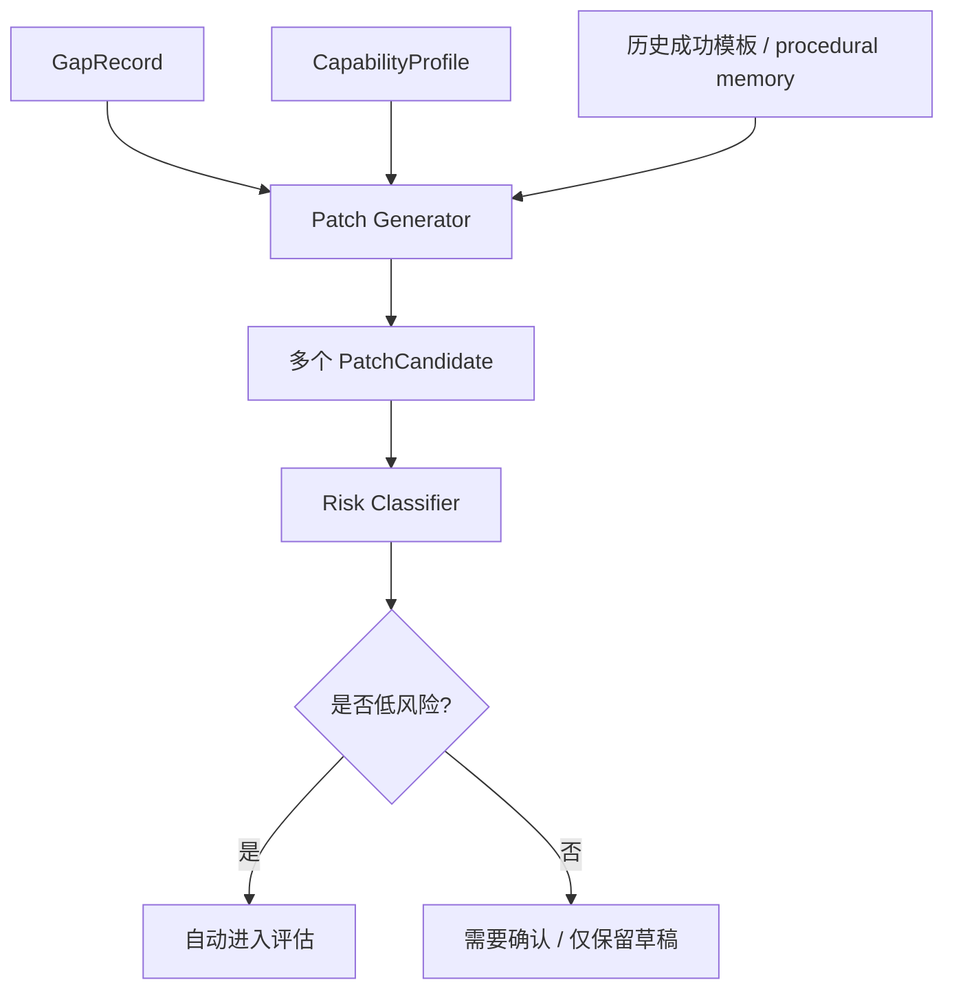
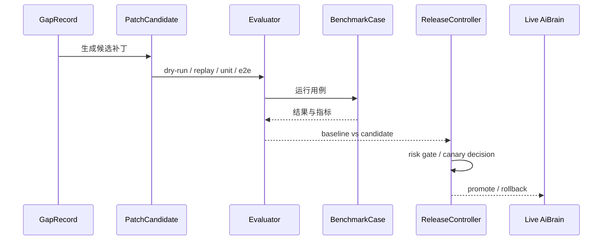

# 一、项目目标

项目名称：AiBrain 自进化与能力补齐系统

一句话描述：把 AiBrain 的运行轨迹、测试结果、日志异常、用户纠正和记忆沉淀统一成一个闭环，让系统能够自动发现能力缺口、生成补齐方案、在沙箱里评估、通过后再灰度上线，并把有效改进写回自身能力画像。

核心目标：

1. 把整个 AiBrain 的行为信号统一纳入一套可追踪、可回放、可评分的进化闭环，而不是只看聊天或只看记忆。
2. 系统能够自动发现重复失败、低效路径、缺失能力和不稳定策略，并把它们归因成明确的 `gap`。
3. 系统能够针对不同风险级别的缺口，自动生成补丁候选，包括 prompt、policy、memory、procedural memory、test、UI 和少量安全 code patch。
4. 每个补丁必须经过离线评估、回放评估和 canary 评估，只有通过阈值的改进才允许进入 active 状态。
5. 进化结果要回写到 `self_model`、`goals`、`drives`、`procedural_memory` 和相关测试资产里，让系统不仅“记住”，还会“变强”。
6. 进化流程不能阻塞现有聊天、记忆、wiki、日志和前端页面，主业务始终优先稳定可用。

不做的事：

1. 不在第一版直接做大模型权重在线训练，先做系统层、自我策略层和记忆层的进化。
2. 不允许高风险补丁自动修改危险代码路径、破坏性文件操作或未授权外部动作。
3. 不把能力画像和事实记忆混成一个存储层，二者保持分离。
4. 不让进化任务同步阻塞用户请求，评估与补齐都默认异步后台执行。
5. 不把“自进化”理解成无限自修改，所有写回都必须有评估和回滚条件。

# 二、业务背景

当前 AiBrain 已经有不少“会记、会想、会循环”的底座，但还没有一套完整的“发现自己缺什么，然后把缺口补上”的机制。

现有底座包括：

1. `BrainEventLog` 已经能记录 run 和事件链，具备回放基础。
2. `BrainJudge`、`BrainCycleRunner`、`ActivitySelector` 已经把决策、动作和循环拆开，具备可插拔的行动链路。
3. `procedural_memory` 已经具备样本采集、模板提炼、匹配、反馈和退役能力。
4. `memory/consolidation` 已经可以把部分运行结果沉淀成长期记忆。
5. `state/self_model`、`state/goals`、`state/drives` 已经有“自我、目标、驱动力”的雏形。
6. `tests/` 和 `backend/main_brain/testing/` 已经有单元测试、集成测试和部分回放测试。
7. `web/` 是 Vue 3 + Vite 架构，已经适合做运行状态、能力图谱和回放看板。

但现在还缺一条非常关键的闭环：

1. 系统知道“发生了什么”，但还没有统一的“我缺什么”的能力画像。
2. 系统知道“某次失败了”，但还没有自动把失败归纳成可操作的能力缺口。
3. 系统知道“某个流程有经验模板”，但还没有把模板、测试、补丁和发布串成演化链路。
4. 系统知道“可以做回放测试”，但还没有把测试结果反过来驱动自身补齐。
5. 系统知道“可以更新 memory”，但还没有把 memory、procedural memory、prompt、policy、UI 和少量安全 code patch 统一进同一条进化回路。

这会带来几个明显问题：

1. 系统可能重复遇到同类失败，但只是在日志里留下痕迹，没有形成能力增长。
2. 不同子系统各自优化，整体却没有“我现在缺什么”的全局视角。
3. 开发者需要手动找 bug、手动补 prompt、手动写测试，系统自身没有学习到“怎么修自己”。
4. 如果未来要逼近 AGI 风格的持续成长，就必须先让它具备“自诊断 + 自补齐 + 自评估”的工程闭环。

预期价值：

1. 降低重复修 bug、重复调 prompt、重复调阈值的人工成本。
2. 让系统从“会积累经验”升级到“会修正自己”。
3. 让长期失败点可以自动暴露为能力缺口，并被优先补齐。
4. 让每次改进都能被评估、对比、回滚，避免“看起来更聪明，实际更脆弱”。
5. 为后续更强的自适应规划、自我反思和 AGI 风格行为打基础。

# 三、功能需求

| 编号 | 功能名称 | 用户故事 | 优先级 | 备注 |
|---|---|---|---|---|
| FR-001 | 全量信号采集 | 作为系统，我希望把 `BrainEventLog`、run 轨迹、测试结果、Playwright 结果、日志异常和用户纠正统一采集到进化层 | P0 | 覆盖 chat / tick / memory / wiki / UI / scripts / tests |
| FR-002 | 能力画像注册 | 作为系统，我希望为每个子能力建立 `CapabilityProfile`，知道它属于什么模块、当前是否健康、历史表现如何 | P0 | 能力维度包括 memory / planning / tool / safety / UI / infra / test |
| FR-003 | 缺口聚类与归因 | 作为系统，我希望把重复失败、低分策略、回归测试失败和长时间未覆盖的能力自动归类成 `GapRecord` | P0 | 需要能输出 root cause 猜测和证据链 |
| FR-004 | 评估用例自动生成 | 作为系统，我希望从 gap 和失败轨迹自动生成 benchmark cases，方便后续回放和回归测试 | P0 | 支持从 run、trace、test、UI 事件生成 |
| FR-005 | 补丁候选生成 | 作为系统，我希望针对每个 gap 生成多个补齐方案，包括 prompt patch、policy patch、memory patch、test patch、UI patch 和安全 code patch | P0 | v1 优先覆盖安全低风险目标 |
| FR-006 | 风险分级与门控 | 作为系统，我希望根据补丁风险自动决定是直接合并、先 canary、还是必须人工确认 | P0 | 高风险补丁默认不自动上线 |
| FR-007 | 沙箱评估与回放 | 作为系统，我希望在不影响线上服务的前提下，对候选补丁进行 dry-run、replay、单元测试和 E2E 测试 | P0 | Playwright 走现有 `web` 测试体系 |
| FR-008 | 基线对比与回归判定 | 作为系统，我希望能把候选补丁和 baseline 版本做客观对比，自动判定是否回归 | P0 | 需要保存 baseline_metrics 和 candidate_metrics |
| FR-009 | Canary 发布与回滚 | 作为系统，我希望低风险补丁可以灰度上线，并在回归时自动回滚 | P0 | 需要支持 `canary_ratio` 和 `rollback` |
| FR-010 | 能力回写 | 作为系统，我希望把验证通过的改进写回 `self_model`、`goals`、`drives`、`procedural_memory` 和 `memory/consolidation` | P0 | 形成“改进后系统更会做事”的闭环 |
| FR-011 | 可解释输出 | 作为开发者，我希望看到每次 gap 为什么被发现、每个补丁为什么被选中、为什么被拒绝 | P0 | 输出 trace、score、threshold、证据引用 |
| FR-012 | 进化看板 | 作为开发者，我希望在前端看到能力图谱、gap backlog、补丁队列、评估结果和回滚历史 | P1 | Vue 页面 + ECharts + G6/force-graph |
| FR-013 | 异步调度 | 作为系统，我希望进化任务在后台低频运行，不阻塞聊天和 tick 主流程 | P0 | 需要 job queue / scheduler |
| FR-014 | 兼容现有链路 | 作为用户，我希望进化系统接入后，现有聊天、记忆、wiki 和日志功能不退化 | P0 | 任何失败都必须可降级 |
| FR-015 | 导出草稿 | 作为开发者，我希望高置信稳定改进可以导出为 skill 草稿或 procedural template 草稿 | P1 | 不自动发布，只输出草稿 |

第一版优先覆盖的缺口类型：

1. 记忆检索不准、模板匹配不稳。
2. 工具调用链路不完整或回灌不充分。
3. prompt / policy 需要调整的低风险行为偏差。
4. 测试覆盖缺失、回归用例缺失。
5. UI 与 API 的状态展示不一致。
6. 自我模型、目标、驱动力的更新不及时。

第一版不优先覆盖的缺口类型：

1. 大模型权重在线训练。
2. 需要高权限危险命令的自动执行补丁。
3. 不可稳定回放的外部依赖场景。
4. 无法自动评估的复杂长期研究问题。

# 四、非功能需求

性能要求：

1. 用户请求主链路的额外进化采集开销尽量控制在 50ms 以内，不得明显拖慢聊天或后台 tick。
2. 后台扫描和评估默认异步执行，在线路径只做轻量打点和队列投递。
3. 单次离线扫描在 1 万条事件级别内应能在本机可接受时间内完成，目标不超过 30 秒到 1 分钟量级。
4. 评估队列的处理不应阻塞 `/chat/send`、`run_tick`、`memory` 检索和前端页面加载。

安全要求：

1. 任何补丁候选都必须经过风险分级，才能决定是否自动合并、灰度发布或人工确认。
2. 不允许把 API Key、密钥、隐私内容或隐藏推理链直接写进 patch summary、benchmark case 或日志正文。
3. 只允许在白名单模块上做自动写回，破坏性操作、删除操作和高风险 tool action 必须被拦截。
4. 进化系统必须具备回滚能力，任何失败都不能把核心服务锁死。

稳定性要求：

1. 所有 job 都必须是幂等的，重跑不能重复污染 registry 或 benchmark 历史。
2. 任一补丁评估失败都要区分“补丁失败”和“环境失败”，避免误判。
3. 任何回写都要保留 baseline 与 candidate 的版本号，便于回退。
4. 进化系统本身失败时，现有聊天、记忆、wiki 和前端页面必须继续可用。

可维护性要求：

1. 采集、归因、生成、评估、发布、回滚必须分层实现，禁止单文件堆叠。
2. 进化模块必须和事实记忆、程序记忆、叙事层保持松耦合。
3. 评估报告必须可回放，便于调阈值和修规则。
4. 目录、状态和 API 必须和现有 `main_brain` 风格兼容。

可观测性要求：

1. 每次 gap 扫描要记录窗口大小、信号来源、发现的 gap 数、处理耗时。
2. 每次补丁生成要记录 patch 类型、目标模块、预期收益和风险等级。
3. 每次评估要记录 baseline 分数、candidate 分数、回归情况和失败原因。
4. 每次回滚要记录触发条件、回滚前后版本和恢复耗时。

兼容性要求：

1. 进化系统不能改变现有聊天协议、SSE 输出和前端基础路由。
2. 现有 `BrainEventLog`、`procedural_memory`、`memory/consolidation`、`state` 和 `tests` 都应被复用，而不是被替代重写。
3. 前端看板可以新增，但不能破坏现有 `Overview / Brain / Memory / Logs / Wiki / Settings` 页面。

# 五、系统架构



技术栈选型：

| 模块 | 方案 | 理由 |
|---|---|---|
| 信号采集 | `BrainEventLog` + `brain_runs.jsonl` + `tests/` + Playwright + 日志 | 项目已有运行轨迹和测试入口，能直接复用 |
| 进化核心 | `backend/main_brain/evolution/` | 和现有 `main_brain` 风格一致，便于接入 `BrainJudge`、`StateAdapter` 和 `LearningAdapter` |
| 存储 | JSON / JSONL 为主，SQLite 作为聚合指标补充 | 贴合现有项目风格，便于回放和迁移 |
| 评估 | 现有 `backend/main_brain/testing/` + `tests/` + Playwright | 可覆盖单测、集成测试和前端 E2E |
| 前端 | Vue 3 + Vite + Pinia + ECharts + G6 / force-graph | 现有前端技术栈已具备图谱和趋势展示能力 |
| 发布控制 | 风险分级 + canary + rollback | 避免自进化失控 |
| 补丁生成 | 规则优先，LLM 辅助 | 先可解释、先可控，再逐步增强 |

建议目录结构：

```text
backend/main_brain/
  evolution/
    __init__.py
    contracts.py
    collector.py
    registry.py
    gap_analyzer.py
    benchmark.py
    patch_generator.py
    evaluator.py
    release.py
    scheduler.py
    trace.py
    policy.py
    exporter.py
  testing/
    evolution/
      harness.py
      fixtures.py
      replay.py
      assertions.py
backend/main_brain/data/
  evolution/
    capabilities.json
    gaps.jsonl
    patch_candidates.jsonl
    benchmark_cases.json
    benchmark_runs.jsonl
    state.json
backend/routes/
  evolution_routes.py
web/src/views/
  EvolutionView/
    EvolutionView.vue
    EvolutionViewModel.ts
    components/
```

关键设计决策：

1. 进化层先覆盖“系统层可控改进”，优先级顺序是 `data / memory / prompt / policy / test / ui / tool / code`，越靠前越容易自动化。
2. 低风险补丁可以自动进入 canary，高风险补丁必须人工确认或额外阈值批准。
3. 每一个补丁候选都必须有 baseline、评估集和回放记录，不能只看主观感觉。
4. 能力画像和事实记忆必须分开存储，避免把“会什么”与“知道什么”混在一起。
5. 进化系统本身也是被监控对象，任何异常都要可回退、可冻结、可追踪。

# 六、数据结构

## 核心实体

### CapabilityProfile

| 字段 | 类型 | 说明 | 约束 |
|---|---|---|---|
| capability_id | str | 能力唯一 ID | 必填，唯一 |
| name | str | 能力名称 | 必填 |
| scope | str | 所属范围，如 `main_brain / memory / wiki / web / tests` | 必填 |
| category | str | 分类，如 `memory / planning / tool / safety / ui / infra / test` | 必填 |
| status | str | `healthy / degraded / missing / proposed / deprecated` | 必填 |
| score | float | 综合健康度 | 0~1 |
| success_count | int | 成功次数 | 非负 |
| failure_count | int | 失败次数 | 非负 |
| evidence_count | int | 证据数 | 非负 |
| dependencies | list[str] | 依赖能力 ID 列表 | 可空 |
| owner_module | str | 主要负责模块 | 可空 |
| last_good_version | str | 最近一次通过版本 | 可空 |
| last_bad_version | str | 最近一次回归版本 | 可空 |
| tags | list[str] | 标签 | 可空 |
| notes | str | 备注 | 可空 |

### GapRecord

| 字段 | 类型 | 说明 | 约束 |
|---|---|---|---|
| gap_id | str | 缺口唯一 ID | 必填，唯一 |
| capability_id | str | 关联能力 | 必填 |
| gap_type | str | `missing / unstable / slow / incomplete / regression / unsafe` | 必填 |
| severity | float | 缺口严重度 | 0~1 |
| confidence | float | 归因置信度 | 0~1 |
| failure_signature | str | 失败签名 | 必填 |
| evidence_refs | list[str] | 证据引用，如 run_id / test_id / log_id | 必填 |
| root_cause_guess | str | 根因猜测 | 可空 |
| suggested_patch_types | list[str] | 建议补丁类型 | 可空 |
| status | str | `open / triaged / generating / fixed / deferred / resolved / archived` | 必填 |
| priority | int | 优先级 | 1~5 |
| created_at | str | 创建时间 | 必填 |
| updated_at | str | 更新时间 | 必填 |

### PatchCandidate

| 字段 | 类型 | 说明 | 约束 |
|---|---|---|---|
| patch_id | str | 补丁唯一 ID | 必填，唯一 |
| gap_id | str | 来源缺口 | 必填 |
| patch_type | str | `prompt / policy / memory / procedural / tool / ui / test / skill / code` | 必填 |
| target_paths | list[str] | 目标文件或模块路径 | 必填 |
| patch_summary | str | 补丁摘要 | 必填 |
| diff_text | str | 补丁 diff 或结构化变更描述 | 可空 |
| safety_level | str | `low / medium / high` | 必填 |
| requires_confirmation | bool | 是否需要人工确认 | 必填 |
| baseline_version | str | 对比基线版本 | 必填 |
| candidate_version | str | 候选版本 | 可空 |
| expected_gain | float | 预期收益 | 0~1 |
| eval_status | str | `pending / running / passed / failed / reverted / archived` | 必填 |
| canary_ratio | float | 灰度比例 | 0~1 |
| created_at | str | 创建时间 | 必填 |
| applied_at | str | 应用时间 | 可空 |
| reverted_at | str | 回滚时间 | 可空 |
| author | str | 生成来源，如 `system / human / llm` | 必填 |

### EvaluationCase

| 字段 | 类型 | 说明 | 约束 |
|---|---|---|---|
| case_id | str | 用例 ID | 必填，唯一 |
| source_type | str | `run / test / e2e / log / manual` | 必填 |
| scenario | str | 场景描述 | 必填 |
| input_snapshot | dict | 输入快照 | 必填 |
| expected_behavior | dict | 期望行为 | 必填 |
| metric_targets | dict | 指标目标 | 可空 |
| tags | list[str] | 标签 | 可空 |
| is_regression_case | bool | 是否回归用例 | 必填 |
| created_from_gap_id | str | 来源缺口 ID | 可空 |

### BenchmarkRun

| 字段 | 类型 | 说明 | 约束 |
|---|---|---|---|
| run_id | str | 评估运行 ID | 必填，唯一 |
| patch_id | str | 补丁 ID | 必填 |
| case_id | str | 用例 ID | 必填 |
| baseline_score | float | 基线分数 | 0~1 |
| candidate_score | float | 候选分数 | 0~1 |
| delta | float | 分差 | 可正可负 |
| latency_ms | float | 评估耗时 | 非负 |
| memory_delta_mb | float | 内存变化 | 可空 |
| passed | bool | 是否通过 | 必填 |
| regression | bool | 是否回归 | 必填 |
| error | str | 失败原因 | 可空 |
| log_refs | list[str] | 相关日志引用 | 可空 |

### EvolutionState

| 字段 | 类型 | 说明 | 约束 |
|---|---|---|---|
| last_scan_at | str | 最近扫描时间 | 可空 |
| last_gap_cursor | str | 最近扫描游标 | 可空 |
| last_evaluation_at | str | 最近评估时间 | 可空 |
| active_patch_id | str | 当前活跃补丁 | 可空 |
| freeze_until | str | 冻结到什么时间 | 可空 |
| auto_merge_enabled | bool | 是否允许低风险自动合并 | 必填 |
| canary_ratio | float | 默认灰度比例 | 0~1 |
| policy_version | str | 进化策略版本 | 必填 |
| rollback_count | int | 回滚次数 | 非负 |
| risk_budget | float | 风险预算 | 0~1 |

## 关系图



## 索引策略

1. `capability_id`、`gap_id`、`patch_id`、`case_id`、`run_id` 需要唯一索引。
2. `status`、`gap_type`、`patch_type`、`eval_status`、`safety_level` 需要普通索引，方便快速过滤。
3. `severity`、`score`、`expected_gain`、`delta` 需要可排序索引，方便挑选优先级。
4. `scope`、`owner_module`、`tags` 需要检索索引，方便按子系统查找。
5. `created_at`、`updated_at`、`last_good_version`、`last_bad_version` 需要时间序列查询支持。

## 数据量预估

1. `CapabilityProfile` 第一版预计 100 到 500 条，足够覆盖整个 AiBrain 的子能力。
2. `GapRecord` 可能在长期运行后增长到 1k 到 10k 条，需要支持归档。
3. `PatchCandidate` 第一版预计 200 到 2000 条，主要保留有价值的候选和成功案例。
4. `EvaluationCase` 第一版预计 200 到 2000 条，包含回放样本、回归样本和手工样本。
5. `BenchmarkRun` 可能快速增长到 1 万到 10 万条，建议按时间分区或周期归档。

# 七、流程设计

## 流程 1：信号采集与缺口发现



步骤：

1. 收集运行轨迹、测试失败、前端 E2E 失败、日志异常、用户纠正和程序记忆反馈。
2. 对各类信号做归一化，统一成可比较的 fingerprint。
3. 将重复失败、低置信 fallback、回归测试失败和长时间未覆盖能力聚成 failure cluster。
4. 对每个 cluster 生成 `GapRecord`，并更新对应 `CapabilityProfile` 的健康度。
5. 如果同一缺口持续复现，就提升 severity 和 priority。

## 流程 2：补丁生成与筛选



步骤：

1. 从 gap 的根因猜测和历史成功模板里生成多个候选修补方案。
2. 优先生成低风险补丁，如 prompt 调整、policy 调整、记忆模板、测试补丁和 UI 补丁。
3. 对每个候选进行风险分类，并标记是否需要人工确认。
4. 为每个候选生成 patch summary、target_paths、expected_gain 和 baseline_version。
5. 只把符合门槛的候选送去沙箱评估。

## 流程 3：自动评估与灰度发布



步骤：

1. 评估器先运行 dry-run，确认补丁不破坏基础流程。
2. 再运行 replay、单元测试和 E2E，记录 baseline 与 candidate 的差异。
3. 按指标计算 `patch_score`，综合考虑收益、回归风险、耗时和覆盖率。
4. 通过阈值的低风险补丁进入 canary，灰度观察一段时间。
5. 如果 canary 阶段出现回归，自动 rollback 并重新打开 gap。

## 流程 4：能力回写与再学习

1. 成功补丁会写回 `CapabilityProfile`，提高对应能力得分。
2. 稳定通过的补丁会更新 `procedural_memory`，形成可复用模板。
3. 与自我认知相关的改进会回写 `self_model`、`goals`、`drives`。
4. 若补丁解决的是记忆质量问题，会同步触发 `memory/consolidation` 规则更新。
5. 若补丁长期稳定，可以导出为 skill 草稿或 procedural template 草稿。

## 状态流转

```text
missing -> observed -> triaged -> generating -> sandboxed -> canary -> active
active -> monitored -> degraded -> rollback -> triaged
triaged -> deferred -> archived
sandboxed -> blocked -> triaged
```

说明：

1. `missing`：当前已知缺失的能力。
2. `observed`：已采集到证据，但还未归因。
3. `triaged`：已完成归因并确定优先级。
4. `generating`：正在生成补丁候选。
5. `sandboxed`：正在做离线评估。
6. `canary`：正在灰度运行。
7. `active`：已验证并进入主线。
8. `monitored`：上线后持续观察。
9. `degraded`：发现退化，等待回滚或再修复。
10. `rollback`：已回滚并回到 triaged。
11. `blocked`：补丁因风险或环境问题被阻塞。
12. `archived`：长期不再处理。

## 异常流程

1. 如果评估环境失败，要标记为 `env_failed`，不能误判成补丁失败。
2. 如果补丁触碰黑名单模块，直接进入 `blocked`，不允许自动评估。
3. 如果同一 gap 在三次补齐后仍反复出现，要自动提升 priority 并扩大证据窗口。
4. 如果 canary 期间出现性能回退或行为偏差，要立即 rollback 并写回 gap。
5. 如果没有足够证据，不生成“看起来聪明但不可验证”的补丁候选。

# 八、API设计

## 1. `GET /brain/evolution/state`

作用：获取当前进化系统状态、冻结信息、待评估队列和统计摘要。

请求参数：无。

响应示例：

```json
{
  "ok": true,
  "state": {
    "last_scan_at": "2026-06-26T10:00:00Z",
    "last_gap_cursor": "run_12345",
    "last_evaluation_at": "2026-06-26T10:10:00Z",
    "active_patch_id": "patch_001",
    "freeze_until": "",
    "auto_merge_enabled": true,
    "canary_ratio": 0.1,
    "policy_version": "1.0",
    "rollback_count": 2,
    "risk_budget": 0.35
  },
  "counts": {
    "capabilities": 183,
    "open_gaps": 17,
    "patch_candidates": 9,
    "benchmark_cases": 312,
    "pending_runs": 4
  }
}
```

错误码：

| 错误码 | 含义 |
|---|---|
| 503 | 存储不可用 |
| 500 | 未预期错误 |

## 2. `POST /brain/evolution/scan`

作用：从运行信号、测试结果和日志中扫描能力缺口。

请求参数：

| 字段 | 类型 | 必填 | 说明 |
|---|---|---|---|
| sources | list[str] | 否 | 采集源，如 `brain_runs / tests / playwright / logs / memory / procedural` |
| window | int | 否 | 采样窗口大小 |
| dry_run | bool | 否 | 是否只预览不落库 |
| min_recurrence | int | 否 | 触发 gap 的最少重复次数 |
| max_gaps | int | 否 | 本次最多生成多少 gap |

响应示例：

```json
{
  "ok": true,
  "job_id": "evo_scan_20260626_001",
  "capabilities_updated": 14,
  "gaps_created": 3,
  "candidates_created": 2,
  "duration_ms": 1840,
  "dry_run": false
}
```

错误码：

| 错误码 | 含义 |
|---|---|
| 400 | 参数不合法 |
| 409 | 当前处于 freeze 状态 |
| 503 | 采集源不可用 |
| 500 | 未预期错误 |

## 3. `GET /brain/evolution/capabilities`

作用：查询能力画像列表，可按状态、类别、模块、分数过滤。

请求参数：

| 字段 | 类型 | 必填 | 说明 |
|---|---|---|---|
| status | str | 否 | 过滤 `healthy / degraded / missing / proposed / deprecated` |
| category | str | 否 | 过滤能力分类 |
| scope | str | 否 | 过滤模块范围 |
| min_score | float | 否 | 最低分数 |
| limit | int | 否 | 返回条数 |

响应结构：返回 `CapabilityProfile` 列表和统计摘要。

错误码：

| 错误码 | 含义 |
|---|---|
| 500 | 未预期错误 |

## 4. `GET /brain/evolution/gaps`

作用：查询 gap backlog，支持按严重度和状态排序。

请求参数：

| 字段 | 类型 | 必填 | 说明 |
|---|---|---|---|
| status | str | 否 | 过滤状态 |
| gap_type | str | 否 | 过滤缺口类型 |
| min_severity | float | 否 | 最低严重度 |
| limit | int | 否 | 返回条数 |

响应结构：返回 `GapRecord` 列表、top root cause 猜测和证据引用。

错误码：

| 错误码 | 含义 |
|---|---|
| 500 | 未预期错误 |

## 5. `POST /brain/evolution/patches/generate`

作用：基于 gap 生成补丁候选。

请求参数：

| 字段 | 类型 | 必填 | 说明 |
|---|---|---|---|
| gap_id | str | 是 | 目标缺口 |
| patch_types | list[str] | 否 | 指定补丁类型集合 |
| allow_modules | list[str] | 否 | 允许修改的模块白名单 |
| dry_run | bool | 否 | 只生成草稿，不写库 |
| max_candidates | int | 否 | 最多生成几个候选 |

响应示例：

```json
{
  "ok": true,
  "patch_candidates": [
    {
      "patch_id": "patch_001",
      "patch_type": "policy",
      "safety_level": "low",
      "requires_confirmation": false,
      "expected_gain": 0.72
    }
  ]
}
```

错误码：

| 错误码 | 含义 |
|---|---|
| 400 | 参数不合法 |
| 422 | 证据不足，无法生成候选 |
| 423 | 目标缺口已冻结 |
| 500 | 未预期错误 |

## 6. `POST /brain/evolution/patches/evaluate`

作用：对候选补丁执行 dry-run、replay、unit 和 E2E 评估。

请求参数：

| 字段 | 类型 | 必填 | 说明 |
|---|---|---|---|
| patch_id | str | 是 | 候选补丁 |
| case_ids | list[str] | 否 | 指定评估用例 |
| modes | list[str] | 否 | `dry_run / replay / unit / e2e` |
| compare_to | str | 否 | 基线版本 |
| dry_run | bool | 否 | 只预览不执行 |

响应结构：返回每个用例的分数、是否回归、整体结论和建议动作。

错误码：

| 错误码 | 含义 |
|---|---|
| 400 | 参数不合法 |
| 422 | 没有可用评估用例 |
| 500 | 评估执行失败 |

## 7. `POST /brain/evolution/patches/apply`

作用：将通过评估的补丁合并到运行系统，支持 canary。

请求参数：

| 字段 | 类型 | 必填 | 说明 |
|---|---|---|---|
| patch_id | str | 是 | 候选补丁 |
| canary_ratio | float | 否 | 灰度比例 |
| auto_promote | bool | 否 | 评估通过后是否自动进入 active |
| confirm | bool | 否 | 高风险补丁人工确认 |

响应示例：

```json
{
  "ok": true,
  "patch_id": "patch_001",
  "status": "canary",
  "canary_ratio": 0.1
}
```

错误码：

| 错误码 | 含义 |
|---|---|
| 409 | 风险门禁未通过 |
| 422 | 评估未通过 |
| 423 | 系统冻结中 |
| 500 | 合并失败 |

## 8. `POST /brain/evolution/patches/rollback`

作用：回滚当前补丁并恢复到基线版本。

请求参数：

| 字段 | 类型 | 必填 | 说明 |
|---|---|---|---|
| patch_id | str | 是 | 补丁 ID |
| reason | str | 否 | 回滚原因 |
| force | bool | 否 | 是否强制回滚 |

响应结构：返回回滚前后版本、恢复耗时和重新打开的 gap。

错误码：

| 错误码 | 含义 |
|---|---|
| 404 | 找不到补丁 |
| 500 | 回滚失败 |

## 9. `POST /brain/evolution/replay`

作用：按历史运行、测试或 gap 对候选补丁做回放。

请求参数：

| 字段 | 类型 | 必填 | 说明 |
|---|---|---|---|
| patch_id | str | 是 | 候选补丁 |
| run_ids | list[str] | 否 | 指定历史 run |
| case_ids | list[str] | 否 | 指定历史 case |
| dry_run | bool | 否 | 只预览 |

错误码：

| 错误码 | 含义 |
|---|---|
| 400 | 参数不合法 |
| 422 | 没有可回放样本 |
| 500 | 回放失败 |

## 10. `GET /brain/evolution/runs/<run_id>`

作用：查看某次进化评估或回放的完整运行轨迹。

响应结构：返回 `BenchmarkRun` 列表、baseline/candidate 对比、日志引用和结论。

错误码：

| 错误码 | 含义 |
|---|---|
| 404 | run 不存在 |
| 500 | 读取失败 |

# 九、验收标准

功能验收：

1. 系统能够从真实运行信号中自动发现至少一种可重复的能力缺口，并写入 `GapRecord`。
2. 系统能够围绕同一个 gap 生成至少 1 个补丁候选，并输出风险等级、目标模块和预期收益。
3. 系统能够对候选补丁执行 dry-run、回放和测试评估，并产出明确的 baseline vs candidate 对比结果。
4. 低风险补丁能够从 `draft -> sandboxed -> canary -> active` 完整走通。
5. 当 canary 出现回归时，系统能够自动回滚，并把 gap 重新打开。
6. 通过验证的改进能够写回 `CapabilityProfile`、`self_model`、`goals`、`drives` 或 `procedural_memory`。
7. 前端能够查看能力图谱、gap backlog、补丁队列、评估结果和回滚历史。
8. 现有聊天、记忆、wiki、日志和前端主页面在接入后仍能正常工作。

性能验收：

1. 在线信号采集不会明显拖慢 `/chat/send`、`run_tick` 或主要页面打开。
2. 后台扫描与评估不阻塞用户请求，队列堆积时系统仍能继续正常对话。
3. 1k 级能力画像和 1k 级 gap 列表查询应保持可交互速度。
4. benchmark 和 replay 可在本机稳定复现，不依赖不稳定外部网络。

安全验收：

1. 高风险补丁不会被自动合并或自动上线。
2. 任何涉及删除、清理、危险命令或外部网络动作的补丁，都必须经过更高门槛确认。
3. 日志、评估结果和补丁描述中不允许泄露敏感信息。
4. 任何异常都可以回滚，不会把系统锁死在不可恢复状态。

测试验收：

1. 至少有一组回放测试覆盖“发现 gap -> 生成补丁 -> 评估 -> 发布 -> 回滚”的全链路。
2. 至少有一组前端 E2E 测试验证 EvolutionView 能正常展示状态、图谱和结果。
3. 至少有一组回归测试验证“同一缺口重复出现会提升优先级”。
4. 至少有一组失败注入测试验证环境失败不会误判成补丁失败。

交付物清单：

1. `backend/main_brain/evolution/` 核心模块。
2. `backend/main_brain/testing/evolution/` 评估与回放测试。
3. `backend/routes/evolution_routes.py` 进化 API。
4. `web/src/views/EvolutionView/` 前端看板。
5. 进化数据目录和 checkpoint 文件。
6. 回放样本、benchmark cases 和 regression cases。
7. 使用说明和运维说明。

# 十、开发任务拆分

| 任务 ID | 任务名称 | 依赖 | 复杂度 | 所属模块 | 对应需求 |
|---|---|---|---|---|---|
| T001 | 定义 `CapabilityProfile / GapRecord / PatchCandidate / EvaluationCase / BenchmarkRun / EvolutionState` 合约 | 无 | M | `evolution/contracts.py` | FR-002, FR-003, FR-004, FR-005 |
| T002 | 梳理全项目可采集信号源和 fingerprint 规则 | 无 | M | `evolution/collector.py` | FR-001, FR-014 |
| T003 | 建立进化存储层、检查点和索引 | T001 | M | `evolution/registry.py` | FR-002, FR-013 |
| T004 | 实现缺口聚类、归因和优先级计算 | T001, T002, T003 | M | `evolution/gap_analyzer.py` | FR-003, FR-014 |
| T005 | 实现 benchmark case 自动生成与回放 harness | T001, T002 | M | `evolution/benchmark.py`, `testing/evolution/harness.py` | FR-004, FR-007, FR-008 |
| T006 | 实现补丁候选生成器，优先覆盖 prompt / policy / memory / test / ui | T001, T004 | M | `evolution/patch_generator.py` | FR-005, FR-011 |
| T007 | 实现沙箱评估器、baseline 对比和评分器 | T001, T005, T006 | L | `evolution/evaluator.py` | FR-007, FR-008 |
| T008 | 实现风险门控、canary 发布和回滚控制器 | T001, T007 | L | `evolution/release.py` | FR-006, FR-009 |
| T009 | 接入 `BrainEventLog`、`BrainJudge`、`LearningAdapter`、`procedural_memory`、`memory/consolidation`、`self_model`、`goals`、`drives` | T002, T004, T008 | L | `main_brain` 各子模块 | FR-001, FR-010, FR-014 |
| T010 | 增加 `/brain/evolution/*` API 与后台调度器 | T003, T004, T007, T008 | M | `backend/routes/evolution_routes.py`, `evolution/scheduler.py` | FR-011, FR-013 |
| T011 | 增加 Vue 进化看板和能力图谱页面 | T003, T010 | M | `web/src/views/EvolutionView/` | FR-012 |
| T012 | 编写回放测试、失败注入测试和前端 E2E 测试 | T005, T006, T007, T008, T011 | M | `backend/main_brain/testing/evolution/`, `tests/` | 全部 |

推荐实施顺序：

1. 第 1 阶段先做 `T001-T004`，把“看见缺口”这件事做扎实。
2. 第 2 阶段做 `T005-T007`，让系统能够自动生成并评估补丁。
3. 第 3 阶段做 `T008-T010`，把 canary、回滚、API 和调度接起来。
4. 第 4 阶段做 `T011-T012`，把能力看板和自动回归测试补齐。

如果这条线跑通，AiBrain 就不只是“有记忆和会说话”，而是开始具备“发现自己不够、补齐自己、再验证自己”的持续成长能力。
