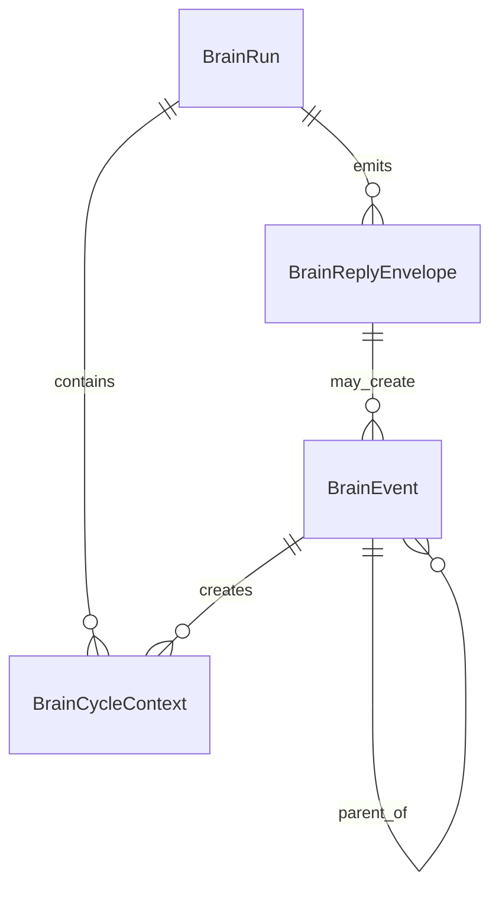
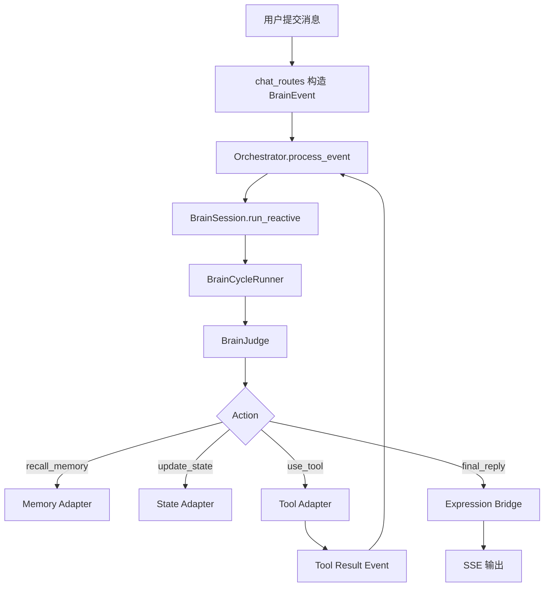

# 一、项目目标

项目名称：聊天完全接入大脑循环

一句话描述：把现有 `/chat/send` 的主回复链路从“旧聊天循环 + 旁路 brain”升级为“以 `main_brain` 为主、旧 `chat/loop.py` 为 fallback”的统一大脑回路，让用户输入、工具结果、状态变化、记忆召回和最终回复都经过同一个中枢。

核心目标：

1. 用户消息进入系统后，优先变成 `BrainEvent`，再进入 `Orchestrator` 和 `BrainSession / BrainCycleRunner`，而不是先走旧聊天循环。
2. 聊天回复的决策、工具调用、状态更新、记忆写入和表达策略都由大脑循环驱动，旧 `send_message()` 只保留降级兜底。
3. 工具执行结果必须回灌到同一条 `trace_id` 链路中，形成“输入 - 推理 - 行动 - 反馈 - 再推理”的闭环。
4. 让 SSE 输出与大脑循环解耦：大脑负责决策，表达桥负责把结果稳定地推给前端。
5. 让系统在任意节点失败时都能回退到旧聊天链路，保证聊天可用性不被破坏。

不做的事：

1. 不在第一阶段删除旧 `chat/loop.py`，它只改成 fallback 和兼容层。
2. 不重构 `modules/brain/memory` 和 `modules/brain/state` 的底层存储实现。
3. 不一次性把视觉、音频、文件监听等多模态输入全接入聊天主链路。
4. 不追求一次性实现 AGI，只实现可观测、可回放、可回退的完整聊天脑循环。

# 二、业务背景

当前系统已经有 `BrainEvent`、`Orchestrator`、`BrainSession`、`BrainJudge`、`BrainCycleRunner` 和事件日志，但聊天主链路仍是“混合模式”：

1. `/chat/send` 会先创建事件，但后续回复仍然调用 `ChatManager.send()`，而 `send_message()` 里依旧是旧的同步 LLM + tool loop。
2. `BrainSession` 目前是可选的前置思考层，默认开关关闭，更多像“回复前加一段内部分析”，还不是主回复引擎。
3. `brain_context` 只是把内部思考注入 prompt，不会主导整个回复流程。
4. 工具调用虽已能回灌事件，但目前还是附着在旧 chat loop 里，未成为真正的大脑动作链。
5. 这导致系统具备“大脑雏形”，但没有“完全接管聊天输出”的主回路。

问题与痛点：

1. 聊天输入和回复不在同一个中枢里，导致 trace 虽然存在，但控制权不集中。
2. 工具结果、状态更新和最终回复之间的关系不够明确，容易出现链路断裂。
3. 旧聊天循环和 brain 循环同时存在时，容易让开发者误判“到底谁在决定回复”。
4. 如果后续要做主动表达、长期任务、反思修正，就需要先把聊天主链路彻底并入大脑循环。

预期价值：

1. 让聊天变成大脑系统的标准输入输出回路，而不是独立于大脑之外的旁路。
2. 让每次回复都能带着状态、记忆、目标和工具结果一起演化。
3. 让调试、回放、统计和自动化测试都基于统一事件链完成。
4. 为后续把背景 tick、主动联系、任务推进也统一进同一回路打基础。

# 三、功能需求

| 编号 | 功能名称 | 用户故事 | 优先级 | 备注 |
|---|---|---|---|---|
| FR-001 | 聊天主入口事件化 | 作为系统，我希望 `/chat/send` 第一时间生成 `BrainEvent` | P0 | 事件类型为 `chat/user_message` |
| FR-002 | 大脑主导回复 | 作为用户，我希望回复主要由 `BrainSession / BrainCycleRunner` 产出 | P0 | 旧 loop 仅 fallback |
| FR-003 | 工具调用入脑 | 作为系统，我希望 LLM 工具调用能变成大脑动作而不是纯 chat 副作用 | P0 | tool call / tool result 都回到同一 trace |
| FR-004 | 表达桥接 | 作为系统，我希望大脑生成的 reply 能稳定转成 SSE token 流 | P0 | 负责 start/token/usage/done |
| FR-005 | 事件反馈闭环 | 作为系统，我希望工具结果、状态变化、记忆召回都能再次影响下一轮决策 | P0 | 统一回灌到 orchestrator |
| FR-006 | fallback 兼容 | 作为开发者，我希望随时能退回旧 `send_message()` | P0 | feature flag + 异常降级 |
| FR-007 | trace 可追踪 | 作为开发者，我希望看到 `event_id / parent_id / trace_id / run_id` | P0 | 便于回放与排障 |
| FR-008 | 状态与记忆同步 | 作为系统，我希望任意聊天事件都能更新状态和记忆上下文 | P1 | 不改底层存储结构 |
| FR-009 | 防止递归风暴 | 作为系统，我希望工具回灌不会触发无限循环 | P0 | depth / budget / timeout |
| FR-010 | 事件回放与调试 | 作为开发者，我希望能按 trace 回放一整条聊天链路 | P1 | 服务定位和复盘 |
| FR-011 | 运行观测 | 作为开发者，我希望能看到大脑每轮做了什么、为什么这么做 | P1 | run log + event log + state trace |

# 四、非功能需求

性能要求：

1. `/chat/send` 的事件入脑步骤应尽量在 50ms 级别完成，不阻塞 SSE 起流。
2. 大脑主循环允许比旧链路多一步决策，但非工具场景下不应明显劣化用户体验。
3. 工具结果回灌必须有预算上限，避免链式循环拖慢整次请求。
4. 如果大脑回复失败，fallback 应立即接管，用户仍能收到正常回复。

稳定性要求：

1. 任一处理节点失败都不能导致整个聊天接口 500。
2. 事件层必须支持 `max_depth`、`max_cycles`、`timeout` 和 `budget`。
3. 任何工具回灌都必须带 `trace_id` 和 `parent_id`，避免链路断裂。
4. SSE 中断、客户端断连、LLM 超时都要能安全收尾。

安全要求：

1. 不把 API Key、内部 prompt、调试密钥写入事件日志。
2. 工具调用执行必须走白名单和参数校验。
3. 需要保留对高风险动作的拦截点，避免大脑直接执行危险副作用。

可维护性要求：

1. 大脑主链路与 fallback 链路要明确分层，方便排查。
2. 事件日志、run log、state trace、SSE 输出要能互相关联。
3. 新增动作类型时，只需要扩展 action handler，不要改聊天主流程。
4. 代码要支持单元测试、集成测试和日志回放测试。

# 五、系统架构

```mermaid
flowchart TD
    U[用户消息] --> R[POST /chat/send]
    R --> I[Chat Ingress Adapter]
    I --> E[BrainEvent: source=chat]
    E --> O[Orchestrator]
    O --> S[BrainSession / BrainCycleRunner]
    S --> J[BrainJudge]
    J --> A{Action}

    A -->|recall_memory| M[Memory Adapter]
    A -->|update_state| ST[State Adapter]
    A -->|use_tool| T[Tool Adapter]
    A -->|create_pending| P[Pending / Expression Buffer]
    A -->|final_reply| X[Expression Bridge]
    A -->|sleep| Z[Stop / Idle]

    T --> E2[BrainEvent: source=tool]
    E2 --> O
    M --> O
    ST --> O
    P --> X
    X --> SSE[SSE: start/token/usage/done]

    O --> L[Event Log / Run Log]
    S --> L
    SSE --> C[前端聊天界面]
    F[旧 send_message()] -. fallback .-> SSE
```

技术栈选型：

| 模块 | 方案 | 理由 |
|---|---|---|
| 事件入口 | `main_brain.contracts` | 统一事件格式，便于 trace 和回放 |
| 编排层 | `main_brain.orchestrator` | 作为聊天主中枢的第一入口 |
| 决策层 | `main_brain.judge` | 让 LLM 只做结构化决策 |
| 循环层 | `main_brain.controller` | 负责多轮 action 执行和终止条件 |
| 表达层 | 新增 `expression bridge` | 把 final_reply / pending 转成 SSE |
| 回灌层 | `main_brain.event_adapters` | tool / state / learning 统一回流 |
| 日志层 | `main_brain.logging.event_log` | 支持事件链追踪与 run 回放 |
| 兼容层 | `modules/chat/loop.py` | 仅保留 fallback 和过渡兼容 |

建议目录结构：

```text
backend/main_brain/
  contracts.py
  orchestrator.py
  router.py
  session.py
  controller.py
  judge.py
  event_adapters.py
  logging/
    event_log.py
  adapters/
    state.py
    memory.py
    tools.py
    expression.py
  bridge/
    chat_ingress.py
    chat_reply.py
    tool_feedback.py
backend/routes/
  chat_routes.py
backend/modules/chat/
  loop.py
  chat_mod.py
  pipeline/sections/brain_context.py
```

关键设计决策：

1. `/chat/send` 以后优先走大脑主链路，旧聊天循环只在失败、开关关闭或灰度回退时使用。
2. 工具调用不再只属于 chat loop，而是作为大脑的一个 action 继续回流。
3. SSE 只是输出层，不参与决策，避免逻辑散落到流式 generator 里。
4. 事件日志和 run log 分开保存，保证既能快速看摘要，也能精确回放链路。

# 六、数据结构

## 核心实体

### BrainEvent

| 字段 | 类型 | 说明 | 约束 |
|---|---|---|---|
| id | str | 事件唯一 ID | 必填 |
| parent_id | str | 上游事件 ID | 可空 |
| trace_id | str | 事件链路 ID | 必填 |
| source | str | chat / tool / tick / reflection / system | 必填 |
| type | str | user_message / tool_result / final_reply / state_change 等 | 必填 |
| modality | str | text / json / event | 必填 |
| content | str | 事件正文 | 必填 |
| timestamp | str | ISO 时间戳 | 必填 |
| salience | float | 注意力分值 | 0~1 |
| metadata | dict | 额外上下文 | 可扩展 |

### BrainCycleContext

| 字段 | 类型 | 说明 |
|---|---|---|
| event | BrainEvent | 当前处理事件 |
| perception | dict | 感知结果 |
| attention | dict | 注意力结果 |
| memory | dict | 记忆召回结果 |
| state | dict | 状态快照 |
| cognition | dict | 决策草案 |
| action | dict | 当前动作结果 |
| feedback | dict | 反馈或回灌信息 |
| error | str | 失败原因 |

### BrainRun

| 字段 | 类型 | 说明 |
|---|---|---|
| run_id | str | 一次聊天脑循环的轨迹 ID |
| mode | str | reactive / background |
| trigger | dict | 触发来源 |
| cycles | list | 每轮 judge / action 记录 |
| stop_reason | str | ready / sleep / timeout / error / fallback |
| finished_at | str | 结束时间 |
| learning_hints | list[str] | 可沉淀的学习线索 |

### BrainReplyEnvelope

| 字段 | 类型 | 说明 |
|---|---|---|
| trace_id | str | 关联原始事件链 |
| source_event_id | str | 触发回复的事件 ID |
| reply_type | str | final / pending / fallback |
| text | str | 最终回复文本 |
| chunks | list[str] | SSE token 切片 |
| should_send | bool | 是否立即发送 |
| hold_reason | str | 暂缓发送原因 |
| usage | dict | token 使用情况 |
| metadata | dict | 额外信息 |

## 关系图



## 索引策略

1. `BrainEvent.trace_id` 需要索引，方便按链路回放。
2. `BrainEvent.parent_id` 需要索引，方便追踪父子关系。
3. `BrainEvent.source` 和 `BrainEvent.type` 需要索引，便于过滤统计。
4. `BrainRun.run_id` 需要索引，便于按运行轨迹读取。

## 数据量预估

1. 每次聊天至少 1 条 `chat` 事件，复杂问题可能伴随多条 `tool` 事件。
2. 如果开启事件日志和 run log，日增量主要由聊天频次和工具调用次数决定。
3. 文本内容保持摘要化，避免日志文件过快膨胀。

# 七、流程设计

## 流程 1：用户聊天主链路



步骤说明：

1. 用户发消息后，路由层先构建 `BrainEvent`。
2. 事件进入 `Orchestrator`，由大脑先做感知、注意、状态标记。
3. `BrainSession` 运行 1~N 轮内部决策，生成 reply strategy。
4. `BrainCycleRunner` 执行 action handlers，必要时调用工具。
5. 工具结果再次变成事件回到同一 trace。
6. `final_reply` 由表达桥转成 SSE token 流。
7. 旧聊天循环只在失败或开关关闭时接管。

## 流程 2：工具回灌闭环

1. `use_tool` action 执行工具。
2. 工具结果生成 `tool_result` 事件，携带原始 `trace_id` 和 `parent_id`。
3. `Orchestrator` 再处理一次该事件，刷新状态、记忆和学习线索。
4. `BrainJudge` 根据新的上下文决定继续用工具、准备回复或结束。
5. 若预算耗尽或超时，则转入 fallback 或终止动作。

## 流程 3：fallback 路径

1. 大脑初始化失败、Judge 输出非法、工具异常不可恢复时，进入 fallback。
2. 路由层调用旧 `ChatManager.send()` / `send_message()`。
3. SSE 仍然正常返回，保证用户体验不被中断。
4. 同时记录 error event 和失败原因，便于后续修复。

## 异常流程

1. 如果 `Orchestrator` 处理失败，保留事件日志并继续旧链路。
2. 如果 `BrainJudge` 输出不合法 JSON，降级到安全决策或 fallback。
3. 如果工具执行失败，只标记这轮 action 失败，不终止整个聊天接口。
4. 如果事件回灌造成重复递归，通过 `trace_id`、`parent_id`、`max_depth` 和预算限制截断。

## 状态流转

```text
idle -> entering_brain -> reasoning -> acting -> feedback -> replying -> idle
```

含义：

1. `entering_brain`：用户消息已转成事件并进入中枢。
2. `reasoning`：BrainSession / BrainJudge 正在做决策。
3. `acting`：工具、状态、记忆等副作用被执行。
4. `feedback`：结果回灌到同一条 trace。
5. `replying`：表达桥把最终回复发送给前端。
6. `idle`：本轮结束，等待下一条输入。

# 八、API设计

## 现有接口

| 方法 | 路径 | 说明 |
|---|---|---|
| POST | `/chat/send` | 用户主入口，内部先入脑再回复 |
| GET | `/chat/state` | 查看当前聊天状态、brain 摘要和运行信息 |
| POST | `/chat/clear` | 清空聊天历史 |

## 建议新增接口

| 方法 | 路径 | 说明 |
|---|---|---|
| GET | `/brain/events/recent` | 查看最近事件列表 |
| GET | `/brain/events/<event_id>` | 查看单个事件详情 |
| GET | `/brain/runs/recent` | 查看最近 run 摘要 |
| GET | `/brain/runs/<run_id>` | 查看完整 run 轨迹 |
| POST | `/brain/runs/<run_id>/replay` | 回放某次事件链 |
| POST | `/brain/chat/mode` | 切换 brain-first / fallback 优先级 |

## `POST /chat/send` 请求示例

```json
{
  "message": "把聊天完全接入大脑循环需要怎么改？"
}
```

## `POST /chat/send` 响应策略

1. 立即返回 SSE `start`。
2. 大脑侧若生成 `final_reply`，通过 token 流输出。
3. 如果大脑失败，则回退到旧聊天循环输出。

## `GET /chat/state` 响应示例

```json
{
  "current_status": "生成回复",
  "brain": {
    "last_reactive_run_id": "br_...",
    "last_background_run_id": "bg_...",
    "current_focus": "把聊天完全接入大脑循环",
    "last_error": "",
    "scheduler_running": false
  }
}
```

## 错误码

| 错误码 | 含义 |
|---|---|
| empty_message | 消息为空 |
| api_key_missing | 未配置 LLM API Key |
| brain_fallback | 大脑失败，已回退旧链路 |
| invalid_event | 事件格式不合法 |
| budget_exhausted | 预算耗尽 |
| timeout | 处理超时 |

# 九、验收标准

功能验收：

1. 用户发送一条消息时，日志中先看到 `BrainEvent` 创建，再看到大脑处理，再看到回复输出。
2. 聊天回复默认由 `BrainSession / BrainCycleRunner` 产出，不再直接以旧 `send_message()` 作为主链路。
3. 工具调用结果会回灌成同一条 `trace_id` 的事件，并影响后续决策。
4. SSE 输出与旧版一致，前端不会因为接入大脑而收不到 token、usage 或 done。
5. 关闭 brain-first 开关时，系统能稳定回退到旧聊天循环。
6. 任意异常都不会把 `/chat/send` 变成 500。

稳定性验收：

1. 连续多轮工具调用不会无限递归。
2. `max_depth`、`max_cycles`、`timeout`、`budget` 任一生效时，都能正确停止并记录 stop_reason。
3. tool 失败、judge 失败、表达桥失败时，系统都能降级。

可观测性验收：

1. 同一轮聊天可以在日志里串起 `event_id / parent_id / trace_id / run_id`。
2. 事件日志和 run log 都能用于定位“为什么这么答”。
3. 能按 trace 回放出聊天输入、工具结果和最终回复的完整链路。

交付物清单：

1. 聊天 brain-first 主链路代码。
2. 旧聊天循环 fallback 兜底代码。
3. 事件链和 run 轨迹日志。
4. 回归测试和 smoke test。

# 十、开发任务拆分

| 任务 ID | 任务名称 | 依赖 | 复杂度 | 所属模块 | 对应需求 |
|---|---|---|---|---|---|
| T001 | 定义聊天回复契约 `BrainReplyEnvelope` | 无 | S | `main_brain/contracts.py` | FR-001, FR-004 |
| T002 | 让 `/chat/send` 优先进入大脑主链路 | T001 | M | `backend/routes/chat_routes.py` | FR-001, FR-002 |
| T003 | 把 `BrainSession` 接成聊天主回复引擎 | T001, T002 | M | `main_brain/session.py` | FR-002 |
| T004 | 将 `BrainCycleRunner` 产出的决策映射到表达桥 | T001, T003 | M | `main_brain/controller.py`, `main_brain/adapters/expression.py` | FR-004 |
| T005 | 把 tool execution 改成大脑 action handler | T003, T004 | M | `backend/modules/chat/loop.py`, `main_brain/adapters/tools.py` | FR-003, FR-005 |
| T006 | 统一 tool_result 回灌 trace 链路 | T002, T005 | M | `backend/modules/chat/loop.py`, `main_brain/orchestrator.py` | FR-003, FR-005, FR-007 |
| T007 | 改造 `brain_context` 只读最新本轮事件链 | T002, T006 | S | `backend/modules/chat/pipeline/sections/brain_context.py` | FR-007, FR-011 |
| T008 | 加入 fallback 开关与异常回退路径 | T002, T003, T004 | S | `main_brain/config.py`, `backend/routes/chat_routes.py` | FR-006, FR-009 |
| T009 | 完善事件日志、run log 和 replay 接口 | T001, T006 | M | `main_brain/logging/event_log.py`, `backend/routes/brain_routes.py` | FR-007, FR-010, FR-011 |
| T010 | 编写主链路集成测试与回归测试 | T002-T009 | M | `backend/main_brain/testing/`, `tests/` | 全部 |

任务顺序建议：

1. 先做 `T001-T003`，把“脑先于旧 loop”确立起来。
2. 再做 `T004-T006`，把表达、工具和回灌都并入大脑循环。
3. 接着做 `T007-T009`，让 trace、日志和 fallback 完整可观测。
4. 最后做 `T010`，用测试锁定“聊天完全接入大脑循环”的结果。
