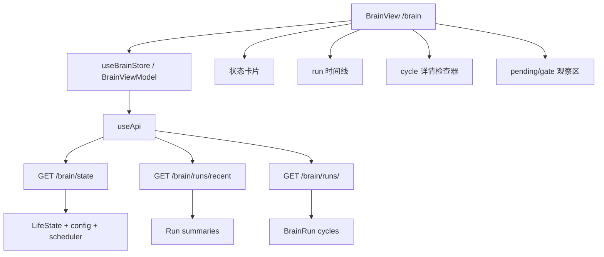
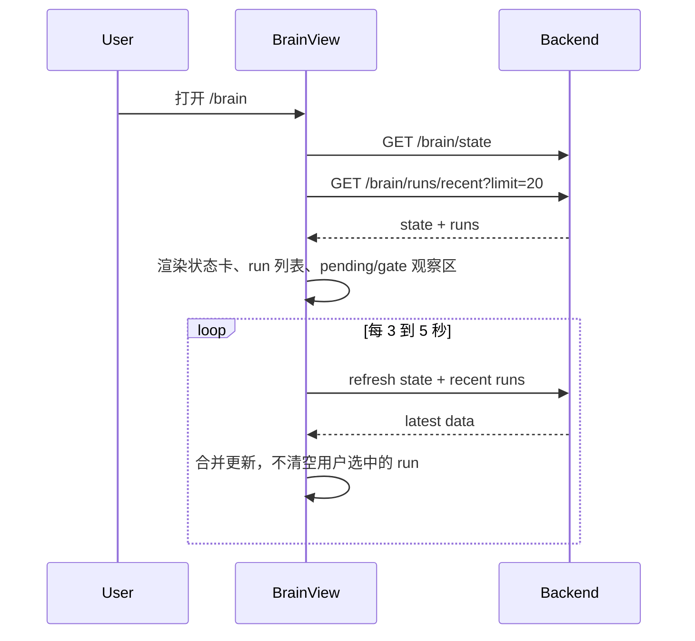
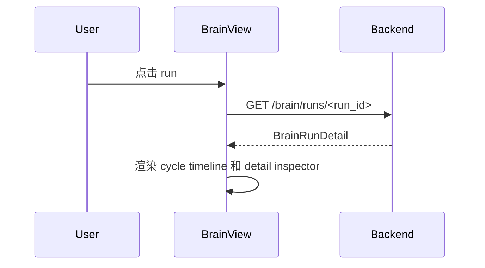
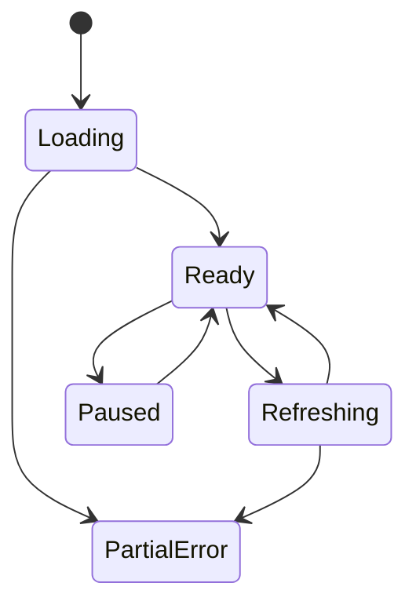

# 一、项目目标

项目名称：BrainLoop 状态可视化面板

一句话描述：在现有 Vue 前端中新增一个只读 Brain 页面，用可视化方式观察当前 `Digital Life BrainLoop` 的运行状态，让开发者能看见它此刻在做什么、为什么这么做、上一轮循环发生了什么、下一步可能醒来做什么。

核心目标：

1. 在前端新增 `/brain` 页面，展示 `LifeState`、scheduler 状态、配置开关、最近 reactive/background runs、pending expressions、gate 结果和最后错误。
2. 支持查看单个 `BrainRun` 的 cycle 轨迹，包括 `thought_summary`、`focus`、`action`、`action_args`、`result_summary`、耗时、错误和停止原因。
3. 支持自动刷新和手动刷新只读状态，默认 3 到 5 秒刷新一次，避免给后端造成额外压力。
4. 第一版不提供 start/stop、手动 tick、配置编辑或任何会触发副作用的控制功能。
5. 页面加载、刷新、查看详情都不能触发真实 LLM、后台 tick、状态写入、主动发送或工具执行。

不做的事：

1. 不宣称系统具备真实意识或真实生命，只展示工程状态和行为轨迹。
2. 不在前端直接绕过后端 policy 或 adapter 执行任何副作用。
3. 不把完整长 prompt、敏感用户原文、工具秘密参数默认展示出来。
4. 不第一版做复杂 3D 大脑或装饰性动画，优先做可读、可查、可调试的工作台。
5. 不在第一版接入 `/brain/life/start`、`/brain/life/stop`、`/brain/life/tick`。
# 二、业务背景

当前 BrainLoop 已经实现了 reactive `BrainSession`、background `LifeLoopDaemon`、`ActivitySelector`、`BrainJudge`、adapter、`ExpressionGate`、event log 和测试 harness。后端也已有基础观测接口：

| 接口 | 当前用途 |
|---|---|
| `GET /brain/state` | 返回 LifeState、scheduler、config、最近 run id |
| `GET /brain/runs/recent` | 返回最近 run 摘要 |
| `GET /brain/runs/<run_id>` | 返回单个 run 完整轨迹 |
| `POST /brain/life/start` | 启动后台循环 |
| `POST /brain/life/stop` | 停止后台循环 |
| `POST /brain/life/tick` | 手动触发一次 tick |
| `GET /chat/state` | 返回聊天状态和 brain 摘要 |

问题是这些信息目前主要靠 API、日志和测试脚本查看。对于“像一个活在电脑里的数字主体”这种系统，用户需要一个可视化窗口，持续知道它现在是否在运行、关注什么、最近做过什么、为什么没有主动说话、pending 队列里有什么、gate 是 send/hold/suppress。

目标用户：

1. 开发者：调试 BrainLoop 行为、定位某个 cycle 为什么选了某个 action。
2. 使用者本人：查看数字主体的当前状态，理解它是否空闲、反思、整理记忆、准备表达或尝试主动联系。
3. 测试脚本和验收流程：通过稳定的页面元素和 API 输出验证闭环是否正常。

预期价值：

1. 把不可见的后台循环变成可观察系统。
2. 缩短调试路径，从“翻日志猜测”变成“点开 run 看轨迹”。
3. 让主动表达不再显得随机，能看到 pending 来源和 gate 原因。
4. 为后续更强 autonomy 提供控制台基础。

# 三、功能需求

| 编号 | 功能名称 | 用户故事 | 优先级 | 备注 |
|---|---|---|---|---|
| FR-001 | Brain 导航入口 | 作为用户，我希望侧边栏有 Brain 入口，可以进入循环状态面板 | P0 | 新增 router 和 NavSidebar 项 |
| FR-002 | 生命状态概览 | 作为用户，我希望一眼看到 LifeLoop 是否运行、当前活动、focus、energy、idle、autonomy | P0 | 数据来自 `/brain/state` |
| FR-003 | 配置和开关展示 | 作为开发者，我希望看到 session/life/proactive 配置是否开启 | P0 | 第一版只展示，不编辑配置 |
| FR-004 | 最近 run 列表 | 作为开发者，我希望看到最近 reactive/background runs，并按 mode 过滤 | P0 | 数据来自 `/brain/runs/recent` |
| FR-005 | run 详情轨迹 | 作为开发者，我希望点开某个 run 后查看所有 cycle 的动作链 | P0 | 数据来自 `/brain/runs/<run_id>` |
| FR-006 | Pending 表达队列 | 作为用户，我希望看到当前有什么“想说但还没说”的内容或 hint | P0 | 需要 `/brain/state` 返回 pending，或新增 debug 字段 |
| FR-007 | Gate 状态展示 | 作为开发者，我希望看到最近一次主动表达 gate 的 action、原因和风险分 | P1 | 历史 gate 需要 run/event log 补充 |
| FR-008 | 自动刷新 | 作为用户，我希望页面自动刷新状态，但不会过度打扰后端 | P0 | 3 到 5 秒轮询，可暂停 |
| FR-009 | 手动刷新 | 作为用户，我希望暂停自动刷新后仍能手动拉取最新状态 | P0 | 只读 GET 请求 |
| FR-010 | 错误和停止原因 | 作为开发者，我希望明显看到 last_error、cycle error、stop_reason | P0 | 错误状态不可吞掉 |
| FR-011 | 时间线视图 | 作为用户，我希望按时间线查看最近 background tick 的活动变化 | P1 | 从 recent runs 生成 |
| FR-012 | 测试友好 DOM | 作为开发者，我希望页面有稳定 `data-testid`，方便 Playwright 验证 | P0 | 按 AGENTS 要求使用 Playwright |
| FR-013 | 轻量状态 API 聚合 | 作为前端，我希望减少并发请求，把 dashboard 需要的数据聚合为一个响应 | P1 | 可新增 `GET /brain/dashboard` |
| FR-014 | 敏感信息折叠 | 作为用户，我希望长参数、工具结果、错误堆栈默认折叠 | P1 | 防止页面泄漏和拥挤 |

明确不做第一版：

1. 不提供启动/停止 LifeLoopDaemon 的按钮。
2. 不提供手动触发 tick 的按钮。
3. 不提供配置编辑、autonomy 调整、proactive 开关修改。
4. 不提供“发送 pending 表达”“强制 gate 通过”等主动行为入口。
# 四、非功能需求

性能要求：

1. `/brain` 页面首屏加载后 500ms 内渲染静态框架，API 返回后填充数据。
2. 自动刷新默认间隔不小于 3000ms；用户可暂停刷新。
3. `GET /brain/runs/recent` 默认限制 20 条；详情只在用户点击后加载。
4. 前端不会因为某个接口失败导致整页白屏，失败模块显示错误和重试按钮。
5. 页面只发起 GET 类观察请求；如使用聚合接口，也必须是只读接口。

安全要求：

1. 页面加载、自动刷新、手动刷新都不得调用 `/brain/life/start`、`/brain/life/stop`、`/brain/life/tick`。
2. 页面不会触发真实 LLM、状态写入、工具执行、主动消息发送。
3. run 详情默认展示摘要字段，长 `action_args`、工具输出、错误堆栈折叠。
4. 不在前端保存 API key、工具凭据或完整敏感上下文。

可用性要求：

1. 页面布局适配桌面和窄屏，核心状态卡、run 列表、详情面板不能重叠。
2. 刷新按钮有 loading、disabled、success、error 状态。
3. 状态标签颜色必须能区分 running、idle、error、dry_run、send、hold、suppress。
4. 使用现有 Vue/Vite/Pinia 风格和 `useApi`，不引入大型 UI 框架。

可维护性要求：

1. 前端新增文件集中在 `web/src/views/BrainView/`。
2. API 类型定义集中在 `BrainView/types.ts` 或 store 中。
3. 后端如需新增聚合接口，放在 `backend/routes/brain_routes.py`，不新建平行 route 体系。
4. 前端修改完成后必须构建前端代码。
5. E2E 使用 Playwright，至少覆盖页面加载、状态展示、run 列表和 run 详情。
# 五、系统架构



技术选型：

| 模块 | 方案 | 理由 |
|---|---|---|
| 前端框架 | Vue 3 + Vite | 项目现有技术栈 |
| 路由 | `vue-router` | 项目已有 `web/src/router/index.ts` |
| API 调用 | `useApi` | 复用现有 `fetchJson/postJson` |
| 状态管理 | 轻量 ViewModel 或 Pinia store | 页面状态较多，避免组件内堆逻辑 |
| 图表/时间线 | CSS + 简单组件 | 第一版不引入新图表库 |
| 后端接口 | 复用只读 `/brain/*`，可选新增 `/brain/dashboard` | 减少重复请求 |
| Vite 代理 | `web/vite.config.ts` 新增 `/brain` proxy | 开发环境让 `/brain/*` 请求转发到 Flask 后端 |
| E2E | Playwright | 项目要求前端 E2E 使用 Playwright |

推荐目录结构：

```text
web/src/views/BrainView/
  BrainView.vue
  BrainViewModel.ts
  types.ts
  components/
    BrainStatusPanel.vue
    BrainRunList.vue
    BrainRunDetail.vue
    BrainCycleTimeline.vue
    PendingExpressionPanel.vue
    GateResultPanel.vue

web/src/router/index.ts
web/src/components/NavSidebar.vue
web/vite.config.ts
web/e2e/brain.spec.ts
```

后端可选补充：

```text
backend/routes/brain_routes.py
  GET /brain/dashboard      # 聚合 state + recent runs + pending + last gate，只读
```

关键设计决策：

1. 页面定位是“观察和调试驾驶舱”，不是聊天页替代品。
2. 状态展示优先读 `/brain/state`，历史轨迹优先读 event log。
3. 第一版前端没有任何副作用操作入口，不接 start/stop/tick。
4. run 详情按需加载，避免每次刷新都读完整日志。
5. pending/gate 使用可解释字段展示，帮助判断主动表达为什么发或不发。
6. 开发环境必须在 Vite proxy 中加入 `/brain`，否则 `useApi('/brain/state')` 会落到前端路由而不是后端。
# 六、数据结构

## BrainDashboardState

| 字段 | 类型 | 说明 | 来源 |
|---|---|---|---|
| life_state | object | 当前 LifeState | `/brain/state` |
| scheduler_running | boolean | 后台 scheduler 是否运行 | `/brain/state` |
| config | object | BrainLoop 相关配置 | `/brain/state` |
| last_reactive_run_id | string | 最近 reactive run | `/brain/state` |
| last_background_run_id | string | 最近 background run | `/brain/state` |
| log_path | string | brain run 日志路径 | `/brain/state` |
| runs | BrainRunSummary[] | 最近 run 摘要 | `/brain/runs/recent` |
| selected_run | BrainRunDetail | 当前查看的 run 详情 | `/brain/runs/<run_id>` |
| refresh_paused | boolean | 前端是否暂停自动刷新 | 前端状态 |
| loading | object | 各模块 loading 状态 | 前端状态 |
| error | object | 各模块错误 | 前端状态 |

## LifeState 展示字段

| 字段 | 展示方式 |
|---|---|
| life_loop_status | 状态徽标 |
| current_activity | 活动徽标 |
| current_focus | 单行文本，过长截断 |
| idle_seconds | 格式化为秒/分钟/小时 |
| energy | 进度条 |
| mood | 标签或 JSON 折叠 |
| working_set | 列表 |
| open_loops | 数量 + 可展开摘要 |
| goals | 数量 + 可展开摘要 |
| pending_expressions | 队列列表 |
| next_wake_hint | 下一次唤醒提示 |
| last_error | 错误栏 |

## BrainRunSummary

| 字段 | 类型 | 说明 |
|---|---|---|
| run_id | string | run ID |
| mode | string | reactive/background |
| started_at | string | 开始时间 |
| finished_at | string | 结束时间 |
| selected_activity | string | 后台活动 |
| cycle_count | number | cycle 数量 |
| actions | string[] | action 序列 |
| stop_reason | string | ready/sleep/max_cycles/timeout/error |
| thought_summary | string | 摘要 |
| error_count | number | 错误数量，可选 |

## BrainRunDetail

| 字段 | 类型 | 说明 |
|---|---|---|
| run | object | run 基础信息 |
| cycles | BrainCycle[] | 每轮 cycle |
| memory_context | array | 召回记忆摘要 |
| tool_results | array | 工具结果摘要 |
| state_deltas | array | 状态变更 |
| pending_created | array | 创建的 pending |
| final_strategy | object | reactive 最终回复策略 |
| stop_reason | string | 停止原因 |

## BrainCycle

| 字段 | 类型 | 说明 |
|---|---|---|
| cycle_index | number | 第几轮 |
| thought_summary | string | 思考摘要 |
| focus | string | 当前关注 |
| action | string | next_action |
| action_args | object | 动作参数，默认折叠 |
| result_summary | string | adapter 结果摘要 |
| confidence | number | 置信度 |
| latency_ms | number | LLM 或处理耗时 |
| error | string | 错误 |
| reply_ready | boolean | 是否准备回复 |
| notify_candidate | object | 主动通知候选，可选 |

# 七、流程设计

## 页面加载流程



## 查看 run 详情



## 手动刷新流程

1. 用户点击刷新。
2. 前端只请求 `/brain/state` 和 `/brain/runs/recent`。
3. 如果当前选中了 run，保留详情面板；用户点击详情刷新时才重新请求 `/brain/runs/<run_id>`。
4. 刷新过程不触发任何后台循环、LLM、工具或状态写入。

## 异常处理

| 场景 | 处理策略 |
|---|---|
| `/brain/state` 失败 | 状态区域显示错误，run 列表保留旧数据 |
| `/brain/runs/recent` 失败 | run 列表显示错误和重试按钮 |
| run detail 404 | 详情区显示 run 不存在，允许刷新列表 |
| 后端模型预热中 | 显示“后端尚未就绪或模型加载中”，保留重试 |
| 聚合接口失败 | fallback 到分别请求 state 和 recent runs |

## 状态流转


# 八、API 设计

第一版前端只接入只读接口：`GET /brain/state`、`GET /brain/runs/recent`、`GET /brain/runs/<run_id>`，可选接入 `GET /brain/dashboard`。后端已有的 `/brain/life/start`、`/brain/life/stop`、`/brain/life/tick` 不在第一版前端中使用。

## GET /brain/state

当前已有，第一版直接使用。

响应示例：

```json
{
  "life_state": {
    "life_loop_status": "idle_thinking",
    "current_activity": "wait",
    "current_focus": "brain-loop",
    "idle_seconds": 120,
    "energy": 0.72,
    "pending_expressions": [],
    "next_wake_hint": {"tick_type": "medium_tick", "reason": "wait"}
  },
  "scheduler_running": false,
  "config": {
    "brain_session_enabled": true,
    "life_loop_enabled": true,
    "proactive_contact_enabled": false,
    "autonomy_level": "assist"
  },
  "last_reactive_run_id": "br_xxx",
  "last_background_run_id": "bg_xxx",
  "log_path": "logs/main_brain/brain_runs.jsonl"
}
```

前端需求：

1. `pending_expressions` 如果当前不在 `life_state` 内，需要后端补充到响应中。
2. `last_error` 如果为空则显示正常。

## GET /brain/runs/recent

当前已有。

查询参数：

| 字段 | 类型 | 必填 | 说明 |
|---|---|---|---|
| mode | string | 否 | reactive/background |
| limit | number | 否 | 默认 20 |

响应示例：

```json
{
  "runs": [
    {
      "run_id": "bg_20260620_xxx",
      "mode": "background",
      "selected_activity": "proactive_contact",
      "cycle_count": 1,
      "actions": ["sleep"],
      "stop_reason": "sleep",
      "thought_summary": "dry_run mock"
    }
  ]
}
```

## GET /brain/runs/<run_id>

当前已有。

响应示例：

```json
{
  "run_id": "bg_20260620_xxx",
  "mode": "background",
  "cycles": [
    {
      "cycle_index": 1,
      "thought_summary": "准备表达但先等待",
      "focus": "pending",
      "action": "create_pending",
      "action_args": {},
      "result_summary": "创建 pending",
      "confidence": 0.8,
      "latency_ms": 1200,
      "error": ""
    }
  ],
  "stop_reason": "sleep"
}
```

## GET /brain/dashboard（可选）

用于减少前端并发请求，P1 实现。该接口必须只读，不能触发 tick、LLM、工具或状态写入。

响应：

```json
{
  "state": {},
  "runs": [],
  "last_gate": {},
  "pending_expressions": [],
  "server_time": "2026-06-20T18:00:00+08:00"
}
```

## 第一版不接入的已有接口

| 接口 | 状态 | 原因 |
|---|---|---|
| `POST /brain/life/start` | 后端已有，前端 v1 不调用 | 属于控制功能 |
| `POST /brain/life/stop` | 后端已有，前端 v1 不调用 | 属于控制功能 |
| `POST /brain/life/tick` | 后端已有，前端 v1 不调用 | 会触发后台循环和潜在副作用 |

错误码：

| 状态码 | 场景 |
|---|---|
| 404 | run_id 不存在 |
| 500 | 后端读取 state、log 或 dashboard 失败 |
# 九、验收标准

功能验收：

1. 访问 `/brain` 可以看到 BrainLoop 状态面板，侧边栏有 Brain 入口。
2. 页面能展示 scheduler 是否运行、`life_loop_status`、`current_activity`、`current_focus`、`energy`、`idle_seconds`、autonomy 配置。
3. 点击刷新可以重新读取 `/brain/state` 和 `/brain/runs/recent`。
4. 最近 run 列表能按 reactive/background/all 过滤。
5. 点击任意 run 可以展示 cycle 时间线和详情。
6. 页面不出现 start、stop、tick、send、apply、save config 等控制按钮。
7. 当接口失败时，页面显示错误，不白屏。
8. `pending_expressions` 存在时，页面能展示来源、score、note、created_at 和 expressed 状态。
9. 有 gate 结果时，页面能展示 `send/hold/suppress`、reason、value/interruption 等指标。
10. 暂停自动刷新后，页面不会继续轮询；点击手动刷新只发起只读 GET 请求。

性能验收：

1. 自动刷新开启时，不会在 10 秒内发起超过 5 轮状态刷新。
2. run 详情只有点击后才请求。
3. 页面加载和刷新不会触发真实 LLM、后台 tick、状态写入、工具执行或主动发送。

安全验收：

1. 页面初次打开不调用 `/brain/life/tick`、`/brain/life/start`、`/brain/life/stop`。
2. 自动刷新和手动刷新也不调用任何 `POST /brain/life/*` 接口。
3. 页面没有任何能造成副作用的控制入口。
4. 长 JSON 默认折叠，敏感字段可在渲染前过滤或截断。

测试验收：

1. 新增 `web/e2e/brain.spec.ts`。
2. Playwright 覆盖 `/brain` 页面加载、状态卡展示、run 列表渲染、run 详情加载。
3. Playwright 验证页面不会请求 `/brain/life/start`、`/brain/life/stop`、`/brain/life/tick`。
4. 前端修改完成后执行构建，构建通过。
5. 如果新增后端只读接口，执行后端 compile 和对应 route smoke test。

交付物清单：

1. `web/src/views/BrainView/BrainView.vue`
2. `web/src/views/BrainView/BrainViewModel.ts`
3. `web/src/views/BrainView/types.ts`
4. `web/src/views/BrainView/components/*`
5. `web/src/router/index.ts` 新增 `/brain`
6. `web/src/components/NavSidebar.vue` 新增 Brain 导航项
7. `web/vite.config.ts` 新增 `/brain` proxy
8. `web/e2e/brain.spec.ts`
9. 可选：`backend/routes/brain_routes.py` 新增只读 `/brain/dashboard`

# 十、开发任务拆分

| 任务 ID | 任务名称 | 依赖 | 复杂度 | 模块 | 对应需求 |
|---|---|---|---|---|---|
| T001 | 梳理只读 `/brain/*` 当前响应字段，确认前端需要字段是否齐全 | 无 | S | backend/frontend | FR-002, FR-004, FR-005 |
| T002 | 新增 BrainView 路由和侧边栏入口 | 无 | S | frontend/router | FR-001 |
| T003 | 在 `web/vite.config.ts` 新增 `/brain` proxy | 无 | S | frontend/devserver | FR-002 到 FR-005 |
| T004 | 定义 BrainView TypeScript 类型 | T001 | S | frontend/types | FR-002, FR-004, FR-005 |
| T005 | 实现 BrainViewModel 或 store，封装 state/runs/detail 只读请求 | T003,T004 | M | frontend/state | FR-002 到 FR-010 |
| T006 | 实现状态概览组件 BrainStatusPanel | T005 | M | frontend/ui | FR-002, FR-003, FR-010 |
| T007 | 实现最近 run 列表 BrainRunList | T005 | M | frontend/ui | FR-004, FR-011 |
| T008 | 实现 run 详情和 cycle timeline | T007 | M | frontend/ui | FR-005, FR-010 |
| T009 | 实现 PendingExpressionPanel | T005 | S | frontend/ui | FR-006 |
| T010 | 实现 GateResultPanel | T005 | S | frontend/ui | FR-007 |
| T011 | 实现自动刷新、暂停刷新和手动刷新 | T005 | S | frontend/ui | FR-008, FR-009 |
| T012 | 给关键元素添加 `data-testid` | T006,T007,T008,T009,T010 | S | frontend/test | FR-012 |
| T013 | 可选新增只读 `/brain/dashboard` 聚合接口 | T001 | S | backend/routes | FR-013 |
| T014 | 补充 `/brain/state` pending/gate 可视化所需字段 | T001 | S | backend/routes | FR-006, FR-007 |
| T015 | 编写 Playwright E2E 测试 | T002 到 T012 | M | test/e2e | FR-012 |
| T016 | 前端构建并修复类型/样式问题 | T002 到 T012 | S | frontend/build | 全部 |
| T017 | 后端 compile 和 route smoke test | T013,T014 | S | backend/test | FR-013 |

推荐实施顺序：

1. P0 基础可见：T001、T002、T003、T004、T005。
2. P0 页面成型：T006、T007、T008。
3. P0 观察闭环：T011、T012、T015、T016。
4. P1 解释增强：T009、T010、T014。
5. P1 性能优化：T013、T017。

第一版最小可交付范围：

1. `/brain` 页面。
2. 状态概览。
3. 最近 run 列表。
4. run cycle 详情。
5. pending expression 展示。
6. 自动刷新、暂停刷新、手动刷新。
7. Playwright 基础测试。

后续控制版再考虑加入：

1. start/stop 控制。
2. dry_run tick 调试。
3. activity override。
4. 配置编辑。
5. pending 表达人工处理。

