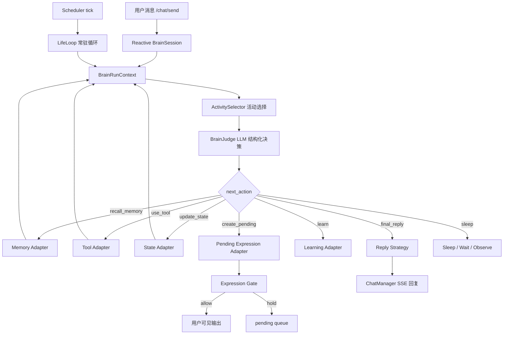
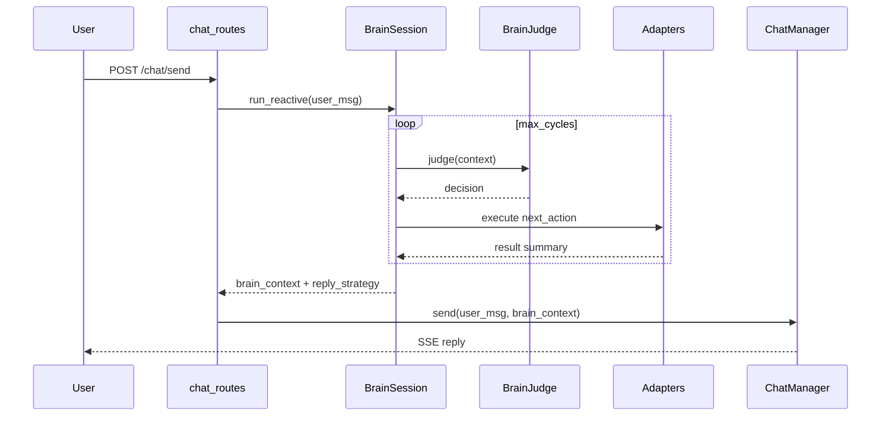
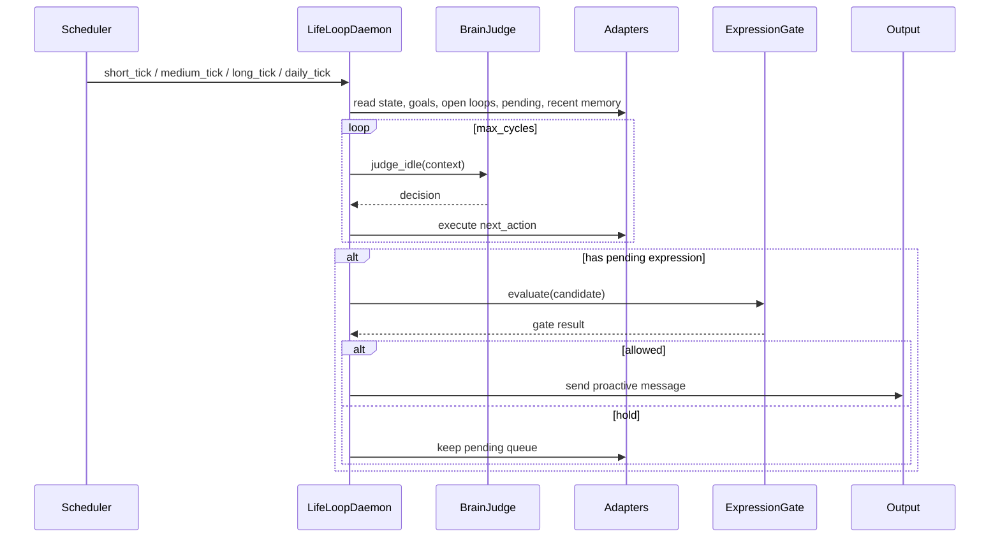

# 一、项目目标

项目名称：Digital Life BrainLoop 常驻数字生命循环

一句话描述：在现有 AiBrain chat 能力上构建一个常驻在电脑里的数字主体：它可以和用户交流，也可以在用户不说话时维持自己的状态、目标、记忆、活动和思考节奏，并在有价值且不打扰用户时主动找用户聊天。

核心目标：

1. 用户发送消息时，启动 `BrainSession`，在一次对话内运行多轮内部思考，再生成用户可见回复。
2. 用户没有输入时，后台 `LifeLoop` 仍持续运行，维护自己的节奏：空闲思考、整理记忆、回看目标、推进未完成事项、生成待表达想法。
3. 每轮循环由 LLM 输出结构化控制信号，代码负责执行记忆检索、工具调用、状态更新、学习沉淀和表达闸门。
4. 系统可以形成“持续存在感”的工程基础：当前关注、未完成事项、长期目标、日常活动、空闲思考、主动表达队列、表达冷却历史。
5. 主动找用户聊天必须经过关系语境、表达价值、冷却、重复检测和打扰风险判断，做到“可以一直活着和思考，但不能随便打扰”。
6. 保留现有 `ChatManager.send()`、PromptPipeline、SSE 协议、记忆和工具能力，第一版以兼容和可回滚为优先。

允许探索：

1. 可以把目标定义为“类似生命一样常驻在电脑上”的数字主体，不只限制为普通工程 agent。
2. 可以设计更强的自主权：写文件、写状态、执行工具、主动向用户发消息都允许纳入能力范围。
3. 可以设计长期持续运行机制，让 LifeLoop 不是一次性任务，而是有持续活动、休眠、唤醒、目标推进和主动联系的生活节奏。
4. 可以允许后台循环主动找用户聊天；第一版仍需要可配置频率和可观测日志，方便调试体验。

设计前提：

1. 所有自主行为都要可追踪：记录原因、上下文、动作、结果和时间。
2. 高风险动作需要分级：普通状态更新可自动执行，文件修改、外部工具、频繁主动联系等动作需要独立策略控制。
3. 系统可以拥有强自主循环，但必须提供暂停、停止、降频和手动接管入口。
4. 主动联系用户不是禁止项，而是核心能力；闸门的作用是调节节奏和质量，不是压制表达。

# 二、业务背景

当前 AiBrain 已经具备聊天、记忆检索、工具调用、状态层和主动表达雏形，但整体仍偏向被动响应：用户输入后，系统构造 prompt、查记忆或工具、生成回复。这个流程可以回答问题，却缺少“我正在想什么、我还惦记什么、我为什么想主动说这句话”的连续内部过程。

用户期望的是更像一个“住在电脑里的数字生命”：它不只是等用户发消息，而是能在空闲时整理记忆、回看未完成事项、维持长期目标、选择自己的活动、形成想法，并在合适的时候主动提醒、分享或继续话题。

预期价值：

1. 让每次对话和每次后台 tick 都产生可追踪的内部轨迹，便于调试系统为什么关注某件事。
2. 让记忆、工具、状态、学习不再只是 prompt 材料，而是参与持续决策。
3. 让主动表达有来源、有理由、有关系语境、有冷却，而不是随机输出。
4. 为长期 self narrative、open loops、goals、working set 和日常活动轨迹提供稳定更新入口。
5. 将原计划里零散的 perception/attention/cognition 判断合并为结构化 `BrainJudge`，减少不用 LLM 的脆弱规则层。

# 三、功能需求

| 编号 | 功能名称 | 用户故事 | 优先级 | 备注 |
|---|---|---|---|---|
| FR-001 | Reactive BrainSession | 作为用户，我发送消息后，希望系统能先内部思考几轮再回复 | P0 | 接入 `/chat/send`，可配置开关 |
| FR-002 | LifeLoop 常驻循环 | 作为数字主体，我希望没有用户输入时也能保持自己的运行节奏 | P0 | 后台线程或调度任务 |
| FR-003 | 多轮 BrainJudge | 作为系统，我希望每轮由 LLM 判断下一步动作 | P0 | 输出 JSON，不直接产生副作用 |
| FR-004 | 记忆动作 | 作为系统，我希望内部循环能按需检索长期/工作记忆 | P0 | 复用现有 memory/workmemory |
| FR-005 | 工具动作 | 作为系统，我希望内部循环能按需调用已有工具 | P1 | 第一版建议只接白名单只读工具 |
| FR-006 | 状态更新 | 作为系统，我希望循环能更新 focus、working set、open loops、goals | P0 | 通过 state adapter 写入 |
| FR-007 | 自主活动选择 | 作为数字主体，我希望能决定当前是整理记忆、反思、等待、学习还是准备表达 | P0 | ActivitySelector |
| FR-014 | 生活节奏 | 作为数字主体，我希望有短/中/长/每日不同节奏，而不是单一后台轮询 | P0 | Life rhythm |
| FR-008 | 主动联系用户 | 作为用户，我希望它能在真正有意义时主动找我聊天，而不是只能被动回复 | P0 | ProactiveContact + gate |
| FR-009 | Pending Expression | 作为系统，我希望把想说但暂不发送的内容放入队列 | P0 | 复用现有 pending_expression |
| FR-010 | 学习更新 | 作为系统，我希望对话和后台思考后沉淀 lesson、cycle summary | P1 | 后台执行，不阻塞回复 |
| FR-011 | 循环观测 | 作为开发者，我希望看到每轮 thought、action、耗时和错误 | P0 | 日志 + `/chat/state` 摘要 |
| FR-012 | 安全停止 | 作为开发者，我希望循环不会失控 | P0 | max_cycles、timeout、budget、stop reason |
| FR-013 | 兼容旧链路 | 作为开发者，我希望关闭新循环后聊天行为回到旧逻辑 | P0 | 配置开关和 fallback |

# 四、非功能需求

性能要求：

1. `BrainSession` 默认最大循环轮数 `max_cycles=3`，可配置到 5。
2. `LifeLoopDaemon` 默认短 tick 30 秒只做轻量检查，中 tick 5 分钟可运行一次 LLM judge，长 tick 1 小时可做整理。
3. 单轮 BrainJudge 超时建议 20 秒；单次 reactive session 总超时建议 60 秒；单次 background tick 总超时建议 30 秒。
4. 任一内部步骤失败时必须降级，不允许影响现有 chat SSE。
5. 后台循环必须低优先级运行，用户正在聊天时默认暂停或降低频率。

自主行为控制：

1. LLM Judge 输出必须经过 schema 校验。
2. 工具调用允许由系统自主发起，但需要按风险等级记录和控制。
3. 主动表达是核心能力，expression gate 用于调节频率、质量、重复度和关系语境。
4. 后台循环允许直接发消息，也允许先创建 pending expression；具体行为由配置和 gate 策略决定。
5. 内部 thought 日志优先保存摘要；如需要完整轨迹，可通过调试配置开启更详细记录。

可维护性要求：

1. 新模块放在 `backend/main_brain/`，不迁移现有 `backend/modules/brain/*`。
2. adapter 只包装现有能力边界，不复制 memory/state/tool manager。
3. 所有循环记录 `run_id`、`mode`、`cycle_index`、`action`、`latency_ms`、`stop_reason`、`error`。
4. 配置集中管理，能独立关闭 reactive session、life loop、proactive contact，并能调整自主等级。

# 五、系统架构



技术选型：

| 模块 | 方案 | 理由 |
|---|---|---|
| Reactive 控制 | `BrainSessionController` | 单次用户消息内多轮循环 |
| 常驻生命循环 | `LifeLoopDaemon` + scheduler | 支持持续存活、节奏和 tick |
| 自主活动选择 | `ActivitySelector` | 在整理记忆、反思、学习、表达、等待之间选择 |
| 判断模型 | 现有 chat LLM 配置或独立 judge model | 不新增复杂模型管理 |
| 输出格式 | JSON schema / dataclass 校验 | 防止 LLM 输出不可执行内容 |
| 状态接入 | `modules.brain.state` adapter | 继续使用 `InternalState.transaction()` |
| 记忆接入 | `modules.brain.memory` adapter | 不迁移现有记忆系统 |
| 主动表达 | 复用 `pending_expression` + `expression_history` | 利用已有冷却和队列能力 |
| 日志 | `logs/main_brain/brain_runs.jsonl` | 支持回放和调试 |

推荐目录：

```text
backend/main_brain/
  __init__.py
  contracts.py
  config.py
  judge.py
  session.py              # Reactive BrainSession
  daemon.py               # LifeLoopDaemon 常驻循环
  scheduler.py            # tick 调度 / 生活节奏
  controller.py           # 通用 cycle runner
  activity_selector.py    # 自主活动选择
  expression_gate.py      # 主动表达闸门
  adapters/
    __init__.py
    memory.py
    tools.py
    state.py
    expression.py
    learning.py
  logging/
    __init__.py
    event_log.py
  prompts/
    brain_judge_reactive.md
    brain_judge_idle.md
    final_reply.md
```

关键设计决策：

1. `BrainSession` 是用户消息触发的短生命周期对话循环。
2. `LifeLoopDaemon` 是常驻数字生命循环，通过 tick 模拟清醒、空闲、整理、等待和主动联系。
3. `ActivitySelector` 决定当前自己要做什么，`BrainJudge` 决定这件事下一步怎么做。`BrainSession` 与 `LifeLoopDaemon` 共享 `BrainRunContext`、`BrainJudgeDecision`、adapter 和日志结构。
4. LLM 只做判断和建议，副作用由 Python adapter 执行。
5. “存在/思考/活动”和“发消息”分离：系统可以持续运行和做自己的事，但主动找用户必须通过 gate。

# 六、数据结构

## LifeState 持续主体状态

`LifeState` 是 LifeLoop 能持续运行的核心状态视图，建议落在现有 `internal_state.json` 的 `life` 节点中，并由 `State Adapter` 通过 `InternalState.transaction()` 读写。

| 字段 | 类型 | 说明 | 更新来源 |
|---|---|---|---|
| life_loop_status | str | 当前存活状态：sleeping/idle_thinking/active_reflecting/chatting/tool_using | Scheduler / LifeLoopDaemon |
| current_activity | str | 当前自主活动：wait/reflect/organize_memory/advance_open_loop/maintain_goal/prepare_expression/proactive_contact/use_tool | ActivitySelector |
| current_focus | str | 当前关注对象 | BrainJudge / State Adapter |
| focus_since | str | focus 开始时间 | State Adapter |
| last_activity_at | str | 最近一次自主活动时间 | LifeLoopDaemon |
| last_user_contact_at | str | 最近一次用户输入或主动联系时间 | chat_routes / Expression Adapter |
| idle_seconds | int | 距离最近用户交互的秒数 | short_tick |
| autonomy_level | str | 自主等级：observe/assist/autonomous/high_autonomy | config / user setting |
| energy | float | 活动预算或精力感，0-1 | Scheduler / ActivitySelector |
| mood | dict | 情绪/氛围摘要，例如 valence/arousal/label | BrainJudge / State Adapter |
| working_set | list[dict] | 当前正在想或处理的对象 | State Adapter |
| open_loops | list[dict] | 未完成事项和悬而未决的问题 | State Adapter |
| goals | list[dict] | 长期目标、短期目标和优先级 | State Adapter |
| recent_thoughts | list[dict] | 最近内部 thought 摘要 | Event Log / State Adapter |
| pending_expressions | list[dict] | 想说但未发送的内容 | Pending Expression Adapter |
| relationship_context | dict | 和用户的关系语境、偏好、最近互动倾向 | Learning Adapter |
| self_narrative_summary | str | 最近自我叙事摘要 | Learning Adapter / daily_tick |
| last_proactive_contact_at | str | 最近主动联系用户时间 | Expression Adapter |
| next_wake_hint | dict | 下次建议唤醒时间和原因 | ActivitySelector |
| last_error | str | 最近错误摘要 | Controller |

最小 JSON 形态：

```json
{
  "life": {
    "life_loop_status": "idle_thinking",
    "current_activity": "wait",
    "current_focus": "",
    "focus_since": "",
    "last_activity_at": "",
    "last_user_contact_at": "",
    "idle_seconds": 0,
    "autonomy_level": "assist",
    "energy": 0.6,
    "mood": {"valence": 0.0, "arousal": 0.3, "label": "neutral"},
    "working_set": [],
    "open_loops": [],
    "goals": [],
    "recent_thoughts": [],
    "pending_expressions": [],
    "relationship_context": {},
    "self_narrative_summary": "",
    "last_proactive_contact_at": "",
    "next_wake_hint": {},
    "last_error": ""
  }
}
```

## TickInput / TickOutput

每次 life tick 都必须有固定输入和输出，避免后台循环变成不可解释的自由运行。

### TickInput

| 字段 | 类型 | 说明 |
|---|---|---|
| tick_id | str | 本次 tick ID |
| tick_type | str | short_tick/medium_tick/long_tick/daily_tick/manual_tick |
| now | str | 当前时间 |
| life_state | dict | `LifeState` 快照 |
| recent_runs | list[dict] | 最近 reactive/background run 摘要 |
| recent_user_messages | list[dict] | 最近用户消息摘要 |
| recent_assistant_messages | list[dict] | 最近系统回复或主动消息摘要 |
| memory_digest | dict | 近期记忆摘要，可为空 |
| pending_expressions | list[dict] | 当前待表达队列 |
| tool_context | dict | 可用工具、工具限制和最近工具结果摘要 |
| budgets | dict | 本次 tick 的时间、token、工具调用预算 |

### TickOutput

| 字段 | 类型 | 说明 |
|---|---|---|
| run_id | str | 本次 background run ID |
| selected_activity | str | ActivitySelector 选择的活动 |
| thought_summary | str | 本次内部思考摘要 |
| state_delta | dict | 要写入 LifeState 的变化 |
| memory_actions | list[dict] | 记忆检索、整理或写入建议 |
| tool_actions | list[dict] | 工具调用结果摘要 |
| pending_expression | dict | 新增或更新的待表达内容 |
| proactive_contact | dict | 主动联系候选和 gate 结果 |
| learning_hints | list[str] | 可沉淀经验 |
| next_wake_hint | dict | 下次建议唤醒时间和原因 |
| stop_reason | str | sleep/ready/max_cycles/timeout/error |


## BrainRunContext

`BrainRunContext` 是 reactive session 和 background life tick 共用的运行上下文，负责把输入、状态、记忆、工具结果和中间循环结果合并给 `ActivitySelector` 与 `BrainJudge`。

| 字段 | 类型 | 说明 |
|---|---|---|
| run | BrainRun | 当前 run 基础信息 |
| life_state | dict | 当前 LifeState 快照 |
| trigger | dict | 用户消息或 tick 触发信息 |
| cycles | list[BrainCycle] | 已完成 cycle |
| memory_context | list[dict] | 已召回记忆摘要 |
| tool_results | list[dict] | 已执行工具结果摘要 |
| pending_expressions | list[dict] | 当前待表达队列 |
| budgets | dict | 剩余时间、token、工具调用预算 |
| config | dict | 本次运行相关配置 |
| errors | list[str] | 已发生但可恢复的错误 |
## BrainRun

| 字段 | 类型 | 说明 | 约束 |
|---|---|---|---|
| run_id | str | 本次循环运行 ID | 必填 |
| mode | str | reactive/background | 必填 |
| trigger | dict | 用户消息或 tick 信息 | 必填 |
| started_at | str | 开始时间 | ISO 时间 |
| cycles | list[BrainCycle] | 内部循环记录 | 默认为空 |
| memory_context | list[dict] | 已召回记忆摘要 | 默认为空 |
| tool_results | list[dict] | 工具结果摘要 | 默认为空 |
| state_deltas | list[dict] | 状态变更摘要 | 默认为空 |
| pending_created | list[dict] | 新增待表达内容 | 默认为空 |
| final_strategy | dict | 最终回复或表达策略 | 可为空 |
| stop_reason | str | 停止原因 | ready/sleep/max_cycles/error/timeout/fallback |

## BrainCycle

| 字段 | 类型 | 说明 | 约束 |
|---|---|---|---|
| cycle_index | int | 第几轮 | 从 1 开始 |
| thought_summary | str | 本轮内部摘要 | 不保存长思维链 |
| focus | str | 当前关注对象 | 可为空 |
| action | str | 下一步动作 | 枚举 |
| action_args | dict | 动作参数 | schema 校验 |
| result_summary | str | 动作结果摘要 | 可为空 |
| reply_ready | bool | reactive 模式是否可回复 | 必填 |
| notify_candidate | dict | background 模式的主动表达候选 | 可为空 |
| confidence | float | 判断信心 | 0-1 |
| latency_ms | float | 本轮耗时 | 必填 |
| error | str | 错误 | 可为空 |

## BrainJudgeDecision

| 字段 | 类型 | 说明 | 约束 |
|---|---|---|---|
| thought_summary | str | 本轮判断摘要 | 必填，短文本 |
| mode | str | reactive/background | 必填 |
| focus | str | 当前焦点 | 可为空 |
| next_action | str | recall_memory/use_tool/update_state/create_pending/final_reply/sleep/abort | 必填 |
| action_args | dict | 动作参数 | 按 action 校验 |
| state_updates | dict | 建议状态更新 | adapter 校验后执行 |
| pending_expression | dict | 想说但未必发送的内容 | 可为空 |
| reply_strategy | dict | reactive 最终回复策略 | final_reply 时必填 |
| should_notify_user | bool | background 是否建议通知用户 | 必填 |
| notify_reason | str | 建议通知原因 | 可为空 |
| learning_hints | list[str] | 可沉淀经验 | 可为空 |
| confidence | float | 信心 | 0-1 |

## ExpressionGateResult

| 字段 | 类型 | 说明 |
|---|---|---|
| allowed | bool | 是否允许主动发给用户 |
| action | str | send/hold/suppress |
| value_score | float | 表达价值 |
| interruption_risk | float | 打扰风险 |
| repetition_score | float | 重复度 |
| cooldown_ok | bool | 是否满足冷却 |
| reason | str | 最终理由 |

# 七、流程设计

## Reactive BrainSession



## LifeLoopDaemon 常驻循环



## tick 策略

| tick | 默认频率 | 是否允许 LLM | 主要任务 |
|---|---|---|---|
| short_tick | 30 秒 | 否 | 检查是否忙碌、更新 idle_seconds、感知环境和等待 |
| medium_tick | 5 分钟 | 是，低频 | 选择活动：整理记忆、推进 open loop、准备表达或继续等待 |
| long_tick | 1 小时 | 是 | 整理近期记忆、生成 lesson、维护 goals、更新 self narrative 摘要 |
| daily_tick | 每日 | 是 | self narrative、长期目标回顾 |


## tick 固定读写契约

不同 tick 的强度不同，但都遵守“先读固定上下文，再选择活动，再写固定结果”的闭环。

| tick | 固定读取 | 允许动作 | 固定写入 |
|---|---|---|---|
| short_tick | life_state、last_user_contact_at、pending 数量、LifeLoop 运行状态 | 更新 idle_seconds、energy、life_loop_status；通常不调用 LLM | state_delta、activity_log、next_wake_hint |
| medium_tick | life_state、recent_runs、open_loops、working_set、pending_expressions、recent_user_messages | ActivitySelector、轻量 BrainJudge、创建 pending、推进 open loop、可选轻量记忆检索 | selected_activity、thought_summary、state_delta、pending_expression、next_wake_hint |
| long_tick | life_state、recent_runs、recent memories、goals、open_loops、relationship_context | 整理记忆、生成 lesson、维护 goals、更新 self_narrative_summary | memory_actions、learning_hints、state_delta、self_narrative_summary、next_wake_hint |
| daily_tick | 全量 life_state 摘要、当天 runs、当天对话、重要记忆、goals | 日总结、关系语境更新、长期目标调整、生成高价值 pending | daily_summary、relationship_context delta、goal_updates、learning_hints、pending_expression |
| manual_tick | 调试请求指定的上下文和 tick_type | 按请求 dry_run 或真实执行 | run log、debug output、可选 state_delta |

每次 tick 的最小执行顺序：

```text
build TickInput
  -> ActivitySelector.select(input)
  -> BrainJudge.judge_idle(input, selected_activity)
  -> Adapter.execute(decision.next_action)
  -> ExpressionGate.evaluate(optional pending/proactive candidate)
  -> write TickOutput
  -> update LifeState
  -> append brain_runs.jsonl
```

写入约束：

1. `life_loop_status`、`current_activity`、`last_activity_at` 每次 tick 都要更新。
2. `recent_thoughts` 只保存摘要和引用，不默认保存完整长思维链。
3. `pending_expression` 必须包含来源 run、表达理由、价值分和过期策略。
4. `next_wake_hint` 必须说明下次唤醒建议来自冷却、open loop、goal 还是用户关系语境。
5. 所有写入都必须能从 `brain_runs.jsonl` 回溯到对应 run 和 cycle。

## 自主活动类型

`ActivitySelector` 每次 life tick 从以下活动中选择一项，或者选择继续等待：

| 活动 | 说明 | 默认是否可主动联系用户 |
|---|---|---|
| `wait` | 保持安静，更新 idle 状态 | 否 |
| `reflect` | 回看最近对话和内部状态，生成短 thought summary | 否 |
| `organize_memory` | 整理近期记忆、去重、生成 lesson candidate | 否 |
| `advance_open_loop` | 推进一个未完成事项，例如继续思考某个设计问题 | 视情况 |
| `maintain_goal` | 检查长期目标是否需要调整或拆分 | 否 |
| `prepare_expression` | 生成想说但暂不发送的 pending expression | 否 |
| `proactive_contact` | 尝试主动联系用户 | 必须通过 gate |
| `use_tool` | 使用白名单工具观察环境或完成内部任务 | 否，除非结果需要告知用户 |

## 用户可见输出通道

主动联系用户时，第一版优先复用现有可见输出能力，避免新建一套前端协议。

| 通道 | 用途 | 第一版策略 |
|---|---|---|
| `pending_expression` | 存放想说但尚未发送的内容 | 默认写入，便于冷却和复查 |
| `output.json` / workmemory output | 前端已有轮询或展示通道 | gate 为 `send` 时可写入 |
| chat SSE | 用户正在对话时的流式回复 | reactive session 使用，background 默认不直接插入 |
| `/chat/proactive` 现有接口 | 手动触发主动表达 | 保留兼容，可作为调试入口 |

输出约束：

1. background 主动联系优先走 `pending_expression -> expression_history -> output.json`。
2. 用户正在进行 SSE 聊天时，background 不插入同一条 SSE 流，避免混流。
3. 每条主动消息必须带 `run_id`、`source_activity`、`reason`、`gate_result`，便于追踪。
4. 后续如前端增加通知中心或系统托盘，再扩展新的 output adapter。
## 主动联系用户闸门

主动联系用户必须同时满足：

1. `value_score >= 0.65`。
2. `interruption_risk <= 0.35`。
3. 冷却时间通过，例如普通主动表达至少间隔 30 分钟。
4. 与最近已表达内容重复度低。
5. 和当前 focus、open loop、用户长期目标、双方关系语境或未完成任务有关。
6. 用户未处于忙碌、睡眠、专注或刚刚拒绝主动消息的状态。
7. 安全策略通过。

闸门输出三种动作：

```text
send      -> 写入用户可见输出通道
hold      -> 保留在 pending queue，等待下次 tick
suppress  -> 记录原因并丢弃或降权
```

# 八、API 设计

## POST /chat/send

现有接口保持不变。新增内部行为由配置控制。

内部配置示例：

```json
{
  "brain_session_enabled": true,
  "brain_session_max_cycles": 3,
  "brain_session_timeout_seconds": 60,
  "life_loop_enabled": true,
  "proactive_contact_enabled": false
}
```

响应结构：保持现有 SSE 事件格式不变。

## GET /chat/state

扩展返回最近 reactive/background 摘要。

```json
{
  "status": "idle",
  "brain": {
    "last_reactive_run_id": "br_20260620_xxx",
    "last_background_run_id": "bg_20260620_xxx",
    "life_loop_status": "idle_thinking",
    "current_focus": "always_on_brain_loop",
    "open_loop_count": 3,
    "pending_expression_count": 2,
    "last_life_tick_at": "2026-06-20T10:00:00+08:00",
    "last_error": ""
  }
}
```

## POST /brain/life/start

启动 LifeLoopDaemon 常驻循环。

响应：

```json
{"ok": true, "status": "running"}
```

## POST /brain/life/stop

停止 LifeLoopDaemon 常驻循环。

响应：

```json
{"ok": true, "status": "stopped"}
```

## POST /brain/life/tick

手动触发一次 life tick，用于调试。

请求：

```json
{"tick_type": "medium_tick", "dry_run": true}
```

响应：

```json
{
  "run_id": "bg_20260620_xxx",
  "cycle_count": 2,
  "actions": ["recall_memory", "create_pending"],
  "gate": {"action": "hold", "reason": "cooldown not ready"}
}
```


## 测试与调试接口

这里的“接口”优先指 Python 内部函数和测试 harness，不要求暴露为 HTTP API。目标是在流程中间能方便插入、复现和定位问题，让测试脚本可以模块化验证 BrainJudge、CycleRunner、ActivitySelector、ExpressionGate、State Adapter 等组件。

推荐文件：

```text
backend/main_brain/testing/
  __init__.py
  harness.py              # 统一测试入口
  fixtures.py             # 构造 LifeState / TickInput / BrainRunContext
  mocks.py                # MockJudge / MockAdapters
  assertions.py           # schema 和状态断言
```

### test_judge_decision()

测试 `BrainJudge` 的结构化输出，不执行任何副作用。

```python
def test_judge_decision(
    context: BrainRunContext,
    *,
    mock_response: dict | None = None,
    validate_schema: bool = True,
) -> dict:
    ...
```

返回：

```python
{
    "ok": True,
    "decision": {...},
    "schema_valid": True,
    "latency_ms": 1200,
    "error": "",
}
```

### run_cycle_probe()

测试单轮 `BrainCycleRunner`。支持 `dry_run=True`，不写状态、不调用真实工具。

```python
def run_cycle_probe(
    context: BrainRunContext,
    *,
    mock_decision: dict | None = None,
    dry_run: bool = True,
) -> dict:
    ...
```

用途：

1. 验证 `next_action` 是否能被正确路由到 adapter。
2. 验证 state delta 是否能被校验。
3. 验证错误是否被写入 cycle，而不是抛穿主流程。

### select_activity_probe()

测试 `ActivitySelector` 在给定 `LifeState` 和 tick 类型下会选择什么自主活动。

```python
def select_activity_probe(
    life_state: dict,
    tick_type: str = "medium_tick",
    *,
    recent_runs: list[dict] | None = None,
    pending_expressions: list[dict] | None = None,
) -> dict:
    ...
```

返回：

```python
{
    "ok": True,
    "selected_activity": "advance_open_loop",
    "reason": "存在未完成 open loop 且空闲时间足够",
}
```

### evaluate_gate_probe()

测试主动联系闸门，不发送消息。

```python
def evaluate_gate_probe(
    candidate: dict,
    life_state: dict,
    *,
    recent_messages: list[dict] | None = None,
) -> dict:
    ...
```

返回：

```python
{
    "ok": True,
    "gate": {
        "action": "hold",
        "allowed": False,
        "value_score": 0.78,
        "interruption_risk": 0.42,
        "reason": "当前打扰风险略高，先保留 pending",
    },
}
```

### build_life_test_context()

构造测试用 `BrainRunContext`，避免每个测试重复拼装上下文。

```python
def build_life_test_context(
    *,
    mode: str = "background",
    tick_type: str = "medium_tick",
    life_state: dict | None = None,
    trigger: dict | None = None,
    budgets: dict | None = None,
) -> BrainRunContext:
    ...
```

### snapshot_life_debug_state()

返回测试视角的 LifeState、recent runs、pending、配置摘要。可被后端测试、脚本、临时 CLI 或可选 HTTP debug route 复用。

```python
def snapshot_life_debug_state() -> dict:
    ...
```

返回：

```python
{
    "life_state": {},
    "recent_runs": [],
    "pending_expressions": [],
    "config": {
        "life_loop_enabled": True,
        "proactive_contact_enabled": False,
        "autonomy_level": "assist",
    },
}
```

测试接口验收要求：

1. 所有 probe 函数支持 `dry_run` 或不产生副作用。
2. `mock_decision` / `mock_response` 可绕过真实 LLM，便于稳定自动化测试。
3. 返回值必须包含 `ok`、耗时、错误信息，涉及 LLM 输出时包含 schema 校验结果。
4. 测试脚本可以直接 import 这些函数做模块化测试，不依赖 Flask 路由。
5. HTTP debug route 只是可选包装，不是测试能力的核心依赖。

## GET /brain/runs/recent

返回最近 reactive/background run 摘要。

## GET /brain/runs/<run_id>

返回单个 run 的 cycle 摘要。默认不返回完整用户原文、长 thought 或敏感工具结果。

# 九、验收标准

功能验收：

1. 开启 `brain_session_enabled` 后，发送一次 chat 消息会生成 reactive run 日志，并最终仍通过现有 SSE 回复。
2. 开启 `life_loop_enabled` 后，后台 tick 会周期性更新 `last_life_tick_at` 和 `life_loop_status`。
3. medium tick 能读取 goals、open loops、working set、pending expression，并通过 ActivitySelector 选择一项自主活动。
4. Judge 输出 `create_pending` 时，系统能创建 pending expression；是否直接发送由配置和 gate 结果决定。
5. expression gate 判断 `hold` 时，内容保留在 pending queue；判断 `suppress` 时记录原因；判断 `send` 时才进入用户可见输出。
6. 用户正在聊天或刚收到主动消息时，后台主动表达会提高 interruption_risk；是否发送由 gate 决定。
7. 关闭 `life_loop_enabled` 后，常驻循环停止，不再产生新 background run。
8. 任一 Judge JSON 非法、工具失败、记忆失败或状态写入失败，都不会导致 chat SSE 卡死。
9. `/chat/state` 能看到 current_focus、open_loop_count、pending_expression_count、last tick 和 last error。

性能验收：

1. short tick 不调用 LLM，耗时目标小于 100ms。
2. medium tick 默认最多 2 轮 LLM judge。
3. background tick 达到超时后必须停止并记录 `stop_reason=timeout`。
4. reactive session 达到 `max_cycles` 后必须停止并 fallback 到可回复状态。

交付物清单：

1. `backend/main_brain/contracts.py`
2. `backend/main_brain/session.py`
3. `backend/main_brain/daemon.py`
4. `backend/main_brain/scheduler.py`
5. `backend/main_brain/controller.py`
6. `backend/main_brain/judge.py`
7. `backend/main_brain/activity_selector.py`
8. `backend/main_brain/expression_gate.py`
9. `backend/main_brain/adapters/*`
10. `backend/main_brain/prompts/brain_judge_reactive.md`
11. `backend/main_brain/prompts/brain_judge_idle.md`
12. `logs/main_brain/brain_runs.jsonl`
13. `/chat/state` brain 摘要
14. life start/stop/tick 调试接口
15. 测试与调试接口 / testing harness
16. 最小集成测试

# 十、开发任务拆分

| 任务 ID | 任务名称 | 依赖 | 复杂度 | 模块 | 对应需求 |
|---|---|---|---|---|---|
| T001 | 定义 LifeState、TickInput、TickOutput、BrainRunContext、BrainRun、BrainCycle、BrainJudgeDecision、ExpressionGateResult | 无 | S | contracts | FR-001, FR-002, FR-003 |
| T002 | 实现 brain run 日志写入和最近记录读取 | T001 | S | logging | FR-011 |
| T003 | 实现 BrainJudge prompt 和 JSON schema 校验 | T001 | M | judge | FR-003 |
| T004 | 实现通用 BrainCycleRunner | T001,T003 | M | controller | FR-003, FR-012 |
| T005 | 实现 Reactive BrainSession | T004 | M | session | FR-001 |
| T006 | 实现 Memory Adapter | T001 | M | adapters.memory | FR-004 |
| T007 | 实现 State Adapter | T001 | M | adapters.state | FR-006 |
| T008 | 实现 Pending/Expression Adapter | T001 | M | adapters.expression | FR-008, FR-009 |
| T009 | 实现 ActivitySelector 自主活动选择 | T007 | M | activity_selector | FR-007, FR-014 |
| T010 | 实现 Expression Gate | T008 | M | expression_gate | FR-008 |
| T011 | 在 `/chat/send` 接入 BrainSession 开关 | T005,T006,T007 | M | routes | FR-001, FR-013 |
| T012 | 扩展 PromptContext 可选 brain_context | T011 | M | chat pipeline | FR-001 |
| T013 | 实现 LifeLoopDaemon 基础 start/stop | T004,T009 | M | daemon | FR-002 |
| T014 | 实现 Scheduler 和 short/medium/long/daily tick | T013 | M | scheduler | FR-002, FR-007, FR-014 |
| T015 | 实现 life 手动 tick 调试接口 | T013,T014 | S | routes | FR-011 |
| T016 | 实现 Tool Adapter 白名单调用 | T001 | M | adapters.tools | FR-005 |
| T017 | 实现 Learning Adapter 后台更新 | T004 | M | adapters.learning | FR-010 |
| T018 | 扩展 `/chat/state` brain 摘要 | T002,T005,T007 | S | routes | FR-011 |
| T000 | 添加基础配置：session/life/proactive 开关、max_cycles、timeout、cooldown、autonomy_level | 无 | S | config | FR-012, FR-013 |
| T020 | 编写测试与调试接口：harness、fixtures、mocks、judge/cycle/activity/gate probes | T003,T004,T009,T010 | M | testing | FR-011, FR-012 |
| T022 | 编写最小集成测试：reactive、life tick、activity selection、gate hold/send、fallback | T011,T013,T000,T020 | M | tests | FR-001, FR-002, FR-008 |
| T021 | 接入现有 `pending_expression` 和 `expression_history` 冷却规则 | T008,T010 | M | adapters.expression | FR-008, FR-009 |

推荐实施顺序：

1. P0：T000、T001、T002、T003、T004，先让配置、契约、日志和通用 cycle runner dry-run 跑起来。
2. P1：T005、T006、T007、T011、T018，接入用户消息触发的 BrainSession，但不接 life loop。
3. P2：T008、T009、T010、T021，接入自主活动选择、pending expression 和主动联系闸门，默认先 hold，可配置为 send。
4. P3：T013、T014、T015，启动 LifeLoopDaemon，先只做 short/medium tick。
5. P4：T012、T020、T022，接入 brain_context 到最终回复并验证 fallback。
6. P5：T016、T017，加入工具和学习更新。
7. P6：打开受控 proactive contact，基于关系语境、冷却、价值和打扰风险逐步放量。
