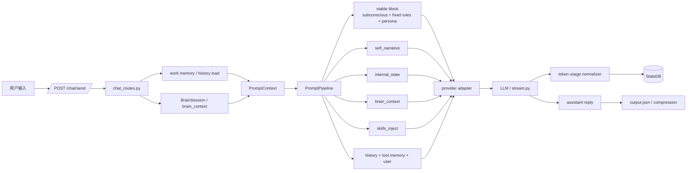
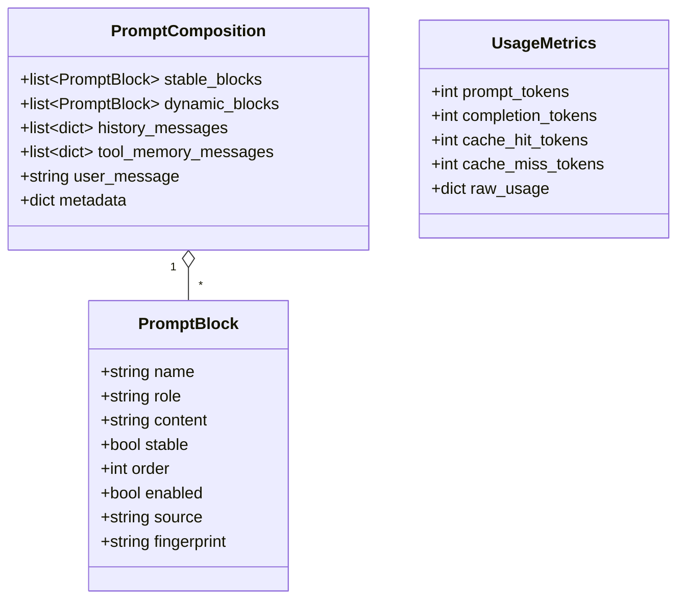
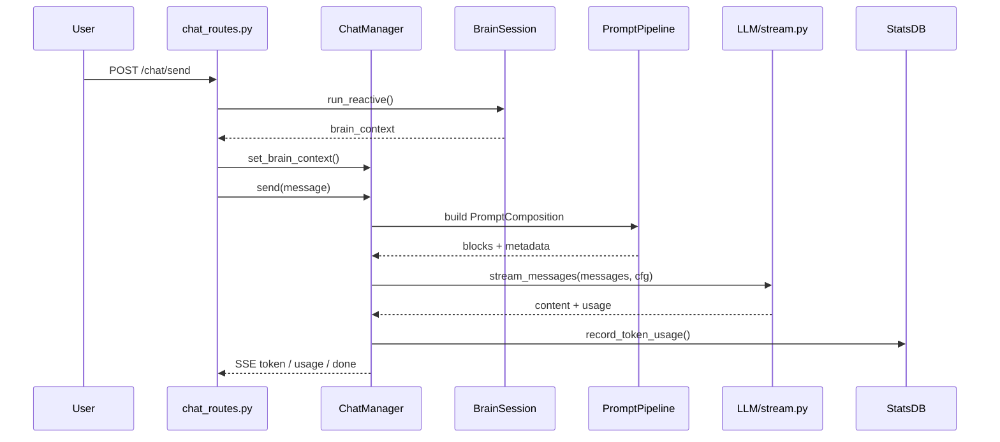
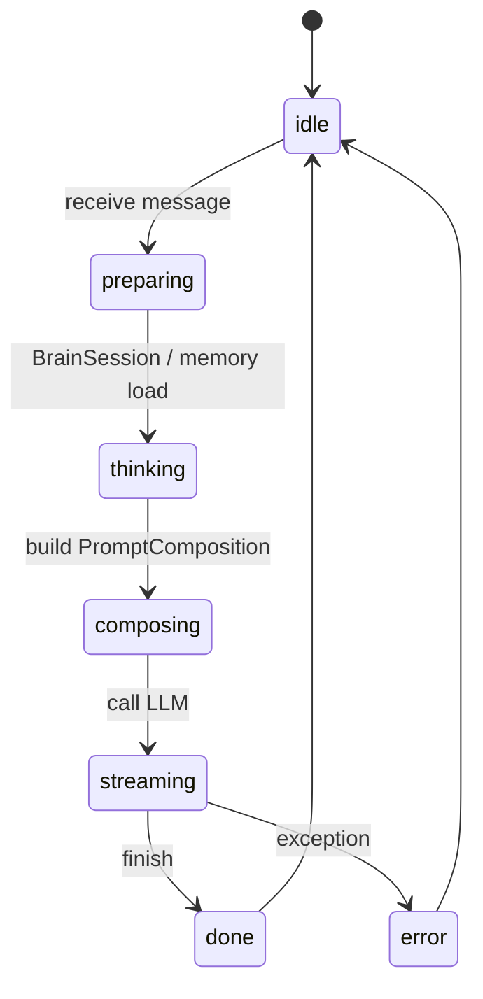

# Chat 上下文块重构

## 一、项目目标

- 项目名称：Chat 上下文块重构
- 一句话描述：把 chat 的单一 system prompt 拆成“稳定主前缀 + 多个独立上下文块”，降低前缀抖动并提升 prompt cache 命中率。
- 核心目标：
  - 首个 system 前缀保持稳定，只承载 `subconscious`、固定规则和基础 persona。
  - `self_narrative`、`internal_state`、`brain_context`、`skills_inject` 从混合 prompt 中拆成独立上下文块。
  - 保持现有聊天、历史压缩、工具调用、BrainSession、work memory 的行为不退化。
  - 补齐 token usage 解析，兼容 `prompt_cache_hit_tokens`、`prompt_cache_miss_tokens` 和 `prompt_tokens_details.cached_tokens`。
  - 不新增外部 HTTP API，不新增数据库表，不改变现有接口契约。
- 不做的事：
  - 不重写 BrainSession 的内部策略。
  - 不改聊天对外路由的名称和返回结构。
  - 不把动态脑内状态写进新的持久化表。
  - 不为追求缓存命中而牺牲可读性或调试能力。

## 二、业务背景

- 当前实现里，`backend/modules/chat/loop.py` 会把 `PromptPipeline.run(ctx)` 的输出拼成一个单独的 `system` message，再继续叠加历史、工具记忆和参考信息。
- `backend/modules/chat/pipeline/sections/__init__.py` 里虽然已经有 `subconscious`、`self_narrative`、`internal_state`、`brain_context`、`skills_inject` 等概念，但最终输出仍然是一个合并后的字符串，块边界在发送给模型前被抹平。
- `backend/routes/chat_routes.py` 每次发送前都会运行 BrainSession，`brain_context` 会跟着每轮对话变化，因此把它混进首个 system 内容会让前缀持续抖动。
- `backend/modules/chat/compression/context_compress.py` 可能重写 `output.json`，历史本身也会变化，因此更应该把“稳定的规则前缀”和“会变的上下文”分离。
- `backend/modules/LLM/stream.py` 目前只处理部分 usage 字段，缓存统计容易漏记，尤其是不同 provider 的字段命名并不一致。
- 业务影响：
  - 缓存命中率低，token 成本和首包延迟都会受影响。
  - prompt 拼接逻辑耦合高，后续新增 section 时容易破坏稳定前缀。
  - 调试时很难区分“模型规则”“自我叙述”“脑内状态”“技能注入”分别对输出产生了什么影响。

## 三、功能需求

| ID | 功能需求 | 说明 | 优先级 | 验收要点 |
|---|---|---|---|---|
| F1 | 稳定主前缀 | 首个 system block 只包含稳定规则、`subconscious` 和基础 persona | P0 | 连续多轮对话中，除非规则配置改动，否则该 block 文本保持一致 |
| F2 | 独立上下文块 | `self_narrative`、`internal_state`、`brain_context`、`skills_inject` 各自输出独立 block | P0 | 每个块都有独立名称、来源和顺序，便于单测和日志定位 |
| F3 | 块顺序固定 | block 组装顺序可预测、可测试、可复现 | P0 | 同样输入下，block 顺序与数量稳定，不随运行时细节漂移 |
| F4 | provider 兼容 | OpenAI-compatible 路径支持多个 system message；Anthropic 路径由适配层做确定性序列化 | P0 | 现有 provider 都能正常出答，不出现消息格式错误 |
| F5 | usage 统计补全 | 兼容 `prompt_cache_hit_tokens`、`prompt_cache_miss_tokens`、`prompt_tokens_details.cached_tokens` | P0 | token_usage 记录能覆盖常见 provider 返回格式 |
| F6 | 现有接口不变 | 现有 chat 路由、SSE 事件和返回结构保持兼容 | P0 | 前端与已有脚本无需改接口即可继续使用 |
| F7 | 历史与记忆继续可用 | `output.json` 历史、tool memory、work memory、BrainSession 保持原行为 | P0 | 聊天、压缩、回放、主动消息不因重构而失效 |

## 四、非功能需求

- 性能：
  - prompt 组装只做内存拼装，不新增网络请求，不新增额外磁盘写入。
  - 单轮消息编排目标控制在毫秒级，不能引入用户可感知的等待。
  - 在本地回归样例中，重构前后流式输出速度不应出现明显退化。
- 安全：
  - 稳定前缀中不得混入 API key、文件路径等敏感值。
  - 动态块继续视为普通 prompt 数据处理，不新增对外暴露面。
- 可维护性：
  - 每个 section 独立成块后，能够单独禁用、单独测试、单独定位日志。
  - 组合逻辑和 provider 序列化逻辑分层，避免继续堆在 `loop.py` 里。
- 可观测性：
  - 至少记录 block 名称、顺序、长度和最终消息数。
  - usage 解析失败时要有清晰日志，但不能中断主流程。
- 兼容性：
  - 保持当前 Flask 路由和 SSE 事件名不变。
  - 对于不支持多 system 语义的 provider，适配层要做确定性降级，不让业务代码感知差异。

## 五、系统架构



### 技术栈与职责

| 组件 | 现有位置 | 职责 | 本次改动 |
|---|---|---|---|
| Flask 路由 | `backend/routes/chat_routes.py` | 接收 `/chat/send`，调度 BrainSession，返回 SSE | 保持不变，只调整入参到消息编排层的调用方式 |
| Chat 主循环 | `backend/modules/chat/loop.py` | 历史加载、work memory、LLM 调用、压缩触发 | 从“单一 system 字符串”改成“结构化 block 列表” |
| Prompt 上下文 | `backend/modules/chat/pipeline/context.py` | 传递 user、memory、metadata | 扩充为 composition 友好的上下文对象 |
| Prompt 流水线 | `backend/modules/chat/pipeline/__init__.py` | 注册并执行 section | 改成输出结构化 block，而不是只返回单字符串 |
| Section 目录 | `backend/modules/chat/pipeline/sections/` | 产出 `subconscious`、`self_narrative` 等内容 | 明确稳定块与动态块边界 |
| LLM 流式层 | `backend/modules/LLM/stream.py` | provider 分发、usage 解析、token 记录 | 补全 cache 字段解析与统一归一化 |
| Work memory | `backend/modules/brain/memory/workmemory/` | `output.json` 读写 | 继续沿用，不改存储格式 |
| Token 统计 | `core.database.StatsDB` | 持久化 token usage | 继续复用已有表结构，只补充写入字段 |

### 目录结构建议

```text
backend/
  modules/
    chat/
      loop.py
      pipeline/
        __init__.py
        context.py
        composition.py        # 新增：PromptBlock / PromptComposition
        sections/
          __init__.py
          subconscious.py
          self_narrative.py
          internal_state.py
          brain_context.py
          skills_inject.py
          memory.py
          association_recall.py
    LLM/
      stream.py
  routes/
    chat_routes.py
tests/
  chat/
    test_prompt_composition.py
    test_usage_normalizer.py
    test_chat_send_sse.py
```

### 关键设计决策

- 多个 `system` message 可以保留在内部消息模型里，OpenAI-compatible 路径直接发送多个 system block。
- 对于 Anthropic 等 provider，内部 block 不能简单丢弃，必须由适配层做确定性序列化。
- 稳定主前缀放在最前，只包含真正长期不变的内容。
- 动态 section 作为独立 block 输出，顺序固定，便于缓存和测试。
- 不新增数据库表，所有 block 都是运行时结构，只有 token usage 继续落现有统计表。

## 六、数据结构

> 说明：本次重构不新增数据库表，以下都是内存态/消息态逻辑结构。

### 核心实体

| 实体 | 字段 | 类型 | 说明 | 约束 |
|---|---|---|---|---|
| `PromptBlock` | `name` | `str` | block 名称，如 `subconscious`、`brain_context` | 全局唯一，便于日志和测试 |
| `PromptBlock` | `role` | `str` | `system` / `user` / `assistant` / `tool` | 本次主要用于 `system` block |
| `PromptBlock` | `content` | `str` | block 文本内容 | 允许为空，空块可跳过 |
| `PromptBlock` | `stable` | `bool` | 是否属于稳定前缀 | `subconscious` 及固定规则为 `true` |
| `PromptBlock` | `order` | `int` | 块序号 | 必须固定且可测试 |
| `PromptBlock` | `enabled` | `bool` | 是否参与组装 | 便于按配置开关 |
| `PromptBlock` | `source` | `str` | 来源模块或函数 | 用于排障 |
| `PromptBlock` | `fingerprint` | `str` | 内容摘要或 hash | 便于缓存对比与调试 |
| `PromptComposition` | `stable_blocks` | `list[PromptBlock]` | 稳定块集合 | 顺序固定 |
| `PromptComposition` | `dynamic_blocks` | `list[PromptBlock]` | 动态块集合 | 顺序固定 |
| `PromptComposition` | `history_messages` | `list[dict]` | 历史对话 | 与 `output.json` 一致 |
| `PromptComposition` | `tool_memory_messages` | `list[dict]` | 最近一次 tool loop 记忆 | 不落盘 |
| `PromptComposition` | `user_message` | `str` | 当前输入 | 必填 |
| `PromptComposition` | `metadata` | `dict` | 调试、统计、provider 信息 | 可扩展 |
| `UsageMetrics` | `prompt_tokens` | `int` | prompt 总 token | 必填，缺失时记 0 |
| `UsageMetrics` | `completion_tokens` | `int` | completion token | 必填，缺失时记 0 |
| `UsageMetrics` | `cache_hit_tokens` | `int` | 缓存命中 token | 来自多种字段映射 |
| `UsageMetrics` | `cache_miss_tokens` | `int` | 缓存未命中 token | 可从 provider 直接拿到或推导 |
| `UsageMetrics` | `raw_usage` | `dict` | 原始 usage 响应 | 便于排障与回归 |

### 逻辑关系



### 索引与哈希策略

- `PromptBlock.fingerprint` 建议用内容 hash 或短摘要，便于比较“哪个块变了”。
- 统计层继续使用现有 `StatsDB`，不新增表索引。
- 历史仍按 `output.json` 的 `seq` 和 `time` 组织，不修改文件结构。
- 如果 provider 只返回 `cached_tokens`，可通过 `prompt_tokens - cached_tokens` 推导未命中值，前提是总 token 已知且结果非负。

## 七、流程设计

### 主流程



### 组装顺序

1. `/chat/send` 收到用户消息后，先检查 API key 和运行状态。
2. `chat_routes.py` 先跑 BrainSession，把最新 `brain_context` 放进 ChatManager。
3. `ChatManager` 读取 work memory，必要时加载历史并触发重载检查。
4. `PromptPipeline` 根据 `PromptContext` 生成 `PromptComposition`，输出多个独立 block。
5. `loop.py` 按固定顺序组装消息：
   - 稳定主前缀 block。
   - 历史对话。
   - tool memory。
   - 动态上下文 block。
   - 当前用户消息。
6. provider adapter 将内部结构序列化为 OpenAI-compatible 或 Anthropic 可用的格式。
7. `stream.py` 从流式响应中提取正文和 usage。
8. `StatsDB` 写入 prompt/completion/cache 统计。
9. 回复结束后，历史写回 work memory，并触发压缩检查。

### 异常流程

- 如果某个 section 渲染失败：
  - 非必需 section 记录 warning 并跳过。
  - 必需 section 直接抛错，避免发出错误 prompt。
- 如果 usage 里没有缓存字段：
  - 仍保留 prompt/completion token。
  - cache 相关字段记 0，并写日志说明 provider 未返回。
- 如果 BrainSession 失败：
  - 继续走普通聊天，不让脑内状态阻塞主链路。
- 如果历史重载或压缩失败：
  - 不影响当前轮对话，最多回退到现有内存历史。

### 状态流转



## 八、API设计

> 本次不新增外部 HTTP API，只记录受影响的现有接口和内部接口。

### 现有 HTTP 接口

| 方法 | 路径 | 请求参数 | 响应 | 备注 |
|---|---|---|---|---|
| `POST` | `/chat/send` | JSON：`{"message": string}` | SSE：`start` / `memory_step` / `token` / `token_estimate` / `usage` / `done` / `error` | 主改造点，消息组装逻辑会变 |
| `GET` | `/chat/messages` | 无 | `{"messages":[...]}` | 仍从 `stats_db` 读取 |
| `GET` | `/chat/history` | 无 | `{"messages":[...]}` | 仍从 `output.json` 读取 |
| `GET` | `/chat/state` | 无 | 状态对象 + `brain` 摘要 | 仅展示，不改接口 |
| `POST` | `/chat/clear` | 无 | `{"ok": true}` | 清空对话消息 |
| `POST` | `/chat/proactive` | 无 | `{"sent": bool, "content": string|null, ...}` | 主动消息，不改接口 |

### `POST /chat/send` 事件说明

| 事件类型 | 字段 | 说明 |
|---|---|---|
| `start` | `type` | SSE 开始事件 |
| `memory_step` | `step` / `detail` | 记忆搜索或图扩散过程 |
| `token` | `content` | 流式正文片段 |
| `token_estimate` | `prompt_tokens` | 模型返回的 prompt token 估计值 |
| `usage` | `prompt_tokens` / `completion_tokens` | 本轮 usage 统计 |
| `done` | `type` | 流结束 |
| `error` | `message` | 错误信息 |

### 内部接口

| 函数/方法 | 期望签名 | 说明 |
|---|---|---|
| `PromptPipeline.build()` | `build(ctx) -> PromptComposition` | 由“返回字符串”改为“返回结构化 block” |
| `PromptComposition.render()` | `render(provider) -> list[dict]` | 为不同 provider 生成最终消息序列 |
| `UsageNormalizer.normalize()` | `normalize(raw_usage, provider) -> UsageMetrics` | 统一不同 provider 的 usage 字段 |
| `stream.py` usage 解析 | 内部函数 | 补齐 `prompt_cache_hit_tokens`、`prompt_cache_miss_tokens`、`prompt_tokens_details.cached_tokens` |

### 错误码

- `400`：空消息。
- `503`：缺少 API key。
- `500`：内部异常、provider 调用失败、历史/压缩/记忆加载异常。

## 九、验收标准

### 功能验收

1. 连续两轮或多轮对话中，只要稳定配置不变，首个 stable block 文本完全一致。
2. `self_narrative`、`internal_state`、`brain_context`、`skills_inject` 在最终消息里以独立 block 形式出现，顺序固定。
3. `brain_context` 每轮变化时，不会把稳定主前缀一起带着抖动。
4. OpenAI-compatible provider 可以收到多个 `system` message，且消息顺序与 block 顺序一致。
5. Anthropic provider 仍可正常出答，不出现消息格式报错。
6. `/chat/send` 的 SSE 事件顺序和字段结构与现有前端兼容。
7. `output.json` 被压缩或重写后，下一轮聊天仍能正确恢复历史。

### 统计与性能验收

1. `stream.py` 能至少识别以下三类缓存字段来源：
   - `prompt_cache_hit_tokens`
   - `prompt_cache_miss_tokens`
   - `prompt_tokens_details.cached_tokens`
2. 如果 provider 只返回 `cached_tokens`，统计层仍能写入 `cache_hit_tokens`。
3. 没有额外数据库表迁移。
4. 没有新增外部 HTTP 接口。
5. prompt 组装阶段不引入明显性能回退，目标是本地基准下保持毫秒级内存拼装。

### 安全与交付验收

1. 稳定前缀不包含敏感信息。
2. 日志能区分 block 名称和来源，但不额外泄露 API key。
3. 相关单测通过。
4. 后端重启后，等待模型 warm-up 完成再测 chat 回归，避免把启动期日志误判为功能异常。

## 十、开发任务拆分

| 任务 ID | 任务名称 | 依赖 | 复杂度 | 所属模块 | 对应需求 |
|---|---|---|---|---|---|
| T001 | 定义 `PromptBlock`、`PromptComposition`、`UsageMetrics` 结构 | - | M | `backend/modules/chat/pipeline/` | F1, F2, F5 |
| T002 | 增加 block 序列化与 provider 适配接口 | T001 | M | `backend/modules/chat/pipeline/`、`backend/modules/LLM/` | F3, F4 |
| T003 | 把 `PromptPipeline` 从“返回字符串”改成“返回结构化 composition” | T001, T002 | M | `backend/modules/chat/pipeline/__init__.py` | F1, F2, F3 |
| T004 | 拆分 `subconscious` 稳定主前缀与动态 section 输出边界 | T003 | S | `backend/modules/chat/pipeline/sections/` | F1 |
| T005 | 将 `self_narrative`、`internal_state`、`brain_context`、`skills_inject` 改成独立 block | T003 | M | `backend/modules/chat/pipeline/sections/` | F2, F3 |
| T006 | 重写 `backend/modules/chat/loop.py` 的消息组装逻辑 | T003, T004, T005 | L | `backend/modules/chat/loop.py` | F1, F2, F3, F6, F7 |
| T007 | 更新 `backend/modules/LLM/stream.py` 的 usage/cached token 解析 | T006 | S | `backend/modules/LLM/stream.py` | F5 |
| T008 | 增加 block 顺序、稳定前缀、历史压缩后重载的单测 | T006 | M | `tests/chat/` | F1, F2, F3, F7 |
| T009 | 增加 usage 解析与 `StatsDB` 写入的单测 | T007 | M | `tests/chat/` | F5 |
| T010 | 联调 `/chat/send` SSE 回归，确认前端和既有脚本兼容 | T006, T007, T008, T009 | M | `backend/routes/chat_routes.py`、测试层 | F4, F6, F7 |

### 并行建议

- T004 和 T005 可以在 T003 之后并行推进。
- T008 和 T009 可以在 T006/T007 完成后并行推进。
- 如果需要更稳妥的灰度，可以先完成 T001-T007，再做 T008-T010 的回归。
