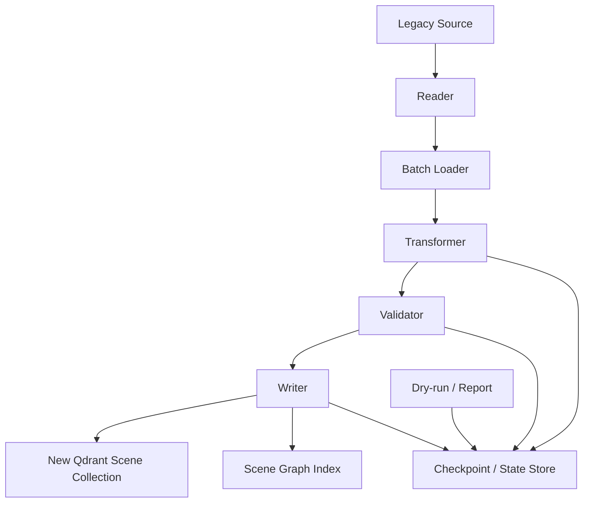
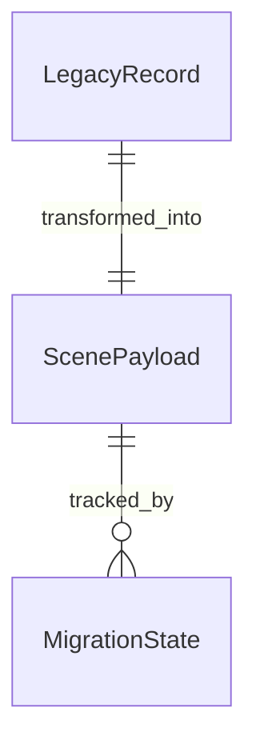
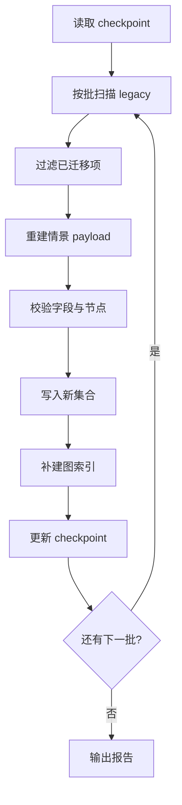

# 一、项目目标

项目名称：旧记忆到情景记忆的迁移脚本

一句话描述：编写一套可重复执行、可断点续跑、可回放验证的迁移脚本，把旧记忆源中的文本记忆统一转换为新的结构化情景记忆，并写入 Qdrant 新集合与新情景图索引。

核心目标：

1. 将旧记忆批量转换为新情景 payload，补齐 `display_text / episodic / nodes / affect / importance`。
2. 支持从旧 Qdrant 集合、旧图数据库或其他 legacy 来源读取记忆，并统一迁移到新记忆体系。
3. 迁移过程必须幂等，脚本重复执行不会制造重复数据或破坏新集合内容。
4. 迁移过程必须可中断恢复，支持 checkpoint、resume 和失败重试。
5. 迁移完成后，新情景记忆可以直接参与新的情景图扩散与检索。

不做的事：

1. 不在迁移脚本里修改在线聊天主流程。
2. 不默认删除旧记忆源数据。
3. 不把迁移脚本设计成常驻服务。
4. 不把旧实体图继续当作主迁移目标。
5. 不把迁移结果仅仅写成普通文本，而是必须写成新情景结构。

# 二、业务背景

当前项目已经具备新的情景记忆主存储能力，Qdrant 中的 payload 结构已经可以承载：

- `text`
- `embedding_text`
- `episodic { what, why, result, lesson[] }`
- `nodes [{ name, type }]`
- `affect`
- `importance`
- `category`
- `user_id`
- `created_at`

但是历史数据仍然分散在旧记忆源里，常见情况包括：

1. 旧 Qdrant 集合中的纯文本记忆或半结构化记忆。
2. 旧图数据库 `memory_graph.db` 中依赖 `memory_nodes / mentions / entity_relations` 的历史记忆。
3. 旧的迁移/补网脚本只是在旧体系内部搬运，并没有转换为新的情景记忆形态。

现状问题：

1. 老记忆如果不迁移，新的情景图扩散就会缺少历史样本。
2. 旧文本型记忆缺少 `episodic` 和 `nodes`，无法和新记忆在同一规则下召回。
3. 老脚本如果只做“复制文本”，会导致新旧数据结构长期混杂。
4. 手工重写旧记忆量太大，不适合人工迁移。

预期价值：

1. 保留历史记忆资产。
2. 让新情景图可以把过去的经验、项目线索、情绪线索纳入召回。
3. 为后续“旧图退场”提供平滑过渡。
4. 让迁移过程本身成为可验证、可回滚、可审计的工程能力。

# 三、功能需求

| 编号 | 功能名称 | 用户故事 | 优先级 | 备注 |
|---|---|---|---|---|
| FR-001 | 扫描旧记忆源 | 作为系统，我希望能分页扫描旧 Qdrant 集合和旧图数据 | P0 | 支持大批量迁移 |
| FR-002 | 情景重建 | 作为系统，我希望把旧文本转换成新的情景 payload | P0 | 生成 `display_text/episodic/nodes/affect/importance` |
| FR-003 | 节点规范化 | 作为系统，我希望旧实体名被规范化到统一节点 | P0 | 复用节点去重规则 |
| FR-004 | 写入新集合 | 作为系统，我希望迁移结果写入 `aibrain_memories` | P0 | 保留 `origin.legacy_id` |
| FR-005 | 图索引补建 | 作为系统，我希望迁移后能补建情景锚点与场景关系 | P0 | 支持新扩散 |
| FR-006 | 幂等执行 | 作为运维，我希望脚本重复执行不会重复迁移 | P0 | 通过映射/状态文件控制 |
| FR-007 | 断点续跑 | 作为运维，我希望脚本中断后可从 checkpoint 继续 | P0 | 适合长任务 |
| FR-008 | Dry-run | 作为开发者，我希望先看迁移预估，不真正写入 | P0 | 便于抽样验证 |
| FR-009 | 失败重试 | 作为系统，我希望失败项进入重试队列 | P1 | 支持按批重试 |
| FR-010 | 迁移报告 | 作为开发者，我希望得到迁移统计和样本对照 | P0 | 输出总数、成功率、失败原因 |
| FR-011 | 迁移兼容 | 作为系统，我希望迁移完成后旧记忆仍可保留或按策略保留 | P0 | 默认不删除源数据 |
| FR-012 | 迁移验证 | 作为开发者，我希望能验证新记忆是否可被新图召回 | P1 | 回放测试用 |

# 四、非功能需求

性能要求：

1. 脚本必须按批次处理，避免一次性把所有旧记忆加载进内存。
2. 迁移任务默认不得阻塞聊天主流程，建议作为离线任务执行。
3. 批大小应可配置，默认建议 50 到 200 条。
4. 当 legacy 数据量较大时，应支持分段执行与多次恢复。

稳定性要求：

1. 单条记忆转换失败不得影响整个批次。
2. 同一条 legacy 记忆重复迁移时，结果必须一致或被识别为重复。
3. 迁移脚本应能处理旧数据缺字段、字段为空、文本异常等情况。
4. 迁移失败必须可追踪，不能静默吞掉。

安全与兼容要求：

1. 默认只读 legacy 源，不删除原始数据。
2. 写入新集合前必须先完成校验，避免脏数据进入主库。
3. 迁移脚本在运行前后都应有日志和报告。
4. 若启用 LLM 辅助重建情景，只能作为增强手段，不应阻塞基础迁移。

可维护性要求：

1. 迁移逻辑拆成 reader / transformer / validator / writer / checkpoint 五层。
2. 迁移脚本与在线检索逻辑解耦。
3. 迁移策略应可版本化，便于未来二次修正。
4. 所有输出字段和策略应能通过样本回放验证。

# 五、系统架构



技术选型：

| 模块 | 方案 | 理由 |
|---|---|---|
| 旧数据读取 | QdrantClient + SQLite 读取 | 兼容 legacy 旧集合和旧图 |
| 情景重建 | 复用现有情景编码规则 | 让迁移结果与新写入保持一致 |
| 节点规范化 | 复用节点去重/别名规则 | 避免同义节点分裂 |
| 新集合写入 | `aibrain_memories` | 与新系统统一 |
| 状态持久化 | JSON 或轻量本地 SQLite | 便于断点续跑 |
| 报告输出 | Markdown + JSON | 便于人工抽查与自动测试 |

建议目录结构：

```text
backend/modules/brain/
  migrate_scene.py            # 迁移核心逻辑
backend/scripts/
  migrate_legacy_scene.py     # CLI 入口（可选）
1-logs/
  migrations/
    legacy_scene/
      checkpoint.json
      report.json
      samples.jsonl
```

关键设计决策：

1. 迁移脚本输出必须是情景记忆，不是旧文本复制。
2. `origin.legacy_id` 必须写入新 payload，作为幂等识别依据。
3. 旧源数据默认不删，先验证新数据可用再考虑清理。
4. 迁移脚本要允许不同策略版本共存，避免一次性锁死实现。

# 六、数据结构

核心数据实体：

| 实体 | 字段 | 类型 | 说明 |
|---|---|---|---|
| LegacyRecord | legacy_id | string | 旧记忆主键 |
| LegacyRecord | raw_text | string | 旧文本内容 |
| LegacyRecord | legacy_payload | object | 旧 payload 或 metadata |
| ScenePayload | text | string | 新记忆展示文本 |
| ScenePayload | display_text | string | 情景标题 |
| ScenePayload | embedding_text | string | 嵌入源文本 |
| ScenePayload | episodic | object | `what/why/result/lesson` |
| ScenePayload | nodes | array | 锚点列表 |
| ScenePayload | affect | object | 情绪信息 |
| ScenePayload | importance | float | 重要性 |
| ScenePayload | origin | object | `legacy_id/source/version/confidence` |
| MigrationState | job_id | string | 迁移任务标识 |
| MigrationState | checkpoint | object | 批次偏移、已处理 ID、失败列表 |
| MigrationState | status | string | running / paused / finished / failed |

实体关系：



索引策略：

1. `origin.legacy_id` 必须可用于幂等检查。
2. `MigrationState.job_id` 需要唯一。
3. `MigrationState.checkpoint` 需要保存最后成功批次或最后处理的 legacy id。
4. 若迁移结果落库到辅助状态表，`legacy_id` 应有唯一约束。

数据量预估：

1. 迁移数量取决于旧集合大小，通常应支持上千到上万条。
2. checkpoint 文件不应记录全部大文本，只记录必要状态。
3. 样本报告只保留抽样项，避免报告过大。

# 七、流程设计

## 批量迁移流程



## 单条记忆转换流程

1. 读取旧文本和旧 metadata。
2. 生成或补全 `display_text`。
3. 从旧内容提取 `episodic`，至少保证 `what` 和 `result` 不为空时可用。
4. 重建 `nodes`，优先使用旧实体和旧图信息，缺失时用保守规则补全。
5. 根据文本语气、正负向、长度和上下文推导 `affect` 与 `importance`。
6. 组装 `origin.legacy_id` 与 `migration_version`。
7. 写入新 Qdrant 集合并补图索引。

## 异常流程

1. 旧文本为空或损坏时，跳过并记录失败原因。
2. 某条记忆的情景重建失败时，降级为最小情景结构继续迁移。
3. 写入新集合失败时，记录重试队列，不影响后续批次。
4. 图索引失败时，新集合写入仍算成功，后续可补建。
5. 断点恢复时，优先读取 checkpoint 恢复到最近成功批次。

# 八、API设计

这里的“API”主要指脚本对外暴露的 CLI 和内部函数接口。

## CLI 接口

| 参数 | 类型 | 必填 | 说明 |
|---|---|---|---|
| `--source` | string | 否 | legacy 来源集合或来源类型，默认自动识别 |
| `--target` | string | 否 | 目标集合，默认 `aibrain_memories` |
| `--batch-size` | int | 否 | 单批处理数量，默认 100 |
| `--dry-run` | bool | 否 | 只生成报告，不写入 |
| `--resume` | bool | 否 | 从 checkpoint 恢复 |
| `--limit` | int | 否 | 只处理前 N 条，便于抽样测试 |
| `--mode` | string | 否 | `deterministic` / `enhanced` |
| `--checkpoint` | string | 否 | checkpoint 文件路径 |
| `--report` | string | 否 | 输出报告路径 |
| `--ids-file` | string | 否 | 指定只迁移某些 legacy id |

## 内部函数接口

```python
migrate_legacy_memories(
    source_collection: str,
    target_collection: str,
    batch_size: int = 100,
    dry_run: bool = False,
    resume: bool = True,
    mode: str = "deterministic",
    limit: int | None = None,
) -> dict
```

## 输出示例

```json
{
  "job_id": "legacy_scene_20260622_001",
  "total": 1280,
  "migrated": 1247,
  "skipped": 23,
  "failed": 10,
  "dry_run": false,
  "checkpoint": {
    "last_legacy_id": "abcd-1234",
    "batch_index": 12
  }
}
```

错误码建议：

1. `400`：参数错误或路径不存在。
2. `409`：已有同一 job 正在运行。
3. `422`：数据可读但无法转换为最小情景结构。
4. `500`：读取、写入或 checkpoint 持久化异常。

# 九、验收标准

功能验收：

1. `dry-run` 能输出迁移预估，不写入新集合。
2. 全量迁移后，新集合中能看到带 `origin.legacy_id` 的情景记忆。
3. 同一批 legacy 数据重复跑两次，不会产生重复的新记忆。
4. 迁移中断后再次运行，能从 checkpoint 继续，不重复处理已完成项。
5. 迁移后的记忆可以被新的情景检索与图扩散命中。

稳定性验收：

1. 单条失败不会终止整个任务。
2. 失败记录会进入报告和重试清单。
3. 旧源数据默认保持不变。
4. 迁移脚本不会影响聊天主流程和在线检索。

性能验收：

1. 批处理执行速度在可接受范围内，且不会占满系统资源。
2. checkpoint 更新频率合理，不会因为过于频繁而拖慢任务。
3. 报告输出大小可控，适合审查。

交付物清单：

1. 迁移脚本核心实现。
2. CLI 启动入口。
3. checkpoint 文件格式说明。
4. 迁移报告样例。
5. 回放验证结果。

# 十、开发任务拆分

| 任务 ID | 任务名称 | 依赖 | 复杂度 | 所属模块 | 对应需求 |
|---|---|---|---|---|---|
| T001 | 梳理 legacy 数据源 | 无 | S | 文档/审计 | FR-001, FR-011 |
| T002 | 定义迁移状态与 checkpoint 格式 | T001 | M | migrate_scene | FR-006, FR-007 |
| T003 | 实现 legacy reader | T001 | M | migrate_scene | FR-001 |
| T004 | 实现情景重建 transformer | T001 | L | migrate_scene | FR-002, FR-003 |
| T005 | 实现 writer 与幂等检查 | T002, T004 | L | migrate_scene | FR-004, FR-006 |
| T006 | 实现图索引补建 | T004, T005 | M | scene_graph | FR-005 |
| T007 | 实现 dry-run 与报告输出 | T002, T004, T005 | M | migrate_scene | FR-008, FR-010 |
| T008 | 实现失败重试与 resume | T002, T005 | M | migrate_scene | FR-007, FR-009 |
| T009 | 添加迁移样本回放测试 | T004, T005, T006 | M | tests | FR-012 |
| T010 | 编写运维说明与执行手册 | T007, T008, T009 | S | docs | FR-010, FR-012 |

并行建议：

1. T003、T004 可以并行推进。
2. T005、T006 在输出结构稳定后串并结合开发。
3. T007、T008、T009 可以在主链路完成后并行补齐。
4. T010 应在样本验证通过后完成。
