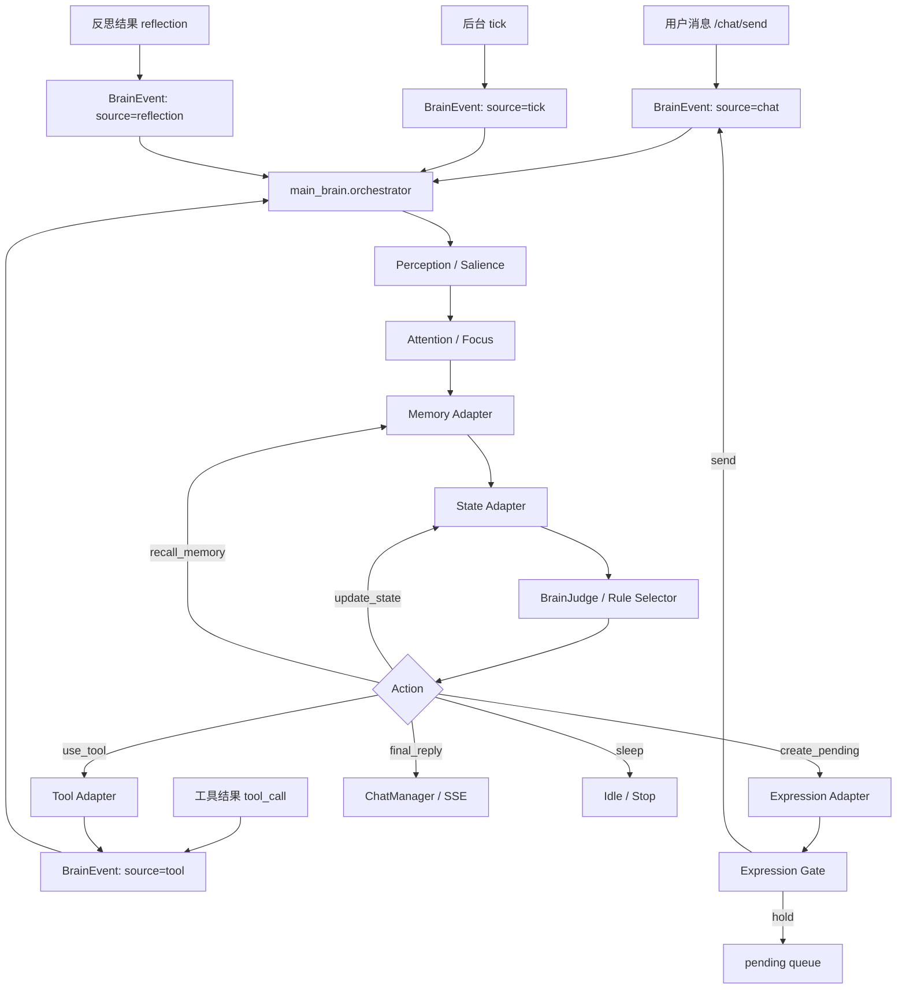
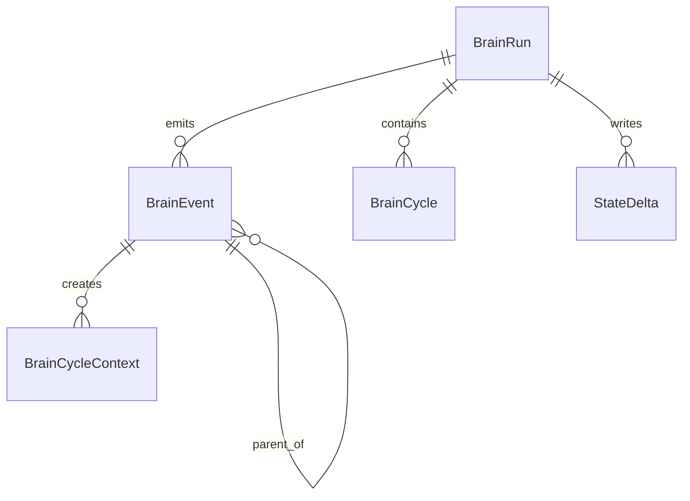
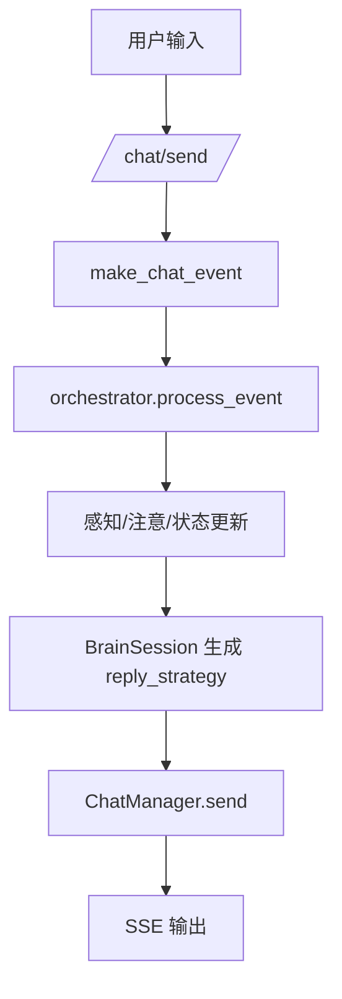
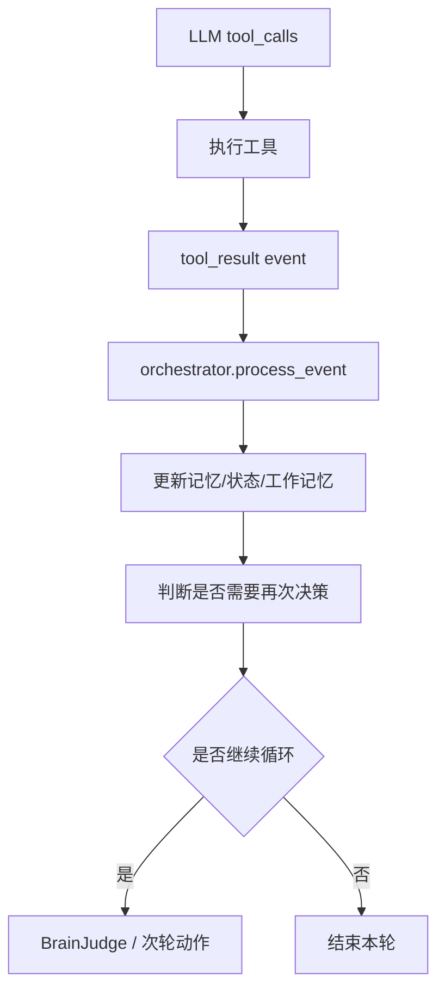
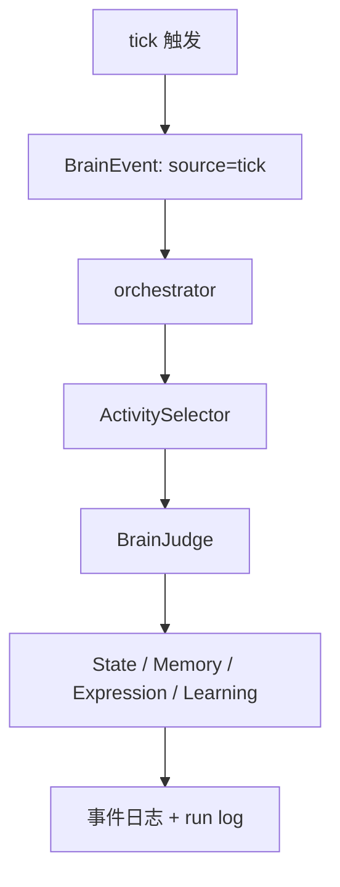

# 一、项目目标

项目名称：main_brain 统一事件回路重构

一句话描述：把当前分散的 `BrainSession`、`LifeLoopDaemon`、`chat/loop.py` 和工具结果处理，统一成一个“事件驱动的大脑回路”，让用户输入、工具结果、后台 tick、反思结果都能变成同一种 `BrainEvent`，并重新进入同一个中枢处理。

核心目标：

1. 建立统一事件契约 `BrainEvent`，让 `user_message`、`tool_result`、`tick`、`reflection_result`、`system_signal` 都能走同一条入口。
2. 建立统一编排器 `orchestrator`，让感知、注意、记忆、状态、决策、表达、反馈都经过同一个循环。
3. 让工具调用结果不只停留在旧的 chat tool loop 里，而是回灌成事件，触发下一轮大脑重新评估。
4. 让后台 tick 和前台聊天共用同一套状态更新、记忆写入、run log 和错误处理方式。
5. 保留现有 `/chat/send`、`ChatManager.send()`、`PromptPipeline` 和 SSE 输出，第一版以兼容和可回滚为优先。
6. 让系统更接近“人脑式闭环”：任何输出都能成为下一次输入，任何结果都能改变下一轮内部状态。

不做的事：

1. 不在第一版强行替换现有 `modules/chat/loop.py` 的全部 LLM 生成逻辑。
2. 不重构 `modules/brain/memory`、`modules/brain/state` 的底层存储结构。
3. 不做完整多模态大脑，不把视觉、音频、文件监听一次性全接进来。
4. 不追求一次性实现 AGI，只做可观测、可回滚、可持续迭代的事件回路底座。

# 二、业务背景

当前 AiBrain 已经具备聊天、记忆、工具调用、状态层、反思和后台节奏，但这些能力彼此之间仍然是“串联的功能模块”，而不是“统一的脑内回路”。

现状大致是：

1. `/chat/send` 会先跑 `BrainSession.run_reactive(user_msg)`，然后仍然进入旧的 `ChatManager.send()` / `chat/loop.py` 生成回复。
2. `chat/loop.py` 里如果触发 `tool_calls`，工具执行和后续 LLM 继续推理都仍然停留在 chat 循环内部。
3. `LifeLoopDaemon` 的后台 tick 是另一套调度体系，虽然会更新状态和反思，但与前台聊天链路没有统一事件总线。
4. 现在的大脑更像“前置思考 + 旧聊天执行”的组合，而不是“每个结果都能回到中枢再次影响下一步”的闭环。

问题与痛点：

1. 工具结果无法自然地回到大脑中心，导致“想了什么、做了什么、结果如何”之间断裂。
2. 用户输入、工具输出、后台 tick、反思结果使用不同的数据形态，不利于统一调试和回放。
3. 事件流不统一时，很难模拟人类那种“边想边做边修正”的递归回路。
4. 后续如果要接入更多输入源，比如视觉、剪贴板、文件变化、外部系统事件，会继续碎片化。

预期价值：

1. 形成统一的“大脑刺激入口”，减少模块各自为政。
2. 让每轮输出都能重新变成下一轮输入，建立更像人类的反馈回路。
3. 让调试和可观测性更强，方便追踪一条事件从输入到反馈的全过程。
4. 为后续扩展多模态输入、主动行动、长期学习打下统一底座。

# 三、功能需求

| 编号 | 功能名称 | 用户故事 | 优先级 | 备注 |
|---|---|---|---|---|
| FR-001 | 统一事件契约 | 作为系统，我希望所有刺激都能被包装成 `BrainEvent` | P0 | 覆盖 chat / tool / tick / reflection / system |
| FR-002 | 统一编排器 | 作为系统，我希望所有事件都进入同一个 orchestrator | P0 | 负责感知、注意、记忆、状态、决策、反馈 |
| FR-003 | 用户输入入脑 | 作为用户，我发送消息后，希望它先成为脑内事件再进入回复链路 | P0 | `/chat/send` 先入事件再保持现有 SSE 回复 |
| FR-004 | 工具结果回灌 | 作为系统，我希望 LLM 工具调用结果能变成新事件继续处理 | P0 | tool result 不再只是 chat loop 的尾部副作用 |
| FR-005 | 后台 tick 统一化 | 作为系统，我希望 background tick 和 chat 共用同一事件结构 | P0 | short/medium/long/daily 都统一成事件 |
| FR-006 | 状态与记忆统一更新 | 作为系统，我希望任何事件都能驱动状态和记忆更新 | P0 | 通过 adapter 路由，不直接改底层模块 |
| FR-007 | BrainContext 统一注入 | 作为 LLM，我希望读取最近事件、状态和未完成目标 | P1 | 替代单次脑内摘要式注入 |
| FR-008 | 反馈链路可观测 | 作为开发者，我希望看到事件 ID、父子事件、状态变化和动作结果 | P0 | run log、event log、state trace |
| FR-009 | 兼容旧聊天循环 | 作为开发者，我希望第一版失败时可回退到旧链路 | P0 | 保留 fallback 开关 |
| FR-010 | 事件回放与调试 | 作为开发者，我希望能回放某个事件链查看处理过程 | P1 | 便于定位“为什么会这么想” |
| FR-011 | 防止死循环 | 作为系统，我希望事件回灌不会无限递归 | P0 | 限制深度、预算、重复事件和 timeout |
| FR-012 | 多输入源扩展 | 作为系统，我希望未来能接入 vision、clipboard、file watcher | P2 | 先预留注册接口 |

# 四、非功能需求

性能要求：

1. 事件入栈和状态标记应尽量在 50ms 级完成，不阻塞 `/chat/send` 的主 SSE 流。
2. 第一版 `BrainEvent` 处理可以只做记录和轻量状态更新，不强制每个事件都触发 LLM。
3. orchestrator 必须支持预算控制，避免工具结果回灌后形成无限链式 LLM 调用。
4. 任一节点失败都必须降级，不能影响聊天回复可用性。

稳定性要求：

1. 用户输入、工具结果、tick、反思结果都要有 `event_id` 和 `parent_id`，便于追踪链路。
2. 事件回路必须可关闭、可降级、可回滚。
3. 任何循环都要有 `max_depth`、`max_cycles`、`timeout` 或 `budget` 上限。
4. 事件处理失败要写日志并产出错误事件，但不要直接把整个系统打崩。

可维护性要求：

1. 新增输入源时，只需要新增 event source adapter，不需要改 chat 主链路。
2. `main_brain` 内部逻辑尽量“判定与执行分离”，LLM 只出建议，Python 负责副作用。
3. 运行日志、事件日志、状态日志要能互相对上。
4. 保持现有模块原位，不做大规模移动和重命名。

体验要求：

1. 用户侧 `SSE` 行为不应因为引入事件层而明显变差。
2. 第一阶段优先“看得见”和“能回退”，其次才是“更像人脑”。
3. 如果某类事件暂时不接管回复，允许只记录、不影响现有行为。

# 五、系统架构



技术选型：

| 模块 | 方案 | 理由 |
|---|---|---|
| 事件契约 | `BrainEvent` + `BrainCycleContext` | 统一所有输入输出形态 |
| 编排层 | `main_brain.orchestrator` | 作为唯一脑内循环入口 |
| 事件路由 | source/type registry | 方便扩展 tool / tick / vision / file |
| 状态接入 | `main_brain.adapters.state` | 继续复用现有 internal_state |
| 记忆接入 | `main_brain.adapters.memory` | 不迁移记忆实现 |
| 工具接入 | `main_brain.adapters.tools` | 白名单工具、安全调用 |
| 反思接入 | `main_brain.reflection` | 反思结果转成事件或状态更新 |
| 日志 | `main_brain.logging.event_log` | 支持事件链回放与追踪 |

推荐目录结构：

```text
backend/main_brain/
  __init__.py
  config.py
  contracts.py
  orchestrator.py
  router.py
  judge.py
  session.py
  daemon.py
  scheduler.py
  controller.py
  activity_selector.py
  expression_gate.py
  adapters/
    __init__.py
    memory.py
    tools.py
    state.py
    expression.py
    learning.py
    output.py
  logging/
    __init__.py
    event_log.py
  reflection/
    __init__.py
    core.py
  narrative/
    __init__.py
    store.py
    steps.py
```

关键设计决策：

1. `BrainSession` 和 `LifeLoopDaemon` 继续存在，但它们变成 orchestrator 的触发器，不再是彼此无关的两套脑循环。
2. `chat/loop.py` 继续负责聊天回复生成，但工具结果必须回灌事件层，不能永久停留在 loop 内部。
3. 第一阶段不强行替换旧链路，只做“旁路接入 + 事件观测 + 回灌闭环”。
4. 后续如果稳定，再考虑把 `chat/loop.py` 的工具执行部分逐步迁入大脑编排层。

# 六、数据结构

## 核心实体

### BrainEvent

| 字段 | 类型 | 说明 | 约束 |
|---|---|---|---|
| id | str | 事件唯一 ID | 必填，全局唯一 |
| parent_id | str | 上游事件 ID | 可空 |
| trace_id | str | 事件链路 ID | 必填，便于串联 |
| source | str | chat / tool / tick / reflection / system / file / vision | 必填 |
| type | str | user_message / tool_result / tick / reflection_result / state_change | 必填 |
| modality | str | text / event / json / image / audio | 必填 |
| content | str | 事件正文 | 必填 |
| timestamp | str | ISO 时间戳 | 必填 |
| salience | float | 注意力分值 | 0-1 |
| metadata | dict | 额外上下文 | 可扩展 |
| raw | any | 原始对象 | 调试用 |

### BrainCycleContext

| 字段 | 类型 | 说明 |
|---|---|---|
| event | BrainEvent | 当前处理事件 |
| perception | dict | 感知结果 |
| attention | dict | 注意力分数、焦点 |
| memory | dict | 召回结果 |
| state | dict | 状态快照 |
| cognition | dict | 决策草案 |
| action | dict | 当前动作或输出 |
| learning | dict | 学习沉淀 |
| feedback | dict | 下游反馈事件 |

### BrainRun

| 字段 | 类型 | 说明 |
|---|---|---|
| run_id | str | 一次执行轨迹 ID |
| mode | str | reactive / background / manual |
| trigger | dict | 触发来源与原始事件 |
| cycles | list | 内部循环记录 |
| stop_reason | str | ready / sleep / timeout / error / fallback |
| finished_at | str | 结束时间 |
| learning_hints | list[str] | 学习线索 |

## 关系图



## 索引策略

1. `BrainEvent.id` 必须唯一索引。
2. `BrainEvent.trace_id` 和 `parent_id` 必须建索引，方便回溯事件链。
3. `BrainEvent.source`、`type`、`timestamp` 建组合索引，方便按来源和时间筛选。
4. `BrainRun.run_id` 建唯一索引，便于查看某次完整循环。

## 数据量预估

1. 如果每次用户消息、tool result、tick、reflection 都产生日志，事件量会比现在明显增加。
2. 第一版建议保留最近 7-30 天事件摘要，完整历史可做归档。
3. 运行日志建议采用 JSONL，避免频繁重写大文件。

# 七、流程设计

## 流程 1：用户输入入脑



## 流程 2：工具结果回灌



## 流程 3：后台 tick



## 异常流程

1. 如果 orchestrator 失败，事件仍然记录为 `error_event`，但聊天主流程继续走旧链路。
2. 如果工具执行失败，工具结果事件标记 `failed=true`，并触发降级决策，而不是让整个循环中断。
3. 如果事件回灌导致重复循环，必须通过 `parent_id`、`trace_id`、`max_depth` 和重复事件去重机制截断。
4. 如果后台 tick 和聊天同时到达，优先保证聊天响应，后台事件降频或延后处理。

## 状态流转

```text
idle -> observing -> focusing -> acting -> feedback -> idle
```

其中：

1. `observing` 表示只记录事件和更新注意力。
2. `focusing` 表示当前事件进入工作记忆和状态层。
3. `acting` 表示触发工具、表达或回复。
4. `feedback` 表示行动结果重新入脑。

# 八、API设计

## 现有接口调整

| 方法 | 路径 | 说明 |
|---|---|---|
| POST | `/chat/send` | 仍是用户主要入口，但内部先包装成 `BrainEvent` |
| GET | `/chat/state` | 增加最近事件、trace_id、当前 focus 和 activity 摘要 |
| POST | `/brain/life/tick` | 手动触发一次 tick，生成 `tick` 事件 |
| POST | `/brain/life/start` | 启动后台循环 |
| POST | `/brain/life/stop` | 停止后台循环 |

## 新增建议接口

| 方法 | 路径 | 说明 |
|---|---|---|
| POST | `/brain/events/ingest` | 统一事件入口，接收 `BrainEvent` |
| GET | `/brain/events/recent` | 获取最近事件列表 |
| GET | `/brain/events/<event_id>` | 查询单个事件详情 |
| GET | `/brain/runs/recent` | 获取最近 BrainRun 摘要 |
| GET | `/brain/runs/<run_id>` | 获取某次运行完整轨迹 |
| POST | `/brain/runs/<run_id>/replay` | 回放某次事件链 |

## `POST /brain/events/ingest` 请求示例

```json
{
  "source": "chat",
  "type": "user_message",
  "modality": "text",
  "content": "帮我看看这个项目怎么改成更像大脑的回路",
  "timestamp": "2026-06-24T10:00:00+08:00",
  "metadata": {
    "session_id": "s_123",
    "chat_id": "c_456"
  }
}
```

## `POST /brain/events/ingest` 响应示例

```json
{
  "ok": true,
  "event_id": "evt_01H...",
  "trace_id": "trace_01H...",
  "run_id": "br_20260624_100000_abcd",
  "accepted": true,
  "deferred": false
}
```

## 错误码

| 错误码 | 含义 |
|---|---|
| invalid_event | 事件格式不合法 |
| event_unsupported | 该 source/type 暂不支持 |
| orchestrator_error | 中枢处理失败 |
| budget_exhausted | 预算耗尽 |
| fallback_used | 已降级到旧链路 |

# 九、验收标准

功能验收：

1. 用户发送一条消息后，系统能生成至少一条 `BrainEvent`，并在日志里看到 `source=chat`。
2. 工具调用产生的结果能被转换成 `tool_result` 或等价事件，并重新进入 orchestrator。
3. 后台 tick、用户输入、工具回灌、反思结果都能在同一条事件链中追踪到。
4. 现有 `/chat/send` 的 SSE 输出不被破坏，必要时可关闭新事件层回到旧链路。
5. `/chat/state` 可以展示最近事件、当前 focus、最近动作和错误摘要。
6. 不会因为事件回灌产生无限递归或工具调用风暴。

稳定性验收：

1. orchestrator 失败时，聊天仍然可用。
2. 工具失败时，系统不会崩溃，只会记录错误事件。
3. 后台 tick 与前台聊天同时发生时，前台响应优先。
4. 连续重复事件会被去重或截断，不会无限反复处理。

可观测性验收：

1. 每个 run 都能找到对应的输入事件、内部 cycle、输出动作和反馈事件。
2. 日志中能清晰看到 `event_id`、`parent_id`、`trace_id`、`run_id`。
3. 开发者可以根据单条事件回放一段处理链路。

# 十、开发任务拆分

| 任务 ID | 任务名称 | 依赖 | 复杂度 | 所属模块 | 对应需求 |
|---|---|---|---|---|---|
| T001 | 定义 `BrainEvent` / `BrainCycleContext` | 无 | S | `main_brain/contracts.py` | FR-001 |
| T002 | 新建 orchestrator 骨架与事件路由 | T001 | M | `main_brain/orchestrator.py` | FR-002 |
| T003 | 为 `/chat/send` 增加事件入脑入口 | T001, T002 | M | `backend/routes/chat_routes.py` | FR-003 |
| T004 | 把 `tool_calls` 结果回灌成事件 | T002, T003 | M | `backend/modules/chat/loop.py` | FR-004 |
| T005 | 统一后台 tick 的事件入口 | T001, T002 | M | `main_brain/daemon.py`, `scheduler.py` | FR-005 |
| T006 | 增加 state / memory / learning 事件适配器 | T002 | M | `main_brain/adapters/*` | FR-006 |
| T007 | 改造 `brain_context` 读取最近事件链 | T003, T006 | S | `backend/modules/chat/pipeline/sections/brain_context.py` | FR-007 |
| T008 | 扩充 run log 与 event log 结构 | T001, T002 | M | `main_brain/logging/event_log.py` | FR-008, FR-010 |
| T009 | 加入 fallback 开关和降级路径 | T002, T003, T004 | S | `main_brain/config.py`, `chat_routes.py` | FR-009, FR-011 |
| T010 | 编写回归测试与事件回放测试 | T001-T009 | M | `tests/`, `backend/main_brain/testing/` | 全部 |

任务顺序建议：

1. 先做 `T001-T002`，把统一事件契约和 orchestrator 骨架搭起来。
2. 再做 `T003-T005`，把用户输入、工具结果、后台 tick 接到同一个入口。
3. 然后做 `T006-T009`，把状态、记忆、日志、降级补齐。
4. 最后做 `T010`，把回归测试和回放验证跑通。

