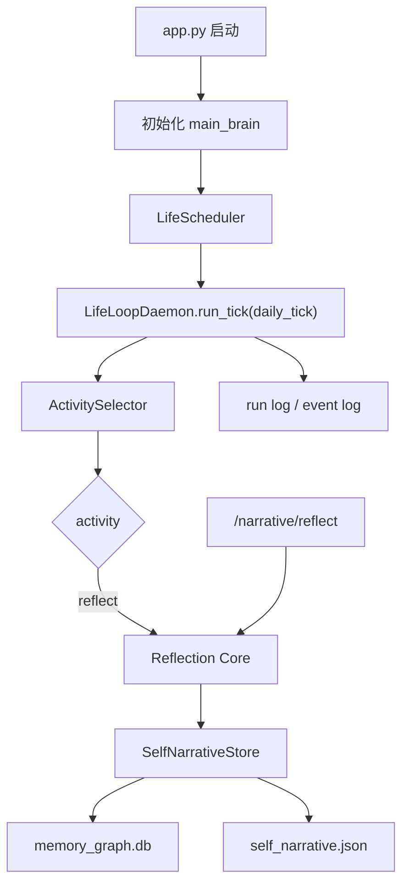
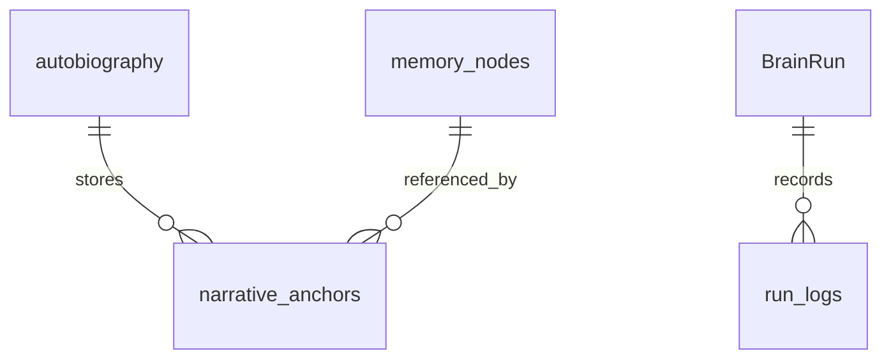
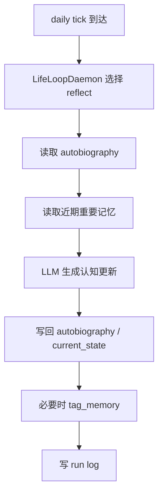

# 一、项目目标

项目名称：反思器并入大脑循环

一句话描述：把当前独立的 self_narrative 每日反思器收进 `main_brain` 常驻循环，让“反思”成为 `LifeLoopDaemon` 的一个正式活动，而不是 `app.py` 里的独立定时线程。

核心目标：

1. 自动反思统一由 `LifeScheduler` / `LifeLoopDaemon` 触发。
2. 手动反思和自动反思共用同一条核心逻辑。
3. 反思结果继续写回 `autobiography`、`current_state`、`narrative_anchors`。
4. 反思运行可在 `main_brain` 的 run log 中观测。
5. 现有聊天链路不受影响，反思失败必须降级。

不做的事：

1. 不改 `memory_graph.db` 的 schema。
2. 不新增独立反思服务。
3. 不重构整个 `main_brain` 架构。

# 二、业务背景

当前反思逻辑分散在两个地方：

1. `backend/app.py` 里有独立的 24h 反思线程。
2. `backend/main_brain` 已经有自己的 scheduler、daemon、activity selector 和 run log。

问题在于：

1. 自动反思不在 brain run 轨迹里，排障困难。
2. 手动反思路由还在调用废弃入口，和真正生效的实现不一致。
3. 反思已经属于“脑内循环”能力，但生命周期却留在 app 层，架构割裂。

预期价值：

1. 反思变成大脑循环中的正式活动，和 `maintain_goal`、`organize_memory` 同级。
2. 自动/手动反思路径合并后，后续更容易扩展为学习、章节回顾、长期目标回看。
3. 运行日志更清晰，方便定位“有没有反思、反思了什么、写回了什么”。

# 三、功能需求

| 编号 | 功能名称 | 用户故事 | 优先级 | 备注 |
|---|---|---|---|---|
| FR-001 | 自动反思并轨 | 作为系统，我希望每日反思由 `main_brain` 统一调度 | P0 | 由 daily tick 触发 |
| FR-002 | 统一反思核心 | 作为维护者，我希望自动和手动反思复用同一函数 | P0 | 避免两套实现 |
| FR-003 | 反思可观测 | 作为开发者，我希望在 run log 中看到反思结果 | P0 | 记录 activity / updated_fields |
| FR-004 | 旧入口兼容 | 作为开发者，我希望 `/narrative/reflect` 还能用 | P1 | 内部转调新逻辑 |
| FR-005 | 失败降级 | 作为用户，我希望反思失败不影响聊天 | P0 | 全链路静默降级 |
| FR-006 | 节流控制 | 作为系统，我希望 24h 内不要重复反思 | P1 | 依据 `last_reflection_at` |

# 四、非功能需求

性能要求：

1. 反思只允许在 daily tick 或手动调试入口执行，不进入短 tick。
2. 反思允许调用 LLM，但不能阻塞聊天主流程。
3. 单次反思异常必须快速返回，不得拖慢 scheduler。

安全要求：

1. 反思只做读记忆和写叙事，不执行外部副作用。
2. JSON 解析失败、Qdrant 读取失败、DB 写入失败都要降级。

可维护性要求：

1. 自动/手动入口只负责参数装配，核心逻辑只保留一份。
2. 删除 `app.py` 独立线程后，启动路径更统一。
3. 运行日志要能定位本次反思所读的记忆和写回字段。

# 五、系统架构



技术选型：

| 模块 | 方案 | 理由 |
|---|---|---|
| 调度 | `main_brain.scheduler` | 已有 daily tick 语义 |
| 循环 | `main_brain.daemon` | 可统一生命周期和日志 |
| 反思执行 | `reflection.py` 抽核心函数 | 自动和手动共用 |
| 状态写回 | `SelfNarrativeStore` | 保留现有存储格式 |

推荐改动位置：

1. `backend/app.py`
2. `backend/main_brain/daemon.py`
3. `backend/main_brain/scheduler.py`
4. `backend/main_brain/activity_selector.py`
5. `backend/modules/brain/memory/self_narrative/reflection.py`
6. `backend/routes/narrative_routes.py`

# 六、数据结构

核心数据实体：

| 实体 | 字段 | 类型 | 说明 |
|---|---|---|---|
| autobiography | data | JSON | 自传主体 |
| current_state | current_state | JSON | 当前心情、thinking、反思时间 |
| narrative_anchors | memory_id | TEXT | 记忆锚点主键 |
| narrative_anchors | anchor_type | TEXT | normal / milestone / identity / current_chapter |
| narrative_anchors | warmth_boost | REAL | 叙事温度加成 |
| BrainRun | run_id | TEXT | 反思运行标识 |
| BrainRun | selected_activity | TEXT | 反思应记录为 reflect |

实体关系：



索引策略：

1. 继续保留 `narrative_anchors.memory_id` 主键索引。
2. 保留 `anchor_type` 普通索引，便于统计和筛选。
3. 不新增新的数据库表。

# 七、流程设计

## 自动反思流程



## 手动反思流程

1. 兼容路由 `/narrative/reflect` 进入同一核心函数。
2. 调试时也可以通过 `/brain/life/tick` 指定 `daily_tick` 触发。
3. 两条路径都不直接写自己的业务逻辑，只做转发。

## 异常处理

1. 没有可用记忆时，跳过更新，只记录反思时间。
2. LLM 输出不是 JSON 时，记录 warning 并放弃本轮更新。
3. 任一步骤失败都不能影响聊天回复或 scheduler 后续 tick。

# 八、API设计

| 方法 | 路径 | 说明 |
|---|---|---|
| POST | `/brain/life/start` | 启动 LifeLoopDaemon |
| POST | `/brain/life/stop` | 停止 LifeLoopDaemon |
| POST | `/brain/life/tick` | 手动触发一次 tick |
| GET | `/brain/state` | 查看循环状态 |
| GET | `/brain/runs/recent` | 查看最近运行 |
| GET | `/brain/runs/<run_id>` | 查看单次运行详情 |
| POST | `/narrative/reflect` | 手动反思兼容入口 |

建议返回示例：

```json
{
  "ok": true,
  "run_id": "bg_20260622_101500_abcd",
  "activity": "reflect",
  "updated_fields": ["beliefs", "goals"],
  "skipped": false
}
```

# 九、验收标准

功能验收：

1. 启动后不再有 `app.py` 独立反思线程。
2. daily tick 能触发一次反思并写入日志。
3. `/narrative/reflect` 仍可用，且会转到同一核心逻辑。
4. `self_narrative.json` 和 `autobiography` 内容同步更新。

稳定性验收：

1. 反思失败不影响 `/chat/send`。
2. 反思失败不影响 scheduler 后续 tick。
3. 24 小时内不会重复触发同一轮日常反思。

# 十、开发任务拆分

| 任务 ID | 任务名称 | 依赖 | 复杂度 | 所属模块 | 对应需求 |
|---|---|---|---|---|---|
| T001 | 梳理现有反思入口 | 无 | S | 文档/审计 | FR-001 |
| T002 | 抽取单一反思核心函数 | T001 | M | `reflection.py` | FR-002 |
| T003 | daily tick 接入反思 | T002 | M | `main_brain/daemon.py` | FR-001 |
| T004 | 删除 app 独立线程 | T003 | S | `backend/app.py` | FR-001 |
| T005 | 手动反思路由转调 | T002 | S | `routes/narrative_routes.py` | FR-004 |
| T006 | 补日志与状态观测 | T003 | M | `main_brain` | FR-003 |
| T007 | 回归测试 | T002-T006 | M | tests | FR-005, FR-006 |

