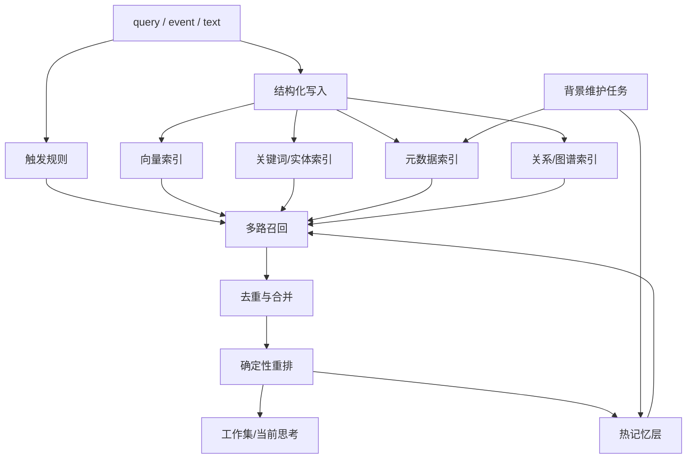
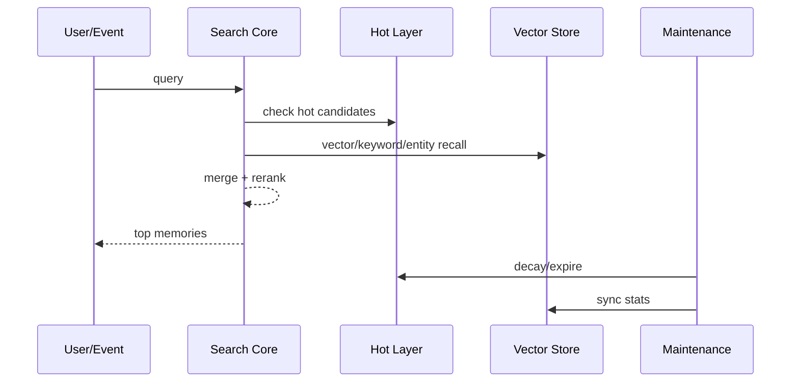

# 一、项目目标

项目名称：无 LLM 长时记忆检索与激活层

一句话描述：在现有 AiBrain 的记忆系统上，建立一套以结构化索引、混合召回、确定性重排和热记忆层为核心的长时记忆方案，让系统尽量不依赖 LLM 参与在线检索，但仍保持较高准确率、较低延迟和可解释性。

核心目标：

1. 在线长时记忆检索不调用 LLM，或只允许极少量、可隔离的离线整理任务调用 LLM。
2. 让记忆检索从“每次都全量搜”变成“规则触发 + 多路召回 + 确定性重排”。
3. 引入热记忆层或激活层，让近期被点亮的记忆在一段时间内优先参与思考。
4. 保持检索结果可解释，能看出某条记忆为什么被命中、为什么被提权、为什么过期。
5. 提供可复现的 probe / harness，方便测试脚本在不依赖 LLM 的情况下做模块化验证。

不做的事：

1. 不把 LLM 放在在线检索主路径里充当裁判。
2. 不把热记忆层当成永久存储，不让临时激活层无限膨胀。
3. 不依赖人工逐条调参才能让系统基本可用。
4. 不把“准确率”完全寄托在向量相似度单一指标上。
5. 不改动用户可见聊天流程的主要语义，只优化记忆侧的召回和激活。

# 二、业务背景

当前记忆链路已经存在 `modules.brain.memory` 体系，包括 `search_memory()`、Qdrant 检索、pipeline search、graph 关联和若干 fallback。问题在于：

1. 在线检索链路过重，经常包含多轮召回、图谱增强和 LLM 过滤。
2. 同一个 query 可能重复触发多次记忆搜索，导致延迟高、噪声多。
3. 记忆“被点亮”的状态没有被单独保存，短时间内的高相关内容会反复从头检索。
4. 系统缺少一层明确的“热记忆 / 激活层”，导致长时记忆更像被动数据库，而不是会自己浮现的认知层。
5. 现在的工程目标不是让 LLM 更聪明，而是让记忆搜索更稳定、更快、更像连续思考。

预期价值：

1. 降低在线检索时延。
2. 提高命中稳定性，减少无关旧记忆干扰。
3. 让“某段内容被唤起后会停留一会儿”成为真实能力。
4. 为后续的自动激活、工作集和长程思考打基础。

目标用户：

1. 开发者：想调试为什么这次检索命中了这些内容。
2. 系统：想在少用 LLM 的前提下维持较好的回忆质量。
3. 测试脚本：希望对记忆检索、激活、过期和重排做稳定回归。

# 三、功能需求

| 编号 | 功能名称 | 用户故事 | 优先级 | 备注 |
|---|---|---|---|---|
| FR-001 | 结构化写入 | 作为系统，我希望写入记忆时自动补充实体、主题、时间、重要性等结构化字段 | P0 | 尽量用规则和确定性方法完成 |
| FR-002 | 多路召回 | 作为系统，我希望检索时同时使用向量、关键词、实体、时间和关系信号 | P0 | 不依赖 LLM |
| FR-003 | 确定性重排 | 作为系统，我希望对候选记忆按可解释分数进行重排 | P0 | 纯规则评分 |
| FR-004 | 热记忆层 | 作为系统，我希望把近期高相关记忆临时升温，减少重复全量检索 | P0 | 带过期和衰减 |
| FR-005 | 自动激活 | 作为系统，我希望记忆有一个激活分数，符合条件时自动进入工作集 | P0 | 体现“自己浮上来”的感觉 |
| FR-006 | 过期和清理 | 作为系统，我希望热记忆在 TTL 到期后自动降温或移除 | P0 | 防止污染和膨胀 |
| FR-007 | 检索解释 | 作为开发者，我希望知道某条记忆为什么被命中、为什么被提升 | P1 | 输出可解释 trace |
| FR-008 | 无 LLM Probe | 作为测试脚本，我希望能直接调用内部函数测试召回、重排和激活 | P0 | 优先函数式接口，不强依赖 HTTP |
| FR-009 | 评估集回放 | 作为开发者，我希望能用固定样本集回放并比较准确率和延迟 | P0 | 支持回归测试 |
| FR-010 | 可观测性 | 作为开发者，我希望记录 query、候选数、命中来源、耗时和缓存命中 | P0 | 方便定位瓶颈 |
| FR-011 | 兼容现有流程 | 作为系统，我希望当前 BrainSession、LifeLoop 仍能直接复用新的检索层 | P0 | 不能破坏现有聊天 |
| FR-012 | 背景维护 | 作为系统，我希望有低频维护任务同步热记忆、衰减分数和清理过期项 | P1 | 可由 daemon 调度 |

第一版明确边界：

1. 不把 LLM 放进在线检索主路径。
2. 不要求热记忆层永久保存。
3. 不要求一开始就做到 100% 自动化，先可用、可测、可调。

# 四、非功能需求

性能要求：

1. 小规模数据集下，单次检索 P95 尽量控制在 100 到 200ms 内。
2. 热记忆命中应明显快于全库长时记忆召回。
3. 多路召回必须支持短路和限流，避免每次都跑满所有路径。
4. 维护任务应低优先级执行，不影响前台对话。

准确率要求：

1. 在固定评估集上，召回准确率不低于当前基线。
2. 对“继续刚才那个”“上次说过的”“还记得吗”这类强触发场景，命中率要显著高于普通事实问答。
3. 热记忆层必须能提高短时间内重复话题的命中稳定性。
4. 候选集合太大时，系统宁可少一点，也不要把大量噪声直接塞入工作集。

可维护性要求：

1. 结构化字段、召回逻辑、重排逻辑、热层逻辑要分层清晰。
2. Probe 接口必须能单独跑，不依赖完整聊天流程。
3. 写入侧和检索侧的变更都要有回放测试。
4. 热记忆层和原始长时记忆层要能分别观察和验证。

可观察性要求：

1. 每次检索记录 query、候选数、最终命中数、耗时、来源分布。
2. 记录热记忆的命中、升温、降温、过期和淘汰原因。
3. 记录重排时各分项分数，便于解释结果。
4. 记录是否触发了 fallback 或缓存命中。

# 五、系统架构



技术选型：

| 模块 | 方案 | 理由 |
|---|---|---|
| 存储 | 现有 Qdrant + 结构化元数据层 | 复用现有基础设施 |
| 召回 | 向量检索 + 关键词/实体/关系 + 热层 | 不依赖 LLM，召回更稳 |
| 重排 | 规则分数 | 可解释、可复现 |
| 热层 | 内存缓存或单独小型集合 | 方便短期激活 |
| 维护 | 低频 daemon / scheduler | 不影响前台对话 |
| 调试 | Python probe 函数 | 便于测试脚本模块化调用 |

推荐目录结构：

```text
backend/modules/brain/memory/
  core.py
  store.py
  qdrant_search.py
  hot_memory.py              # 新增：热记忆层
  activation.py              # 新增：自动激活分数与阈值
  ranking.py                 # 新增：确定性重排
  signals.py                 # 新增：query / memory 信号提取
  probes.py                  # 新增：测试和调试 probe
  evaluation.py              # 新增：回放与指标计算
```

关键设计决策：

1. 写入阶段尽量把记忆变成“好检索”的形状。
2. 检索阶段先召回，再重排，再决定是否进入工作集。
3. 热记忆层只保存“最近被点亮”的少量内容。
4. 在线检索默认不调用 LLM，只允许离线整理时少量补标签。
5. 任何一层都要能单独测，不要把逻辑全塞进一个巨大的 `search_memory()`。

# 六、数据结构

## MemoryRecord

| 字段 | 类型 | 说明 |
|---|---|---|
| id | str | 记忆唯一 ID |
| text | str | 原始记忆文本 |
| source | str | user / assistant / tool / system |
| created_at | str | 创建时间 |
| updated_at | str | 更新时间 |
| entities | list[str] | 实体列表 |
| topics | list[str] | 主题标签 |
| importance | float | 重要性 |
| emotion | float | 情绪强度 |
| open_loop | bool | 是否未完成 |
| relation_keys | list[str] | 关系键 |
| vector_score | float | 向量命中分 |
| keyword_score | float | 关键词命中分 |
| entity_score | float | 实体重合分 |
| topic_score | float | 主题相关分 |
| recency_score | float | 新近度分 |
| access_count | int | 被访问次数 |
| last_accessed_at | str | 最近访问时间 |

## HotMemoryRecord

| 字段 | 类型 | 说明 |
|---|---|---|
| memory_id | str | 指向原始记忆 |
| hot_score | float | 热度分 |
| activated_at | str | 激活时间 |
| expires_at | str | 过期时间 |
| reason | str | 激活原因 |
| source_query | str | 触发它的查询 |
| ttl_seconds | int | 存活时长 |

## SearchTrace

| 字段 | 类型 | 说明 |
|---|---|---|
| query | str | 原始查询 |
| signals | dict | 触发信号 |
| candidate_count | int | 候选数 |
| hot_hit_count | int | 热层命中数 |
| final_count | int | 最终结果数 |
| elapsed_ms | int | 检索耗时 |
| source_breakdown | dict | 来源分布 |
| fallback_used | bool | 是否触发 fallback |

## ActivationSignal

| 字段 | 类型 | 说明 |
|---|---|---|
| query_text | str | 查询文本 |
| entity_overlap | float | 实体重合度 |
| topic_overlap | float | 主题重合度 |
| recency_boost | float | 新近度加成 |
| unfinished_boost | float | 未完成加成 |
| repeat_boost | float | 重复出现加成 |
| goal_boost | float | 目标相关加成 |
| final_score | float | 激活总分 |

# 七、流程设计

## 写入流程

1. 接收新的记忆文本。
2. 用规则/词典/正则提取实体、主题、时间和来源。
3. 计算重要性、情绪和 open loop 标记。
4. 写入原始记忆层和向量索引层。
5. 更新关系索引和统计字段。
6. 如果记忆刚刚被频繁提及，则同步升温到热记忆层。

## 检索流程

1. 先用规则判断是否需要激活长时记忆。
2. 触发后并行做多路召回：向量、关键词、实体、关系、热层。
3. 合并候选并去重。
4. 用确定性公式计算重排分数。
5. 高分结果进入工作集，中分结果进入热层，低分结果直接丢弃。
6. 记录 SearchTrace，供测试与调试使用。

## 热层流程

1. 候选被多次命中后升温。
2. 热层按 TTL 和热度衰减。
3. 过期项自动降温或清理。
4. 热层只保存少量高价值内容。

## 维护流程

1. 低频扫描热层和元数据索引。
2. 统一执行过期、衰减、合并和清理。
3. 将命中统计写入日志或调试状态。
4. 维护任务不能阻塞在线对话。



# 八、API 设计

第一版优先使用内部函数和 probe，不强依赖 HTTP。推荐接口如下：

## `build_memory_signals(query, context=None) -> ActivationSignal`

提取查询信号，返回实体重合、主题重合、未完成度、新近度等分项。

## `search_memory_candidates(query, *, top_k=50, allow_hot=True) -> list[dict]`

只做召回，不做复杂解释。

## `rank_memory_candidates(query, candidates, signals=None) -> list[dict]`

只做确定性重排，返回排序后的候选。

## `activate_hot_memory(candidates, *, reason, ttl_seconds) -> int`

把少量候选同步到热层。

## `decay_hot_memory(now=None) -> int`

清理或降温过期热记忆。

## `get_memory_debug_state() -> dict`

返回热层大小、最近 query、最近耗时、缓存命中和过期统计。

## `run_memory_probe(query, *, top_k=20) -> dict`

供测试脚本直接调用，返回：

```json
{
  "ok": true,
  "trace": {},
  "candidates": [],
  "ranked": [],
  "elapsed_ms": 18
}
```

可选调试路由：

- `GET /brain/memory/debug`
- `POST /brain/memory/probe`

说明：

1. HTTP 不是核心依赖，核心是可直接 import 的 Python probe。
2. 如果后续需要页面观察，再把 debug route 补上即可。
3. 在线检索路径默认不调用 LLM。

# 九、验收标准

功能验收：

1. 同一 query 反复出现时，热记忆命中率明显提升。
2. 在线检索主路径不调用 LLM。
3. 候选结果能按分项分数解释为什么被选中。
4. 热记忆层能自动过期和清理。
5. 记忆检索能被 probe 单独调用。

性能验收：

1. 小规模数据集 P95 检索延迟达到预期目标。
2. 热层命中明显快于全库召回。
3. 多路召回不会在低价值 query 上无意义放大成本。

准确率验收：

1. 在固定回放集上，Recall@K 不低于当前基线。
2. 强触发句式命中率高于普通事实查询。
3. 热层和重排不会把大量噪声引入工作集。

测试验收：

1. 有 `probe` 函数可直接被脚本调用。
2. 有回放评估集和指标输出。
3. 有缓存/热层/过期/重排的单元测试。
4. 有至少一组端到端检索回放测试。

# 十、开发任务拆分

| 任务 ID | 任务名称 | 依赖 | 复杂度 | 模块 | 对应需求 |
|---|---|---|---|---|---|
| T001 | 梳理现有 `search_memory()`、pipeline 和 fallback 链路，补耗时埋点 | 无 | M | memory.core / pipeline | FR-010 |
| T002 | 定义 `MemoryRecord`、`HotMemoryRecord`、`SearchTrace`、`ActivationSignal` | T001 | S | memory.models | FR-001, FR-010 |
| T003 | 实现结构化写入辅助函数，补实体/主题/重要性等字段 | T002 | M | memory.signals | FR-001 |
| T004 | 实现多路召回核心（向量、关键词、实体、关系、热层） | T002 | L | memory.search | FR-002 |
| T005 | 实现确定性重排器和可解释分项输出 | T004 | M | memory.ranking | FR-003, FR-007 |
| T006 | 实现热记忆层和 TTL / 衰减 / 清理逻辑 | T002 | M | memory.hot_memory | FR-004, FR-006 |
| T007 | 实现自动激活分数计算和进入工作集的规则 | T003,T005 | M | memory.activation | FR-005 |
| T008 | 实现 `probe` / harness 接口，支持测试脚本直接调用 | T004,T005,T006,T007 | M | memory.probes | FR-008 |
| T009 | 实现回放评估和指标计算 | T004,T005 | M | memory.evaluation | FR-009 |
| T010 | 把新检索层接入现有 BrainSession / LifeLoop 读取点 | T004,T005,T006 | M | main_brain / adapters | FR-011 |
| T011 | 增加背景维护任务和调度入口 | T006,T007 | S | daemon / scheduler | FR-012 |
| T012 | 编写单测和回放测试，覆盖缓存、过期、重排、命中 | T008,T009 | M | tests | FR-008, FR-009 |

推荐实施顺序：

1. P0 基础骨架：T001、T002、T003。
2. P0 检索核心：T004、T005、T006。
3. P0 自动激活和接入：T007、T010。
4. P1 调试和评估：T008、T009、T012。
5. P1 后台维护：T011。

第一版最小可交付范围：

1. 结构化写入辅助。
2. 多路召回 + 确定性重排。
3. 热记忆层。
4. 无 LLM Probe。
5. 基础评估回放。

