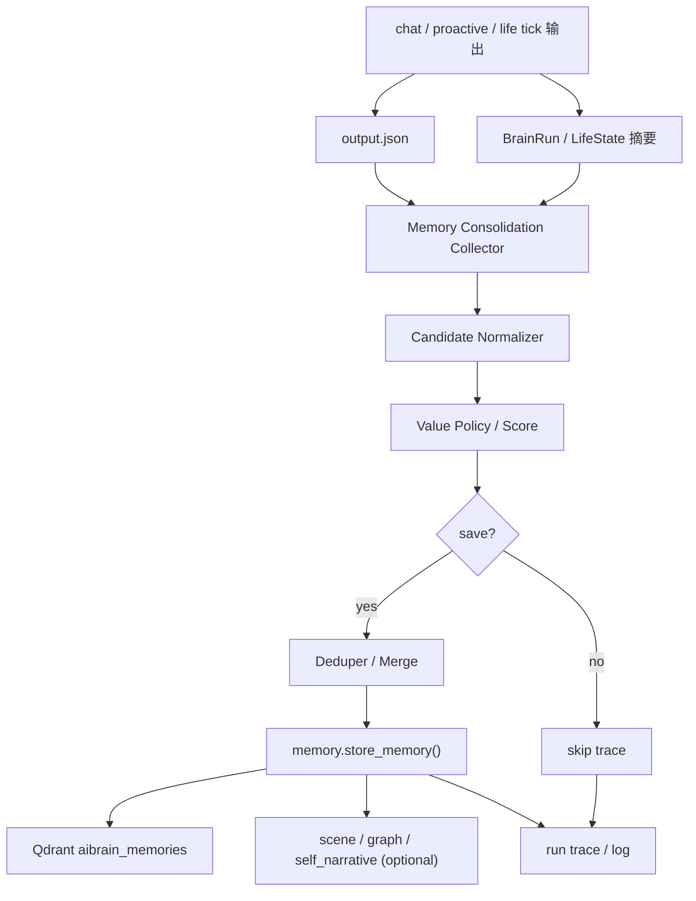
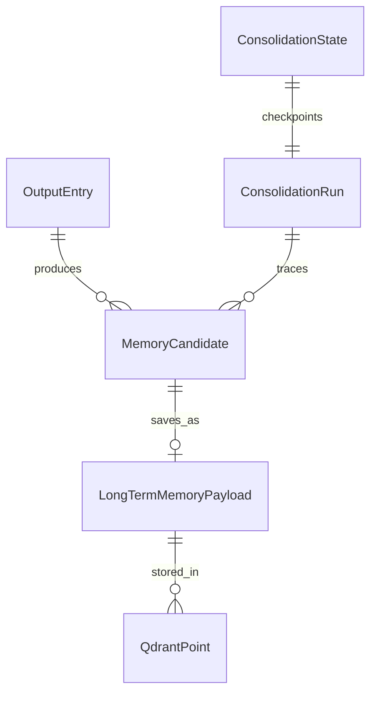
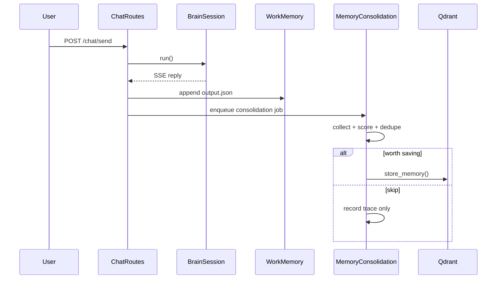
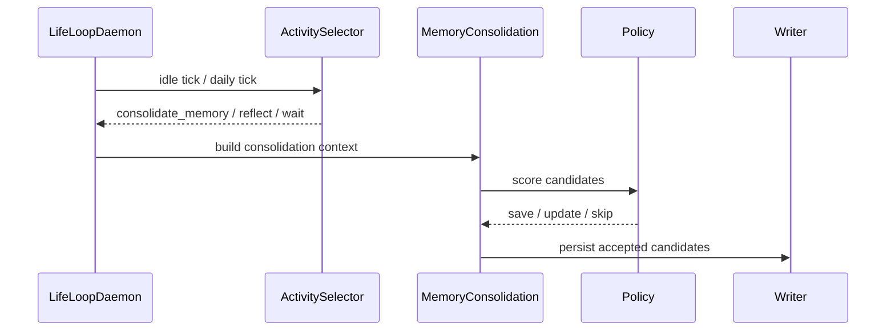

# 一、项目目标

项目名称：输出记忆沉淀到长时记忆

一句话描述：在现有 `BrainSession` / `LifeLoopDaemon` 上新增一条自动沉淀路径，把 `output.json`、主动表达和大脑循环中的高价值内容筛选、去重并写入长时记忆，让系统像人类一样在思考、表达和休息中逐步形成长期记忆。

核心目标：

1. 系统能自动识别哪些输出值得沉淀为长时记忆，而不是把所有内容都保存。
2. 输出中的重要偏好、任务、决定、关系语境、环境事实能在后台被整理并写入 `aibrain_memories`。
3. 记忆沉淀过程必须可追踪，能看到“为什么保存、保存了什么、为什么跳过”。
4. 沉淀流程不能破坏现有聊天、`output.json` 历史、主动表达和记忆检索能力。
5. 系统需要具备类似人类的记忆巩固节奏，优先在空闲、低负载、日常循环阶段执行。

不做的事：

1. 不把每一条输出都存成长时记忆。
2. 不把长时记忆写入逻辑塞进用户可见回复链路里。
3. 不重写现有 `output.json` 的核心历史格式。
4. 不要求前端先做复杂的人工审核界面。
5. 不让 LLM 成为每次输出沉淀的唯一判定器，规则和阈值必须先能工作。

# 二、业务背景

当前项目已经有几条相关能力：

1. `output.json` 会记录聊天历史和主动表达结果，但它更像工作记忆，不是长时记忆。
2. `backend/main_brain` 已经有 `BrainSession`、`LifeLoopDaemon`、`ActivitySelector`、`ExpressionGate` 等循环能力。
3. `backend/modules/brain/memory/core.py` 和 `qdrant_store.py` 已经支持把文本写入 `aibrain_memories`。
4. `reflection.py` 能从近期记忆中提炼长期认知，但它偏向“回顾已有记忆”，不是“从输出中自动生成新记忆”。

现在的缺口是：

1. 用户说过的重要信息、系统主动说过的重要内容，没有一条稳定的自动沉淀路径。
2. 很多有价值的信息只停留在 `output.json` 里，后续不会主动进入长时记忆。
3. 记忆保存和聊天输出是两条断开的线，系统还没有“边思考边巩固”的闭环。
4. 如果不建立自动保存路径，系统会越来越依赖短期上下文，表现得像“会说话但记不住”。

预期价值：

1. 减少重复提问和重复表达，让系统逐步记住稳定偏好和长期任务。
2. 让长时记忆更像人类记忆巩固，而不是被动数据库写入。
3. 提升 `BrainSession` 和 `LifeLoopDaemon` 的连续性，让系统能“思考过后记下来”。
4. 让开发者能清楚看到哪些输出被判定为“值得保存”。

目标用户：

1. 开发者：想知道为什么这条内容被保存成长期记忆。
2. 系统：希望在后台自动沉淀有价值的信息，减少遗忘。
3. 用户：希望系统记得偏好、约定、任务和重要上下文，而不是每次都重来。

# 三、功能需求

| 编号 | 功能名称 | 用户故事 | 优先级 | 备注 |
|---|---|---|---|---|
| FR-001 | 输出候选采集 | 作为系统，我希望从 `output.json`、主动表达和内部循环摘要中采集候选记忆 | P0 | 先支持最近窗口，不做全量扫描 |
| FR-002 | 价值筛选 | 作为系统，我希望区分“普通输出”和“值得长期保存的输出” | P0 | 需要规则评分，LLM 只做辅助 |
| FR-003 | 长时记忆写入 | 作为系统，我希望把高价值候选写入 `aibrain_memories` | P0 | 复用现有 `store_memory()` |
| FR-004 | 去重与合并 | 作为系统，我希望避免重复保存相同偏好或事实 | P0 | 支持相似记忆更新或跳过 |
| FR-005 | 脑循环触发 | 作为系统，我希望在 `BrainSession` 结束、`LifeLoopDaemon` 空闲 tick、daily tick 时触发沉淀 | P0 | 优先后台执行 |
| FR-006 | 保存解释 | 作为开发者，我希望知道每条候选为何被保存、更新或跳过 | P0 | 需要 trace / log |
| FR-007 | 手动预览 | 作为开发者，我希望能 dry-run 预览沉淀结果但不真正写入 | P1 | 便于调试阈值 |
| FR-008 | 冷却与限流 | 作为系统，我希望避免短时间内反复保存同一类内容 | P0 | 需要 source hash / cooldown |
| FR-009 | 敏感信息保护 | 作为系统，我希望不要把明显敏感信息自动写进长时记忆 | P0 | 先用规则屏蔽，后续可扩展 |
| FR-010 | 兼容现有输出 | 作为用户，我希望 `output.json` 和现有聊天历史保持可读、可回放 | P0 | 不破坏现有格式 |
| FR-011 | 可观测状态 | 作为开发者，我希望能看到最近一次沉淀时间、保存数量和失败原因 | P1 | 可挂在 `/brain/state` 或 debug 路由 |
| FR-012 | 可回放测试 | 作为测试脚本，我希望能用固定样本回放沉淀结果 | P0 | 便于回归和调参 |

第一版重点保存的内容：

1. 用户长期偏好，例如表达方式、工具偏好、工作节奏。
2. 持续任务和承诺，例如“下次再继续做什么”。
3. 反复出现的环境事实，例如常用目录、项目约束、操作习惯。
4. 重要关系语境，例如用户对系统的期待变化。
5. 明显影响后续行动的决定或结论。

第一版明确不重点保存的内容：

1. 无意义闲聊。
2. 单次短暂情绪波动，且没有持续性。
3. 低信息量的重复表达。
4. 明显敏感、临时、应当遗忘的内容。

# 四、非功能需求

性能要求：

1. 不允许沉淀流程阻塞 `POST /chat/send` 的用户响应链路。
2. 正常情况下，沉淀动作应在后台异步执行，聊天主流程额外开销尽量低于 50ms。
3. 单次沉淀批次建议控制在 20 条输出窗口以内，避免长时间扫描历史。
4. 若需要调用 LLM 做辅助总结，只允许在后台低频执行，不能成为每条输出的必经步骤。

安全要求：

1. 需要有基础敏感信息过滤，至少先屏蔽密码、token、key、cookie、私密链接等明显内容。
2. 不保存完整的隐藏思维链，只保存摘要和可解释理由。
3. 如果判定信息不适合长期保存，必须支持明确跳过并记录原因。

可维护性要求：

1. 采集、评分、去重、写入、trace 必须分层，不要堆在一个大函数里。
2. 沉淀策略要可配置，阈值能调。
3. 需要有 dry-run 接口，方便测试规则而不污染真实记忆。
4. 输出历史和长时记忆之间要保持松耦合，避免互相拖坏。

可观测性要求：

1. 每次沉淀记录 `run_id`、`source`、`candidate_count`、`saved_count`、`skipped_count`、`duplicate_count`、`latency_ms`。
2. 每条候选记录基础评分项，例如新颖度、持续性、重要性、任务相关性、关系相关性。
3. 保存、更新、跳过、失败都要能在日志里查到理由。

兼容性要求：

1. `output.json` 的原始用户/assistant历史格式不变。
2. 现有 `pending_expression`、`proactive_send`、`reflection` 逻辑不应因沉淀而退化。
3. 前端第一版不强制新增页面，最多补一个调试状态展示。

# 五、系统架构



技术选型：

| 模块 | 方案 | 理由 |
|---|---|---|
| 输出采集 | 读取 `workmemory.output_mem_read()` | 已有稳定 `output.json` 入口 |
| 候选评分 | 规则优先，LLM 辅助可选 | 规则可控、易测试 |
| 长时记忆写入 | `modules.brain.memory.core.store_memory()` | 复用现有 Qdrant 写入管线 |
| 去重 | 语义相似 + 内容 hash + 元数据匹配 | 避免重复保存 |
| 触发器 | `BrainSession` 结束回调 + `LifeLoopDaemon` tick | 符合“脑循环巩固”语义 |
| 调试 | Python probe / dry-run API | 方便测试脚本和回放 |

推荐目录结构：

```text
backend/main_brain/
  memory_consolidation.py      # 统筹输出沉淀流程
  adapters/
    output.py                  # 读取 output.json / 输出摘要
    memory.py                  # 现有记忆读取与检索
  testing/
    memory_consolidation.py    # probe / dry-run / replay

backend/modules/brain/memory/consolidation/
  __init__.py
  collector.py                 # 候选采集与归一化
  policy.py                    # 价值评分与过滤规则
  dedupe.py                    # 去重 / 合并 / 冷却
  writer.py                    # 写入长期记忆
  trace.py                     # 运行轨迹与解释
  redaction.py                 # 敏感信息屏蔽
```

关键设计决策：

1. `output.json` 继续作为工作记忆和历史来源，不直接改成长时记忆数据库。
2. 长时记忆写入由独立的 consolidation 层负责，避免污染聊天链路。
3. 保存决策必须先可解释，再谈“更智能”的策略。
4. 大脑循环负责决定“什么时候巩固”，内容本身由 consolidation 层决定“值不值得保存”。
5. 去重比“多存”更重要，第一版宁可少存，也不要重复堆垃圾记忆。

# 六、数据结构

## OutputEntry

| 字段 | 类型 | 说明 | 约束 |
|---|---|---|---|
| seq | int | `output.json` 序号 | 必填 |
| user | str | 用户输入 | 可空 |
| assistant | str | 系统输出 | 可空 |
| time | str | 时间戳 | 必填 |
| source | str | chat / proactive / compress | 建议新增，可选 |
| memory_status | str | pending / saved / skipped / duplicate | 可选 |
| memory_id | str | 对应长时记忆 ID | 可选 |
| consolidation_run_id | str | 最近一次沉淀 run | 可选 |

## MemoryCandidate

| 字段 | 类型 | 说明 | 约束 |
|---|---|---|---|
| candidate_id | str | 候选 ID | 必填 |
| source_type | str | output / proactive / reflection / tick | 必填 |
| source_seq_range | list[int] | 来源输出序号范围 | 可空 |
| source_text | str | 原始文本片段 | 必填 |
| summary | str | 归一化摘要 | 必填 |
| importance | float | 重要性 | 0-1 |
| novelty | float | 新颖度 | 0-1 |
| persistence | float | 持续性/长期性 | 0-1 |
| relation_score | float | 与用户关系/目标的相关性 | 0-1 |
| task_score | float | 与未完成事项的相关性 | 0-1 |
| sensitivity | float | 敏感风险 | 0-1 |
| final_score | float | 综合分 | 0-1 |
| decision | str | save / update / skip / defer | 必填 |
| reason | str | 决策理由 | 必填 |
| source_hash | str | 内容 hash | 必填 |

## ConsolidationRun

| 字段 | 类型 | 说明 |
|---|---|---|
| run_id | str | 本次沉淀运行 ID |
| trigger | str | reactive_end / idle_tick / daily_tick / manual |
| tick_type | str | short / medium / long / daily / manual |
| started_at | str | 开始时间 |
| elapsed_ms | int | 总耗时 |
| scanned_count | int | 扫描输入条数 |
| candidate_count | int | 产出候选条数 |
| saved_count | int | 写入条数 |
| updated_count | int | 更新条数 |
| skipped_count | int | 跳过条数 |
| duplicate_count | int | 重复条数 |
| error_count | int | 错误条数 |
| last_processed_seq | int | 上次处理到的 `output.seq` |
| status | str | success / partial / failed / dry_run |

## ConsolidationState

| 字段 | 类型 | 说明 |
|---|---|---|
| last_processed_seq | int | 最近处理的 `output.seq` |
| last_run_id | str | 最近一次运行 ID |
| last_saved_at | str | 最近一次写入时间 |
| last_saved_memory_id | str | 最近一次保存的长时记忆 ID |
| policy_version | str | 当前策略版本 |
| cooldown_until | str | 全局冷却时间 |
| pending_backlog | int | 待处理候选数量 |

## LongTermMemoryPayload

| 字段 | 类型 | 说明 |
|---|---|---|
| text | str | 存入 `aibrain_memories` 的正文 |
| display_text | str | 展示文本，可与 text 一致或更短 |
| source | str | output / proactive / reflect / manual |
| source_seq | int | 来源输出序号 |
| source_run_id | str | 来源运行 ID |
| memory_kind | str | preference / task / fact / relation / decision |
| importance | float | 重要性 |
| tags | list[str] | 标签 |
| created_at | str | 创建时间 |
| updated_at | str | 更新时间 |
| source_hash | str | 用于去重 |

实体关系：



索引策略：

1. `source_hash` 需要索引或可快速比对，避免重复保存。
2. `source_seq` 需要记录，方便增量扫描 `output.json`。
3. `last_processed_seq` 必须持久化，保证重启后不会重复沉淀。
4. `memory_kind`、`source`、`created_at` 适合做统计和调试查询。

数据量预估：

1. `output.json` 维持最近若干百条历史，主要是工作记忆。
2. 每次 consolidation 通常只有 0-5 条真正值得保存的候选。
3. 长时记忆会持续增长，但应依靠去重和策略控制写入速率。

# 七、流程设计

## 1. Reactive 结束后的沉淀流程



## 2. LifeLoop 空闲巩固流程



## 3. 候选判定流程

1. 从 `output.json` 和最近 run 摘要中读取增量数据。
2. 抽取稳定信息片段，例如偏好、任务、约定、事实、关系变化。
3. 为每条候选计算综合分：重要性、新颖度、持续性、任务相关性、关系相关性、敏感风险。
4. 低分内容直接跳过，中分内容可进入待观察队列，高分内容进入长时记忆写入。
5. 通过内容 hash、语义相似度和已有记忆比对进行去重。
6. 写入成功后更新 checkpoint 和 trace。

## 4. 异常流程

1. `output.json` 读取失败时，沉淀流程跳过，不影响聊天。
2. 候选抽取失败时，仅记录错误，不回滚输出历史。
3. Qdrant 不可用时，保存 trace 并等待下次 tick 重试。
4. 检测到敏感内容时，直接 `skip` 并记录红action原因。
5. 若重复保存风险过高，优先 `update` 旧记忆而不是新增。

## 5. 状态流转

```text
new -> normalized -> scored -> save/update/skip -> traced -> checkpointed
```

如果启用暂存队列：

```text
new -> normalized -> scored -> defer -> retry_window -> save/update/skip
```

# 八、API设计

第一版优先提供内部函数和调试接口，HTTP 只是可选包装。

## 内部主接口

### `build_consolidation_context(trigger, *, window_size=20, include_pending=true) -> dict`

作用：组装一次沉淀运行所需上下文。

参数：

| 字段 | 类型 | 必填 | 说明 |
|---|---|---|---|
| trigger | str | 是 | `reactive_end` / `idle_tick` / `daily_tick` / `manual` |
| window_size | int | 否 | 读取 `output.json` 的窗口大小 |
| include_pending | bool | 否 | 是否把 `pending_expressions` 纳入候选 |

返回：

```json
{
  "run_id": "mc_20260623_0001",
  "trigger": "daily_tick",
  "window_size": 20,
  "outputs": [],
  "brain_summary": {},
  "checkpoint": {"last_processed_seq": 120}
}
```

### `extract_memory_candidates(context) -> list[dict]`

作用：从上下文抽候选并做归一化。

返回字段重点：

| 字段 | 类型 | 说明 |
|---|---|---|
| summary | str | 候选摘要 |
| source_text | str | 原始片段 |
| source_hash | str | 去重键 |
| memory_kind | str | 记忆类型 |
| importance | float | 初评分 |

### `score_memory_candidate(candidate, policy=None) -> dict`

作用：计算是否保存、更新或跳过。

返回示例：

```json
{
  "decision": "save",
  "final_score": 0.82,
  "reason": "稳定偏好 + 任务相关 + 高新颖度",
  "need_llm": false
}
```

### `consolidate_memory(trigger, *, dry_run=false) -> dict`

作用：执行完整沉淀流程。

返回示例：

```json
{
  "ok": true,
  "run_id": "mc_20260623_0001",
  "saved_count": 2,
  "updated_count": 1,
  "skipped_count": 5,
  "duplicate_count": 3,
  "dry_run": false
}
```

### `preview_memory_consolidation(trigger, *, window_size=20) -> dict`

作用：只预览，不写库。

## HTTP 调试接口

### `POST /brain/memory/consolidate`

请求：

```json
{
  "trigger": "manual",
  "window_size": 20,
  "dry_run": false
}
```

响应：

```json
{
  "ok": true,
  "run_id": "mc_20260623_0001",
  "saved_count": 2,
  "updated_count": 1,
  "skipped_count": 5,
  "duplicate_count": 3
}
```

### `POST /brain/memory/consolidate/preview`

作用：只返回候选与评分，不写入任何长时记忆。

### `GET /brain/memory/consolidation/state`

返回：

```json
{
  "last_processed_seq": 120,
  "last_run_id": "mc_20260623_0001",
  "last_saved_at": "2026-06-23T15:10:00+08:00",
  "pending_backlog": 4,
  "policy_version": "v1"
}
```

### `GET /brain/memory/consolidation/recent`

返回最近几次沉淀运行摘要，便于调试和回放。

错误码建议：

| 错误码 | 说明 |
|---|---|
| 400 | 参数不合法，例如 `window_size` 超范围 |
| 409 | 冲突，例如手动沉淀和后台沉淀同时抢占 |
| 503 | Qdrant / memory pipeline 不可用 |
| 500 | 其他未预期错误 |

# 九、验收标准

功能验收：

1. 发送包含稳定偏好、任务或约定的对话后，系统能在后台把它沉淀成长时记忆。
2. 普通寒暄、重复句子和短暂情绪不会被频繁保存。
3. 同一条或高度相似内容不会被重复写入多个长时记忆点。
4. `dry_run` 能输出候选、评分和原因，但不会写入 Qdrant。
5. `output.json` 的历史读取、压缩和回放仍然正常。
6. 每次保存都能追踪到来源输出序号和沉淀 run。
7. `BrainSession`、`LifeLoopDaemon`、主动表达流程都不因沉淀功能而卡顿。

性能验收：

1. 在线聊天主流程额外耗时保持很低，不因为沉淀而明显延迟。
2. 后台沉淀批次能在可控时间内完成，不占满 CPU 或阻塞其他 tick。
3. 去重和保存逻辑在常见窗口规模下运行稳定，不做全量无差别扫描。

安全验收：

1. 明显敏感信息不会被自动保存到长时记忆。
2. 只有摘要和可解释理由进入 trace，不写完整隐藏思维链。
3. 失败情况下不会把异常内容写入 `output.json` 或 Qdrant。

可观测性验收：

1. 能查看最近一次沉淀的 `run_id`、候选数、保存数、跳过数和失败原因。
2. 能从日志里找到某条记忆为何被保存或被跳过。
3. 能按 `source_hash` 或 `source_seq` 回溯来源。

交付物清单：

1. `backend/main_brain/memory_consolidation.py`
2. `backend/main_brain/adapters/output.py`
3. `backend/modules/brain/memory/consolidation/collector.py`
4. `backend/modules/brain/memory/consolidation/policy.py`
5. `backend/modules/brain/memory/consolidation/dedupe.py`
6. `backend/modules/brain/memory/consolidation/writer.py`
7. `backend/modules/brain/memory/consolidation/trace.py`
8. `backend/modules/brain/memory/consolidation/redaction.py`
9. `backend/main_brain/testing/memory_consolidation.py`
10. `POST /brain/memory/consolidate` 调试接口
11. `GET /brain/memory/consolidation/state` 状态接口
12. 最小回放测试

# 十、开发任务拆分

| 任务 ID | 任务名称 | 依赖 | 复杂度 | 所属模块 | 对应需求 |
|---|---|---|---|---|---|
| T001 | 梳理 `output.json`、`pending_expression`、`BrainSession` 结束点和 `LifeLoopDaemon` tick 点 | 无 | S | 审计 | FR-001, FR-005 |
| T002 | 定义 `MemoryCandidate`、`ConsolidationRun`、`ConsolidationState`、`LongTermMemoryPayload` | T001 | S | contracts | FR-006, FR-011 |
| T003 | 实现输出采集器，读取 `output.json` 增量和最近 run 摘要 | T001 | M | collector | FR-001, FR-010 |
| T004 | 实现候选归一化与敏感信息屏蔽 | T002,T003 | M | collector/redaction | FR-002, FR-009 |
| T005 | 实现价值评分策略（重要性、新颖度、持续性、任务相关性、关系相关性） | T002 | M | policy | FR-002 |
| T006 | 实现去重 / 合并逻辑，支持内容 hash 和语义相似比对 | T002,T005 | M | dedupe | FR-004, FR-008 |
| T007 | 封装写入器，复用 `store_memory()` 并写入 trace 元数据 | T002,T006 | M | writer | FR-003 |
| T008 | 在 `BrainSession` 结束后挂接沉淀任务投递 | T003,T007 | M | main_brain/session | FR-005 |
| T009 | 在 `LifeLoopDaemon` 的 idle / daily tick 中加入 consolidation activity | T003,T005 | M | main_brain/daemon | FR-005 |
| T010 | 实现 trace / checkpoint 持久化，记录 last_processed_seq | T002,T007 | S | trace | FR-006, FR-011 |
| T011 | 提供 dry-run / preview 调试接口 | T004,T005,T006 | S | routes / testing | FR-007, FR-012 |
| T012 | 编写回放测试和最小集成测试，覆盖保存、跳过、去重、敏感过滤 | T008,T009,T011 | M | tests | FR-004, FR-009, FR-010 |

推荐实施顺序：

1. P0 基础审计与契约：T001、T002。
2. P0 核心链路：T003、T004、T005、T006、T007。
3. P0 脑循环接入：T008、T009。
4. P1 可观测与调试：T010、T011。
5. P1 回放测试：T012。

第一版最小可交付范围：

1. 能从 `output.json` 读取增量候选。
2. 能按规则筛选出值得保存的内容。
3. 能复用现有 `store_memory()` 写入长时记忆。
4. 能避免重复保存和明显敏感内容。
5. 能在后台沉淀，不影响聊天。
