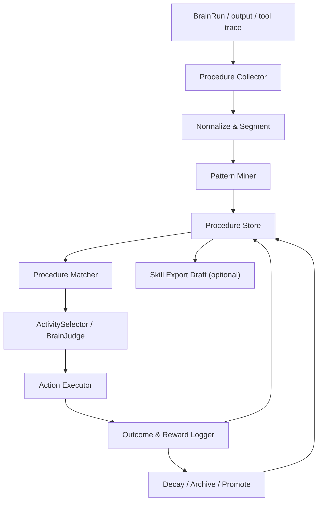
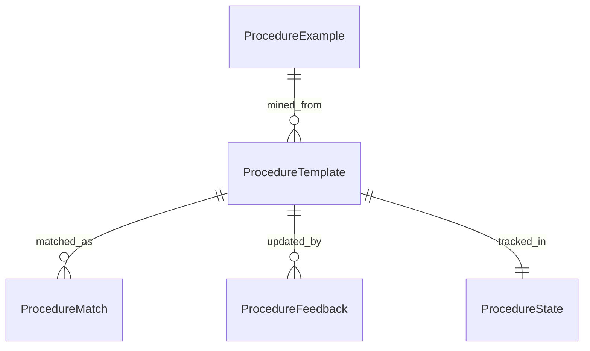
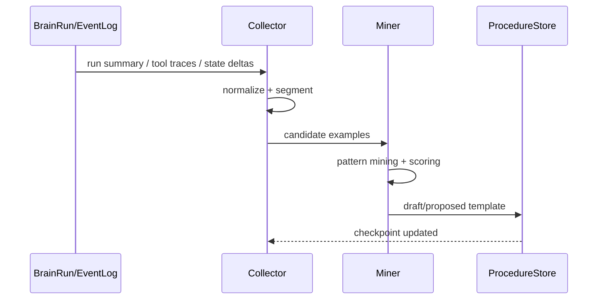
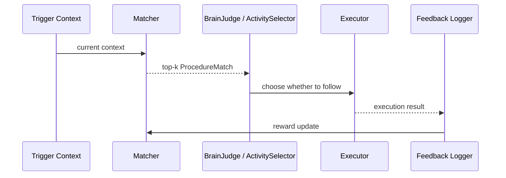

# 一、项目目标

项目名称：程序记忆与习惯模板系统

一句话描述：把 `BrainRun`、工具调用、状态变化和任务结果中反复成功的动作序列提炼成“程序记忆”，让系统在相似上下文下优先复用已验证过的做法，而不是每次都重新思考一遍。

核心目标：

1. 从真实运行轨迹中自动提炼可复用的动作模板，而不是把所有日志都当记忆保存。
2. 在相似上下文下，系统能检索到最合适的程序记忆并作为决策参考。
3. 程序记忆必须可解释，能看到它为什么被提炼、为什么被推荐、为什么被淘汰。
4. 程序记忆要能持续学习，根据成功/失败结果更新分数、稳定性和适用范围。
5. 程序记忆不能替代现有 skill，但可以在后续导出为 skill 草稿，作为更高层的能力封装。
6. 第一版必须保证不阻塞现有聊天、反思、沉淀和主动表达链路。

不做的事：

1. 不把每一次运行都生成程序记忆。
2. 不自动执行高风险动作，程序记忆第一版只做建议和参考。
3. 不把程序记忆和事实记忆混成一个存储层。
4. 不直接自动发布 skill，上线前仍需要校验或人工确认。
5. 不把短暂、一次性的探索流程硬提炼成长期习惯。

# 二、业务背景

当前 AiBrain 已经具备不少“会想”的底座：

1. `BrainSession` 能记录一次对话里的多轮内部决策。
2. `LifeLoopDaemon` 能在空闲时持续运行，维护节奏、目标和表达。
3. `brain_runs.jsonl` 能记录每次运行轨迹。
4. `open_loops`、`goals`、`concerns`、`working_set` 已经有了任务/关注/目标的状态层。
5. `output-memory-consolidation` 已经能把部分输出巩固成长期记忆。

但这里还缺一类非常关键的记忆：

1. 系统知道“是什么”，但还不够知道“怎么做更稳”。
2. 同样的任务会被重复规划，重复走相似流程，缺少行为上的复用。
3. 现在的决策更像“每次临场发挥”，还没有形成稳定的动作偏好和操作套路。
4. 如果不补这一层，系统会越来越像会说话的数据库，而不像会积累经验的主体。

程序记忆要解决的问题是：

1. 从成功的动作序列里提炼“上下文 → 动作模板 → 结果”的模式。
2. 让系统在类似场景下优先走已经验证过的路径。
3. 让“做事方式”也能被记住、复用、衰减和升级。

目标用户：

1. 开发者：希望系统在重复任务上越来越稳。
2. 系统本身：希望减少重复思考和重复试错。
3. 后续技能系统：希望把稳定流程导出成 skill 草稿。

预期价值：

1. 降低重复任务的决策成本。
2. 提高流程一致性和可复现性。
3. 让系统逐步形成“习惯”和“默认做法”。
4. 为后续自动生成 skill、自动化工作流和更强自主性打基础。

# 三、功能需求

| 编号 | 功能名称 | 用户故事 | 优先级 | 备注 |
|---|---|---|---|---|
| FR-001 | 运行轨迹采集 | 作为系统，我希望从 `brain_runs.jsonl`、工具调用、状态变化中采集程序记忆候选 | P0 | 只采集稳定运行样本 |
| FR-002 | 模式提炼 | 作为系统，我希望从多次相似成功轨迹里提炼出动作模板 | P0 | 支持重复序列与子序列 |
| FR-003 | 程序模板存储 | 作为系统，我希望把模板、适用条件、步骤、风险和统计数据保存下来 | P0 | 独立于事实记忆 |
| FR-004 | 上下文匹配 | 作为系统，我希望在当前上下文下检索最合适的程序记忆 | P0 | 返回 top-k 候选 |
| FR-005 | 决策参考 | 作为系统，我希望在 `ActivitySelector` / `BrainJudge` 中使用程序记忆作为参考 | P0 | 先建议，后执行 |
| FR-006 | 反馈更新 | 作为系统，我希望根据实际结果更新程序记忆的成功率、奖励和可用性 | P0 | 形成闭环学习 |
| FR-007 | 风险控制 | 作为系统，我希望高风险程序记忆只给建议，不直接自动执行 | P0 | 安全优先 |
| FR-008 | 可解释输出 | 作为开发者，我希望看到模板为何匹配、为何推荐、为何降权 | P0 | 输出 trace |
| FR-009 | 生命周期管理 | 作为系统，我希望程序记忆能从 draft 走到 active，再到 deprecated/archive | P0 | 支持衰减和退役 |
| FR-010 | Skill 导出草稿 | 作为开发者，我希望把高置信模板导出为 skill 草稿 | P1 | 不自动发布，需确认 |
| FR-011 | Dry-run 和回放 | 作为测试脚本，我希望能预览提炼和匹配结果而不写库 | P0 | 便于调阈值 |
| FR-012 | 兼容现有链路 | 作为用户，我希望程序记忆接入后现有聊天、反思和沉淀不退化 | P0 | 不改变主流程语义 |

第一版优先覆盖的程序记忆类型：

1. 聊天前的上下文整理流程。
2. 代码修改流程。
3. 记忆检索和沉淀流程。
4. 主动表达前的筛选流程。
5. 反思/总结流程。
6. 测试与验证流程。

第一版不优先覆盖的内容：

1. 一次性的临时技巧。
2. 依赖不稳定外部环境的流程。
3. 高风险写操作、删除操作、发布操作。
4. 还没稳定的实验性策略。

# 四、非功能需求

性能要求：

1. 程序记忆匹配应为后台轻量操作，默认不阻塞用户回复。
2. `match` 接口的 P95 延迟应尽量控制在 50 到 100ms 内。
3. 模式提炼只允许低频后台执行，不得每轮都跑完整矿化。
4. 模板数量在 1k 以内时仍应保持可快速检索和更新。

安全要求：

1. 程序记忆不能默认自动执行高风险步骤。
2. 模板中不得保存完整隐藏思维链，只保留摘要和步骤说明。
3. 程序记忆导出 skill 前必须经过规则校验和风险检查。
4. 敏感信息、密钥、隐私内容不得进入模板正文。

可维护性要求：

1. 采集、提炼、匹配、反馈、导出必须分层实现。
2. 模板版本要可追踪，能回滚到上一版。
3. 需要有 dry-run、replay、preview 三类调试能力。
4. 程序记忆与事实记忆、长期叙事、工作记忆保持松耦合。

可观测性要求：


1. 记录每次提炼的 `run_id`、样本数、模板数、成功数、失败数、耗时。
2. 记录每次匹配的上下文摘要、候选模板、分数和最终选择。
3. 记录每次反馈更新前后的关键分数变化。

稳定性要求：

1. 低质量模板要能自动降权或退役。
2. 同一流程不应无限拆出重复模板。
3. 模板匹配结果必须可解释，不允许黑箱推荐。

与 skill 的边界：

1. 程序记忆是“系统学到的经验模板”。
2. skill 是“可打包、可分发、可显式调用的能力包”。
3. v1 只做到程序记忆，skill 导出仅作为高置信后的可选扩展。

# 五、系统架构



技术选型：

| 模块 | 方案 | 理由 |
|---|---|---|
| 采集源 | `brain_runs.jsonl` + `output.json` + state delta | 现有系统已有完整轨迹 |
| 主要存储 | 独立 JSON/JSONL 模板库 | 和当前项目风格一致，简单可控 |
| 结构索引 | 内存索引 + 持久化 checkpoint | 低成本匹配，便于增量更新 |
| 模式提炼 | 规则 + 统计 + 可选 LLM 辅助 | 先稳后强，减少误提炼 |
| 匹配器 | 规则过滤 + 结构化打分 + 轻量相似度 | 可解释、易回放 |
| 风险控制 | 白名单动作 + 阈值门控 | 防止程序记忆变成自动危险执行器 |
| 导出 | skill 草稿生成器 | 作为高置信模板的后续扩展 |

推荐目录结构：

```text
backend/main_brain/procedural_memory/
  core.py
  contracts.py
  collector.py
  miner.py
  matcher.py
  policy.py
  feedback.py
  exporter.py
  trace.py
  scheduler.py

backend/modules/brain/memory/procedural/
  store.py
  stats.py
  decay.py
  examples.py
  index.py

backend/modules/brain/data/procedural_memory/
  templates.json
  examples.jsonl
  state.json
  archive.jsonl
```

关键设计决策：

1. 程序记忆不进 `internal_state.json`，避免把大规模行为模板塞进轻量状态层。
2. 原始证据留在 `brain_runs.jsonl`，程序记忆只保存摘要、模板和统计信息。
3. 模板先做“推荐”和“提示”，后做“导出 skill 草稿”，不直接自动发布。
4. 高风险动作永远由代码或人工确认执行，程序记忆只提供建议。
5. 模板生命周期必须可退役，避免旧习惯长期霸占决策。

## 核心代码草图

这部分写的是第一版需要遵循的核心代码骨架，不要求一次性完全实现，但后续实现尽量按这个形状落地。

```python
from dataclasses import dataclass, field


@dataclass
class ProcedureTemplate:
    template_id: str
    name: str
    intent: str
    trigger_signals: dict
    preconditions: list[str]
    steps: list[dict]
    success_criteria: list[str]
    risk_level: str = "low"
    status: str = "draft"
    confidence: float = 0.0
    success_count: int = 0
    failure_count: int = 0
    reward_ema: float = 0.0
    last_used_at: str = ""
    version: int = 1
    tags: list[str] = field(default_factory=list)
    source_example_ids: list[str] = field(default_factory=list)
    skill_exportable: bool = False


def collect_procedure_examples(run_summary: dict) -> list[dict]:
    """从 brain_runs.jsonl 摘要里提取程序记忆样本。"""
    examples = []
    for cycle in run_summary.get("cycles", []):
        action = cycle.get("action", "")
        if action in {"wait", "sleep"}:
            continue
        examples.append({
            "example_id": f"ex_{run_summary['run_id']}_{cycle.get('cycle_index', 0)}",
            "run_id": run_summary["run_id"],
            "mode": run_summary.get("mode", ""),
            "context_digest": {
                "activity": run_summary.get("selected_activity", ""),
                "focus": cycle.get("focus", ""),
                "stop_reason": run_summary.get("stop_reason", ""),
            },
            "action_sequence": [cycle],
            "outcome": "success" if run_summary.get("stop_reason") in {"ready", "completed"} else "partial",
            "reward": 1.0 if run_summary.get("stop_reason") in {"ready", "completed"} else 0.5,
        })
    return examples


def mine_procedure_templates(examples: list[dict]) -> list[dict]:
    """把相似样本聚成模板。第一版先按 signature 聚类。"""
    groups: dict[str, list[dict]] = {}
    for ex in examples:
        sig = _build_signature(ex)
        groups.setdefault(sig, []).append(ex)

    templates = []
    for sig, items in groups.items():
        if len(items) < 3:
            continue
        templates.append({
            "template_id": f"proc_{sig[:12]}",
            "name": items[0]["context_digest"].get("activity", "procedure"),
            "intent": items[0]["context_digest"].get("activity", ""),
            "trigger_signals": {"signature": sig},
            "preconditions": _infer_preconditions(items),
            "steps": _extract_common_steps(items),
            "success_criteria": _infer_success_criteria(items),
            "risk_level": _infer_risk_level(items),
            "status": "proposed",
            "confidence": min(0.95, len(items) / 10.0),
            "success_count": sum(1 for x in items if x.get("outcome") == "success"),
            "failure_count": sum(1 for x in items if x.get("outcome") != "success"),
            "reward_ema": _reward_ema(items),
            "source_example_ids": [x["example_id"] for x in items],
            "skill_exportable": False,
        })
    return templates


def match_procedure_templates(context: dict, templates: list[dict], top_k: int = 3) -> list[dict]:
    """在当前上下文里找最适合的程序记忆。"""
    scored = []
    for t in templates:
        if t.get("status") not in {"proposed", "active"}:
            continue
        if not _preconditions_met(t, context):
            continue
        score = _score_template(t, context)
        if score <= 0:
            continue
        scored.append({
            "template_id": t["template_id"],
            "score": round(score, 3),
            "reason": _match_reason(t, context, score),
            "step_preview": [s.get("action", "") for s in t.get("steps", [])[:4]],
            "action_hint": t.get("intent", ""),
        })
    scored.sort(key=lambda x: x["score"], reverse=True)
    return scored[:top_k]


def enrich_brain_context_with_procedures(ctx: dict, templates: list[dict]) -> dict:
    ctx["procedure_matches"] = match_procedure_templates(ctx, templates, top_k=3)
    return ctx


def record_procedure_feedback(store, template_id: str, result: str, reward_delta: float) -> dict:
    """根据执行结果更新模板分数与状态。"""
    template = store.get(template_id)
    if not template:
        return {"ok": False, "reason": "template not found"}
    if result == "success":
        template.success_count += 1
    elif result == "fail":
        template.failure_count += 1
    template.reward_ema = round(template.reward_ema * 0.9 + reward_delta * 0.1, 4)
    template.confidence = max(0.0, min(1.0, template.confidence + reward_delta * 0.05))
    if template.success_count + template.failure_count >= 10 and template.success_count <= template.failure_count:
        template.status = "deprecated"
    store.save(template)
    return {"ok": True, "template_id": template_id, "status": template.status}
```

```python
def run_brain_tick_with_procedures(tick_input, templates):
    context = {
        "mode": tick_input.mode,
        "tick_type": tick_input.tick_type,
        "idle_seconds": tick_input.life_state.get("idle_seconds", 0),
        "open_loops": tick_input.life_state.get("open_loops", []),
        "goals": tick_input.life_state.get("goals", []),
    }
    context = enrich_brain_context_with_procedures(context, templates)
    tick_input.context["procedure_matches"] = context["procedure_matches"]
    return tick_input
```

# 六、数据结构

## ProcedureExample

| 字段 | 类型 | 说明 | 约束 |
|---|---|---|---|
| example_id | str | 样本 ID | 必填 |
| run_id | str | 来源 run | 必填 |
| mode | str | reactive/background | 必填 |
| tick_type | str | short/medium/long/daily/manual | 可空 |
| context_digest | dict | 上下文摘要 | 必填 |
| action_sequence | list[dict] | 动作序列 | 必填 |
| tool_calls | list[dict] | 工具调用摘要 | 可空 |
| state_deltas | list[dict] | 状态变化摘要 | 可空 |
| outcome | str | success/fail/partial/unknown | 必填 |
| reward | float | 结果奖励 | 0-1 |
| source_refs | list[str] | 原始证据引用 | 可空 |

## ProcedureTemplate

| 字段 | 类型 | 说明 | 约束 |
|---|---|---|---|
| template_id | str | 模板 ID | 必填 |
| name | str | 模板名 | 必填 |
| intent | str | 目标意图 | 必填 |
| trigger_signals | dict | 触发信号，如关键词、状态阈值 | 必填 |
| preconditions | list[str] | 前置条件 | 必填 |
| steps | list[dict] | 有序动作步骤 | 必填 |
| success_criteria | list[str] | 成功判据 | 必填 |
| risk_level | str | low/medium/high | 必填 |
| status | str | draft/proposed/active/deprecated/archive | 必填 |
| confidence | float | 模板置信度 | 0-1 |
| success_count | int | 成功次数 | 必填 |
| failure_count | int | 失败次数 | 必填 |
| reward_ema | float | 奖励指数滑动平均 | 0-1 |
| last_used_at | str | 最近使用时间 | 可空 |
| last_mined_at | str | 最近提炼时间 | 可空 |
| version | int | 版本号 | 必填 |
| tags | list[str] | 标签 | 可空 |
| source_example_ids | list[str] | 关联样本 | 可空 |
| skill_exportable | bool | 是否可导出 skill 草稿 | 必填 |

## ProcedureMatch

| 字段 | 类型 | 说明 |
|---|---|---|
| match_id | str | 匹配 ID |
| template_id | str | 模板 ID |
| score | float | 综合分 |
| context_fit | float | 上下文适配度 |
| success_fit | float | 历史成功度 |
| risk_penalty | float | 风险惩罚 |
| reason | str | 推荐原因 |
| step_preview | list[str] | 步骤预览 |
| action_hint | str | 给 judge/selector 的建议 |

## ProcedureState

| 字段 | 类型 | 说明 |
|---|---|---|
| last_mined_run_id | str | 最近处理的 run |
| last_example_seq | int | 最近处理到的样本序号 |
| last_template_id | str | 最近更新的模板 |
| policy_version | str | 规则版本 |
| active_count | int | 当前 active 模板数 |
| draft_count | int | 当前 draft/proposed 数 |
| archive_count | int | 已归档数 |
| cooldown_until | str | 全局冷却时间 |
| export_queue_count | int | 待导出 skill 草稿数量 |

## ProcedureFeedback

| 字段 | 类型 | 说明 |
|---|---|---|
| template_id | str | 模板 ID |
| run_id | str | 反馈来源 run |
| result | str | success/fail/partial/skip |
| reward_delta | float | 奖励增量 |
| notes | str | 反馈说明 |
| recorded_at | str | 记录时间 |

实体关系：



索引策略：

1. `template_id` 需要唯一索引。
2. `status`、`risk_level`、`skill_exportable` 需要快速过滤。
3. `trigger_signals` 中的关键词、动作签名、模式签名需要建立倒排或哈希索引。
4. `reward_ema`、`success_rate`、`last_used_at` 需要可排序，以便淘汰和推荐。

数据量预估：

1. `ProcedureExample` 主要是增量日志，可保留最近 1k 到 10k 条。
2. `ProcedureTemplate` 第一版控制在 200 条以内更易维护。
3. `archive.jsonl` 用于保留历史退役模板，不参与在线匹配。

# 七、流程设计

## 1. 样本采集与提炼



步骤：

1. 从 `brain_runs.jsonl` 读取最近成功的运行样本。
2. 抽取动作序列、上下文摘要、工具调用和状态变化。
3. 归一化成 `ProcedureExample`。
4. 用规则和统计把相似样本聚成模板候选。
5. 对候选模板打分，输出 draft 或 proposed。

## 2. 在线匹配与使用



步骤：

1. 先构建上下文特征，例如运行模式、空闲时长、目标状态、open loops、风险等级。
2. 过滤掉不满足前置条件的模板。
3. 对剩余模板计算上下文适配度、成功度、风险惩罚和最终分。
4. 输出 top-k 建议给 `ActivitySelector` 或 `BrainJudge`。
5. 执行后记录结果，更新模板分数。

## 3. 反馈更新流程

1. 若模板带来成功结果，提升 `success_count`、`reward_ema` 和 `confidence`。
2. 若模板导致失败、打断或风险，降低分数并增加 `failure_count`。
3. 连续低分模板自动进入 `deprecated`。
4. 长期不用的模板进入 `archive`。

## 4. 生命周期状态机

```text
draft -> proposed -> active -> cooling -> active
active -> deprecated -> archive
draft -> archive
proposed -> archive
```

说明：

1. `draft`：刚提炼出来，未审查。
2. `proposed`：已满足初始阈值，等待观察。
3. `active`：可用于在线推荐。
4. `cooling`：最近失败或风险较高，短期降频。
5. `deprecated`：不再推荐，但保留历史。
6. `archive`：仅归档，不参与匹配。

## 5. 异常流程

1. 样本不足时，模板保持 draft，不进入 active。
2. 上下文不完整时，退化为规则建议，不引用程序记忆。
3. 模板冲突时，优先选择风险更低、成功率更高的模板。
4. 如果导出 skill 草稿失败，不影响程序记忆本身。

# 八、API设计

第一版优先提供内部函数和调试接口，HTTP 只是可选包装。

## 内部接口

### `collect_procedure_examples(window=50, *, modes=None) -> list[ProcedureExample]`

作用：从最近运行中抽取样本。

### `mine_procedure_templates(examples, *, min_support=3, min_success_rate=0.7) -> list[ProcedureTemplate]`

作用：从样本中提炼模板。

### `match_procedure_templates(context, *, top_k=5) -> list[ProcedureMatch]`

作用：在当前上下文下匹配程序记忆。

### `record_procedure_feedback(template_id, run_id, result, reward_delta, notes="") -> dict`

作用：根据执行结果更新统计。

### `promote_procedure_template(template_id) -> dict`

作用：把模板从 proposed 提升到 active。

### `retire_procedure_template(template_id, reason="") -> dict`

作用：把模板归档或退役。

### `export_procedure_skill_draft(template_id) -> dict`

作用：将稳定模板导出为 skill 草稿。

## HTTP 调试接口

### `POST /brain/procedural/mine`

请求：

```json
{
  "window": 100,
  "min_support": 3,
  "min_success_rate": 0.7
}
```

响应：

```json
{
  "ok": true,
  "new_templates": 2,
  "updated_templates": 1,
  "archived_templates": 0
}
```

### `POST /brain/procedural/match`

请求：

```json
{
  "context": {
    "mode": "background",
    "idle_seconds": 1200,
    "open_loop_count": 2
  },
  "top_k": 5
}
```

响应：

```json
{
  "ok": true,
  "matches": [
    {
      "template_id": "proc_001",
      "score": 0.84,
      "reason": "空闲 tick + 有 open loop + 历史成功率高"
    }
  ]
}
```

### `POST /brain/procedural/feedback`

请求：

```json
{
  "template_id": "proc_001",
  "run_id": "bg_20260624_xxxx",
  "result": "success",
  "reward_delta": 0.2,
  "notes": "有效减少重复思考"
}
```

### `GET /brain/procedural/state`

返回程序记忆状态、模板数量、冷热分布、最近更新。

### `GET /brain/procedural/templates`

返回模板列表，支持状态、风险、分数过滤。

### `POST /brain/procedural/export-skill`

作用：导出 skill 草稿，不自动发布。

错误码建议：

| 错误码 | 说明 |
|---|---|
| 400 | 参数不合法或上下文缺失 |
| 409 | 模板状态冲突，例如重复 promote |
| 422 | 样本不足，无法提炼模板 |
| 503 | 存储或事件日志不可用 |
| 500 | 未预期错误 |

# 九、验收标准

功能验收：

1. 系统能从多次成功运行中提炼出至少一条程序记忆模板。
2. 相似上下文下，程序记忆能稳定匹配到对应模板。
3. 使用程序记忆后，系统能够通过反馈更新模板分数。
4. 低质量模板会自动降权、冷却或退役。
5. 高置信模板可以导出为 skill 草稿，但不会自动发布。
6. 程序记忆只影响建议和决策参考，不会破坏现有主流程。

性能验收：

1. 在线匹配不应明显增加聊天和 tick 的延迟。
2. 模式提炼只在后台低频执行，不占用前台响应时间。
3. 模板数量增长到数百条后仍可快速过滤和排序。

安全验收：

1. 高风险模板不会自动执行。
2. 不保存敏感信息和隐藏思维链。
3. 导出的 skill 草稿必须通过规则校验。

测试验收：

1. 有 `dry-run` 可以看到提炼和匹配结果但不写库。
2. 有回放测试可以验证保存、推荐、反馈、退役。
3. 有至少一组端到端样本覆盖成功模板提炼和上下文匹配。

交付物清单：

1. `backend/main_brain/procedural_memory/core.py`
2. `backend/main_brain/procedural_memory/collector.py`
3. `backend/main_brain/procedural_memory/miner.py`
4. `backend/main_brain/procedural_memory/matcher.py`
5. `backend/main_brain/procedural_memory/feedback.py`
6. `backend/main_brain/procedural_memory/exporter.py`
7. `backend/modules/brain/memory/procedural/store.py`
8. `backend/modules/brain/memory/procedural/index.py`
9. `backend/modules/brain/memory/procedural/decay.py`
10. `backend/modules/brain/data/procedural_memory/`
11. 调试接口 `/brain/procedural/*`
12. 回放与 dry-run 测试

# 十、开发任务拆分

| 任务 ID | 任务名称 | 依赖 | 复杂度 | 所属模块 | 对应需求 |
|---|---|---|---|---|---|
| T001 | 梳理 `brain_runs.jsonl`、`output.json`、`state delta`、`open_loops`、`goals` 的程序记忆候选来源 | 无 | S | 审计 | FR-001 |
| T002 | 定义 `ProcedureExample`、`ProcedureTemplate`、`ProcedureMatch`、`ProcedureFeedback`、`ProcedureState` | T001 | S | contracts | FR-003, FR-008 |
| T003 | 实现采集器，把运行轨迹归一化为程序记忆样本 | T001,T002 | M | collector | FR-001 |
| T004 | 实现模式提炼器，输出 draft/proposed 模板 | T002,T003 | M | miner | FR-002, FR-009 |
| T005 | 实现模板存储、索引和 checkpoint | T002 | M | store/index | FR-003 |
| T006 | 实现上下文匹配器和评分器 | T002,T005 | M | matcher | FR-004, FR-008 |
| T007 | 实现反馈更新、reward EMA 和退役逻辑 | T002,T005,T006 | M | feedback/decay | FR-006, FR-009 |
| T008 | 接入 `ActivitySelector` 和 `BrainJudge` 的程序记忆参考 | T006 | M | main_brain | FR-005, FR-007 |
| T009 | 实现调试接口：mine、match、feedback、state、templates | T005,T006,T007 | S | routes/testing | FR-011 |
| T010 | 实现 skill 导出草稿功能 | T004,T005 | M | exporter | FR-010 |
| T011 | 编写回放测试和最小集成测试 | T003,T004,T006,T007,T008,T010 | M | tests | FR-011, FR-012 |

推荐实施顺序：

1. P0 基础骨架：T001、T002、T005。
2. P0 样本与提炼：T003、T004。
3. P0 在线匹配：T006、T008。
4. P1 反馈、退役和调试接口：T007、T009。
5. P1 skill 导出：T010。
6. P1 测试与回放：T011。

第一版最小可交付范围：

1. 能从运行轨迹中稳定抽取程序记忆样本。
2. 能把样本提炼成可解释的动作模板。
3. 能在相似上下文下返回 top-k 模板建议。
4. 能根据结果更新模板分数并退役低质量模板。
5. 能输出 skill 草稿，但不自动发布。
