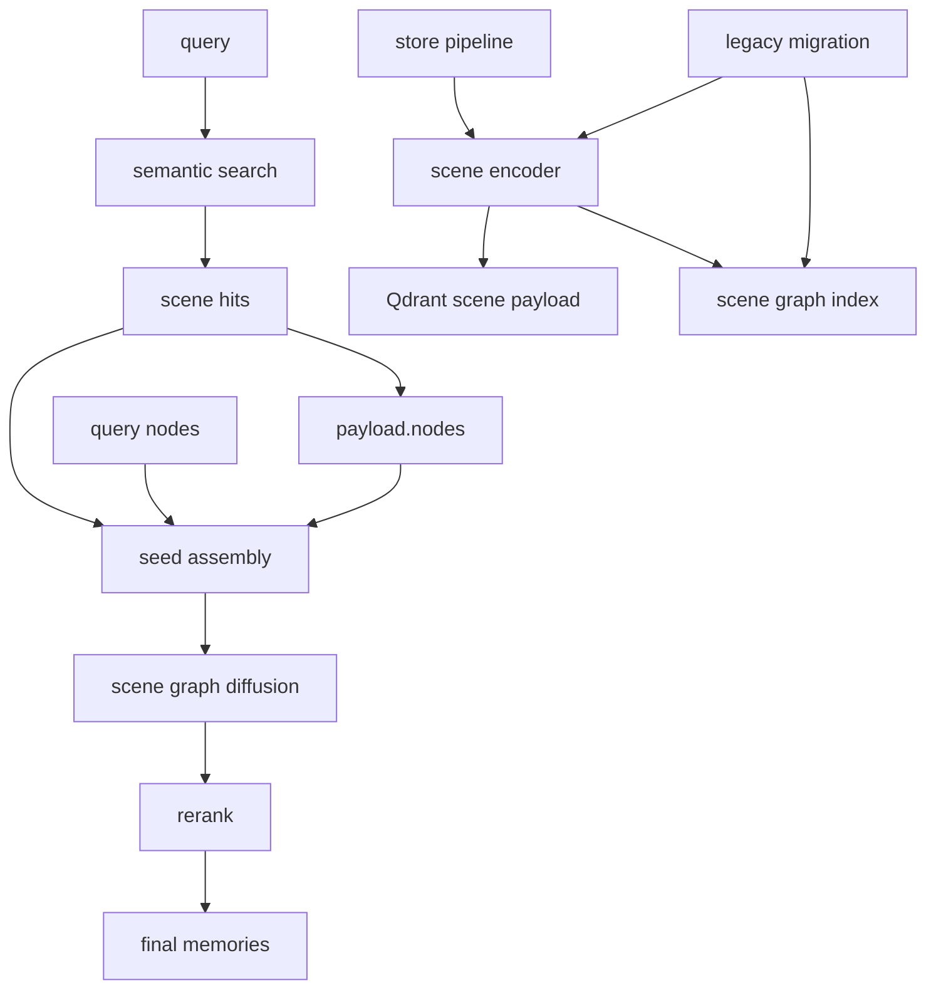
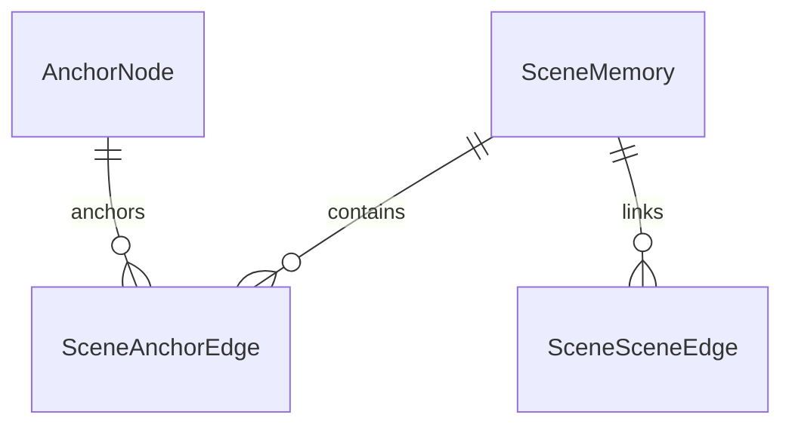
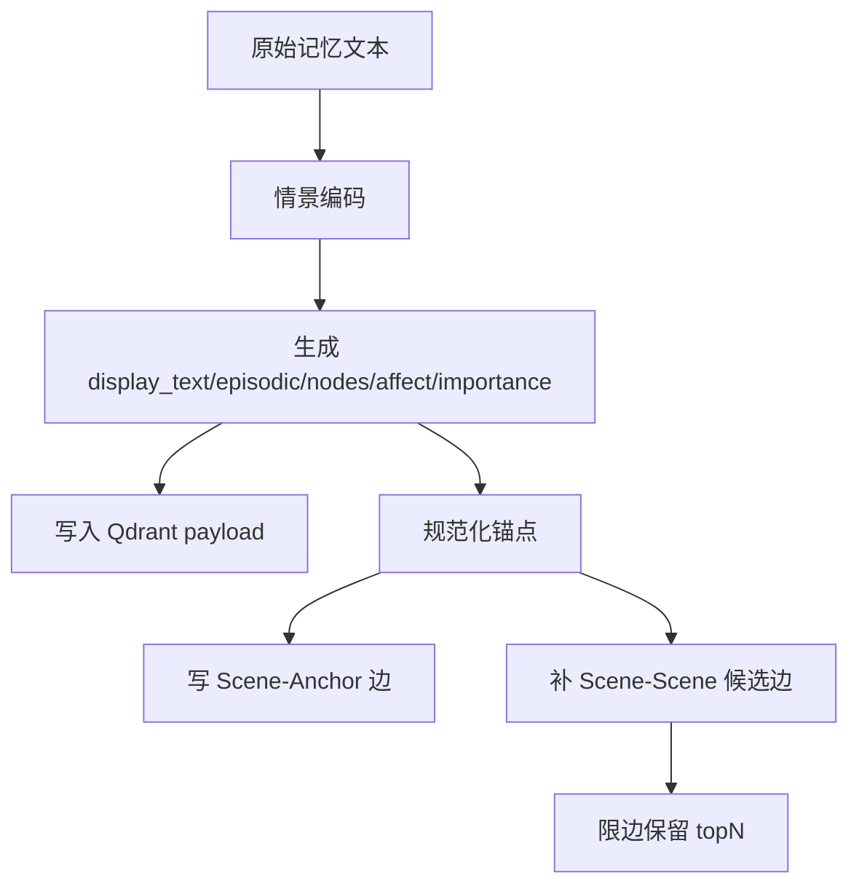
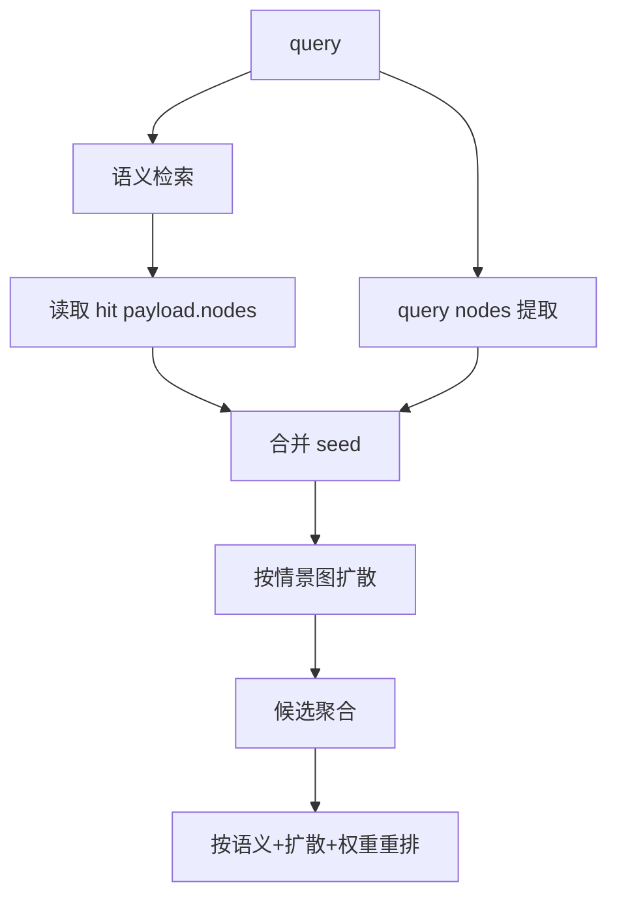
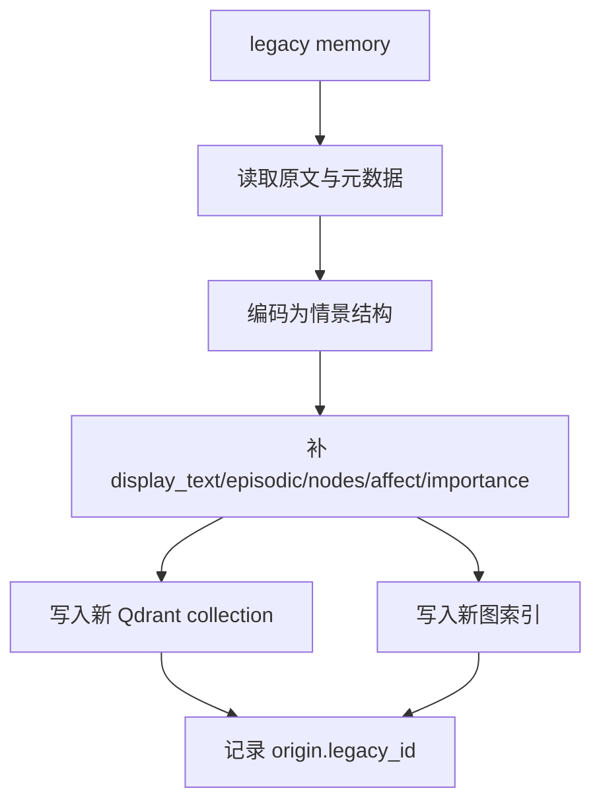

# 一、项目目标

项目名称：情景记忆图扩散重构

一句话描述：把现有基于实体共现的旧图扩散，重构为适配情景记忆的图扩散系统，让所有记忆最终以结构化情景记忆为主存储，并能围绕 `display_text / episodic / nodes / affect / importance` 做可解释的多跳召回。

核心目标：

1. 让新写入的记忆全部以情景记忆形式进入系统，Qdrant 中的 payload 成为事实主源。
2. 让图扩散从“实体共现召回”升级为“情景-锚点-情景”的扩散模式。
3. 让 `nodes` 成为扩散种子，`episodic` 成为扩散语义，`affect` 和 `importance` 成为扩散权重。
4. 将旧的实体图扩散逐步降级、隔离并最终移除，避免新旧两套逻辑长期并存。
5. 提供旧记忆到新情景记忆的迁移机制，保证历史数据可继续被召回。

不做的事：

1. 不继续把旧的 `entity_nodes/mentions` 图当作主召回图。
2. 不在在线检索主路径里依赖 LLM 再次提取实体作为唯一入口。
3. 不要求一次性把所有历史数据人工重写完。
4. 不改变现有 Qdrant 作为主存储的基本方向。
5. 不新增与情景图目标无关的独立记忆系统。

# 二、业务背景

当前系统已经支持结构化情景 payload 存储，包含：

- `text`
- `embedding_text`
- `episodic { what, why, result, lesson[] }`
- `nodes [{ name, type }]`
- `affect { ... , intensity }`
- `importance`
- `category`
- `user_id`
- `created_at`

但检索侧仍有旧图逻辑残留，主要问题是：

1. 旧图以实体共现为中心，无法表达“这条记忆为什么发生、学到了什么、情绪为何强烈”。
2. 情景记忆已经是主存储形态，但图扩散仍然围绕旧实体层运行，语义层次不一致。
3. 旧记忆如果不迁移到情景结构，扩散能力会长期被“碎片化文本 + 实体抽取噪声”限制。
4. 旧图中的 `memory_count`、泛化实体过滤和共现边，对技术项目类情景会过度削弱关键锚点。
5. 目前需要的是“围绕场景记忆进行联想”的图，而不是“围绕名词做邻居搜索”的图。

预期价值：

1. 更准确地召回和串联技术学习、顿悟、目标推进、情绪变化等连续场景。
2. 让图扩散更像“想起一个场景后，顺着线索浮现相关场景”。
3. 为后续的反思、总结、学习沉淀和长期叙事提供统一记忆底座。
4. 让老记忆升级后仍然可检索、可解释、可逐步淘汰旧图。

# 三、功能需求

| 编号 | 功能名称 | 用户故事 | 优先级 | 备注 |
|---|---|---|---|---|
| FR-001 | 情景记忆主存储 | 作为系统，我希望所有新记忆都以结构化情景记忆写入 | P0 | 以 Qdrant payload 为主源 |
| FR-002 | 情景锚点建图 | 作为系统，我希望每条情景记忆自动连接到 `nodes` 锚点 | P0 | `nodes` 为核心扩散入口 |
| FR-003 | 情景间扩散 | 作为系统，我希望在情景记忆之间做多跳扩散召回 | P0 | 替代旧实体共现召回 |
| FR-004 | 情感与重要性加权 | 作为系统，我希望情绪强、重要性高的情景更容易被唤起 | P0 | 使用 `affect` 和 `importance` |
| FR-005 | 因果与教训联想 | 作为系统，我希望通过 `why/result/lesson` 召回相似场景 | P0 | 适配学习、反思、总结类问题 |
| FR-006 | 旧记忆迁移 | 作为系统，我希望历史旧记忆能批量转成情景记忆 | P0 | 支持分批、重试、幂等 |
| FR-007 | 旧图退场 | 作为维护者，我希望旧实体图扩散可逐步关闭 | P1 | 先降级，再移除 |
| FR-008 | 扩散可解释 | 作为开发者，我希望知道每条候选为何被扩散出来 | P0 | 输出 trace / hop / weight |
| FR-009 | 迁移回放 | 作为开发者，我希望能回放迁移结果验证一致性 | P1 | 便于抽查样本 |
| FR-010 | 兼容检索 | 作为系统，我希望迁移期新旧记忆都能被召回 | P0 | 新图优先，旧图兜底 |
| FR-011 | 图规模控制 | 作为系统，我希望图不会因全连接而爆炸 | P0 | 限边、限跳、限候选 |
| FR-012 | 运行观测 | 作为开发者，我希望看到扩散命中数、跳数、耗时和迁移进度 | P1 | 便于调参和排障 |

# 四、非功能需求

性能要求：

1. 单次情景扩散召回应尽量控制在可交互范围内，推荐 P95 小于 300ms。
2. 扩散过程必须有跳数上限、候选上限和边数上限，避免图爆炸。
3. 迁移任务必须分批执行，不能阻塞在线聊天主流程。
4. 新图查询优先于旧图查询，旧图仅作为迁移期 fallback。

准确性要求：

1. 新图召回结果应更重视情景语义，而不是只看名词重合。
2. 对“为什么”“怎么理解”“以前那个场景”这类问题，`why/result/lesson` 权重应更高。
3. 对“之前那个人/那个项目/那个目标”这类问题，`nodes` 中的 person/goal 锚点应更高。
4. 高 `importance` 和正向 `affect` 的场景应更容易进入候选集。

可维护性要求：

1. 新旧图逻辑要能清晰分层，迁移完成后旧逻辑应可删除。
2. 图 schema、扩散策略、迁移策略要解耦，避免混在一个函数里。
3. 需要保留可观测日志，便于定位某条记忆为何被召回。
4. 所有迁移操作要幂等，可重复执行而不破坏数据。

兼容性要求：

1. 迁移期内，旧记忆不能丢失。
2. 旧接口在过渡期内仍可访问，但内部要逐步转向新情景图。
3. 后端重启后，图索引和情景主存储应可自动恢复。

# 五、系统架构



技术选型：

| 模块 | 方案 | 理由 |
|---|---|---|
| 主存储 | Qdrant `aibrain_memories` | 已有结构化 payload，适合做情景事实源 |
| 节点注册 | `aibrain_nodes` 或等价规范节点表 | 统一 `person/concept/emotion/goal` 锚点 |
| 图索引 | 以 scene 为主的图索引层 | 支持 scene-anchor-scene 扩散 |
| 扩散算法 | 受控 spreading activation | 适合多跳、可解释、可限流 |
| 迁移任务 | 后台批处理 + 幂等检查 | 保证旧记忆平滑升级 |

目录结构建议：

```text
backend/modules/brain/memory/
  pipeline/
    steps/
      store/
        encoder.py
        graph_link.py
        entity_extract.py
      search/
        graph_recall.py
        scene_diffusion.py   # 新增
  qdrant_store.py
  scene_graph.py            # 新增，替代旧实体图主职责
  migrate_scene.py          # 新增，旧记忆迁移
```

关键设计决策：

1. 旧实体图不再承担主扩散职责，只保留迁移兼容和回放能力。
2. `nodes` 是情景图的第一类输入，不再等价于“普通实体列表”。
3. `episodic` 不是附属文本，而是扩散判别的重要信号。
4. 情景图以“场景之间的联想”为目标，而不是“实体之间的互查”为目标。

# 六、数据结构

核心数据实体：

| 实体 | 字段 | 类型 | 说明 |
|---|---|---|---|
| SceneMemory | id | string | Qdrant point id，情景主键 |
| SceneMemory | text | string | 展示标题/短文本 |
| SceneMemory | embedding_text | string | 向量检索输入 |
| SceneMemory | episodic | object | `what/why/result/lesson` |
| SceneMemory | nodes | array | 核心锚点列表 |
| SceneMemory | affect | object | 情绪维度与烈度 |
| SceneMemory | importance | float | 重要性权重 |
| SceneMemory | created_at | datetime | 创建时间 |
| SceneMemory | user_id | string | 所属用户 |
| SceneMemory | origin | object | 迁移来源、legacy_id、置信度 |
| AnchorNode | name | string | 规范化节点名 |
| AnchorNode | type | string | `person/concept/emotion/goal` |
| AnchorNode | alias_of | string | 归一化别名指向 |
| SceneAnchorEdge | scene_id | string | 情景主键 |
| SceneAnchorEdge | anchor_name | string | 锚点名 |
| SceneAnchorEdge | role | string | `seed/bridge/emotion/goal` |
| SceneAnchorEdge | weight | float | 边权重 |
| SceneSceneEdge | from_scene_id | string | 源情景 |
| SceneSceneEdge | to_scene_id | string | 目标情景 |
| SceneSceneEdge | relation_type | string | `shared_node/causal/same_goal/...` |
| SceneSceneEdge | weight | float | 边权重 |

实体关系：



索引策略：

1. `SceneMemory.id` 必须唯一索引。
2. `SceneMemory.created_at` 需要索引，便于时间衰减和最近优先。
3. `AnchorNode.name` 需要唯一索引，保证锚点归一化。
4. `SceneAnchorEdge.anchor_name` 需要索引，便于从锚点反查情景。
5. `SceneSceneEdge.from_scene_id / to_scene_id` 需要索引，便于多跳扩散。

数据量预估：

1. 单个用户场景数据量会快速增长，但锚点数应明显小于情景数。
2. 每条情景建议只保留少量强边，避免边数近似全连接。
3. 迁移期旧记忆与新记忆会并存，需支持分批重建索引。

# 七、流程设计

## 新情景写入流程



## 新情景检索流程



## 旧记忆迁移流程



异常流程处理：

1. 如果情景编码失败，使用保守默认值继续写入，不阻塞存储。
2. 如果某条旧记忆无法完整迁移，记录失败原因并进入重试队列。
3. 如果图边构建失败，Qdrant 写入仍然算成功，图层可异步补建。
4. 如果新图不可用，检索可短暂 fallback 到旧逻辑，但要打日志并统计次数。

# 八、API设计

## 情景写入与迁移

| 方法 | 路径 | 说明 |
|---|---|---|
| POST | `/memory/scene/migrate` | 触发旧记忆批量迁移 |
| POST | `/memory/scene/reindex` | 重建情景图索引 |
| GET | `/memory/scene/migration/status` | 查看迁移进度 |
| GET | `/memory/scene/graph/stats` | 查看图规模与边数 |

## 检索与调试

| 方法 | 路径 | 说明 |
|---|---|---|
| POST | `/memory/scene/search` | 按情景图扩散检索 |
| POST | `/memory/scene/explain` | 返回某次召回的扩散路径 |
| GET | `/memory/scene/anchor/<name>` | 查询某锚点关联的情景 |
| GET | `/memory/scene/<scene_id>` | 查询单条情景详情 |

## 请求响应建议

`POST /memory/scene/search`

请求：

```json
{
  "query": "理解entity_relations工作原理",
  "top_k": 20,
  "mode": "default"
}
```

响应：

```json
{
  "ok": true,
  "results": [
    {
      "id": "scene_xxx",
      "text": "理解entity_relations工作原理",
      "score": 0.923,
      "source": "scene_diffusion",
      "trace": {
        "seed_nodes": ["entity_relations", "AiBrain"],
        "hop": 2,
        "relation_type": "shared_node"
      }
    }
  ]
}
```

错误码建议：

1. `400`：参数缺失或格式错误。
2. `404`：scene / anchor 不存在。
3. `409`：迁移任务正在运行。
4. `500`：图层或存储层异常。

# 九、验收标准

功能验收：

1. 新写入的记忆都能生成结构化情景 payload，并在 Qdrant 中保留完整字段。
2. 检索时能从 `payload.nodes` 直接形成扩散种子，不再依赖旧实体图作为主路径。
3. 对“为什么理解了”“学到了什么”“这个目标相关场景”类问题，能召回带 `why/result/lesson` 的情景。
4. 旧记忆可以批量迁移成新情景记忆，迁移后仍可被检索。
5. 旧图扩散可以关闭或降级，不影响聊天主流程。

稳定性验收：

1. 迁移任务可重复运行，不会重复生成冲突数据。
2. 单条情景扩散不会因为某个高频锚点导致结果爆炸。
3. 图索引失败时，Qdrant 主存储仍可工作。
4. 旧新两套逻辑并存期间，结果排序不会明显混乱。

性能验收：

1. 典型查询在目标数据量下可保持可交互响应。
2. 迁移任务分批执行时不阻塞前台聊天。
3. 扩散步数和候选数量都能按配置限制。

交付物清单：

1. 情景图 schema 文档。
2. 迁移脚本与回放脚本。
3. 新的扩散检索实现。
4. 旧图退场开关与兼容策略。
5. 验证日志与抽样测试结果。

# 十、开发任务拆分

| 任务 ID | 任务名称 | 依赖 | 复杂度 | 所属模块 | 对应需求 |
|---|---|---|---|---|---|
| T001 | 梳理旧图与新情景记忆边界 | 无 | S | 文档/审计 | FR-001, FR-007 |
| T002 | 定义情景图 schema | T001 | M | memory/scene_graph | FR-001, FR-002 |
| T003 | 实现情景锚点规范化 | T002 | M | memory/scene_graph | FR-002 |
| T004 | 实现 scene-anchor 建边 | T002 | M | memory/scene_graph | FR-002 |
| T005 | 实现情景间候选边生成 | T003 | L | memory/scene_graph | FR-003, FR-011 |
| T006 | 新情景扩散检索器 | T004, T005 | L | memory/search | FR-003, FR-004, FR-005 |
| T007 | 旧实体图召回降级 | T006 | M | memory/search | FR-007, FR-010 |
| T008 | 旧记忆迁移编码器 | T002, T003 | L | memory/migrate_scene | FR-006 |
| T009 | 迁移任务调度与重试 | T008 | M | backend jobs | FR-006, FR-012 |
| T010 | 检索解释与 trace 输出 | T006 | M | memory/search | FR-008, FR-012 |
| T011 | 回放测试与样本校验 | T006, T008 | M | tests | FR-009, FR-010 |
| T012 | 清理旧图依赖与开关 | T007, T011 | M | memory / config | FR-007 |

并行建议：

1. T002、T003、T008 可以部分并行。
2. T004、T005 依赖 schema 后可并行推进。
3. T006、T010 在扩散接口稳定后同步完成。
4. T012 应在迁移和回放验证通过后执行。
