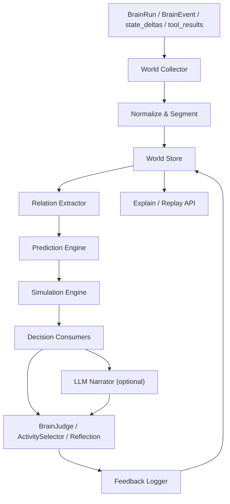
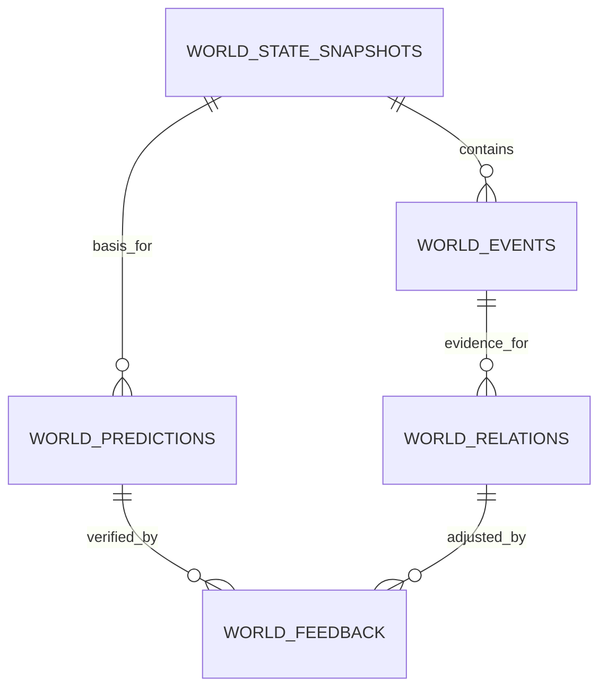
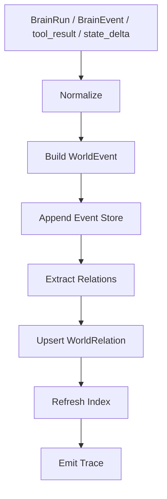
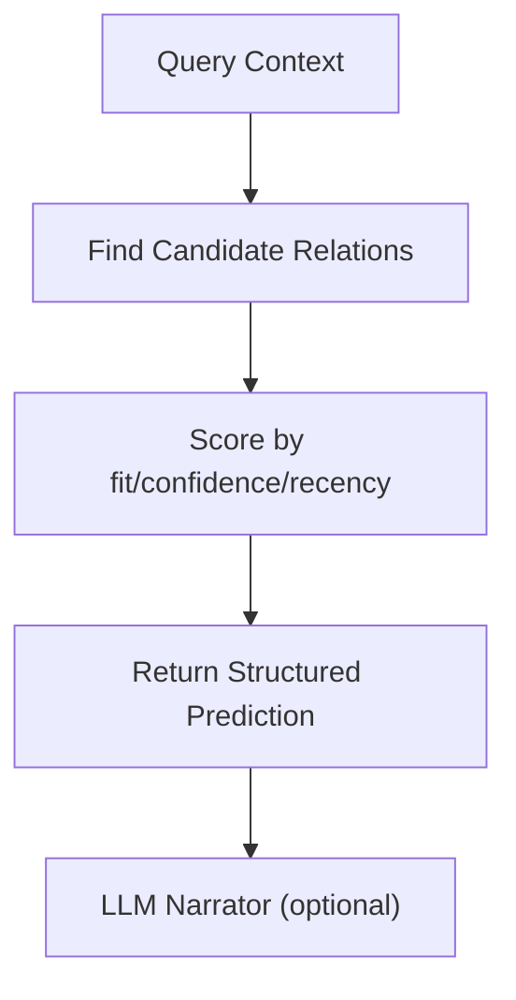
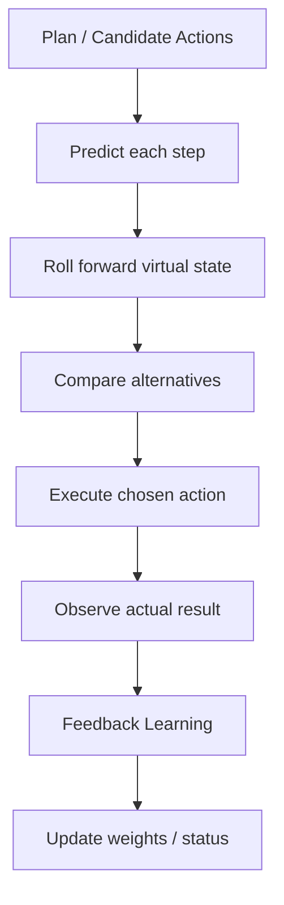
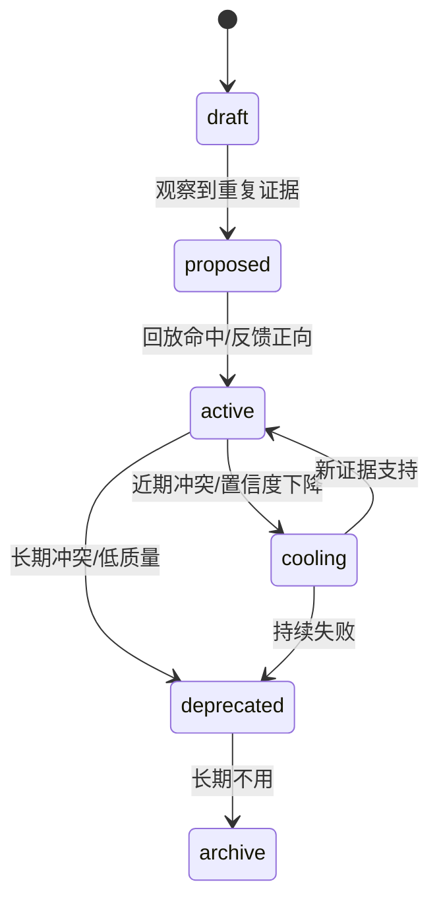

# 一、项目目标

项目名称：基础世界模型 v1

一句话描述：从 `brain_runs.jsonl`、`state_deltas`、`tool_results`、`scene_graph` 和 `graph` 中抽取可观测事件与因果关系，建立一个可查询、可预测、可回放的内部世界模型，为 `BrainJudge`、`ActivitySelector`、反思和规划提供后果评估能力。

核心目标：

1. 把“发生了什么”标准化成可复用的世界事件，而不是只保留原始日志文本。
2. 把“事件之间怎么相互影响”沉淀为因果、时序和条件关系。
3. 在决策前提供结构化预测，回答“如果现在做 X，最可能发生什么”。
4. 支持回放与反馈学习，根据真实结果修正关系权重、置信度和状态。
5. 与现有 `scene_graph`、`graph.py`、`procedural_memory` 松耦合复用，不重建一套平行记忆系统。
6. 第一版保持低延迟、可解释、非阻塞，不替代 LLM，只给 LLM 和主循环提供可靠依据。

不做的事：

1. 不做完整通用 AGI 世界模拟器。
2. 不把世界模型当成自然语言聊天库，也不直接生成长篇推理文本。
3. 不把 LLM 输出当作真值，LLM 只负责抽取、补充和解释。
4. 不自动执行高风险动作，世界模型第一版只做预测和建议。
5. 不引入重型训练管线或 fine-tuning 作为 v1 必要前置。

# 二、业务背景

当前 AiBrain 已经有了几个关键底座：

1. `BrainRun`、`BrainEvent`、`brain_runs.jsonl` 能提供真实运行轨迹。
2. `scene_graph` 已经能表达场景锚点和场景之间的联想。
3. `graph.py` 已经能表达实体共现、typed relation 和事件记忆。
4. `procedural_memory` 已经能表达“怎么做更稳”的程序模板。
5. `BrainJudge` 和 `ActivitySelector` 已经是最自然的决策入口。

但目前还缺一层更底层的东西：

1. 系统知道“以前怎么做”，但还不够知道“这样做会带来什么后果”。
2. 现有关系图更偏“关联召回”，还不够偏“状态变化和后果预测”。
3. 决策链路里仍然需要 LLM 临场判断，缺少可持续积累的预测依据。
4. 如果没有世界模型，程序记忆只能回答“怎么做”，不能回答“为什么这么做、会不会更好”。

世界模型要解决的问题是：

1. 从事件流里抽取状态、动作、反馈和结果。
2. 把“动作 -> 结果”的规律保存在结构化模型里。
3. 在当前上下文下，先做后果预演，再让 `BrainJudge` 或 `ActivitySelector` 决定是否执行。

目标用户：

1. `BrainJudge`：在输出决策前参考预测结果，减少拍脑袋式判断。
2. `ActivitySelector`：在选活动时参考风险、收益和时序后果。
3. 反思/总结模块：在回看时识别预测偏差和认知缺口。
4. 开发者：希望系统能解释“为什么这样预测”“依据是什么”。

预期价值：

1. 提高决策稳定性，减少重复试错。
2. 把“经验”从程序记忆扩展到“结果预判”。
3. 让系统开始具备简单的反事实能力。
4. 为后续目标规划、模拟器和更强自主性打底。

# 三、功能需求

| 编号 | 功能名称 | 用户故事 | 优先级 | 备注 |
|---|---|---|---|---|
| FR-001 | 事件采集与标准化 | 作为系统，我希望把 `BrainRun`、`BrainEvent`、`state_deltas`、`tool_results` 统一成世界事件 | P0 | 只采集可观测证据 |
| FR-002 | 世界状态快照 | 作为系统，我希望按 run / tick 保存世界状态快照，便于回放和对比 | P0 | 支持版本号 |
| FR-003 | 关系抽取 | 作为系统，我希望从事件和状态变化里抽取 `causal`、`temporal`、`conditional` 关系 | P0 | 初版以 LLM 写入 + 规则校验/去重为主 |
| FR-004 | 上下文预测 | 作为系统，我希望在给定上下文和动作时，输出下一步状态和风险评估 | P0 | 返回结构化结果 |
| FR-005 | 简单模拟 | 作为系统，我希望比较多个候选动作路径的后果，选择更稳的一条 | P0 | 只做 1~2 步预测 |
| FR-006 | 可解释输出 | 作为开发者，我希望看到预测用了哪些事件、关系和证据 | P0 | 输出 trace |
| FR-007 | 反馈学习 | 作为系统，我希望在真实结果返回后修正关系权重和置信度 | P0 | 形成闭环 |
| FR-008 | 回放评估 | 作为测试脚本，我希望对历史 run 做 replay，评估预测命中率 | P0 | 便于调阈值 |
| FR-009 | 决策接入 | 作为系统，我希望在 `BrainJudge` / `ActivitySelector` 前使用世界模型做预演 | P0 | 先建议，后执行 |
| FR-010 | 调试与观测 | 作为开发者，我希望能查看世界模型的状态、关系和预测记录 | P1 | 便于排错 |
| FR-011 | LLM 辅助解释 | 作为系统，我希望在证据不足时，让 LLM 把结构化结果翻译成人话 | P1 | LLM 只做表达，不做真值来源 |
| FR-012 | 风险门控 | 作为系统，我希望高风险动作只做预测，不直接自动执行 | P0 | 安全优先 |

第一版优先覆盖的世界模型场景：

1. 用户消息后的回复后果预判。
2. 任务推进时的状态变化预判。
3. 主动表达前的打扰风险预判。
4. 反思和记忆整理中的“下一步会发生什么”判断。
5. 程序记忆模板适用范围的后果预判。

第一版不优先覆盖的内容：

1. 复杂多跳长期规划。
2. 跨天、跨周的大规模世界演化模拟。
3. 全自动策略学习和在线强化训练。
4. 依赖大量外部知识库的开放世界推理。

# 四、非功能需求

性能要求：

1. 单次 `predict` 接口在本地 10k 级关系数据下的 P95 延迟尽量控制在 100ms 内。
2. 单次 `simulate` 接口在 2~3 个候选动作下的 P95 延迟尽量控制在 300ms 内。
3. 事件采集和关系更新必须异步或轻量化，不阻塞 `BrainSession` / `LifeLoopDaemon` 主循环。
4. 当世界模型不可用时，主流程必须自动降级到原有 LLM 决策，不允许卡死。

安全要求：

1. 世界模型只使用可观测数据和结构化摘要，不保存隐藏思维链原文。
2. 不允许世界模型直接执行删除、发布、写库等高风险副作用。
3. 对低置信预测必须显式标记 `uncertain` 或 `fallback`。
4. 敏感信息、密钥、个人隐私不得进入模型正文。

可维护性要求：

1. 采集、标准化、存储、预测、模拟、反馈必须分层。
2. 模型版本、关系版本和快照版本要可追踪、可回放。
3. 需要 dry-run、replay、explain 三类调试能力。
4. 尽量复用现有 `scene_graph`、`graph.py`、`event_log`，避免重复造轮子。

可观测性要求：

1. 每次预测都记录 query、上下文摘要、候选关系、置信度和最终结果。
2. 每次模拟都记录比较了哪些候选动作、各自评分和依据。
3. 每次反馈更新都记录前后置信度变化和状态迁移。

兼容性要求：

1. 不破坏现有聊天、反思、程序记忆和输出沉淀链路。
2. 世界模型应可独立关闭，关闭后系统回退到原有逻辑。
3. 与 `procedural_memory` 的边界清晰：程序记忆回答“怎么做”，世界模型回答“做了会怎样”。

# 五、系统架构



技术选型：

| 模块 | 方案 | 理由 |
|---|---|---|
| 主存储 | SQLite + JSONL | 与现有项目风格一致，便于回放和迁移 |
| 关系层 | 复用 `graph.py` / `scene_graph.py` 的图结构 | 现有实体图已存在，世界模型应在其上做语义增强 |
| 快速索引 | Python 内存索引 + 可重建 checkpoint | 适合低延迟查询和后台刷新 |
| 预测逻辑 | 规则 + 统计 + 轻量图搜索 | v1 先保证可解释与稳定性 |
| 解释层 | LLM 可选叙述层 | 只负责把结构化结果翻译成人话 |
| 集成层 | `backend/main_brain/*` + `backend/routes/brain_routes.py` | 与现有 loop / route 架构一致 |

推荐目录结构：

```text
backend/main_brain/world_model/
  collector.py
  policy.py
  predictor.py
  simulator.py
  trace.py
  scheduler.py

backend/modules/brain/memory/world_model/
  contracts.py
  store.py
  extractor.py
  index.py
  learner.py
  decay.py

backend/routes/brain_routes.py
backend/main_brain/contracts.py
backend/main_brain/judge.py
backend/main_brain/activity_selector.py
```

关键设计决策：

1. 世界模型不替换 `scene_graph`，而是把 `scene_graph` 当作高层场景关系输入之一。
2. `graph.py` 继续负责实体和事件关系的基础图，世界模型在其上增加“状态变化”和“后果预测”层。
3. 预测结果必须优先返回结构化数据，LLM 只做自然语言解释。
4. v1 只做 1~2 步的短链预测，先追求稳定和可回放，不追求复杂长程规划。
5. 风险动作默认只建议，不自动执行。

## 核心代码思路

```python
from dataclasses import dataclass, field


@dataclass
class WorldEvent:
    event_id: str
    source_type: str
    subject: str
    action: str
    object: str = ""
    context: dict = field(default_factory=dict)
    confidence: float = 0.5
    created_at: str = ""


@dataclass
class WorldRelation:
    relation_id: str
    from_node: str
    to_node: str
    relation_type: str   # causal / temporal / conditional / affects
    weight: float = 1.0
    confidence: float = 0.5
    evidence_ids: list[str] = field(default_factory=list)
    status: str = "draft"


def ingest_world_signal(run_summary: dict, cycle: dict, state_delta: dict | None, tool_result: dict | None):
    # 核心链路：事件标准化 -> 抽取关系 -> 写库 -> 刷新索引
    event = normalize_event(run_summary, cycle, state_delta, tool_result)
    store.append_event(event)
    relations = extract_relations(event)
    if relations:
        store.upsert_relations(relations)
    index.mark_dirty()
    return event.event_id


def predict_outcome(context: dict, action: str) -> dict:
    # 关键链路：取当前状态 -> 找候选关系 -> 评分 -> 输出结构化预测
    candidates = index.lookup(context, action)
    scored = score_candidates(candidates, context, action)
    best = scored[:3]
    return {
        "prediction": best[0]["summary"] if best else "uncertain",
        "confidence": best[0]["confidence"] if best else 0.0,
        "evidence": [x["evidence"] for x in best],
        "alternatives": best[1:],
    }


def simulate_plan(context: dict, actions: list[str]) -> dict:
    # 核心逻辑：逐步滚动状态，比较每一步的后果与风险
    current = context
    timeline = []
    for action in actions:
        pred = predict_outcome(current, action)
        current = roll_forward(current, pred)
        timeline.append({"action": action, "prediction": pred, "state": current})
    return {"timeline": timeline, "final_state": current}


def learn_from_feedback(prediction_id: str, actual_outcome: dict):
    # 关键链路：对比预测与真实结果，更新关系权重与状态
    delta = compare(prediction_id, actual_outcome)
    store.update_relation_confidence(delta)
    store.update_prediction_status(prediction_id, delta)
```

说明：

1. `ingest_world_signal` 负责把杂乱事件变成统一输入。
2. `predict_outcome` 负责结构化预测，不直接产出长文本。
3. `simulate_plan` 负责把多个动作串起来做短程推演。
4. `learn_from_feedback` 负责把实际结果反写回模型。

# 六、数据结构

核心数据实体：

| 实体 | 字段名 | 类型 | 说明 | 约束 |
|---|---|---|---|---|
| WorldEvent | `event_id` | TEXT | 事件唯一 ID | 主键 |
| WorldEvent | `source_type` | TEXT | 来源类型，如 `brain_run`、`tool`、`state_delta` | 必填 |
| WorldEvent | `subject` | TEXT | 主体 | 必填 |
| WorldEvent | `action` | TEXT | 动作 | 必填 |
| WorldEvent | `object` | TEXT | 客体 | 可空 |
| WorldEvent | `context_json` | JSON/TEXT | 结构化上下文 | 必填 |
| WorldEvent | `confidence` | REAL | 事件可信度 | 0~1 |
| WorldStateSnapshot | `snapshot_id` | TEXT | 快照 ID | 主键 |
| WorldStateSnapshot | `source_run_id` | TEXT | 来源 run | 索引 |
| WorldStateSnapshot | `state_json` | JSON/TEXT | 当前世界状态 | 必填 |
| WorldStateSnapshot | `version` | INT | 状态版本 | 必填 |
| WorldRelation | `relation_id` | TEXT | 关系唯一 ID | 主键 |
| WorldRelation | `from_node` | TEXT | 起点 | 索引 |
| WorldRelation | `to_node` | TEXT | 终点 | 索引 |
| WorldRelation | `relation_type` | TEXT | `causal` / `temporal` / `conditional` / `affects` | 必填 |
| WorldRelation | `weight` | REAL | 关系强度 | 0~1 |
| WorldRelation | `confidence` | REAL | 置信度 | 0~1 |
| WorldRelation | `status` | TEXT | `draft` / `proposed` / `active` / `cooling` / `deprecated` | 必填 |
| WorldPrediction | `prediction_id` | TEXT | 预测 ID | 主键 |
| WorldPrediction | `query_hash` | TEXT | 查询哈希 | 索引 |
| WorldPrediction | `context_json` | JSON/TEXT | 查询上下文 | 必填 |
| WorldPrediction | `predicted_json` | JSON/TEXT | 结构化预测结果 | 必填 |
| WorldPrediction | `confidence` | REAL | 预测置信度 | 0~1 |
| WorldPrediction | `result_status` | TEXT | `pending` / `verified` / `contradicted` | 必填 |
| WorldFeedback | `feedback_id` | TEXT | 反馈 ID | 主键 |
| WorldFeedback | `prediction_id` | TEXT | 所属预测 | 外键 |
| WorldFeedback | `actual_json` | JSON/TEXT | 真实结果 | 必填 |
| WorldFeedback | `delta_json` | JSON/TEXT | 预测-实际差异 | 必填 |
| WorldFeedback | `recorded_at` | TEXT | 记录时间 | 必填 |

ER 图：



索引策略：

| 字段 | 索引原因 |
|---|---|
| `WorldEvent.source_type` | 快速按来源筛选 |
| `WorldEvent.created_at` | 按时间回放与窗口扫描 |
| `WorldRelation.from_node` / `to_node` | 快速查因果链与邻居扩展 |
| `WorldRelation.relation_type` | 按关系类型过滤 |
| `WorldRelation.status` | 匹配时只读 active/proposed |
| `WorldPrediction.query_hash` | 预测结果缓存与去重 |
| `WorldPrediction.result_status` | 回放评估与反馈检索 |
| `WorldFeedback.prediction_id` | 快速回写预测结果 |

数据量预估：

1. 按当前节奏，初版可先按每天 200~1000 条事件估算。
2. 6 个月内 `world_events` 约 3 万以内，SQLite 足够承载。
3. `world_relations` 预计比事件少一个数量级，通常在几千到一两万条。
4. 若后续事件量显著上涨，再考虑单独拆分冷热存储或增量索引。

# 七、流程设计

## 1. 事件接入流程



流程说明：

1. 采集原始运行数据。
2. 标准化为 `WorldEvent`。
3. 根据规则和统计抽取关系。
4. 写入关系库和索引。
5. 输出 trace 方便调试。

## 2. 预测流程



流程说明：

1. 输入当前上下文和候选动作。
2. 找出相关关系链。
3. 按上下文匹配、历史成功率、置信度、风险做评分。
4. 返回结构化预测。
5. 若需要自然语言，再交给 LLM 解释。

## 3. 模拟与反馈流程



## 4. 异常流程处理

1. **缺字段**：跳过该条事件，记录 `unknown` 质量标记，不阻塞主流程。
2. **关系冲突**：保留多证据并降低置信度，必要时进入 `cooling`。
3. **低置信预测**：返回保守答案，必要时退回 LLM 解释层。
4. **存储不可用**：主循环降级到原有 LLM 决策，不影响用户回复。
5. **回放失败**：只影响评估，不影响线上状态。

## 5. 状态流转



这套状态流转适用于 `WorldRelation`，也适用于 `WorldPrediction` 的结果状态。

# 八、API设计

建议把接口挂到 `backend/routes/brain_routes.py`，与现有 `/brain/*` 风格一致。

## 1. 事件接入

### `POST /brain/world-model/ingest`

请求参数：

| 字段 | 类型 | 必填 | 说明 |
|---|---|---|---|
| `source_type` | string | 是 | `brain_run` / `event` / `tool` / `state_delta` |
| `source_id` | string | 是 | 来源 ID，如 `run_id`、`event_id` |
| `subject` | string | 是 | 主体 |
| `action` | string | 是 | 动作 |
| `object` | string | 否 | 客体 |
| `context` | object | 是 | 结构化上下文 |
| `confidence` | number | 否 | 默认 0.5 |
| `dry_run` | boolean | 否 | 是否只预览不落库 |

响应结构：

```json
{
  "ok": true,
  "event_id": "wev_123",
  "snapshot_id": "wss_456",
  "relation_count": 3,
  "dry_run": false
}
```

错误码：

1. `400` 参数错误。
2. `409` 事件重复。
3. `500` 存储异常。

## 2. 结构化预测

### `POST /brain/world-model/predict`

请求参数：

| 字段 | 类型 | 必填 | 说明 |
|---|---|---|---|
| `context` | object | 是 | 当前上下文 |
| `action` | string | 是 | 待评估动作 |
| `top_k` | number | 否 | 候选条数，默认 3 |
| `with_trace` | boolean | 否 | 是否返回证据链 |
| `use_llm_narration` | boolean | 否 | 是否附带自然语言解释 |

响应结构：

```json
{
  "ok": true,
  "prediction": {
    "summary": "先整理上下文再联系更稳",
    "confidence": 0.82,
    "risk_level": "medium",
    "evidence": ["run_001", "run_014"],
    "alternatives": [
      {"action": "wait", "score": 0.71}
    ]
  }
}
```

错误码：

1. `400` context/action 缺失。
2. `422` 无法生成有效预测。
3. `500` 预测引擎异常。

## 3. 简单模拟

### `POST /brain/world-model/simulate`

请求参数：

| 字段 | 类型 | 必填 | 说明 |
|---|---|---|---|
| `context` | object | 是 | 初始上下文 |
| `actions` | array[string] | 是 | 候选动作序列 |
| `top_k` | number | 否 | 返回前几个方案 |
| `dry_run` | boolean | 否 | 仅模拟不写库 |

响应结构：

```json
{
  "ok": true,
  "timeline": [
    {"action": "organize_context", "confidence": 0.76},
    {"action": "reply", "confidence": 0.84}
  ],
  "final_state": {
    "risk_level": "low",
    "expected_response": "positive"
  }
}
```

错误码：

1. `400` actions 为空。
2. `422` 序列无法模拟。
3. `500` 模拟器异常。

## 4. 世界状态查询

### `GET /brain/world-model/state`

响应结构：

```json
{
  "ok": true,
  "state": {
    "snapshot_count": 128,
    "event_count": 2048,
    "relation_count": 321,
    "active_relation_count": 120,
    "last_updated_at": "2026-06-25T08:00:00Z"
  }
}
```

## 5. 关系查询与解释

### `GET /brain/world-model/relations`

查询参数：

| 字段 | 类型 | 必填 | 说明 |
|---|---|---|---|
| `node` | string | 否 | 按节点检索 |
| `relation_type` | string | 否 | 按关系类型过滤 |
| `limit` | number | 否 | 默认 50 |

### `GET /brain/world-model/explain`

查询参数：

| 字段 | 类型 | 必填 | 说明 |
|---|---|---|---|
| `prediction_id` | string | 是 | 预测 ID |
| `with_evidence` | boolean | 否 | 是否返回完整证据链 |

## 6. 反馈回写

### `POST /brain/world-model/feedback`

请求参数：

| 字段 | 类型 | 必填 | 说明 |
|---|---|---|---|
| `prediction_id` | string | 是 | 预测 ID |
| `actual_outcome` | object | 是 | 真实结果 |
| `result` | string | 是 | `success` / `fail` / `partial` |
| `notes` | string | 否 | 反馈说明 |

错误码：

1. `400` 参数缺失。
2. `404` prediction 不存在。
3. `500` 回写失败。

## 7. 回放评估

### `POST /brain/world-model/replay`

请求参数：

| 字段 | 类型 | 必填 | 说明 |
|---|---|---|---|
| `run_id` | string | 否 | 只回放单个 run |
| `window` | number | 否 | 回放窗口 |
| `dry_run` | boolean | 否 | 是否只评估不落库 |

## 8. LLM 解释接口

如果预测结果置信度低或证据不足，可以把结构化结果传给 LLM 生成自然语言说明，但要严格要求：

1. LLM 只能解释 world model 返回的内容。
2. 不允许 LLM 补写没有证据的事实。
3. 解释文本必须标注“不确定”或“推测”。

# 九、验收标准

功能验收：

1. 给定一条模拟 `BrainRun`，`ingest` 能成功生成 `WorldEvent`、`WorldStateSnapshot` 和至少一条 `WorldRelation`。
2. 给定一个已知上下文，`predict` 能返回结构化结果、置信度和证据链。
3. `simulate` 能比较 2~3 个候选动作并给出排序。
4. `feedback` 能更新关系权重、置信度和状态。
5. `replay` 能对历史 run 做回放，并输出预测命中率。
6. 关闭世界模型后，主循环能够无缝退回原有 LLM 决策，不报错。

性能验收：

1. `predict` 在本地 10k 级数据下 P95 延迟不高于 100ms。
2. `simulate` 在 3 个动作以内的场景下 P95 延迟不高于 300ms。
3. 事件接入不影响 `BrainSession` 与 `LifeLoopDaemon` 的主要响应时间。

安全验收：

1. 世界模型不保存隐藏思维链全文。
2. 高风险动作不会被世界模型直接执行。
3. 低置信预测会明确标注 `uncertain` 或 `fallback`。

可解释性验收：

1. 每条预测都能追溯到具体事件和关系证据。
2. 每次反馈更新都能看见前后权重变化。
3. `explain` 接口能输出一条可读的证据链。

交付物清单：

1. 世界模型存储和数据结构代码。
2. 预测与模拟核心逻辑。
3. `brain_routes` 调试接口。
4. 回放测试与 benchmark 脚本。
5. 方案文档与说明。

# 十、开发任务拆分

| 任务 ID | 任务名称 | 依赖 | 预估复杂度 | 所属模块 | 对应需求编号 | 并行组 |
|---|---|---|---|---|---|---|
| T001 | 世界模型数据契约与存储层 | - | M | `backend/modules/brain/memory/world_model/` | FR-001/002/003 | A |
| T002 | 事件采集与标准化 | T001 | M | `backend/main_brain/world_model/` | FR-001/002 | A |
| T003 | 关系抽取器 | T001、T002 | L | `backend/modules/brain/memory/world_model/` | FR-003 | B |
| T004 | 预测引擎与评分器 | T001、T003 | L | `backend/main_brain/world_model/` | FR-004/006/012 | B |
| T005 | 简单模拟器 | T004 | L | `backend/main_brain/world_model/` | FR-005 | C |
| T006 | 反馈学习与衰减 | T001、T004 | M | `backend/modules/brain/memory/world_model/` | FR-007 | C |
| T007 | 调试接口与路由 | T002、T004、T005 | M | `backend/routes/brain_routes.py` | FR-008/010 | D |
| T008 | 接入 `BrainJudge` / `ActivitySelector` | T004、T007 | M | `backend/main_brain/judge.py`、`backend/main_brain/activity_selector.py` | FR-009 | D |
| T009 | 回放评估与 benchmark | T001~T006 | M | `backend/main_brain/testing/` | FR-008 | E |
| T010 | 观察面板与文档补齐 | T007、T009 | S | `plan/` + 调试页面 | FR-010/011 | E |

推荐执行顺序：

1. 先做 T001/T002，保证数据进得来、存得住。
2. 再做 T003/T004，把“后果预测”跑通。
3. 然后做 T005/T006，让模型能模拟并学习。
4. 最后接 T007/T008/T009，把它真正用到主循环里。

并行建议：

1. T002 和 T001 可以并行起草接口，只要统一数据契约。
2. T005 可以在 T004 的预测格式确定后并行开发。
3. T007 和 T009 可以在核心接口稳定后并行推进。
